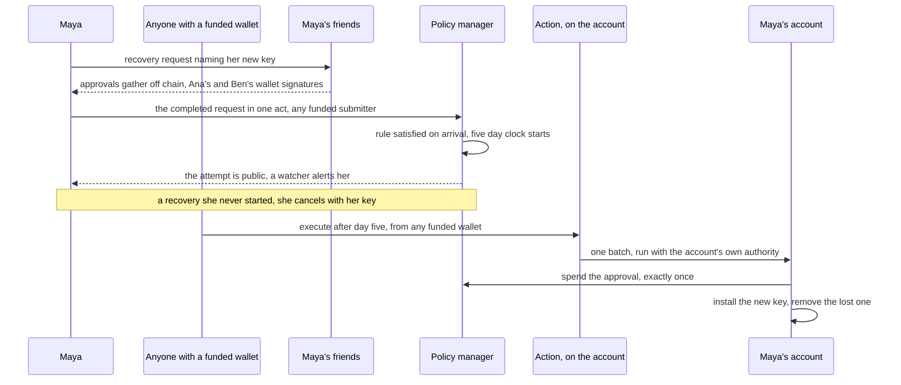
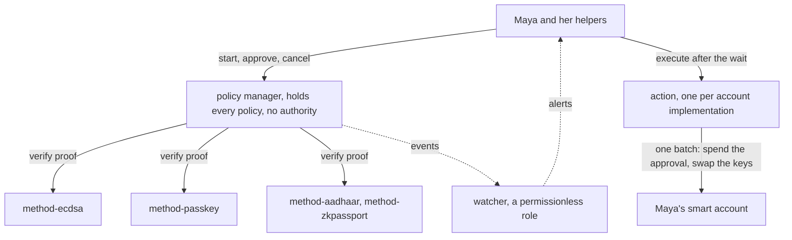
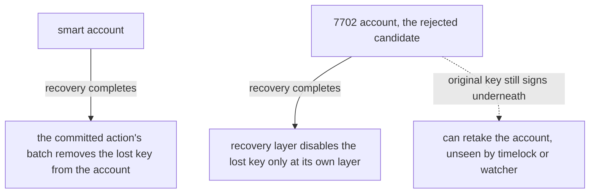

# Design

The recovery kit lets an account holder who lost their signing key take the account back through people or credentials they already hold. It ships as contracts with an SDK any wallet can integrate, and the Kohaku extension is its first integration, so the same kit serves wallets that embed it and Kohaku itself. This draft is written for the partner's engineers and for a reviewer who was not in the design conversation.

Recovery runs under one rule the holder writes, naming some of their friends or a passkey, and one contract, the policy manager, judges every recovery against that rule. Every approval is cryptographically tied to one specific recovery, so it can never be reused. After the waiting period, one small audited contract on the account, the action, installs the key the rule approved and removes the lost one. Its code can do nothing else. The attempt is public from the moment it opens, so a watching wallet can tell the holder in time to cancel. The same flow can later move an account to a post-quantum key, since a policy approves an outcome and an action carries it out, and an account that admits such a signer takes an action written for it.

This file is the design's idea draft. The tech design comes later as its own documents under `design/<department>/`, carrying the interface freezes and the dependency pins this draft never claims.

## D-0 The ask

The Ethereum Foundation asked for a social recovery kit, for the Kohaku wallet first. The Ethereum Foundation made UX a priority and set the delivery as contracts, an SDK and the recovery experience in the extension. It also named the methods to weigh, guardians beside an email proof and passkeys, with AnonAadhaar as a maybe and zkTLS weighed early. The email proof and zkTLS were dropped and zkPassport ships instead. The kit ships passkeys as the second primary beside guardians and the two government identity proofs as the secondary pair, and D-5 records the reasons.

Kohaku is itself both an extension and an SDK other wallets integrate. The kit's core contract is general the same way: it authorizes actions against a policy the account committed, and key recovery is the first action built on it. D-5 records that decision.

This engagement designs the whole kit and builds part of it. What it builds is the contracts, the circuit integration, the SDK module and the recovery experience in the Kohaku extension. The deliverables' detail belongs to the tech design rather than to this draft.

The people the kit serves lean mainstream first, since technical users already have recovery in products like Safe. That person's resources are an email address, a device that holds a passkey and ordinary friends without wallets. Success is a working end-to-end showcase at Devcon Mumbai in November 2026 with at least three recovery options beyond the signing key. After Mumbai the kit goes to real production, so no showcase choice may close the production path.

The kit leaves out two cases. The kit defends against key loss and not against key theft, so it does nothing against an attacker who already holds the current key. The legitimate holder keeps priority and can interrupt any recovery they did not intend, as long as their rule is not itself compromised. A rule an attacker can satisfy loses the account the way a stolen key loses it. Moving assets off an unrecoverable account is out, since recovery means regaining control of the account itself.

Every choice below has to meet one requirement: a setup must show the holder the trust it creates, who can act on the account, how fast and what fails together.

The kit is the primary deliverable: the policy manager with the methods, the SDK, the recovery experience and the recovery action for the demo's account. Any smart account an action serves can adopt it. The demo runs on Ambire's smart account, the one the Kohaku extension creates for its users, so the engagement builds no account. D-5 records that decision. [`design/future-work.md`](./future-work.md) records what the engagement designed and did not build, and the file itself is the list. None of it is committed to anybody.

The engagement succeeds when ordinary users get their account back after losing their key, using people or credentials they already have, and when the kit shows it working end to end on a smart account in the Kohaku extension, on stage at Devcon Mumbai 2026.

## D-1 What must always hold

The kit holds a set of properties no matter what. Twenty of them shape the flow this document describes and get a line each below. [`design/invariants.yaml`](./invariants.yaml) carries those with their testable statements and adds two more, both binding the byte formats more than one implementation computes. The numbers are how the rest of this document points at them. A setup is the recovery arrangement the holder approved. A proof is anything a method produces to show its part is done.

Five govern who gets in.

- I-1, key rotation only ever happens through a path the holder set up.
- I-2, only the account's own authority changes the recovery configuration.
- I-3, a method the holder never named cannot join their recovery, a corollary of I-1.
- I-4, the method the holder approved is the method that runs, a corollary of I-1.
- I-5, the method interface is permissionless, so anyone deploys a module and any holder adopts one by naming it, with no gatekeeper in between.

Five give the holder time and a way out.

- I-6, an attempt completes only after the waiting period the holder committed has elapsed.
- I-7, the current key can always cancel a running recovery.
- I-8, cancelling a recovery takes a proof set as strong as the one that could open it, from any set satisfying the rule and not necessarily from the same people.
- I-9, no complete proof set, no recovery, no ticking clock.
- I-10, at most one attempt per action at a time, so at most one recovery.

Three pin what a proof is worth.

- I-11, a proof made for one recovery is useless for any other.
- I-12, editing a setup retires every proof already given, even when the edited setup rewrites the identical rule.
- I-13, a proof past its window opens nothing.

Six protect the holder's position.

- I-14, the policy manager isolates method calls, and a method is handed nothing beyond its own check.
- I-15, the holder always sees before approving who could act on their account, which the integrator's setup screen shows rather than any contract check.
- I-16, the chain learns only what the holder chose to show, a single salted commitment at minimum.
- I-17, once a recovery completes the old key stops working on the account, everywhere the committed handover reaches.
- I-18, an approved handover executes at most once and exactly as committed, the new key installed and the old removed through the committed action with the payment the request named, spent and applied as one atomic batch, nothing more.
- I-19, a pause only refuses and never lets a recovery through.

One holds the kit to the record it emits.

- I-20, every setup write and every recovery step emits its event, and no event lies.


## D-2 How a recovery runs

### The methods

Four methods ship. The first two are the primary pair, the ones every rule is expected to stand on. The identity proofs come second, built and offered but not meant to carry a rule on their own, for reasons D-5 records.

- A wallet signature is the ordinary Ethereum approval, open to anyone who already has a wallet. A guardian is a person the holder trusts vouching with a wallet signature of their own, the narrow use of a word some wallets stretch to every voucher.
- A passkey is the unlock check phones and laptops already carry, the fingerprint or face behind Apple and Google accounts. A walletless friend can use one too, at the same weight as a wallet signature. A passkey binds to one relying-party domain and does not assert for another, so enrolling a friend mints a fresh credential at the integrator's domain rather than reusing one they hold. Asserting it at recovery needs that domain reachable, an off-chain dependency the tech design records.
- AnonAadhaar proves possession of India's Aadhaar identity.
- zkPassport proves possession of a biometric passport.

Each method is a small contract verifying one kind of credential. A credential is the thing a person presents: a signature, a passkey check or an identity proof. D-4 explains how anyone builds a new method that plugs in beside the shipped four. D-5 records why an email proof was dropped, and anyone can add one later through that interface. The contracts only ever see credentials. The rule decides whose credentials count.

### One recovery, start to finish

This subsection runs one recovery end to end through one holder, Maya, because every mechanism this document introduces appears once in her path, and the passkey and identity credentials the mainstream reader would use are the same mechanism with a different config, which the method section shows.

Maya's account is a smart account. Its one signing key is an ordinary Ethereum key she made at setup, the kind a seed phrase backs. Maya is more technical than the typical person the kit serves, since her rule names friends who hold wallets and a hardware wallet in a drawer. Her mandatory clause names that hardware wallet and a passkey on her phone, either of which satisfies it, the redundancy inside a clause D-5 asks for, so losing one of the two devices costs her neither the recovery nor the cancel.

When she set up recovery she made one rule: two of her three friends must approve, either the hardware wallet in her desk drawer or the passkey on her phone must sign, then five days must pass. The hardware wallet approves recoveries without being a key on the account, so stealing it alone gives the thief nothing. Her first clause is three wallet credentials, so a broken wallet verifier satisfies it on its own, the exposure D-6 describes and the one her setup screen would raise with her. Ana, Ben and Carla each have a wallet of their own, which makes each of them a guardian. Everyone approves with something they already hold, and nobody installs anything new.

Then she changes computers, and she cannot find the seed phrase anywhere. She lost the note somewhere across the years. The signing key lived on the old machine and the seed that could rebuild it is gone, so the account has no usable signer left.

From her new laptop, though any phone or computer would do, she fetches the backup her setup published and decrypts it with her password, since her rule names a passkey whose configuration nobody recites from memory. Then she prepares a recovery, naming the new key that should take over. Nothing exists on chain yet. The approvals gather off chain inside the recovery request itself, so the chain sees the recovery only when the completed set arrives in one transaction. She has no funded key to pay for that submission, so someone else pays. Anyone may submit the request, and who does depends on what her wallet's integration arranges, a sponsor it names or a friend with a funded wallet.

Maya sends the recovery request to Ana, Ben and Carla, the helpers her rule names. Helper is this design's word for anyone whose credential a rule can call on. Ana and Ben, the two her rule asks for, each approve with an ordinary signature from their own wallet key. Maya unpacks the hardware wallet from her drawer and signs the same approval herself, completing the set. Every approval names, cryptographically, this exact recovery on this account handing over to this new key, and the price the account pays for it, so none of them can be reused anywhere else and nobody can raise the price after they signed (D-3 explains how).

The completed request lands, the rule is satisfied on arrival and the five day clock starts. The attempt is public from that moment, so any service watching the chain on her behalf can tell her "recovery is running on your account". That alert exists for the day someone else starts a recovery she never wanted, while she still holds her key and can cancel with it. Nothing takes that power away. Today the recovery is her own, so she waits. Once the five days are up anyone presses execute, and the account, through its committed action, spends the approval the contract holds, installs the new key and removes the lost one, all in one transaction. The lost key no longer opens this account.



### The rule

Every recovery is that story with the names changed. Everything below calls a running recovery an attempt. A setup holds exactly one rule, an AND across one or more clauses, each clause satisfied by any N of its M named credentials:

```
setup_body = (rule, wait, ignores_pause)       # what the setup commits and the digest binds, see D-3 and D-5; the action keys the setup beside it
rule       = AND(clause_1, ..., clause_k)      # every clause must be satisfied
clause     = ANY_N_OF(n, [cred_1 ... cred_m])  # any n of these m credentials, each one person's credential of one method

# Maya's rule
AND(
  ANY_N_OF(2, [ana_wallet, ben_wallet, carla_wallet]),
  ANY_N_OF(1, [maya_hardware_wallet, maya_passkey])
)

# the classic threshold alone, no mandatory credential, one clause
AND(
  ANY_N_OF(3, [ana_wallet, ben_wallet, carla_wallet, dan_passkey, eve_passkey])
)
```

The same method serves different roles through its credential configuration. Ana's wallet, Ben's wallet and Maya's hardware wallet are three credentials of the one wallet method, each with its own address and salt, and a passkey method carries its own credentials the same way. A credential's own configuration is what keeps each method a simple verifier of its one credential. This design defers deeper composition such as thresholds inside thresholds.

The setup carries one waiting period, the holder's own choice with no minimum the contract enforces. The setup screens default it to a safe span of days. The request reveals it with the rest of the rule at recovery, and the contract refuses to release the approval before it has elapsed (I-6). A rule may also name the same person more than once, through a credential of theirs at each place. The contract does not forbid that and the setup screen shows it plainly, since it is the holder's own choice to make. One credential at two places is the other case, which the contract also allows and the setup screen refuses.

### The attempt

In technical terms an attempt is a small state machine the policy manager keeps, at most one active per committed action at a time:

```
none ---the rule's full proof set arrives in one act---> waiting    # born satisfied, clock starts
waiting ---wait elapsed, anyone executes through the action---> consumed  # approval spent and handover applied in one batch
waiting ---holder key cancels, a satisfying proof set does, or a method it used reports itself stopped---> cancelled  # the three cancels
waiting ---holder edits or clears the setup---> cancelled  # the incidental cancels
# ids count up per account and action, and are never reused
```

That machine is the same for every action. It is the policy manager's one flow: a proof set satisfying the committed policy opens an attempt, the wait runs, the cancels stay open, and the account spends the approval into whatever outcome the action defines. This document explains the flow through recovery, and the payload is a key handover only because the recovery action says so.

The proofs gather off chain inside the recovery request and reach the contract as one act. The SDK defines the gathering flow and its formats as code running on the participants' own devices, since the kit operates no server. An attempt therefore never exists unsatisfied, and opening one takes a full set of proofs from credentials the rule names (I-9). There is no half-open state to spam or store.

The request carries one validity window every proof in it signs, and that window must still be open when the request lands, so it must span the slowest helper. The tech design's limits section names that number as the SDK's, and I-9 records the decision that a full proof set arrives in one act rather than incrementally. Submitting, cancelling and executing carry no privileged caller, so a sponsor pays for each with no authority over the outcome and risks only its gas. A sponsor who simulates a request before paying sees that request in the clear: the setup body and the used credentials. The open questions carry that confidentiality even for a request it never submits.

The contract allocates attempt numbers counting upward, never reusing one, so approvals from a cancelled or finished attempt can never count again under a recycled number (I-11). One attempt runs at a time (I-10), and only a set that satisfies the rule can start it. A hostile attempt therefore means enough of the rule's credentials were compromised to satisfy it, the case the wait and the cancel exist for. Every transition emits an event. A watcher, the role D-4 describes, follows those events to alert the holder (I-20).

The contract judges every request once, inside the submission call that opens the attempt, and it verifies no proof again at execution. The request carries the setup body written out in full, since the chain only ever stored its hash. The contract recomputes the commitment from that body and rejects a mismatch. The contract adds three checks: the commitment of an empty body can never be committed, a body with no clauses satisfies nothing, and neither does a rule whose every clause sits at zero.

For each credential used the contract recomputes the credential commitment from the written-out configuration supplied, so a method module only ever judges configuration the holder committed. The method then verifies the proof against the binding digest inside the proof's validity window. A request that falls short changes nothing.

The contract cannot see a degenerate rule behind the hash, since the setup is a commitment when it is written, so preventing one is the SDK's job at setup. That check protects against two failures. A rule satisfied by nothing is a dead setup discovered in a loss, while a rule satisfied by an empty or duplicate-thinned proof set lets whoever submits first take the account. The contract sees the rule only when a recovery reveals it. There it refuses the two shapes a stranger satisfies with nothing: a rule with no clauses and a rule whose every clause sits at zero. It judges nothing else about the rule's sense. Catching the rest is client code, which the sdk chapter specifies and its tasks test.

Once the contract accepts a request, the judgment stands, and a proof expiring later or a provider key rotating mid-wait cannot undo the acceptance. Before the handover executes as one atomic operation, the contract re-checks at the spend that the wait has elapsed, that the setup is unchanged, that no cancel arrived, that the attempt is the one the caller named and that the payload being executed is the committed one. It then asks the methods that attempt used whether any of them has been stopped, unless the holder committed to ignore that.

### Cancelling

An open attempt has three cancels, each open until the executing transaction lands. More fall out of acts aimed at something else, described just below. The holder's key cancels, a satisfying proof set cancels, and anyone cancels an attempt one of whose methods reports itself stopped. That third one nobody signs, since the stop is the authorization, and it exists so a stopped method never leaves an attempt that can be neither spent nor cancelled. A holder who committed at setup to keep their accepted attempts through a stop has closed that third path for their own attempts, and keeps the other two. The holder should count only on the wait. Whoever wants an attempt executed sends the transaction in the first block after the wait expires, and the holder does not control the ordering, so an elapsed wait means the handover can land at any moment. After it lands nothing remains to cancel, since the handover is done.

The account's current authority can always cancel (I-7). The delay itself is the protection, the standard timelock pattern. A proof set from the same setup can also cancel it (I-8). Such a set satisfies the rule the way an opening set does, under the same clauses and thresholds, and each proof in it is signed under the digest's cancel purpose for that exact attempt. The cancel purpose is part of the signed message, so an approval proof can never serve as a cancel proof, and nobody can reuse an intercepted approval proof to cancel the recovery it approves.

The set may be the same people who approved, backing out of a recovery whose new key was discarded. It may also be a different satisfying set, which is what protects a holder whose key is already gone from a recovery they never wanted. That protection holds wherever their rule admits a set the attacker does not control, and a clause requiring every credential it lists admits no such set. No set too weak to open a recovery can cancel one. A set that satisfies the rule can still cancel recoveries it could never complete as takeovers, since a cancel lands at once while a takeover must survive the wait, an asymmetry the holder accepts with the rest of the committed rule. The setup screens therefore guide the holder toward thresholds a hostile minority cannot reach.

The other cancellations follow from acts with a different main goal. Editing or clearing the setup during the wait cancels the running attempt in the same act and retires every proof given under the old setup. The cancellation event fires like any other, so a holder who edits mid-recovery starts over (D-3 explains the mechanism). The contract also refuses to release an attempt whose setup changed, a second check of the same rule rather than a separate cancel path. The attempt was accepted against the old rule, so no attempt outlives the rule it satisfied. Every authority the account honours can edit, which is the holder's own key and any contract the account authorized, the same parties that can cancel outright, so editing grants nobody a power they did not already hold. The edit takes effect at once and the recovery it replaces gets days. The contracts chapter weighs the alternatives against that asymmetry.

Turning recovery off is one call the account makes at the policy manager, `clearSetup`, which cancels any waiting attempt and moves the setup nonce, so `consume` finds no live attempt and refuses the stale nonce besides. Where the account can also revoke the action's authorization, the wallet pairs the two writes in one batch. It pairs them only while a setup stands, since `clearSetup` reverts for a holder whose setup is already gone and takes the whole batch with it. An account that cannot revoke the authorization relies on the clear alone, which turns the action off because the manager then has nothing to release. The policy manager hears nothing about the authorization, so a holder who removes only the authorization leaves a dormant setup behind. That setup is dormant only because nothing can spend into the account, and anyone with a satisfying proof set still opens an attempt against it, publishes the rule and runs its clock. A later re-authorization revives the setup as committed and releases any attempt that ran its wait out meanwhile, a hazard the tech design names and the wallet's screens carry.

## D-3 The binding digest

When Ana taps approve, she signs the binding digest, a single hash naming everything her yes applies to. Change any piece of the situation and the digest changes, so her signature stops matching. A proof made for one recovery is useless anywhere else.

Four groups of facts go into it.

1. The first group says where this is happening, naming the chain, the account, the policy manager's address and the format version. Swap the policy manager and every approval already given stops verifying. The chain id also makes recovery a one-chain event. Kohaku works on mainnet alone today, so the kit ships single-chain and states that scope, and the cross-chain model is a deferred production question.

2. The second group says which setup is in force, the action the setup was committed under, and a hash of the whole setup body, the rule together with the wait and the pause choice, so an approval given under one setup never counts under another and never for a different action of the same account. Beside them sits the setup nonce, a counter that goes up by one on every setup write, on create, change and remove alike. Even an edit that rewrites the identical rule therefore counts as a new setup and the old approvals stop verifying, which is how the contract delivers I-12. Commitment and nonce live in the policy manager's own storage, keyed by the account and the action, with the attempt counter beside them. Clearing the setup keeps the two counters, which never decrease, and switching to a different policy manager invalidates old approvals anyway, since the contract's address is in the first group.

3. The third group says which recovery this is. It carries the attempt's number and whether the signature approves the recovery or cancels it, carried by the message's own type, so neither ever counts as the other. It also carries when the request expires, one window every proof in it signs. The number is the one the contract allocates next, predicted in the recovery request for the helpers to sign over. The contract rejects a request naming any other number, higher or lower, so nobody banks a proof set for a later attempt. The expiry bounds the off-chain gathering, and the contract rejects a request past its window (I-13).

4. The fourth group says what outcome is approved. It carries the place this approval fills, one flat index counted across every clause in body order rather than a pair of a clause and a position, so one signature counts towards one credential and no other, and the tech design fixes that numbering. It carries the complete handover payload rather than the bare new key: the new key, the old authority being removed and whatever the action needs beyond them. A signature over the new key alone would let whoever submits the request choose the rest and remove a different authority than the helpers approved. The payment order is in this group too: the token, the amount and the payee the account pays. The helpers therefore approve the price of the recovery beside its outcome, and nobody can raise it or redirect it after they signed. A request may leave the payee open instead, for whoever builds the batch that executes to encode, an open form the helpers approve as such.

The handover is not secret. It travels in the request in the clear, and the integrator's approval page renders its fields, the destination key and the authority being removed. A wallet that renders typed data shows the account and the price beside the payload, and shows the payload itself as opaque bytes, since the payload's layout belongs to the committed action. Rendering the payload's fields is therefore the approval page's obligation, which the open questions carry for the integrator surface.

The same four groups as code, an illustrative sketch, since the frozen layout lands in the tech design and may differ:

```
handover = (new_key, old_authority, install_path)

digest = keccak256(abi.encode(
    // where this is happening
    chain_id,            // mainnet for the design target, the demo binds Sepolia's
    account,             // Maya's account address
    policy_manager,      // the one contract that judges the recovery, per D-4
    version,             // of this digest format
    // which setup is in force
    action,             // the contract that will carry out the outcome
    setup_nonce,         // goes up by one on every setup change
    keccak256(setup_body), // the setup body from D-2, the rule with the wait and the pause choice
    // which recovery this is
    attempt_id,          // the number the contract allocates next
    message_kind,        // the approval form or the cancel form, which the tech design fixes as two typed messages rather than one field
    valid_until,         // expiry, bounds the off-chain gathering
    // what outcome is approved
    place,               // which place in the rule this fills, Ana's spot in clause one
    handover,            // Maya's new key and the removed authority, in the clear, rendered by the approval page
    payment_order        // what the account pays for this, a token, an amount and the payee, or an open payee whoever builds the executing batch encodes
))
```

What goes into the digest is commitments, never anyone's identity in the open, no friend list and no email address. The digest holding commitments alone is what lets a future private method use the same format without a rewrite. Several stacks compute the same bytes: the SDK and the contracts always, an action and the account for what authorizes that action, a proof circuit for the identity methods, and the integrator's own wallet for the authority a handover installs. Those bytes must come out identical. `design/invariants.yaml` carries the list in full, and the formats below are the ones this draft names. Each of the formats below therefore freezes as a known-answer test vector every stack replays byte for byte:

- The binding digest freezes first, since every proof in the kit approves it.
- The proof formats freeze beside it, the wallet signature's signed struct and the passkey challenge.
- The credential commitment preimage freezes as D-5 sketches it.
- The setup commitment preimage freezes over the account, the action, the setup nonce and the setup body, which the SDK, the contract and a rebuild client all recompute.
- The attempt request and the cancellation request encodings freeze with them, the formats I-21 names.
- The setup body encoding freezes behind its inner hash, and the recovery action's handover payload freezes as that action's own vector.
- The backup's payload joins the set once a reader beyond the SDK ships, encrypted or in the clear.

These byte layouts freeze late, once the tech design settles the formats, because a frozen mistake stays frozen. Both identity proofs' public inputs join the set as their methods ship.

## D-4 Modules and roles

Maya's story ran on a handful of pieces, named here together with where each one lives on a real account. These names are the vocabulary `design/invariants.yaml` binds.

The kit lands on smart accounts, accounts that are themselves contracts with replaceable keys. On such an account the kit authorizes one contract, the action, through whatever grant that account offers: a module install on one implementation and a privilege entry on another. The account authorizes the action to run calls with the account's own authority, and the action runs exactly one batch, the calls an approved attempt fixed. The policy manager is installed on no account and reads none. D-5 records why the account authorizes the action and not the policy manager.

An ordinary address upgraded through ERC-7702 keeps its original private key, so no recovery can disarm a lost one. The kit therefore targets smart accounts alone, the decision D-5 records.

The kit itself is one main contract, the policy manager, with small modules around it.

It keeps the setup commitment per account and per action, the setup nonce that rises on every edit as D-3 describes, and the running attempt's state. The cleartext setup body reaches it only in a request's calldata at recovery, and it stores none of that body. The credentials live outside it in method modules, one small verifier contract per kind of credential, and each holder's own credentials are configuration the rule names:

- `method-ecdsa` checks an ordinary Ethereum signature against the committed address, Ana's approval or Maya's hardware wallet.
- `method-passkey` checks a passkey assertion against the committed key, the fingerprint or face unlock a device already carries.
- `method-aadhaar` and `method-zkpassport` check the two identity proofs against their committed identity, the secondary pair D-5 scopes.

The method modules hold no holder's configuration and no attempt. Every credential's configuration, whose address and whose key, is inside the setup's single committed hash D-5 describes, and the readable copy lives with the holder and their backup. When the policy manager needs one credential's proof checked it hands the proof, the digest and that configuration to the module the rule names. The module checks one against the other and answers valid or not, through a function signature the tech design freezes.

The module dispatched is the committed address itself, so the code the holder committed is the code that runs (I-4). Dispatching to the committed address depends on the stated assumption that code at a committed address stays what the holder inspected, and the cases where it does not are out of scope by decision. A module holds nothing of any holder's between calls, though the shipped identity pair each hold one trusted key of their own that their key admin can update, a tradeoff D-6 weighs. A check may still read outside contracts, a deployed circuit verifier pinned by its address.

Which person each credential belongs to is configuration too, so a guardian is a wallet credential naming a friend's address, never a special mechanism. Keeping all that configuration in one place gives two things:

- Only the account writes its own configuration, which enforces I-2 in one place instead of once per module.
- The policy manager calls every method through a static call, so neither the method nor anything it calls can write state during verification, and a hostile or buggy method corrupts nothing of the kit's (I-14).

Account implementations still differ in how a key is swapped. A Safe rotates an owner list. A modular account updates the key a plug-in module stores, or swaps that module when the key lives immutably inside it. Ambire's account writes a table of privileged keys. The action is one thin contract per account implementation that hides those differences: the policy manager approves an outcome and releases that approval exactly once, and the action carries it out in the account's native way, through whatever call that account exposes.

The policy manager never calls an account. An account with a different execution function needs a different action and no change to the policy manager. The recovery action for Ambire's account is one contract, and a Safe action would be another, the design [`design/future-work.md`](./future-work.md) records.

Which action serves an account is fixed at setup inside the setup commitment, so the action is neither the request author's to pick nor an admin's to rewrite. An action acts with the account's own authority, so the kit builds and audits every action it offers, immutable with no proxy and no upgrade admin. Nothing else in the kit knows which account implementation it runs on. An account whose implementation changes after setup may no longer accept its committed action's batch, so the rotation reverts, or writes storage the upgraded account no longer reads. The holder therefore re-commits their setup at an account upgrade, while they still hold the key, guidance the setup screens carry.

The rotation itself is all or nothing, installing the new key and removing the failed one in a single operation that reverts as a unit. No half-executed recovery therefore ever leaves the account with two keys or none (I-18).

> The watcher is a role rather than a service the kit builds, since the kit operates no relayers, APIs or off-chain storage. The policy manager emits an event on every transition (I-20), so any indexer, wallet backend or the holder's own client fills the role by reading the chain. The role holds two jobs.
>
> The first is the alert, the piece that told Maya "recovery is running on your account". How an alert reaches a holder is the integrator's own job, which an open question records.
>
> The second is the rebuild, where a holder standing on a new device with nothing rebuilds their own setup through the same event stream. They fetch the backup D-5 describes and decrypt it locally with their password when their privacy dial chose the encrypted level.



The method interface is open on purpose, permissionless to build for and permissionless to adopt from, with no gatekeeper in between (I-5). Anyone can build a new method module, and the shipped set is ordinary instances of the same interface with no special powers. New methods join without changes to the core.

A conforming method ships a declaration of trusted parties, a machine-readable list of the key admin able to change its keys, the keys its verdict trusts, whoever can stop it, and whoever is one acceptance away from either role. The module's author writes that declaration and nobody checks it. The credential commitment pins the method's address, so the code that answered that declaration at adoption is the code that answers it later, while the parties it names can change afterwards. A conforming method therefore gets the visibility I-15 asks for and the code pinning I-4 asks for. The setup screen shows the declared parties at adoption, and no contract checks them at verification, a decision not to build that detection.

A holder can still name a module without a declaration of trusted parties, and its exact code is pinned all the same. They give up the visibility instead, since a declaration pins no key and only says who can change one, so the risk of an undeclared module is the adopting holder's alone.

The methods this kit ships are immutable, with no proxy and no upgrade admin. The code a holder inspected is therefore the code that runs for as long as they name it. A permissionless third-party module carries no such guarantee, which the setup screen shows at adoption through the module's declaration of trusted parties, or the lack of one (I-15). Updating a method is the holder's own act, rotating the configuration to the new module's credentials through the policy manager and trusting no one in between.

The policy manager itself, the one contract holding every rule, is immutable like the methods and the action, with no proxy anywhere in the kit. It carries no pause and no owner, and neither does the action, so the only stop in the kit is the one a method carries, turned on and off by whoever that method names as its pause holder, the decision D-5 records and the tech design specifies.

## D-5 Key decisions

This is the decision record, one decision per heading, each opening with the question it answers, written to stand alone for a reviewer who was not in the design conversation.

### The account, smart accounts over 7702

Which kind of account does the kit protect? A smart account, one that is a contract whose keys are replaceable state. On the demo's account every authority is an address, so a passkey serves as a helper credential rather than as the account's own signing key. An account whose signer set admits passkey bytes would take a dedicated action, recorded in future work, and D-2's story runs on the address form.

An account may also hold several keys or modules at once, since multisig shapes are ordinary configuration on a smart account. An account holding several keys is why a recovery names exactly the authority it replaces, which D-3's handover field fixes. Whatever else the holder installed stays untouched and stays theirs to account for (I-17).

The other candidate was ERC-7702, which lets the ordinary address every existing user already has run contract code while keeping that address. A 7702 address however keeps its original private key forever. That key can override or remove any code the address delegates to, so no recovery module can ever disarm it. A lost key is not a destroyed key, since an heir finds the seed phrase or a resold laptop still holds it, at which point the resurfaced key retakes the account, and no timelock or alert can see it.

The same difference appears with post-quantum keys. A smart account can install a post-quantum signer in place, and this kit's handover is one way to do it, since a handover whose new authority is a post-quantum key is an ordinary action and needs no account migration. A 7702 address keeps its classical key no matter what it installs, and its one exit, migrating to a smart account, needs that same original key, exactly the move a holder who lost it can no longer make.

One limit applies. The kit itself accepts classical signatures to approve a rotation, so it gates classical assumptions behind a threshold, a wait and the holder's veto rather than removing them. A post-quantum credential set is a later question.

So the kit targets smart accounts as a family, any account that is a contract with replaceable keys, Ambire's account and Safe among them, a choice the Ethereum Foundation confirmed for V1, and no 7702 mode ships. An existing externally owned address does not convert in place, since that is the 7702 move the design rejects. Its path is a fresh smart account, with the assets migrated across while the holder still holds the old key. A holder of a smart account the kit has no action for, a Safe today, migrates the same way, since no action for it is committed to anyone, an onboarding cost.



### The demo account

Which smart account does the kit connect to, and does the engagement build it? Ambire's `AmbireAccount`, the ERC-4337 smart account the Kohaku extension creates for its users. Ambire's factory deploys it as a proxy, in the revision the Kohaku wallet vendors. The engagement builds no account.

The engagement builds the recovery action for that account. The action calls the account's external validator function, the one path the account gives an outside contract, and writes the account's table of privileged keys. It writes the recovered key at the account's narrower key value, whose safety does not rest on that key being reserved to one account, and the wallet of the pinned revision refuses to sign ordinary typed data with such a key, so a recovered holder transacts at once and signs that class of message only once the client wraps it. The contracts chapter carries that design. The kit does not support the account's 7702 variant, where an ordinary address delegates to Ambire's code, because the delegating key can still sign for the account after a handover. An ordinary address is supported only as the signing key of a smart account.

The Ethereum Foundation chose this target.

Before that choice the engagement designed an account of its own in full, on OpenZeppelin's base after a comparison of five bases, and it stays in [`design/future-work.md`](./future-work.md) as a later option the Ethereum Foundation ranks as nice to have, beside the findings for a Safe action.

### What may run on the account

What may the kit's code do on the account? The account authorizes one contract, the action, to run calls with the account's own authority. The action runs one batch and no other. After the wait it spends the approval at the policy manager, installs the new key and removes the lost one, and an audit checks that its code does only that. The policy manager is authorized on no account and calls none. The next decision explains that split.

The Ethereum Foundation confirmed that choice over the alternative, a contract that can only approve or reject operations the account presents. Each account implementation grants that authority through its own function. [`design/future-work.md`](./future-work.md) records the alternatives weighed, the reasons, and that function for each recorded account.

### The core, a policy engine that approves and never executes

How general is the policy manager, and does it touch the account? It is a policy engine named `PolicyManager` in the tech design, a contract that approves outcomes against committed policies. It judges proofs against a committed policy, runs the wait, and releases the approval exactly once through one call only the account itself can make. It never calls an account and holds no authority over any.

The spend being the account's own call is what keeps the policy manager ignorant of every action's address and puts the spend inside the account's batch, so it lands or reverts with the writes it releases, the reasons the tech design gives in full. The action defines the outcome, for recovery the key handover, and spends the approval by running the account's batch with the spend as its first call, so the spend and the key writes land or revert as one unit.

What decided it:

- The contract that only approves is the simpler one. A core that executes needs an outbound call into the account, a delivery plan per account implementation and reentrancy care on every call out. A core that only approves is a state machine whose only calls out are verification reads, and the only code that touches an account is the small audited action.
- It also makes the kit general. The core binds to no account standard, so an account with a different execution function needs a different action and no core change, and one account can run several actions at once, each under its own policy.
- Each guarantee sits with the party that can enforce it. The core's own code enforces the exactly-once release, and the account's own batch makes it atomic, which the kit requires of any account it serves rather than assuming of every account. The contracts chapter lists that requirement.

The generality was checked against one account shape that has no key-management call at all. EIP-8130 moves an account's keys into one shared Keystore contract, where a key is added or revoked by a change batch signed by an admin key and relayed by anyone. Recovery there takes the form the EIP itself names, a contract the holder registers as the authenticator of an admin key, which the Keystore asks whether a batch is approved. The kit's action for such an account is that authenticator. It reads the manager's attempt and answers, and the manager does not change. `design/future-work.md` carries the design and why nothing is built for it yet.

Recovery is the first action, not the shape of the core. The same approve-then-spend flow serves any outcome a holder wants gated by people, credentials and time: a treasury transfer above a limit that friends must approve, an inheritance handover that waits longer, a migration to a new account implementation, each one another action committed under its own policy with no manager change. The ecosystem's intent vocabulary is close, and this design does not use it: an intent names an outcome for solvers to fill, while an action here names an outcome a policy authorizes, a distinction the contracts chapter keeps in its own words.

The split costs three things. Once the account authorizes the action, the action can run any call with the account's authority at any time, not only at a release, a risk the tech design's security notes describe. The digest's outcome payload renders as bytes on a wallet's signing screen, moving the field-by-field disclosure to the approval page. And a cancel is paid by whoever submits it, since the contract no longer calls accounts, a cost the design accepts: a canceller uses any funded wallet, and needing a cancel while reaching none is not a case the kit serves.

### Immutable, with a pause on the methods that need one

Can anyone change the kit after deployment? Nobody changes its code. Every contract of the kit, the policy manager, the methods and the action, is deployed once with no proxy and no upgrade admin. The policy manager and the action carry no pause and no owner either, so nothing stops a request, a spend or a setup write at either of them.

The only stop in the kit belongs to a method. The two identity methods carry one, since their verdict leans on an issuer key and a certificate root somebody else rotates, so either can go wrong with no line of the method's own code wrong. The wallet method and the passkey method carry none, since neither holds a key anybody else rotates. One address the Ethereum Foundation holds stops the two that have it, lifts them again, and can hand that role on or give it up. The same party updates the key each of those two methods trusts, which is the power to forge every proof of that method, so a rule naming one of them accepts both hands.

The Ethereum Foundation asked for no upgrades, no proxies and a way to stop the kit after a bug, and settled this shape. Its reasoning was that the manager and the action are business logic a review can settle, and that the stop belongs where the outside dependency is.

A pause only refuses, and the policy manager is the only party that refuses on it. A stopped method's proofs stop counting in requests, approvals and cancels alike, and before a spend the manager asks each method the accepted set used whether it is stopped, so a bug found during a wait reaches the attempt that method opened. A holder may commit at setup that stops do not reach them, and the manager honours that everywhere it reads a stop. Nothing re-judges what the manager already accepted, so whoever holds a pause can stop recoveries and cannot cause one (I-19).

Four other shapes lost, each on a cost of its own. A proxy with an upgrade admin gives one key the power to change the code every setup depends on, which is what the Ethereum Foundation refused. A proxy with its ownership renounced is immutable in effect and gives no way to stop anything. No switch at all, the shape Uniswap's core takes, leaves a bug live for as long as the deployment exists. A stop nothing could lift, the shape the design carried before this decision, makes every use of it a last resort, since one wrong call strands every holder without a key for good.

A second state, deprecate, was the design's earlier answer to the Foundation's second ask, that a holder may keep using the kit at their own risk. Under it the kit keeps running for helpers who sign their consent to a buggy deployment. It was withdrawn because a helper set that can forge its way into a recovery signs that consent as readily as an honest one, and because no audited contract carries a consent mode of any kind. The Foundation accepted that on 2026-09-09 and proposed a separate contract the account names at setup to decide whether a method counts as stopped, which future work records with the consent shape and the research.

A stopped method costs its holders what a dead provider costs them, so redundancy inside clauses is what contains that, while a stop aimed at one waiting attempt ends it outright and redundancy spans nothing there, and a holder with a key re-commits onto a replacement while a holder without one waits for the stop to lift. That wait covers the cancel by proofs too, since a stopped method refuses those proofs as well. And no address can stop a spend at the manager or the action, which carry no pause, so a bug in either is repaired only by a new deployment that holders adopt with their own keys. What a stop does reach is an attempt whose accepted set used the stopped method, which the manager refuses to release. The tech design specifies the pause, who holds it and what it reaches.

### One rule per setup

How much can one rule express? One rule per setup, an AND of clauses, each any N of its M credentials under one waiting period. D-2 states exactly that shape. Two alternatives lost.

- A menu of alternative rules stacked with OR lost on UX research, since people reason poorly about alternatives configured months apart. Each forgotten alternative is a full way into the account, so whoever satisfies the weakest one takes the account.
- Deep nesting, thresholds inside thresholds, was unnecessary complexity, a rule nobody reads at a glance that adds no safety.

Two costs remain. A rule containing one slow credential, a method whose proof takes time to produce, carries that caution in its single wait, and the setup screen's default wait, which the SDK sets, is the only guidance a holder with one slow credential gets. A clause everyone must satisfy is a single point of failure by construction, since redundancy lives inside clauses as N below M, which the setup screen shows the holder.

### What the chain learns

What does the chain learn about a setup? Only what the holder chose to show, a single salted commitment at minimum. `I-16` binds that privacy decision as an invariant. The wait lives inside that commitment like the rest of the setup body. The kit enforces no floor, so there is nothing the contract must read at the write and nothing forces the wait into the open.

Privacy is a dial the holder sets rather than a fixed posture, private by default. A holder may publish more of their configuration to depend less on the encrypted backup and its password, and the setup screen states what each level reveals. The dial lives in the event alone, a UX-first choice, while contract storage holds the commitment whatever the holder chose.

Verification therefore always runs against the commitment, and a buggy or mismatched reveal can mislead a reader rebuilding a setup, never the contract judging one. A rebuilding client closes that gap too by recomputing the commitment from the revealed configuration and refusing a mismatch, a check the SDK owes in the tech design.

The commitment closes over the account, the action that keys the setup, the setup nonce and the whole setup body, the rule with its clause structure and thresholds, each credential's own salted commitment with its method address inside, together with the wait and the holder's pause choice. The account sits inside the preimage so two of a holder's accounts never publish the same commitment, and the nonce sits inside it so a setup edited back to an earlier one never republishes the same bytes. A recovery on one account cannot open another's commitment either, because the default salt includes the account.

Against the commitment nobody can count Maya's clauses or tell whether she leans on friends or on devices. Whether anyone can test a guess like is this address one of Maya's guardians depends on her salts. By default the SDK computes each credential's salt as `keccak256(account, place)`. A holder on a new device recomputes the salt from memory, so a recovery needs no secret beyond the rule's own contents. A rule naming a passkey or an identity credential carries contents nobody recites, a P-256 point and an identity commitment among them, so that holder rebuilds from their backup whatever they chose about salts. The cost is that an attacker who knows the holder's contacts can hash candidate guardian sets against the commitment and find a match. The default hides a wallet guardian only from someone who cannot guess their address.

A holder who wants their guardians unguessable supplies the salts themselves. The SDK takes a salt per credential as given rather than deriving one, so a holder who wants a value nobody can guess brings one, and the kit derives nothing from a password and holds no secret of theirs. The contract accepts whatever salt reaches it, so what hides a credential is that value's entropy and another client is free to compute it some other way. A recovery publishes the salts of the places it used, so a salt drawn from a small set is guessed once it is published beside what it hid.

What that path costs is the salt itself. A salt the holder cannot reproduce is a credential they cannot use, so it lives in their backup or their own record like the rest of the configuration, and how they keep it is theirs rather than a rule of the kit. The demo's extension handles no salt and offers this nowhere. Passkey and identity credentials are unguessable under either salt.

A published encrypted backup is the one private-default channel whose ciphertext length still buckets the rule by size, which the SDK closes with fixed-size padding. The contract itself learns the rule only when a request reveals it at recovery, checked against the committed hash.

What no dial hides is the metadata inherent to an on-chain recovery. A setup exists at all, the setup nonce counts the holder's edits, and the events of I-20 time each edit and attempt. None of it is rule content. The core carries no privacy machinery, no global tree of all users, no zero-knowledge circuit and no bookkeeping of spent proofs, so a future fully private method can build all of that inside its own opaque commitment without the core changing.

Two limits stay. Submitting a request reveals the setup body it carries, the rule with its wait, its pause choice and its action, together with the used credentials' readable configuration, so it also reveals who they were. The open questions carry that disclosure. A request that fails discloses the same bytes as one that succeeds, since both travel in a public transaction, so the disclosure starts at the submission rather than at the recovery. Under the default salt anyone with a list of addresses can test the revealed body for every guardian who did not approve, so a recovery exposes the whole guardian set. What keeps the unrevealed guardians hidden is a salt an observer cannot reproduce, whoever computed it.

The kit recommends reconfiguring afterwards. The nonce gives the same rule a different commitment, and nothing unpublishes what a past recovery exposed. Whoever read the revealed body can test the next commitment against it in one hash, so a setup that is unlinkable after a recovery needs a changed body. A salt the holder supplied does not help here either, since no salt carries the nonce, so the same rule under the same salts reproduces the same body and an observer hashes it with the new nonce.

```
# each credential hides behind its own salted hash, method address inside
# salt_i = keccak256(account, i) by default, recomputable from memory
# salt_i = any value the holder supplies, which the SDK takes as given
cred[i] = keccak256(method_address, method_config, salt_i)  # the address pins the module, on I-4's stated assumption about code at a committed address, and the declaration it carries
# the chain stores one commitment closing over the whole rule
setup = keccak256(account, action, setup_nonce, setup_body)   # setup_body is the rule (clauses, thresholds, cred[0..m]) with the wait and the pause choice; the action keys the setup
# the wait lives inside the commitment like the rest of the setup body,
# revealed at recovery and honored at the spend, no floor enforced
# beside the commitment the holder's privacy dial (I-16): optional public metadata
# and a backup of the whole setup, encrypted or in the clear
event SetupCommitted(setup, metadata, backup)   # backup = encrypt(password_key, config) | config | empty
```

The backup is optional and is the holder's normal rebuild source, since a rebuild reproduces the exact preimage, the method addresses, each helper's configuration, the order and the wait, and the chain confirms it only by a matching hash. Any client fetches it from the chain and the holder's password decrypts it locally, with no server holding anything, the one shape that fits a kit operating no off-chain storage.

A holder who keeps one keeps that password in a password manager. That password encrypts the backup and nothing else, since no salt is derived from it. A holder who wants no password at all publishes the configuration in the clear instead, the level of the privacy dial that trades privacy for a recovery depending on no secret, an informed choice the setup screen states.

### The method tiers

Which methods ship, at what standing? The method research settled two tiers. Wallet signature and passkey are the primary pair and the hard requirement, the methods every rule is expected to stand on. AnonAadhaar and zkPassport ship as the secondary pair, the usable remainder of the methods weighed, built and offered as working demonstrations of the open interface. AnonAadhaar reaches the Mumbai audience better than any other method, and zkPassport is technically stronger, with active-authentication support varying by country.

The kit ships no email proof. Its proving circuit runs near three gigabytes and sits behind a centralized relayer that learns helper email addresses.

The kit ships no zkTLS proof either, since no on-chain verifier for it exists. Building one carries the whole transport stack: the signatures, the encryption and a registry of the domains a proof may speak for. That verifier is out of proportion to what the method would add beside the shipped set.

Both secondary methods carry known problems, verified against the sources on 2026-08-19. The forgery worry the method research had flagged turned out to be a deployment hazard rather than a verifier break. AnonAadhaar's contract pins its accepted signing key immutably and constrains every public signal, while the repository publishes its test signing key and its deploy script defaults to that test key. A deployment must therefore pin the production key hash deliberately or accept free forgeries.

Two harder problems remain. No public security audit of the circuits or contracts exists. The packages last shipped a substantive change in December 2024 and the pinned production key is the identity authority's 2021 certificate, so QR codes signed under the authority's rotated key fail verification and the fix is unmerged, verified against the sources on 2026-08-19. A QR code that fails verification is a liveness failure for the legitimate user a recovery method serves.

Every credential counts toward its clause and the contract cannot tell a demonstration credential from a real one, so a weak credential weakens any clause that contains it. Disclosure and redundancy contain that, not a contract mechanism. The setup screen labels the secondary methods' weight plainly. The rule guidance is that a secondary credential added to a clause comes with a raised threshold, since adding it without raising the threshold weakens the clause. For an all-secondary clause that means a threshold above the forgeable count, and D-6's buggy-verifier bullet gives the containment argument.

A secondary method is opt-in, named only by a holder who chose it, and it can harm only that holder, so its weaknesses are that holder's to accept and the kit builds nothing against them. AnonAadhaar stays in the set for that reason, shipped as a secondary method with the findings of 2026-08-19 stated at adoption, and the setup screen discourages it if those findings stand unfixed at the showcase.

### Reused audited parts

Is the wallet-signature method written from scratch? Not the signature-checking part. The design reuses the audited signature-verification mechanics the Candide social recovery module relies on, meaning the dispatch that also accepts a signature from a wallet that is itself a contract, adopted through `registry/` as an owner-minted delta rather than copied. The message a guardian signs is the kit's own typed digest of D-3 rather than Candide's layout, so the audited assurance covers the contract-guardian dispatch and not the signed message.

The design does not reuse Candide's own threshold, timelock and guardian storage, since all three live in the policy manager, so the audited assurance carries the signature check rather than the recovery flow. A friend without a wallet needs nothing from this decision, since they appear in the rule as a passkey credential instead.

## D-6 Security notes

Each entry names an attack or failure that can happen, then where the design answers it. This section does not repeat the replay attacks, since D-3 already names each one beside the digest field that defeats it.

Every containment below that depends on the wait and the alert also depends on the alert reaching the holder, and no named party delivers it, since the kit runs no service. The wait is the whole time an unwatched holder has to notice and cancel, which is why the setup screens default it to a safe span of days, which the open questions record.

A keyless holder whose honest side can still satisfy the rule shuts an unwanted attempt down with the proof set of I-8, submitted from any funded wallet, since the kit pays for no transaction. A holder whose rule is already compromised has lost the account the way a stolen key loses it, and the wait and the alert are their remaining time rather than a cure.

- A method's provider can stop operating. A proving service can go down, a registry can go stale, or a provider can shut down for good. AnonAadhaar is the current example, its pinned 2021 authority certificate already rejecting QR codes the authority signs under its rotated key. Methods share no state, so every other method keeps working (I-14), while redundancy lives inside clauses as N below M. Credentials of one method still share that method's verifier, so three friends who all approve the same way are one failure domain. The setup shows that, so a rule cannot look more redundant than it is.

    The case that remains is a rule whose mandatory clause depends on the dead provider. A holder who still has their key reconfigures and drops it. A keyless holder cannot, and for an immutable method a fix means a new contract they can adopt only by reconfiguring, which needs the key they lost. Absent redundancy the lockout is therefore permanent rather than temporary, which is why the setup screen asks for redundancy inside every clause. One clause contains a dead method and a forging one at once only where its threshold sits above the credentials any single method holds in it and below the clause's own count, which takes three credentials at least. On two it buys one property or the other, since a threshold of one hands the clause to whoever forges either method and a threshold of two is the single point of failure D-5 discourages. A method its pause holder stopped is the same shape from the holder's side, since its proofs stop counting in openings and cancels alike until the stop lifts.
- Rehearsal is what would catch any of the failures above before a recovery needs them, periodic reminders that a credential still works. The kit does not build it, so it is integrator work the kit welcomes without owning.

- A method's verifier can be buggy and accept proofs it should reject. A forged proof fills only the places in the rule its method guards, so it hands over an account on its own only where the forged proofs alone satisfy every clause, which is a rule that rests on that one method and nothing else. Where any clause needs another method, the forgery still has to pass that method, the wait and the helpers' own cancel path. The rule's redundancy contains a broken verifier rather than any single mechanism, which is why the setup screen discourages resting a mandatory clause on one method. A holder who cannot span methods reaches neither that redundancy nor the method's own stop, since the passkey method carries none, so for the persona of the next bullet this risk is accepted rather than contained.

- The mainstream persona of D-0, keyless with friends who hold no wallets, reaches only the passkey method at first, since guardians want a wallet and the identity pair is secondary, so their honest rule is often a single clause of passkeys, one method and one failure domain. This is a first-class supported shape rather than a misconfiguration, its security resting on the passkey verifier's own robustness, the P256VERIFY precompile at address 0x100, live on mainnet since the Fusaka upgrade of 3 December 2025 (EIP-7951, 6900 gas per verification) and on Sepolia since 14 October 2025, so the demo and the production target verify alike and no 330000 gas contract verifier is needed on either, together with the wait and the cancel rather than on cross-method redundancy the persona cannot reach. [verified V-1 on 2026-08-27] The redundancy story is the recommendation for holders who can span methods, and the open interface widens the mainstream-reachable set over time, each new method that needs no wallet giving this persona a second failure domain to spread across.

- Two more things follow for the passkey-only persona. A passkey signs a digest that renders nothing, so none of their helpers sees the account, the destination key or the price on any wallet screen, and the approval page is their only disclosure. Every passkey asserts only for the domain it was enrolled under, so the whole rule depends on that one relying-party domain staying live, the availability dependency the tech design's security notes record beside the other provider failures.

- Anyone will eventually publish method modules, so a holder can adopt one that is buggy or outright malicious. It can harm only the holder who chose it, since a module can only ever join a recovery whose rule names it (I-3) and the policy manager runs it as hostile code, in a static call that can write nothing and gets no shared state to corrupt. A module that reverts fails its own credentials, which fails the recovery when those credentials were a mandatory clause, so availability depends on redundancy rather than on isolation. A module that approves falsely is the buggy-verifier case above, contained the same way. No mechanism protects a holder who makes an unvetted module their whole rule, so adoption is labeled adopt at your own risk, while the shipped methods come with an audit and frozen vectors. A hostile module also reaches whoever pays for a request naming it, since a verdict that depends on state another contract flips passes simulation and reverts on chain at the sponsor's cost, a case the open questions carry.

- The keys a method trusts can change after a holder committed, and for the shipped identity methods their own key admin can change them. The shipped methods are immutable in code, with no proxy, so a holder updates one only by rotating their own configuration. The keys a method trusts still change under other people's hands, and the identity pair is the live case, a passport certificate registry or an identity provider's key rotating with no holder action involved.

    So that such a rotation does not invalidate every credential of the method, the shipped identity methods let their key admin update the key they trust. Letting the key admin update the key gives them the power to set a key they control and forge every proof of that method, the same power a proxy admin holds over an upgradeable verifier. That power is an accepted tradeoff for now rather than a defect, and the tech design states it in full. The kit builds no detection for a moved key, by decision. No contract check reads a trusted key against a committed value, so a moved key makes the dependent credentials fail or follow the new root, whichever the method produces.

    What the holder gets is the declaration's visibility at setup (I-15), with the key admin named first on it, and an event on every key update for any watcher to alert on. Beyond that the containment is the one the surrounding bullets state, since methods share no state and redundancy inside clauses spans failure domains. A moved key is therefore contained like a provider failure or a false verdict rather than detected.

- Nobody weaker than the rule can end a running attempt against the holder's wish. A cancel by proofs needs a set that satisfies the same rule, bound to the specific attempt under the cancel purpose, so a group able to cancel a recovery could also open one. A cancel by veto needs a method the attempt used to report itself stopped, which is that method's pause holder acting, per the tech design's security notes. A group that can cancel holds a veto it cannot turn into a takeover, since a cancel lands at once while its own attempt would have to survive the wait, and that is a property of the rule the holder committed rather than of the kit, which is why the setup guidance treats reachable cancel thresholds as part of the rule being approved. The path is for retraction, a coalition or the holder calling off a recovery they no longer want, the discarded-key case among them.

    It has one liveness dependency the running attempt does not, since an attempt is judged once and stays judged while a cancel's proofs are verified fresh at submission, so a method that stops working or turns hostile during the wait removes the cancel by proofs that leaned on it and not the attempt, one more reason the setup guidance keeps redundancy inside every clause. It does not rescue a holder whose rule is already compromised, since an attacker holding a satisfying set can reopen after any cancel, and a cancel signed ahead covers one attempt id and no other, so signing ahead buys a finite number of vetoes rather than a standing one.

- Recovery removes the lost key and nothing else. Any other way into the account, an extra owner key, another module with execute power, or a code entry the wallet itself installed, survives a recovery untouched (I-17 states this boundary). A compromise among those extras is therefore outside the kit's reach. The setup screen asks the holder to account for every such extra way in, since a module with execute power can act as the account itself, a trust the account grants rather than the kit. An extra way in that is itself recoverable has its own rule, so the account's effective protection is the weakest rule among all its ways in, which the setup screen states beside the enumeration.

## D-7 Chapter ownership

The tech design runs as one chapter per area, one file under `design/<department>/`, drafted in parallel with no chapter editing another's file. This table names each area's author, the band of `D-` ids its sections mint from, and the interfaces it owns and consumes. Owned interfaces carry the same names each task file later records as `owns_interfaces`, and nothing mechanical keeps the two in step, so whoever coordinates re-reads this table whenever an interface freezes or moves. No interface is frozen yet, so the two interface columns fill as each chapter's freezes land.

| area | chapter file | author | id band | interfaces owned | interfaces consumed |
| --- | --- | --- | --- | --- | --- |
| contracts | `design/onchain/contracts.md` | @0xParti | D-100 to D-199 | none frozen yet | none frozen yet |
| sdk | `design/offchain/sdk.md` | @0xAaCE | D-200 to D-299 | `ISetupClient`, `IRecoveryClient`, `IPolicyManagerInteractor`, `IMethodModuleReads`, `IRecoveryActionInteractor`, `IRecoveryActionArming` (D-202), `IEventManager` (D-203), `IActionCodec`, `IMethodCodec` (D-204), `IMethodsOrchestrator`, `IRecoveryMethod` (D-206), `IProvider` (D-208) | none frozen yet |
| ux | `design/frontend/ux.md` | @FiboApe | D-300 to D-399 | none frozen yet | none frozen yet |

On the ux track @FiboApe rules the ux copy findings as the owner's delegate, and the owner ratifies those calls.

[`design/future-work.md`](./future-work.md) records what the engagement designed and did not build, and the file itself is the list. That record has no chapter, no author seat and no id band, and it sits outside the design the signature covers.

