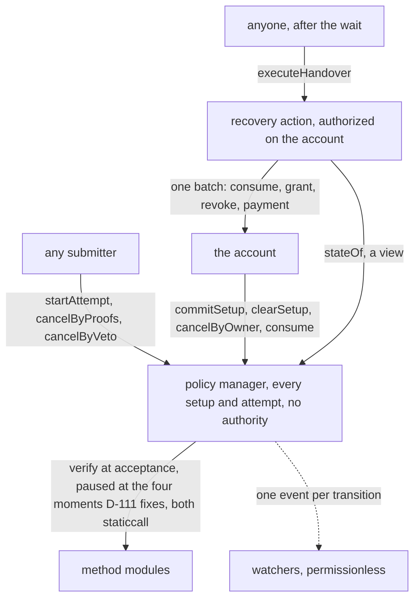
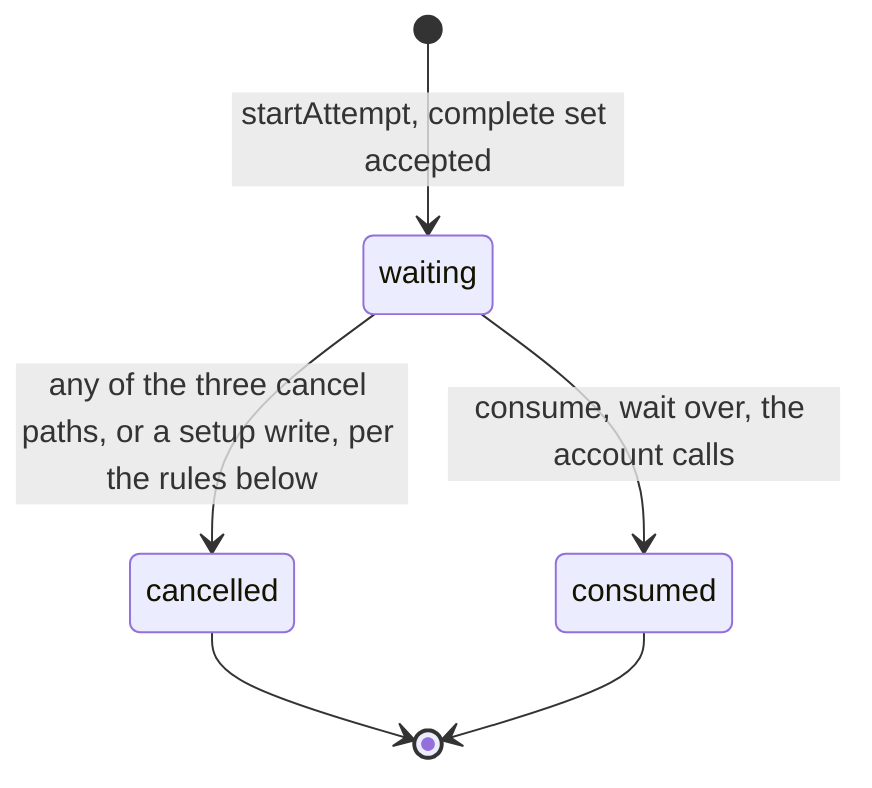
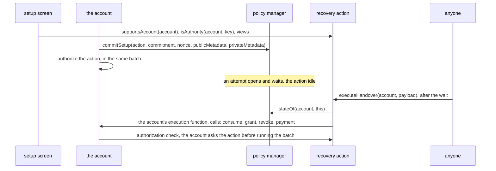
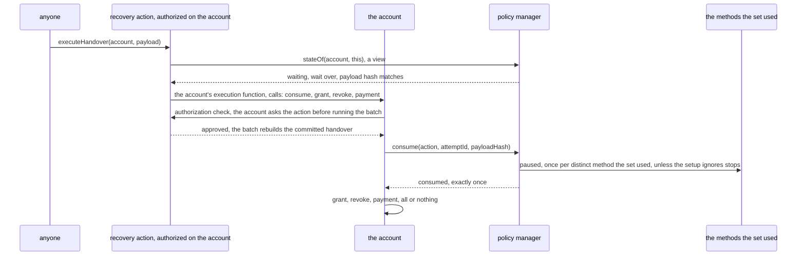
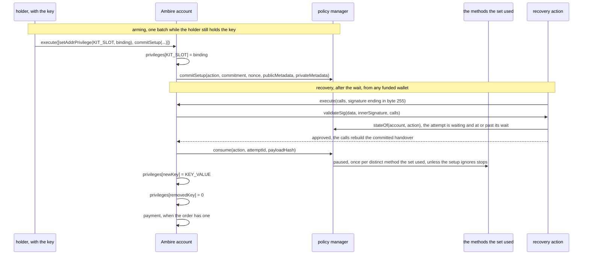
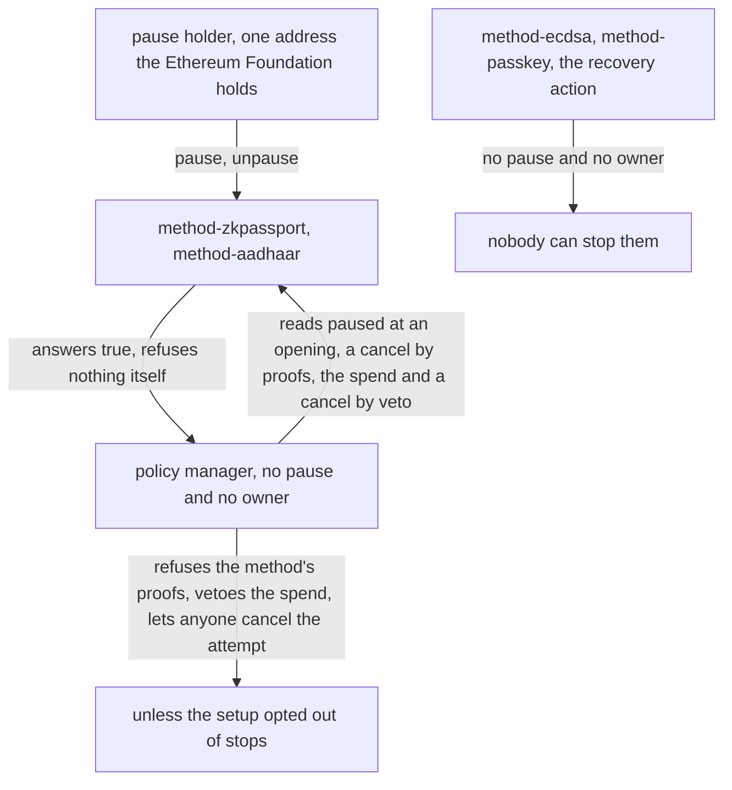

# Contracts tech design

This chapter is the contracts half of the tech design, authored by @0xParti. It is written to be read on its own, by whoever builds or reviews these contracts without having seen the conversation that produced them. Sections mint ids from the D-100 to D-199 band that the ownership table in [`design/PRD.md`](../PRD.md) records. The chapter reasons about each contract first and proposes its interface inside that contract's own section, so each signature follows the reasoning that produced it. Where an ecosystem convention shaped a choice, the section names the convention.

## D-100 Scope

This chapter is the full technical design of the on-chain kit, and it covers six things.

- It says what each contract is responsible for, and why.
- It declares each contract's storage, functions, events and errors.
- It gives the attempt state machine in full.
- It proposes each interface for freeze inside that contract's own section.
- It lists what any account must provide to run an action, and specifies the recovery action for the demo's account, Ambire's `AmbireAccount`.
- It specifies the pause a method can carry.

Every interface and every byte layout in this chapter is a proposal. The layouts freeze when their test vectors land under `design/kats/`. Those vectors are the agreement I-21 and I-22 demand between the SDK and the contracts. The interfaces freeze when the ownership table in [`design/PRD.md`](../PRD.md) records them and the action task has compiled the pinned source against the deployed bytecode on both chains and checked that no kit slot collides with an address Ambire's own slot convention would produce, the obligations D-105 leaves open on the demo's account, since either answer could still change an interface.

## D-101 Architecture

The kit's core is one contract, the policy manager, and it authorizes actions. An action is a contract that carries out one kind of outcome on one account implementation, a key handover, a transfer, a migration, under a policy the holder committed. The manager knows nothing about the outcome. It judges proofs against the policy and releases an approval, and what the action does with it is the action's own code. Recovery is the first action and the one this chapter follows, and any other outcome a holder wants gated by people, credentials and time is another action under its own policy. The first three entries below are the kinds of contract that make the kit, and the fourth is the account they serve, which stands outside the kit:

1. **The policy manager** makes every decision and holds every setup and every attempt. It is one contract, and every account calls it directly. It takes setups from accounts, judges requests against them and runs the state machine, every setup and attempt keyed by the account and the action. It holds no authority over any account: its one spend call is `consume`, which only the account itself can make, which releases an approved attempt exactly once, and the committed action performs what the release allows. Only an account writes its own configuration, enforced in one contract instead of once per module, and a hostile method reaches no holder's configuration and no other method's, since every setup and every attempt lives here and a method holds nothing of any holder's. What a method does hold is its own trusted keys and its own stop, which D-104 and D-111 specify. It carries no pause and no owner, and neither does an action.
2. **The method modules** are the judges of credentials, one per kind, permissionless to deploy and adopt. Each answers one question in a read-only call: does this proof approve this digest under this configuration? How it answers is its own business. The wallet method checks the signature in its own code, while an identity method calls its proof system's deployed circuit verifier and turns that answer into the kit's one verdict. That verifier is stateless code pinned by its address, like the method itself. The kit ships four, all ordinary instances of the same interface, and two of them additionally carry a key admin and a stop, which D-104 and D-111 specify and which the setup screen shows at adoption. A method module is a verifier the manager consults, and no account authorizes one.
3. **The actions** carry out the outcomes, one action per outcome per account implementation: each fixes the payload layout the helpers approve, screens accounts for the setup screen, and spends the approval by running the account's own batch through whatever call that account exposes, the consume first and the outcome's writes behind it. An action for another implementation is another contract.
4. **The account** is not part of the kit. Any smart account adopts the kit through an action written for the way that account carries out a batch, which is its own execution function wherever it has one and its keystore's own approval path where it has none, and the manager reads nothing of the account. The demo runs on Ambire's `AmbireAccount`, the smart account the Kohaku extension creates for its users. The engagement does not build it. The section on the smart account says what any account must expose, and `design/future-work.md` records what the engagement designed and did not build.

This chapter specifies in full the recovery action for Ambire's `AmbireAccount`, the demo's account, and the view functions every action exposes to the screens. The kit builds and audits every action it offers. Naming an action in a setup selects the code that spends any approval, and the account's own grant is what lets that action run calls with the account's authority. The section on the actions states the action's duties and that risk.



One request runs through this architecture, the idea draft's story told from the contracts' side:

1. Helpers sign the binding digest off chain. It is typed data naming the account, the action, the attempt, the payload and what the account will pay whoever submits. For the recovery action the payload is the new key coming in and the exact key being removed.
2. A submitter calls `startAttempt` with the written-out setup body, the payload, the payment order and every proof.
3. The manager recomputes the commitment, checks each place in order, and dispatches each proof to its method as a static call.
4. When every proof passes and every clause meets its threshold, the attempt opens and the wait starts counting. No proof is ever checked again for this attempt. The manager stores the payload's hash and the payment order next to the clock, and the opening event publishes the payload and the body in the clear, so everything the release will perform is public from this moment.
5. Once the wait is over, anyone calls the action's `executeHandover`. The action reads the manager's `stateOf` as an early exit, then builds the account's batch and hands it to the account's execution function. That batch is the consume first, then the two key writes, then the payment. Before running the batch the account asks the action, through whatever authorization check that implementation offers, and the action rebuilds the handover from the batch and checks it against the waiting attempt, the one guard on the account's authority. On the demo's account that check is `validateSig`, the callback the account makes to the action before it runs the batch.

   The writes come after the consume in the batch, so nothing executes without the spend and nothing is spent twice.
6. Every step emitted its event, so a watcher can rebuild the whole sequence from the chain alone.

## D-102 The smart account

This section lists what an account must provide to run an action, so an integrator can check an implementation against it before writing the account half of an action. The manager is installed on no account and reads none, so this list is the whole surface the kit touches on an account.

An account can run a recovery when it has three things:

- A way for one outside contract, the action, to run a batch of calls with the account's own authority, all of them landing or none. The account grants that through its own key, and every implementation names the grant differently, a module install, a privilege slot, a Safe module. Where that grant is exclusive to the action, the action initiates the batch and its own frame is where the guard sits. Where it is a door any caller can reach with a blob anyone can build, the account must ask the action whether to run the batch before it runs it, and that answer is then the whole guard, which is the shape the demo's account takes and D-105 specifies.
- Calls that add a key and remove a key, reachable inside that batch. On most implementations these are calls the account makes on itself. On some they go to a separate contract that holds the keys, with the account still the caller.
- Four reads the action makes of the account: one that says which implementation it runs, answered by a view where the account offers one and read out of its code where it does not, one that says whether an address is a key on it, one that says whether the action is authorized, and, wherever the account's table mixes keys with code, one that says whether an address holds any authority at all. The action's `supportsAccount`, `isAuthority` and `isAuthorized` answer the screens from the first three, and the broader view is one implementation's own, which is why the recovery action declares it and the shared interface does not.

Nothing else is required of an account the kit reaches this way, and Ambire's account, a Safe and a 7579 account all have the three things, each through an action of its own. The account needs no standard, no hook into the manager, no knowledge of the kit and no upgrade path. An account whose keys live in an EIP-8130 keystore has none of the three and reaches the outcome by another route, since its keys are written by a change batch a shared contract holds rather than by the account at all, so the action for it is an authenticator that answers whether a batch is approved and the manager does not change. `design/future-work.md` carries that design beside the other actions the engagement did not build, and it is the witness that the manager binds to no account standard rather than an account this list describes.

An account turns one action off by clearing that action's setup at the policy manager, one call the account makes per committed action, `clearSetup`, since the manager then has nothing to release and the action's code builds only what a release authorizes. Removing the authorization as well turns nothing further off, the way removing a token approval moves no balance, and it matters for one reason the section on that state gives.

Two facts follow from that split. A setup can exist with no authorization at all, since storing a setup is a call the account makes to the policy manager, `commitSetup`, which asks nothing else of the account, so a setup a wallet commits before authorizing the action still admits an attempt: anyone with a satisfying proof set opens one, publishes the rule and runs the clock, and the missing authorization stops the spend alone. The mirror case, an authorization removed with the setup left behind, is the dormant setup the security notes name. A third state, an authorization left live with no setup behind it, is reachable by `clearSetup` alone, and the security notes name it beside the dormant setup.

The key writes of a handover run in the account's own frame, with the account as the caller, so no contract outside the account can write its keys. The consume call is the account spending its own approval at the manager, which is why only the account may make it.

The security notes record one account behavior the action cannot repair, a second contract holding the account's authority that sends the consume alone and spends the approval while executing nothing.

## D-103 The policy manager

### Responsibility

The manager makes every decision and holds every setup and every attempt, and it holds none of the kit's authority. The deployed artifact is `PolicyManager`, since what it holds is policies and recovery is the first action the kit builds on it. One account's policy for one action is the setup the idea draft commits, and this chapter says setup for it. A policy here is a rule over credentials and an action is one committed contract that carries out an outcome, narrower words than the session-permission standards use for them.

- Configuration comes from the account itself and from nobody else, keyed by the action, so one account holds one independent setup per action.
- Recovery operations come from anyone, authorized by proofs alone.
- The manager never calls an account. Its outbound calls are the method verifications and the pause reads, static calls that can write nothing. It holds no authority anywhere. An approved attempt is released through `consume`, a call the account itself makes, and the committed action's own code performs what that release allows. The section on the actions states that trust. The interface below lists every external function, and none of them calls an account, so a reader can check the claim by reading the list against the code.

### Storage

Every setup and every attempt the kit holds live in two persistent mappings, and no other kit state is stored anywhere but inside a method that holds trusted keys or a pause:

```solidity
/// What the manager remembers about one action on one account. The commitment and the nonce are
/// the configuration only the account writes; the attempt counter is moved by the permissionless
/// opening call, and the block is written by every setup write.
struct Setup {
    bytes32 commitment;     // keccak256(account, action, nonce, body); bytes32(0) when none
    uint64  nonce;          // rises on every setup write, never rewinds
    uint64  attemptCounter; // the last allocated attempt id, never rewinds
    uint48  setupCommittedAtBlock; // the block of the last setup write, including a clear, so a client reads that one block rather than the whole history, taking the last matching event in it since two writes for one action can share a block; a block number rather than a time, unlike every other uint48 here
}

mapping(address account => mapping(address action => Setup))   internal setups;
mapping(address account => mapping(address action => Attempt)) internal attempts;
```

The storage keys by account and action address, so one account holds one setup per committed action, and the recovery action is one of them. Two setups for one outcome would take two action addresses, and the setup screen, the integrator's own adoption surface outside the kit, refuses to commit the second, since two would run two parallel attempts with the weaker rule deciding the account. The screen carries the same duty for a second manager deployment.

Neither counter ever decreases. The nonce rises on every setup write, a clear included, and the attempt counter moves only when an opening allocates an id, so a clear raises the first and leaves the second where it was, and retired proofs can never count again under a recycled attempt id. The manager never stores the cleartext setup body. It arrives in calldata at recovery, and the manager checks it against its committed hash.

The attempt record keeps what the manager needs at the spend and cannot recompute, which the `Attempt` struct below fixes field by field. Among them are the payload's hash, the payment order and the clock, beside the distinct methods the accepted set used and the holder's pause choice. Every stop read after acceptance reads that copy rather than the body. The opening event publishes the payload and the body in the clear, so storage keeps the hashes and watchers keep the content. The manager meets the privacy invariant I-16 regardless, since the commitment is the only configuration in storage.

### The attempt state machine

This subsection gives every state an attempt can hold, the call that moves it into each, and the rule the manager applies at each transition.



The rules at each transition:

- **A second request never displaces a waiting attempt.** A rule is satisfied or it is not, so no set satisfies it more than another and the manager has nothing to rank, and a second request fails as `AttemptAlreadyActive` whoever sends it. The sets are not interchangeable for the holder, since the methods a set names are the ones that can veto its spend, which is why the verification order asks the client to prefer the set naming the fewest of them. The first satisfying set therefore holds the action's one slot for the whole wait, and any other set's path is a cancel by proofs and then a fresh request, two transactions and a new wait.

- **A setup edit while an attempt waits** cancels that attempt in the same transaction, before the nonce increases, with its own cancel event.

    The edit itself takes effect at once, with no wait of its own, since the authority that writes a setup is the account's own and the kit does not defend against a stolen key, the scope the idea draft sets. That authority is every contract the account authorized as well as the holder's key. The write that replaces the whole setup gets no delay and no disclosure, while the recovery it forecloses gets days and the cancel paths the state machine lists. Argent's account is the one neighbour that guards the setup as strongly as the recovery, at the price of a second timelock the holder waits out to change their own guardians. The kit does not carry a third shape, a pending setup that activates after the current setup's own wait. It would give the holder the same notice a recovery gives them, and it would also leave a holder with a compromised setup unable to replace it for that whole window. The wait itself is read from the body at acceptance and written into the attempt as `consumableAfter`, so no later write re-times an attempt already waiting, where Zodiac's delay modifier reads its cooldown from global storage at execution and so lets one owner call push every queued item forward. No attempt outlives the setup it was judged under, and the consume re-checks the attempt's nonce against the setup's as a second check, so a write path that forgot to cancel would still not release a retired setup.
- **A cancel with nothing to cancel** reverts on all three paths, `cancelByOwner`, `cancelByProofs` and `cancelByVeto`, since each would otherwise emit a transition that did not occur, which the event rule forbids. `clearSetup` on an action with no setup reverts for the same reason.
- **The manager never learns whether the account authorizes an action.** Granting and removing the authorization are the account's own calls on itself and no hook reaches the manager, so a removal leaves the setup and any attempt in the manager. Leaving is one write, `clearSetup`, and the SDK pairs the authorization removal beside it where there is a setup to clear, since `clearSetup` reverts for a holder whose setup is already gone and a batch carrying both would revert whole. On an account that cannot revoke the authorization, `clearSetup` alone turns the action off, since it cancels any waiting attempt and moves the nonce, so `consume` finds no live attempt and refuses the stale nonce besides. A setup left behind is dormant rather than dead, revived by a later re-authorization, the hazard the security notes name.
- **A request must carry the exact next attempt id.** The helpers sign over the id the manager will allocate, and the manager rejects a request carrying any other id, lower or higher, so nobody can save a proof set for a later attempt.
- **A consume and a cancel by proofs aimed at the same attempt** both name it by id, and the consume names its payload hash besides, so whichever lands second reverts rather than acting on whatever replaced its target, and a replacement attempt always runs its own full wait from its own acceptance. The holder's own `cancelByOwner` names no id and cancels whatever attempt is live, since the account's key decides for the account.
- **No deadline to consume exists**, so a satisfied attempt whose wait is over stays spendable until someone executes or cancels it. The one deadline is on the request: every proof signs its `validUntil`, and the manager refuses the request once it passes, so a gathered proof set goes stale while an accepted attempt does not. There is no separate expiry path, because a cancel clears an attempt wherever somebody can send one, and an expiry would add a deadline whose approach hurries whoever meant to execute. Argent's account takes the other branch, where an escape expires on its own after a further period, so both sides of this choice have a shipped precedent. The security notes state what ours costs, the case the cancels do not reach among it, a keyless holder whose helpers cannot be reassembled. The holder with a key uses `cancelByOwner`, a proof set satisfying the rule uses `cancelByProofs`, and anyone uses `cancelByVeto` once a method the attempt used has been stopped. A cost falls on each side. An attempt nobody can execute blocks the action's only attempt slot until a cancel clears it, and an attempt everybody forgot stays spendable by anyone, so a holder who regains their key with an attempt waiting is told to cancel it.
- **The payment is a call in the action's batch**, after the consume, so a payment call that reverts takes the whole batch with it and nothing is consumed: the attempt stays waiting and the proofs stay valid. Whether an account that cannot cover the order reverts is the token's and the payee's business, which D-110 states. The SDK checks the balance before submitting.

### The setup body

This section says what the committed body contains and how the manager reads it. The body is the rule written out with the wait and one risk choice beside it. The manager decodes it with four internal functions, named below so the chapter can refer to them, and none of them is part of any public interface. What each one computes decides behavior, so this section fixes that, while the exact bytes freeze as the setup-body vector later. Every preimage this chapter writes as `keccak256` over a list of values is `abi.encode` over exactly that list in that order, the setup commitment, each credential commitment and the default salt alike, so every dynamic member carries its own length and no two different bodies or configs hash alike by re-splitting one run of bytes. The two sections after it say how the manager checks a request against this body and what the proofs sign.

```
setupBody = (
    uint48  wait,           // seconds between acceptance and consumableAfter; no floor, no ceiling
    bool    ignoresPause,   // whether a method's stop reaches this holder's accepted attempts
    Clause[] clauses        // one or more; the rule is the AND of them
)
Clause = (
    uint8     threshold,    // how many of this clause's credentials must fill
    bytes32[] credentials   // each keccak256(method, config, salt), in the holder's order
)
```

The action is not in the body bytes, and it is still signed and committed. Every proof signs the action address inside the digest, and the setup commitment hashes the account, the action, the nonce and the body together, so a body committed under one action never verifies under another. The body leaves it out only because the manager already stores the setup under the action's address, which the account names in the `commitSetup` call. A second action on the same account has its own setup, its own body and its own attempts.

- A **place** is the flat index of a credential across all clauses in body order, so place 0 is the first credential of the first clause and the numbering runs on into the next clause. The proofs' strictly increasing places therefore also walk the clauses in order.
- `credentialAt(body, place)` returns the credential hash at that index and reverts with `PlaceOutOfRange` past the end, so a place the rule does not have fails before any method sees it.
- `ruleSatisfied(body, proofs)` counts the filled places inside each clause against its threshold and answers whether every clause meets its own. When one does not, it names the first failing clause, which is what `RuleUnsatisfied` reports. It returns false for a body with no clauses, so an empty rule never opens an attempt. It also returns false for a rule whose every clause has a threshold of zero, since that rule and no other is met by a request with no proof at all, and it is the one rule shape the contract refuses on its own. A clause at zero beside a clause above zero is allowed, and a body whose only clause sits at zero is the all-zero shape `ruleSatisfied` refuses. The rule is the AND of its clauses, so a zero clause is a condition nothing has to fill while every other clause still has to be met, and a holder who parks a retired credential in such a clause keeps a rule that works. A clause whose threshold exceeds its credential count is named, not refused, since its count fails anyway and the name only tells the caller which clause is impossible. The body with no clauses and the all-zero rule both fail as `RuleUnsatisfied` naming clause zero, since neither refusal comes from a clause that missed its threshold.
- A place counts as filled only after its method returned the magic value, never by its position in the proofs array. A request whose proofs run out fails as `RuleUnsatisfied`. One failing proof reverts the whole call, so every entry in the array has passed by the time the count runs. Counting upward from verified proofs is what makes the commitment a rule rather than the whole authorization, and Safe's `checkNSignatures` walks the signatures it was given the same way. A neighbouring wallet counted downward from its guardian list instead and shipped a quorum an empty signature blob satisfied, which its own audit read past. Counting upward is the contract-side half of the degenerate-rule risk the idea draft assigns to the SDK.
- `ignoresPauseOf(body)` reads the holder's choice. At an opening and at a cancel by proofs the manager reads it from the revealed body. At acceptance it copies the choice onto the attempt, since neither the spend nor the cancel by veto receives the body and neither may trust a value the caller supplies. So the choice reaches all four reads of a stop. The setup screen states it in the holder's own words rather than by naming the mechanism.
- `waitOf(body)` reads the wait. `startAttempt` computes `consumableAfter` in the width the attempt stores it in, so a wait that carries the sum past that width reverts the request rather than wrapping into a shorter wait, and D-109 writes the one form that does it. A holder whose wait carries the sum past that width can never recover, so the SDK refuses at setup any wait above what the width leaves over the current time, one of the numbers the SDK owes.
- A clause's threshold is a `uint8`, which bounds how many credentials a clause can require and not how many it lists. The list is a `bytes32[]`.

The commitment hides the body, so a client bug can commit a dead setup that no contract check catches at the write. A preimage computed over the wrong action is found only when the holder has lost their key and tries to recover. The body layout is fixed for the life of each deployment, since nothing upgrades in place, so a new clause kind means a new manager and a migration. Several deployments can be live at once, so the SDK keys its body encoder on the manager's address. Before its screen reports success, the SDK re-derives the commitment it just committed from its own record.

A backup describes the body and the nonce of the write that carried it, so a holder who keeps one re-attaches it to every write that creates or replaces a setup, including a write that commits the identical rule, since a rebuild client, the client that reconstructs a holder's setup on a new device from the chain and their backup, reads the last such write alone and an empty field there leaves that holder nothing. The field is opaque bytes the manager never reads, so the manager cannot check that and the duty is the SDK's. A rebuild client reads the backup from the last write that created or replaced a setup and treats an empty field there as no backup rather than as a reason to walk the history. The rebuild client owes the same re-derivation.

### Verification order at acceptance

The manager verifies a request inside `startAttempt`, in one transaction and in the order below. The action plays no part in it and never sees a proof. At execution the consume re-checks the state the manager stored here and then asks the methods the set used whether any of them vetoes the release. Before the manager reads any place, it checks five things:

1. The account has a setup under the request's action.
2. The action has no active attempt.
3. The request names the stored setup nonce.
4. The attempt id is the next one.
5. The request's validity window has not passed. The window is one field of the request that every proof signs, the way EIP-2612's permit carries its deadline inside the signed message, so the manager checks it once here and never per place, a place being one credential's slot in the rule and numbered by the setup body section above.

Then the manager recomputes the setup commitment. It hashes the body in the request with the account, the action and the stored setup nonce, and the result must equal the stored commitment.

A cancellation runs the same checks with five differences. The second check inverts, since a cancel needs the attempt an opening refuses. The attempt id must be the live one rather than the next. Every proof signs the cancelling form of the digest rather than the approving one, so an approval never counts as a cancel. The manager checks the attempt's own setup nonce against the setup's, an extra check that is redundant here as at the consume, since a setup write already cancels. And the cancellation path does not check that a setup exists, since no attempt waits without one, so the attempt check refuses every cancellation an absent setup could reach.

Then, for each filled place, on both kinds:

1. The place is strictly greater than the previous one, so no place is filled twice and the loop crosses the clauses in order. A clause is one any-N-of-M group of the rule, in the shape the setup body section above encodes. Safe's `checkNSignatures` requires the same ordering of its signers for the same reason. The ordering makes a repeated place unrepresentable rather than merely forbidden. A repeated credential is a different thing: a rule may name one credential at two places, each place carries its own salt, so both verify and both count, and refusing that is the setup screen's, the risk the idea draft assigns to the SDK.
2. The manager recomputes the credential hash. The place names its method address, its config and its salt in the clear, and the manager hashes the three the way the setup did and compares against the credential hash at that place in the revealed body. A wrong method, config or salt fails here, before any call, so the module that runs is the one the holder committed and the config it judges is the one the holder wrote (I-4). The manager assumes the code at that address does not change, and the security notes name the cases where it does not.
3. The manager reads the method's pause, once per distinct method and before any proof of it is read, and refuses the whole request as `MethodStopped` when the method reports itself stopped. It skips this read when the revealed body says the holder ignores stops. The method itself refuses nothing, since the manager is the only reader of a stop, the rule the pause section fixes.
4. The manager computes the place's digest, per the digest section below, and dispatches `verify` as a static call. A verdict counts only when the static call succeeds and returns exactly 32 bytes whose whole word equals the magic value, the selector of `verify` itself, left-aligned. Reading four bytes rather than the word would admit a verifier that returns the selector followed by anything, and accepting more than one word would admit trailing bytes the decoder ignores, which is why Safe's own signature validator pins the length. Skipping the success check would read a revert carrying those bytes as an approval, the line whose absence in a neighbouring signer library an attacker exploited in June 2026. A revert, an empty return and a wrong value all read as false.

A request changes state only when every check passes. One bad proof beside a satisfying set fails the whole request, so the SDK submits the smallest set that satisfies the rule rather than everything it gathered, and verifies each proof by the same static call before it submits anything. Among equally small sets it prefers the one naming the fewest methods that carry a stop, since the methods a request names are the ones that can veto its spend. That pre-check is a filter and never a guarantee, since a method's verdict can depend on state another transaction moves between the simulation and inclusion, the limit Q-5 records for a sponsor's own simulation. A surplus proof makes the whole request depend on a method the rule did not need and puts that method's stop in front of the spend, an exposure the submitter would be choosing for the holder.

### The digest

This section says what a proof approves and how the manager rebuilds it from the request. The digest is EIP-712 typed data, so a wallet that renders typed data shows a signer the fields by name. Whether a given wallet renders an unknown struct that way or as a hash is that wallet's own behavior, which the design does not vouch for.

The payload is the one field the manager cannot type, since its layout is the committed action's own. It travels as plain bytes, and a wallet renders it as hex. A guardian approving with a wallet that renders typed data therefore sees the account, the attempt number and the payment in the clear, and the payload, for the recovery action the new key and the removed one, only as bytes. A typed summary of the outcome, carried beside the opaque payload and signed with it, would render as named fields on a wallet that renders typed data. The kit does not carry one, and what it costs is what decided it. The manager would have to keep the summary or its hash on the attempt so the action could read it back, every action would owe a decode of its own, and both would freeze as vectors, which is complexity the contracts carry for a disclosure the approval page already owes.

The approval page reads the payload field by field, decoding it in the committed action's layout, and the integrator's screens carry that page. So the signing screen alone shows less than the whole request, a cost the security notes record. A passkey assertion and an identity proof render nothing at all, since the digest enters them as a challenge or a public input, so for those helpers the approval page was always the only disclosure.

The domain is this deployment's own: the name `PolicyManager`, the digest format's version, the chain id and the manager's address. An approval signed for one chain or one deployment therefore verifies on no other. A redeploy at a new address invalidates every gathered approval, whether or not the format changed. No kit contract upgrades in place. A bug fix is therefore a deployment at a new address, and after a migration the helpers sign every approval again.

The format's version is the constant `DIGEST_VERSION`, and it is not `version()`, which is the deployment's release number. The manager publishes the whole domain through `eip712Domain()`, per ERC-5267, so the SDK reads it instead of guessing it. Two message types carry the two acts. The type name is part of what a proof signs, so an approval never counts as a cancel:

```
Approval(
    address account, address action, uint64 attemptId, uint64 setupNonce,
    bytes32 setupBodyHash, bytes payload, PaymentOrder order,
    uint48 validUntil, uint256 place)
PaymentOrder(address token, uint256 amount, address payee)

Cancellation(
    address account, address action, uint64 attemptId, uint64 setupNonce,
    bytes32 setupBodyHash,
    uint48 validUntil, uint256 place)
```

How the manager fills those fields from a request, and what it checks around them, in the order it runs:

```
// what arrives
request = (account, action, attemptId, setupNonce, setupBody, payload, order, validUntil, proofs[])
body    = decode(setupBody) = (wait, ignoresPause, clauses[])                    // the setup body section above

// the request against the stored setup
setup = setups[account][action]
require(setup.commitment != 0)                                                  // NoSetup
require(attempts[account][action].state != Waiting)                             // AttemptAlreadyActive
require(setupNonce == setup.nonce)                                              // WrongSetupNonce
require(attemptId == setup.attemptCounter + 1)                                  // WrongAttemptId
require(now <= validUntil)                                                      // RequestExpired
require(keccak256(account, action, setupNonce, setupBody) == setup.commitment)  // SetupCommitmentMismatch
                                                                                // body fields count only from here

// each proof against the revealed body
for p in proofs, places strictly increasing:                                    // PlacesNotStrictlyIncreasing
    require(keccak256(p.method, p.config, p.salt) == credentialAt(body, p.place))   // CredentialMismatch
    if (!body.ignoresPause) require(!_vetoes(p.method))                         // MethodStopped, once per distinct method
    digest = eip712(domain, Approval(account, action, attemptId, setupNonce,
                                     keccak256(setupBody), payload, order, validUntil, p.place))
    require(p.method.verify(p.config, digest, p.proof) == MAGIC)                // ProofRejected
require(ruleSatisfied(body, proofs))                                            // RuleUnsatisfied

// what the attempt keeps
attempt = (attemptId, setupNonce, now + body.wait, Waiting, keccak256(payload), order, distinct methods, body.ignoresPause)
```

A cancellation runs the same block with the four differences the verification section names, and its digest is the `Cancellation` type with no payload and no order.

Each field defeats one replay. The request declares the setup nonce its proofs were signed under and the manager refuses any but the stored one, failing as `WrongSetupNonce`, so an approval given under a retired setup fails with a named error before any proof is read, rather than as a rejected proof, and the digest is computed over that checked value. The action address ties a proof to one action, so an approval gathered for one action never counts for another the same account runs. The attempt id ties a proof to one attempt, the place ties it to one place in the rule, and the payload and the order tie it to one outcome and one price.

The order is one nested struct, the same `PaymentOrder` the request carries and the attempt stores, so the three places that hold it agree byte for byte.

`setupBodyHash` is the one pre-hashed member, and its preimage is the setup body's own bytes and nothing else, the same bytes the request carries and the same the commitment closes over with the account, the action and the nonce. So the digest binds the setup without carrying it, and a client that hashes the body one way for the commitment and another for the digest produces a request no proof verifies. The vector for this format carries both hashes over one body for that reason.

A cancellation names an attempt and no outcome, which is what a cancel is. It carries no payment order: a cancel is paid by whoever submits it, a decided cost, since the manager calls no account, and a canceller with no funded wallet of their own submits from any other, the way an opening request already travels. The proofs themselves are not in the digest, since a proof cannot sign itself. A method verifies that its credential approved exactly this digest, in the method's own way: a signature over it for a wallet, a passkey assertion whose challenge is it, a zero-knowledge proof with it as a public input.

The manager's `hashApproval` and `hashCancel` views compute these digests, and they call the same internal encoder the verification path calls, so the view and the check cannot disagree. A client uses them to cross-check its own bytes, not to replace them. A wallet's typed-data signing call takes the domain, the types and the message, not a digest, and a passkey or an identity proof needs the digest before any transaction exists. So the SDK derives the typed data locally, and both stacks replay the digest vector I-21 names.

### Interface

This subsection declares every external function of the manager: its configuration doors, its attempt calls, its one spend door, its views and its introspection. A reader can check against the list that none of them calls an account.

```solidity
/// @title IPolicyManager
/// @author defi-wonderland
/// @notice The one contract that judges recoveries. It stores each account's policy
///         per action, judges requests against it, runs the attempt state machine,
///         and holds no authority over any account.
/// @dev The manager never calls an account. The account spends an approved attempt
///      by calling consume, exactly once, and the action's code decides what runs
///      around that spend.
/// @dev The manager carries no pause and no owner. The only stop in the kit is the one a
///      method may carry, which the manager reads at an opening, at a cancel by proofs,
///      at the spend and at a cancel by veto, per D-111.
interface IPolicyManager {
    // ---- Configuration. Callable by the account alone. ----

    /// @notice Create or replace the caller's setup for the given action.
    /// @dev Increments the setup nonce and cancels any active attempt of the action.
    ///      Refuses bytes32(0), the no-setup value, the commitment of zero-length bytes,
    ///      the one dead preimage it can name, and any nonce other than the current one
    ///      plus one. The commitment and the nonce arrive as independent arguments, so
    ///      this catches a caller whose nonce is stale and never proves the commitment
    ///      was computed over it, the dead-preimage hazard D-110 states.
    /// @param action The action this setup governs, by its address.
    /// @param setupCommitment keccak256 of the account, the action, the nonce this
    ///        write will hold, and the setup body.
    /// @param nonce The nonce the commitment was computed over, the current one plus one.
    /// @param publicMetadata What the holder chose to show the world about this setup,
    ///        empty by default. Anyone may read it.
    /// @param privateMetadata The holder's backup of their configuration, encrypted
    ///        unless the holder chose the clear path, possibly empty. Public on chain
    ///        like everything else.
    function commitSetup(address action, bytes32 setupCommitment, uint64 nonce, bytes calldata publicMetadata, bytes calldata privateMetadata) external;

    /// @notice Remove the caller's setup for the given action.
    /// @dev Increments the setup nonce and cancels any active attempt. Reverts with no setup.
    function clearSetup(address action) external;

    /// @notice Cancel the caller's own active attempt with the account's own key.
    /// @dev Only the account may call it, like commitSetup and clearSetup. Reverts with
    ///      NoActiveAttempt where nothing waits, and reads no nonce, since no attempt
    ///      outlives the setup it was judged under.
    function cancelByOwner(address action) external;

    // ---- Attempts. Permissionless to call, authorized by proofs alone. ----

    /// @notice Open an attempt with a complete proof set in one transaction.
    /// @dev Anyone may call it. The proofs are the authorization, and the caller's identity has
    ///      no bearing on any check. What the caller does choose, where a rule can be
    ///      satisfied more than one way, is which methods the attempt records as used, and
    ///      those are the methods that can veto its spend later, per D-111. No caller ever
    ///      fills a place by being who they are, so there is no implicit approval anywhere in the manager, unlike Safe's signature check, which takes the executor as an argument and warns in its own comments that passing it wrongly lowers the threshold by one.
    /// @param request The full request; see AttemptRequest.
    function startAttempt(AttemptRequest calldata request) external;

    /// @notice Cancel the active attempt with a proof set that satisfies the rule.
    /// @dev Anyone may call it. The proofs are the authorization. A cancel proof signs
    ///      a Cancellation type naming one attempt, so an approval proof never counts as one.
    /// @param request Like AttemptRequest but with no payload, since a cancel approves no outcome.
    function cancelByProofs(CancelRequest calldata request) external;

    /// @notice Cancel a waiting attempt one of whose methods has been stopped. Permissionless.
    /// @dev The stop is the authorization, so this call carries no proofs. The named method
    ///      must be one this attempt's accepted set used, and it must answer the pause read
    ///      with exactly true, per D-111. Reverts with no waiting attempt, on an id that is
    ///      not the live one, on a setup nonce that has moved, on an attempt whose setup
    ///      committed to ignore a stop, on a method the attempt did not use, and on any
    ///      answer that is not that exact word. It requires no wait, no
    ///      payload and no window, and it does not move the setup nonce or the attempt
    ///      counter.
    /// @param account The account whose attempt is cancelled.
    /// @param action The action the attempt runs under.
    /// @param attemptId The exact attempt, so a cancel aimed at one never reaches its successor.
    /// @param method The stopped method the caller points at, checked for membership in the
    ///        attempt's used methods, which is where the authorization comes from, so no
    ///        caller can point the manager at an address the holder never committed.
    function cancelByVeto(address account, address action, uint64 attemptId, address method) external;

    // ---- The spend door. Callable by the account alone. ----

    /// @notice Spend the caller's approved attempt under the given action, exactly once.
    /// @dev The caller is the account. Reverts with no waiting attempt, on an attempt
    ///      id that is not the live one, before the wait ends, on a stale setup nonce, on a
    ///      payload hash that is not the committed one, and, unless this attempt's setup
    ///      committed to ignore a stop, on a method it used answering the pause read with
    ///      true, per D-111. Sets the attempt to Consumed, so a second call reverts. The action puts this call first in the batch that executes
    ///      the payload. The manager never sees that batch, so only the action's code
    ///      keeps the spend and the writes together, per D-105.
    /// @param action The action whose attempt is spent.
    /// @param attemptId The exact attempt being spent, so a spend aimed at one attempt
    ///        can never release a successor.
    /// @param payloadHash keccak256 of the payload being executed, checked against the
    ///        committed one.
    function consume(address action, uint64 attemptId, bytes32 payloadHash) external;

    // ---- Views. ----

    /// @notice Everything a client needs to know about one action's setup and attempt,
    ///         in one read. Whether the action is authorized on the account is the
    ///         account's own fact, read from the account.
    /// @param account The account asked about.
    /// @param action The action asked about.
    /// @return state The committed setup, its nonce, the id the next request must
    ///         carry, and the attempt record.
    function stateOf(address account, address action) external view returns (ActionState memory state);

    /// @notice The digest the proof at one place of a request must approve, EIP-712
    ///         typed data under this deployment's domain. A cross-check for the SDK,
    ///         which derives the same typed data locally to sign it.
    /// @param request The request the digest is computed over, its proofs ignored.
    /// @param place The place in the rule the approving credential fills.
    /// @return digest What the proof at that place must approve.
    function hashApproval(AttemptRequest calldata request, uint256 place) external view returns (bytes32 digest);

    /// @notice The digest the proof at one place of a cancellation must approve, bound
    ///         to one exact attempt under a type distinct from an approval's.
    /// @param request The cancellation the digest is computed over, its proofs ignored.
    /// @param place The place in the rule the cancelling credential fills.
    /// @return digest What the proof at that place must approve.
    function hashCancel(CancelRequest calldata request, uint256 place) external view returns (bytes32 digest);

    /// @notice The EIP-712 domain the digests are computed under, per ERC-5267: the name,
    ///         DIGEST_VERSION, the chain id and this address. What the SDK reads to derive
    ///         the typed data locally.
    function eip712Domain() external view returns (
        bytes1 fields, string memory name, string memory version, uint256 chainId,
        address verifyingContract, bytes32 salt, uint256[] memory extensions);

    // ---- Introspection. ----

    /// @notice ERC-165, so wallets and clients can probe what this is.
    function supportsInterface(bytes4 interfaceId) external view returns (bool supported);

    /// @notice Human-readable name of this deployment, for wallets and clients. Not
    ///         the EIP-712 domain's name, which is the fixed string the domain view returns.
    function name() external view returns (string memory managerName);

    /// @notice Semantic version of this deployment.
    function version() external view returns (string memory managerVersion);

}
```

### Errors

Each error carries the offending values, so a failed recovery is debuggable. This matters here for a second reason: a method module's revert reads as a false verdict, so the manager's own reverts must look different.

```solidity
error InvalidCommitment(bytes32 supplied);       // bytes32(0), the no-setup sentinel, or the commitment of zero-length bytes
error WrongSetupNonce(uint64 supplied, uint64 expected);        // a commitment computed over a nonce this write will not hold, or a request signed under a nonce that is not the stored one
error PlaceOutOfRange(uint256 place, uint256 count);              // a place past the end of the revealed rule
error NoSetup(address account, address action); // an attempt, or clearSetup, asked of an action with no committed setup
error NoActiveAttempt(address account, address action);        // cancel or consume with nothing running
error AttemptAlreadyActive(address account, address action, uint64 attemptId);  // startAttempt while an attempt is already running
error WrongAttemptId(uint64 supplied, uint64 expected);         // a request named an id that is not the next one, or a cancel or consume one that is not the live one
error SetupCommitmentMismatch(bytes32 recomputed, bytes32 committed);  // the written-out rule does not hash to the commitment
error StaleAttempt(uint64 judgedUnder, uint64 currentNonce);    // consume or cancel found the setup nonce moved since acceptance
error CredentialMismatch(uint256 place, bytes32 recomputed);     // method, config and salt do not hash to the credential at this place
error PlacesNotStrictlyIncreasing(uint256 place);  // a duplicate or out-of-order place in the proofs array
error RequestExpired(uint48 blockTimestamp, uint48 validUntil); // the request arrived after its own deadline
error ProofRejected(uint256 place, address method);  // this method rejected the proof at this place in the rule
error MethodStopped(uint256 place, address method);   // the method at this place reports itself stopped and the setup did not opt out of stops
error MethodVetoedSpend(address method);         // a method the accepted set used answered the spend's pause read with true, per D-111
error MethodNotUsed(uint64 attemptId, address method);  // a cancel by veto named a method this attempt's accepted set did not use
error AttemptIgnoresPause(uint64 attemptId);     // a cancel by veto aimed at an attempt whose setup committed to ignore a method's stop
error MethodNotStopped(address method);          // a cancel by veto named a method that did not answer the pause read with true
error RuleUnsatisfied(uint256 clause);           // every proof verified, but this clause's filled places miss its threshold; clause zero for a body with no clauses and for an all-zero rule
error WaitNotOver(uint48 blockTimestamp, uint48 consumableAfter);  // consume before the wait ended
error WrongPayload(bytes32 supplied, bytes32 committed);        // consume named a payload that is not the attempt's
```

### Structs

Two request formats serve the attempt calls, one for an opening and one for a cancellation, and the bytes of both are among what the test vectors freeze. This chapter fixes the widths here, since the vectors freeze them permanently: timestamps are `uint48`, the width ERC-4337 uses for validity, and `place` is `uint256` because calldata pads every value type to 32 bytes anyway, so a narrower type would save nothing.

```solidity
/// What the account pays and to whom, approved by the helpers inside the digest, so
/// nobody can redirect it after they signed, the shape Safe's own refund parameters
/// take, the gas token and the refund receiver signed with the transaction. Zero
/// amount means nobody is paid.
struct PaymentOrder {
    address token;        // address(0) for the native asset, otherwise an ERC-20
    uint256 amount;       // the batch carries this transfer; whether the payee receives it is the token's business, per D-110
    address payee;        // who is paid, usually the submitter or their paymaster; address(0) leaves the order open, per D-105
}

/// Everything one attempt submission carries: which account and action, the rule
/// written out, the outcome being approved in the committed action's own layout,
/// what the account pays for it, and the proofs.
struct AttemptRequest {
    address account;      // the account the action runs on
    address action;      // the action the setup was committed under
    uint64  attemptId;    // must equal stateOf(account, action).nextAttemptId
    uint64  setupNonce;   // the setup version the proofs were signed under; any other than the stored one fails as WrongSetupNonce, never as a rejected proof
    bytes   setupBody;    // the committed rule written out; with the account, the action and the nonce it must hash to the commitment
    bytes   payload;      // the outcome being approved, in the committed action's layout; the manager stores its hash
    PaymentOrder order;   // what the account pays at execution, and to whom
    uint48  validUntil;   // until when this signed request may still be submitted; every proof signs it
    ProofPlace[] proofs;   // one entry per filled place; place values strictly increasing
}

/// One filled place in the rule: which place, which method judges it, whose credential,
/// its salt, and its proof. The manager hashes method, config and salt and compares
/// the result with the credential hash at that place in the body, so none of them is
/// trusted as sent.
struct ProofPlace {
    uint256 place;         // which place in which clause of the rule
    address method;       // the module that verifies this credential
    bytes   config;       // the credential in the method's own layout, per D-104
    bytes32 salt;         // this credential's salt, keccak256(account, place) by default, or any value the holder supplied at setup, per D-110
    bytes   proof;        // the method's proof bytes, per D-104
}

/// A cancellation submission. Like AttemptRequest but approving no outcome, which is
/// why it carries no payload. It carries its own validUntil, so a cancel signed ahead
/// of the attempt it names cannot wait for it forever.
struct CancelRequest {
    address account;      // the account whose attempt is cancelled
    address action;      // the action the attempt belongs to
    uint64  attemptId;    // the exact attempt these proofs cancel
    uint64  setupNonce;   // the setup version the cancel proofs were signed under, checked like the opening request's
    bytes   setupBody;    // the committed rule written out
    uint48  validUntil;   // until when this signed cancellation may still be submitted
    ProofPlace[] proofs;   // signed as cancellations of this exact attempt
}

enum AttemptState { None, Waiting, Cancelled, Consumed }

/// One-read summary of one action on one account, what stateOf returns.
struct ActionState {
    bytes32 setupCommitment;   // bytes32(0) when no setup exists
    uint64  setupNonce;        // monotonic across clearing and recommitting
    uint64  nextAttemptId;     // the id the next accepted request must carry
    uint48  setupCommittedAtBlock;  // the block of the last setup write, a block number rather than a time
    Attempt attempt;           // the last attempt record; Waiting is the only live state, the others are history
}

/// The attempt record per action, overwritten by each new attempt and never deleted:
/// the clock and what the spend checks, all of it public since the opening event.
struct Attempt {
    uint64 attemptId;       // the id this attempt was allocated
    uint64 setupNonce;      // the setup version it was judged under; consume and cancel refuse any other
    uint48 consumableAfter; // when the wait ends
    AttemptState state;     // Waiting while live; Cancelled or Consumed once ended
    bytes32 payloadHash;    // keccak256 of the committed payload; what consume checks
    PaymentOrder order;     // the payment the helpers approved
    address[] usedMethods;  // the distinct methods the accepted set used, in the order the proofs named them; consume asks each one whether it vetoes the spend
    bool ignoresPause;      // copied from the body this attempt was judged under, so the spend and the cancel by veto read it without the body
}

/// @notice The account committed a new setup for one action.
/// @param publicMetadata The holder's optional public note, for anyone. Empty by default.
/// @param privateMetadata The holder's own configuration copy for a future device, the
///        backup the idea draft describes, encrypted unless the holder chose the clear
///        path. A separate field because its audience is the opposite of the public one's.
event SetupCommitted(
    address indexed account,
    address indexed action,
    uint64 nonce,
    bytes32 setupCommitment,
    bytes publicMetadata,
    bytes privateMetadata
);

/// @notice The action's setup was removed by clearSetup. A recommit emits
///         SetupCommitted alone, one event per setup write.
/// @param nonce The nonce this clear wrote, the previous one plus one, the same value
///        SetupCommitted carries for a write.
event SetupCleared(address indexed account, address indexed action, uint64 nonce);

/// @notice A complete proof set opened an attempt.
/// @param setupNonce The setup version the attempt was judged under, so a watcher
///        binds the attempt to the setup that authorized it.
/// @param usedPlaces The place values the accepted set filled, strictly increasing. Which
///        person each place is follows from the configs in the transaction's calldata.
/// @param usedMethods The distinct methods that set used, the ones consume asks for a veto,
///        so the event stream carries the whole attempt the manager stored, per I-20.
event AttemptStarted(
    address indexed account,
    address indexed action,
    uint64 attemptId,
    uint64 setupNonce,
    bytes setupBody,
    uint256[] usedPlaces,
    address[] usedMethods,
    bytes payload,
    PaymentOrder order,
    uint48 consumableAfter
);

/// @notice The attempt was cancelled.
/// @param canceller Who cancelled: the account itself for the holder's cancel, the caller
///        for a cancel by proofs or by veto, zero for a cancel that fell out of a setup write.
/// @param vetoingMethod The stopped method whose veto authorized a cancel by veto, and
///        address(0) on every other path, so an administrative cancellation never reads as
///        a helper set backing out.
/// @param setupNonce The setup version, and usedPlaces the places the cancelling set
///        filled, empty for the holder's own cancel and for a cancel by veto, mirroring the
///        opening event so a holder can tell their own friends backing out from a set they
///        should worry about.
event AttemptCancelled(
    address indexed account,
    address indexed action,
    uint64 attemptId,
    address canceller,
    address vetoingMethod,
    uint64 setupNonce,
    uint256[] usedPlaces
);

/// @notice The account spent the attempt, and that is all the manager saw. What the
///         batch around the spend performed, the writes and the payment, is the
///         account's own transaction and state to read, never inferred from this event.
event AttemptConsumed(
    address indexed account,
    address indexed action,
    uint64 attemptId
);
```

The manager emits the cleartext `setupBody` and `payload`. The body is public from the moment an attempt starts, so the event leaks nothing the transaction does not, and a hashes-only event would leave the watcher nothing to read.

A client also reads the event to see what an open attempt contains. `stateOf` says whether an attempt is running, when its wait ends and which payload hash it will release, while `AttemptStarted` carries the rule, the outcome, the order and which places were filled, free for any client to read. `AttemptConsumed` says the spend happened and nothing more, so a watcher reporting a completed handover reads the account's own transaction and signer state beside it.

The manager's events do not carry whether the account authorizes the action. Whether it does is the account's own fact. The account's own view functions carry it, in whatever shape that implementation gives them, and the committed action's `isAuthorized` reads them for the SDK beside this stream. On the manager's own event stream the authorization's removal is therefore invisible, and what carries it is the account's own privilege-change events, which D-108 hands the sdk chapter as the alerting surface.

The configurations of the used credentials travel in the transaction's calldata, public and only inconvenient to index, and the event carries the cleartext body, so every credential hash of the rule is published too, used and unused alike. Which approvals a request publishes is the submitter's choice, since a request may carry more proofs than the thresholds need and the manager verifies every one it carries. The event omits the request's `validUntil`, because a watcher never needs the window after acceptance. From acceptance the attempt is bound by its clock and its id.

## D-104 The method modules

### Responsibility

A method module answers one question in a read-only call and stores nothing of the kit's.

- It keeps no account's configuration and no attempt, and it cannot write during a check: the interface is `view` and the manager dispatches it as a static call, so a module that tries to write reverts. One failing or hostile method can never touch another. That isolation is invariant I-14, and the static call enforces it mechanically.
- The manager treats every module as hostile: a verdict counts only as the exact magic value, per the verification order at acceptance above.
- A method may carry a pause of its own, the only stop in the kit. The method only reports it, through `paused()`, and never refuses a proof on its own account. The manager reads that report at the four moments D-111 fixes, honouring the holder's own opt-out at every one of them, so a stopped method's credentials stop counting in requests, approvals and cancels alike until whoever holds that pause lifts it, for every holder who did not opt out. A method that carries none is one nobody can stop, and what a third-party method does about its own bugs is its author's business rather than something this interface requires.
- The interface is minimal. Every function added to it is surface a hostile module could abuse: callbacks, hooks and multi-call flows alike.
- The argument order follows ERC-7913's `verify(key, hash, signature)`, the credential first and the thing it approves second, so an author who has written a 7913 verifier maps it without a second look. A verifier written to ERC-7913 works as a method when its signature and magic value match this one, and it lacks only the declaration and the members named below. The ERC-165 probe is therefore advisory: the setup screen warns on a module that fails it rather than refusing it, since adoption has no gatekeeper (I-5). The two match exactly, verified against the final text of ERC-7913 on 2026-09-08, which requires the magic value `0x024ad318` and names it as that interface's own `verify` selector, the same four bytes this method's signature produces. So a conformant ERC-7913 verifier verifies for this kit with no change to its verification code, and a verifier already built to that standard serves as a method here, so nobody writes one twice.
- The pause read belongs to `IPolicyMethodPause` rather than to this interface. A verifier that declares no pause is therefore not missing a member of the interface it claims, and it answers that read with nothing. An address whose fallback answers it with the exact word is refused at every opening that names it, since the manager reads the stop before it reads any proof of that method. Where the holder committed to ignore stops the manager never makes that read, so the credential fills and no spend is vetoed. Either way an address whose fallback answers that read vetoes nothing, and what it costs is the credential rather than the attempt.

### What a method may hold of its own

The kit ships four methods: `method-ecdsa`, `method-passkey`, `method-zkpassport` and `method-aadhaar`. Each is specified in the shipped methods section below. Some of them do not judge a proof alone. Their verdict depends on somebody else's key, and for the shipped identity pair the method holds that key in its own storage, where its key admin, the role `IPolicyMethodAdmin` below declares, can update it:

- `method-zkpassport` holds the root of the passport certificate set its proofs are checked against, the value the zkPassport project publishes and rotates, and its key admin writes the new root when that happens.
- `method-aadhaar` holds the public key hash of the identity issuer its proofs are checked against, and its key admin replaces that hash when the issuer rotates.
- `method-ecdsa` and `method-passkey` hold no trusted key, so neither has a key admin. They carry no pause either, so nobody can stop them.

The same two methods carry the only stop in the kit, for the same reason. A verdict that leans on somebody else's key can go wrong with no line of the method's code being wrong, and refusing that method is the one repair that does not need every holder's key. The pause lives in the method contract: the method stores one flag, and its owner, the Foundation's address, sets and clears it. The manager stores nothing about it and only reads it. D-111 specifies what the pause reaches and who may ignore it.

A method that holds the key directly, rather than reading it live from the issuing project's own registry contract, keeps one kind of dependency instead of two. Whoever the key admin is, they already have to follow the issuer's rotations, and copying the current value into the method adds no outside contract whose admin could change the verdict from one step further away. It is not the same duty as a live read, since a copy needs a transaction per rotation and fails silently when nobody sends one. Outside itself a method still calls stateless verifier code, a circuit verifier for a proof system, pinned by its address like the method itself and trusting nobody.

An updatable trusted key is a decided tradeoff. An updatable key keeps the identity methods alive when the issuer rotates a key, which otherwise breaks every credential of that method with no fix a keyless holder could apply. The security notes weigh the cost. The key admin can set a key they control and then forge every proof of that method, the same power a proxy admin holds over an upgradeable verifier. ERC-7913, the standard for pluggable signature verifiers the methods follow, asks the opposite: that a verifier depend on nothing that can change after deployment, because a guardian set at setup may be used years later. The two identity methods depart from that on purpose, and the setup screen shows their key admin first. The commitment still pins the code, on the assumption I-4 states, but the verdict that code produces now depends on state the key admin writes.

### The declaration of trusted parties

A holder who adopts a method also trusts whoever can change what that method accepts and whoever can stop it. I-15 says the holder sees every such party before approving, so the interface has a view for it, `trustedParties`, returning five things: the admin able to change the method's keys, the address one acceptance away from that role, the keys the method trusts today, the address that can stop it, and the address one acceptance away from that. Both roles report their pending holder, since a holder reading this at adoption is reading who will be able to act on them and not only who can today. The kit cannot require the view of anyone, since adoption has no gatekeeper. The four shipped methods implement it, and only the two identity methods have anything to declare. `method-ecdsa` and `method-passkey` answer nobody and nothing, the zero address as `admin` and as `pauseHolder` and an empty list as `trustedKeys`. A third-party method may leave the view out, and the setup screen then shows the method as carrying unknown parties.

A third-party method may also lie in it, since nobody checks the answer. The declaration is code, not an off-chain file. The commitment pins the module's address, so on the assumption I-4 states, the code that answered the declaration at adoption is the code that answers it later, while the keys and the roles it reports can change afterwards.

Outside code a method calls, a circuit verifier, is not a party, since it is pinned by address like the method itself and its circuit is published like any other code. A method whose verdict routed through an upgradeable outside contract would be lying by omission. The declaration carries no field for that address, so a holder reads which parties can change this method and not which verifier its verdict runs through, which the method's own code and its audit carry. The shipped methods have audits behind their declarations, and for a third-party module the setup screen warns the holder that the list is the author's own word, a duty the integrator's own screens carry.

### How the manager reads a verdict

The manager calls whatever address the setup names, so a verdict has to be hard to produce by accident. A call to an address with no code succeeds and returns nothing. A contract with a catch-all fallback can return any 32 bytes. A check that read success as approval, or any nonzero word as true, would accept an address that never verified anything.

So `verify` returns a `bytes4`, and the manager accepts one value only: the selector of `verify` itself, the first four bytes of `keccak256("verify(bytes,bytes32,bytes)")`. An empty return, a revert or any other value is a rejection. That value is the magic value of ERC-7913, the standard for pluggable signature verifiers, so every verifier built to that standard already returns it on purpose. ERC-1271, the standard a smart account uses to say whether it accepts a signature, uses the same pattern, and the return is named `magicValue` after it. A plain bool is the easy value to produce by accident, so this design does not accept one.

One kind of address returns the caller's own selector at the front: a precompile that echoes its input, the identity precompile among them. The length check refuses it, since an echo returns the whole call and the manager accepts one word alone. What remains is a contract that returns exactly the magic value and verifies nothing. A contract that returns the magic value and verifies nothing is a hostile method like any other, the holder's own adoption risk. The security notes name it.

The pause read runs the other way on the same principle. There the manager refuses only on a successful call returning exactly the ABI encoding of `true`. In both reads only a recognized answer carries authority. They differ because one answer authorizes a credential and the other vetoes a release. What each of the four reads does with an answer that is not that word is D-111's, which states all four in one place rather than leaving each section to restate them.

### Interface

This subsection declares the one function every method answers, the declaration a conforming method publishes, and the two role surfaces a method that carries keys or a stop implements beside them.

```solidity
/// @title IPolicyMethod
/// @author defi-wonderland
/// @notice One credential verifier. Permissionless to deploy and adopt.
/// @dev A method may carry a pause of its own, the only stop in the kit. The
///      manager reads it at the four moments D-111 fixes and asks for nothing else, so a method that
///      declares none is adoptable unchanged.
interface IPolicyMethod {
    /// @notice Verify one credential's proof against the binding digest.
    /// @dev The manager calls it as a static call, after checking that config hashes to
    ///      the committed credential.
    /// @param config The credential's written-out configuration, already recommitted.
    /// @param digest The hash this proof must approve, from hashApproval or hashCancel.
    /// @param proof The method-specific proof bytes.
    /// @return magicValue IPolicyMethod.verify.selector when the proof approves exactly
    ///         this digest under this config; any other value, empty return or revert
    ///         reads as false. The name and the pattern follow ERC-1271.
    function verify(bytes calldata config, bytes32 digest, bytes calldata proof)
        external view returns (bytes4 magicValue);

    /// @notice The self-attested declaration of whose word this method's verdict
    ///         depends on: the key admin able to change its keys, the keys it trusts as set
    ///         today, and whoever can stop it. address(0) and an empty list mean nobody
    ///         and nothing.
    /// @return admin Who can update this method's trusted keys; address(0) when nobody can.
    /// @return pendingAdmin The address one acceptance away from that role; address(0) when
    ///         no transfer is open.
    /// @return trustedKeys The outside values this method's verdict accepts today, a hash of an
    ///         issuer key for one shipped method and a root over a certificate set for the other.
    /// @return pauseHolder Who can stop this method; address(0) when nobody can, per D-111.
    ///         A zero here means this method declares no stop of its own, and a method that
    ///         answers the manager's pause read with true is refused at every opening that
    ///         names it, or fills ordinarily where the setup ignores stops, so a holder reads
    ///         this as who has said they can stop it rather than as who cannot.
    /// @return pendingPauseHolder The address one acceptance away from holding that stop,
    ///         address(0) when no transfer is open, so a holder reading this at adoption
    ///         sees a role about to move rather than only the one holding it today.
    function trustedParties() external view
        returns (address admin, address pendingAdmin, bytes32[] memory trustedKeys,
                 address pauseHolder, address pendingPauseHolder);

    /// @notice ERC-165, so the setup screen can ask a bare address whether it is a
    ///         policy method before adopting it. Advisory: a module failing it is
    ///         warned about, not refused.
    function supportsInterface(bytes4 interfaceId) external view returns (bool supported);

    /// @notice Human-readable module name, for the adoption screen.
    function name() external view returns (string memory moduleName);

    /// @notice Semantic version of this module.
    function version() external view returns (string memory moduleVersion);
}

/// @title IPolicyMethodPause
/// @notice The stop surface of a method that carries one. The two identity methods
///         implement it; the wallet and passkey methods do not, and a method that
///         implements none of it is a method nobody can stop, per D-111. Ownership of the
///         stop is `Ownable2Step`'s and this interface declares none of it again.
interface IPolicyMethodPause {
    /// @notice Stop this method. Callable by the pause holder alone. While it is on the
    ///         method answers the manager's read with true, and what the manager does with
    ///         that answer at each of the four moments it reads is D-111's. The
    ///         method itself refuses nothing inside verify.
    function pause() external;

    /// @notice Let this method's proofs count again. Callable by the pause holder alone.
    function unpause() external;

    /// @notice Whether this method is stopped. The one function of this interface the
    ///         manager calls, and the only one every method may leave out, since a method
    ///         that carries no pause implements none of this and is adoptable unchanged.
    function paused() external view returns (bool isPaused);

    /// @notice The stop went on. What a watcher alerts every holder whose rule names the
    ///         method on, since the manager derives no such audience.
    event Paused(address account);

    /// @notice The stop came off.
    event Unpaused(address account);
}

/// @title IPolicyMethodAdmin
/// @notice The key admin's surface of a method that holds trusted keys. The shipped
///         identity methods implement it; the wallet and passkey methods do not, having
///         no keys. The key admin is a role of its own, not the pause holder above.
interface IPolicyMethodAdmin {
    /// @notice Replace the keys this method trusts. Callable by admin alone.
    function setTrustedKeys(bytes32[] calldata trustedKeys) external;

    /// @notice The keys changed. What a watcher alerts holders of this method on.
    event TrustedKeysUpdated(bytes32[] previous, bytes32[] current);

    /// @notice Hand the key admin role to another address, in two steps, the shape
    ///         OpenZeppelin's Ownable2Step gives ownership. The named address becomes
    ///         the admin only by accepting, so a mistyped address strands nothing and a
    ///         compromised admin key can be replaced without freezing the keys.
    ///         Callable by the admin alone.
    function transferAdmin(address newAdmin) external;

    /// @notice A transfer of the key admin role was offered. What a watcher alerts the
    ///         holders of this method on, since the offer is the one window in which the
    ///         handover is visible before the new admin can set a key and forge with it.
    event AdminTransferOffered(address indexed current, address indexed pending);

    /// @notice Accept a transfer offered to the caller.
    function acceptAdmin() external;

    /// @notice The key admin role changed hands.
    event AdminTransferred(address indexed previous, address indexed current);

    /// @notice The pending admin, address(0) when no transfer is open.
    function pendingAdmin() external view returns (address admin);

    /// @notice Give up the key admin role for good, the way OpenZeppelin's Ownable
    ///         renounces ownership, so trustedParties reports nobody.
    ///         It leaves the pause untouched, a separate role in a separate function,
    ///         per D-111. For a method whose stack has stopped rotating keys, and the
    ///         last resort rather than the answer to a key that needs replacing.
    function renounceAdmin() external;

    /// @notice The admin is gone. The keys set until now are the keys forever.
    event AdminRenounced(address previous);
}
```

`IPolicyMethodPause` and `IPolicyMethodAdmin` are the two role surfaces of a method that carries either, and the shipped identity methods carry both. The wallet and passkey methods implement `IPolicyMethod` alone. One base interface plus optional extensions is the ERC-165 pattern, the way ERC-721 declares its metadata and enumeration extensions. The manager needs no interface check for it, since it reads `paused()` directly and treats a revert or an empty return as not stopped.

`IPolicyMethodAdmin` is the key admin's side. The key admin calls `setTrustedKeys` when the issuer rotates a key, hands the role on with the two-step transfer beside it, and calls `renounceAdmin` to freeze the keys for good, and `trustedParties` reports whatever those calls set. Both steps of that handover emit, so the offer reaches a watcher before the new admin holds a key it can forge with, where the pause holder's own handover emits through `Ownable2Step`. The word owner is `Ownable2Step`'s and means the pause holder alone. Those same two methods also implement `IPolicyMethodPause` above, inheriting `Pausable` and `Ownable2Step` from OpenZeppelin at the release the registry pins. The manager never calls `IPolicyMethodAdmin`, and its events are for watchers, who alert the holders whose rule names the method. A method module declares no events the manager reads. A module may declare its own errors for whoever simulates a call off chain, but the manager never reads them: any revert counts as a false verdict.

### The shipped methods

This section says what each of the four methods checks, what its config and proof carry, and whose word its verdict depends on. The proof layouts are the proposals the method vectors under I-22 freeze. Each method's config layout crosses the same boundary and freezes with them, since the SDK writes what the method reads.

#### The wallet method

`method-ecdsa` checks that a guardian's wallet signed the digest. Its config is the guardian's address, and its proof is the signature. A guardian's wallet is one of two things: an ordinary key, which produces a signature the chain can recover an address from, or a smart account, which has no key of its own and instead answers whether it accepts a signature. The method tries both ways rather than looking at whether the address has code, the order OpenZeppelin's `SignatureChecker` takes, because code appears and disappears without the kit's knowledge. A smart account exists only as a predicted address until its first transaction, and an ordinary address can start delegating to code between setup and recovery.

The method accepts the EIP-712 digest and no other signed form, so a guardian whose wallet cannot sign this typed structure cannot fill a place whatever key they hold, and what a helper's wallet can sign is a question the setup screen asks before the credential is committed. The method refuses a personal-message path, since a message a page can request as a login is a message a phisher can harvest as an approval. The ordinary path is `ecrecover` over the digest, which passes when the recovered signer equals the config and the config is not the zero address, the value `ecrecover` returns on failure and the case OpenZeppelin's `ECDSA` refuses for the same reason. The smart account path is ERC-1271, the standard a contract uses to say whether it accepts a signature: a static call to `isValidSignature(digest, proof)` whose answer counts only on a successful call returning exactly that standard's magic value and nothing beside it, the discipline the manager applies to a method's own verdict and for the same reason. The idea draft reuses that dispatch from the audited Candide mechanics, run over the kit's own typed message. A signature that passes either path counts for the place, and the key is tried first, so an address that delegated to code precisely to retire its own key keeps filling its place under that key here.

When the guardian is a smart account, the holder is not trusting a fixed key. Who can sign for that account is decided by the account itself, by its owners, its threshold and its own recovery, and all of that can change after setup without the holder knowing. The holder is trusting whoever controls that account at recovery time, so the setup screen shows that account as a trusted party beside the guardian's address. The wallet method itself declares no trusted parties, because this one belongs to the credential, not to the method.

#### The passkey method

`method-passkey` checks that a helper's passkey signed the digest. Its config is the helper's passkey public key, a P-256 point as x and y, together with the hash of the relying-party id it was enrolled under. The public key is committed inside the credential hash, and the private key never leaves the helper's authenticator. Its proof is the assertion the helper's device produced: the authenticator data, the client data JSON and the signature's r and s.

A passkey never signs the challenge directly. It signs a hash over the authenticator data and the client data, and the challenge sits inside the client data. The method rebuilds that message and checks the assertion steps named here, of the ones WebAuthn Level 2 defines, the rest of which the check list carries: the challenge inside it is the place's digest, which the client data carries as text in WebAuthn's own base64url rendering without padding, so the module compares against that rendering rather than against the raw word, the client data's type is the one an assertion carries, the relying-party hash is the committed one, and the signature verifies under the committed key, through the P256VERIFY precompile the idea draft records as live. It also requires the user-verified flag the same standard defines, read from the assertion it is given. The client that mints a passkey credential owes the enrolment conditions, which the sdk and ux chapters carry.

The method task implements the field-by-field check list behind those checks, and its vectors under I-22 freeze it. That list covers where the challenge sits inside the client data, which flag bits the method demands, and how it reads the precompile's answer as a value rather than as mere success. One vector runs over a client data document with an extra field, so the vectors pin the parsing rather than assume it. Design prose does not fix those bytes, and the vectors do.

Two facts about the passkey's domain belong here rather than in the task. The relying-party hash binds a domain family and not an exact page, since a relying-party id may be a suffix of the asserting page's origin, so any subdomain of it can ask for an assertion over this kit's digest, a dangling name and a user-content host among them. Keeping enrollment and assertion on one exact origin is a duty the integrator's own screens carry, and those screens do not reach a subdomain nobody meant to serve.

The method could commit the exact origin beside the relying-party hash and check it in the client data it already parses, and it does not. That check costs a field in every passkey credential and a string comparison per place, and it refuses an integrator that legitimately serves more than one origin. What it closes is a subdomain of the integrator's own name.

The relying-party id belongs to the integrator rather than to any holder, so a subdomain that can ask for an assertion reaches every holder whose rule names a passkey enrolled under that id, not one of them. A holder with another method in every clause loses those places alone, and a holder whose whole rule is passkeys under that id loses the account. A passkey also asserts only for the domain it was enrolled under, so every passkey in a rule stops working when that domain goes away, a provider failure the security notes carry with the redundancy guidance every other provider gets. The SDK normalizes a high-s signature to the low form before submitting.

#### The identity methods

`method-zkpassport` and `method-aadhaar` check a zero-knowledge proof that the helper holds one specific identity document. Their config is the identity commitment the proving stack defines for one document under one scope, the value the same person's document reproduces and a different person's cannot. Whether a credential survives a document renewal or an issuer rotation therefore follows whatever that stack's commitment survives, which is unanswered for both stacks.

The proof is the zero-knowledge proof with its public inputs. The place's digest enters the circuit as a public input through the mapping that stack uses for an outside signal. The verdict binds the config as well as the digest: the identity commitment among the public inputs must equal the commitment the config carries, so a valid proof of a different document fills no place. A method checking the proof and the digest alone would accept any holder of any document its stack serves. The method reads its verifier's answer as a value rather than as a successful call, the rule the manager applies to a method's own verdict, and which convention the pinned verifier follows is part of what the deployment asserts beside the trusted key. That mapping differs between stacks and this chapter names each one, since the author writing a module reads this chapter and a module that compares a raw digest against a signal the client transformed fails every honest proof. The Aadhaar module takes the signal hash, the keccak of the digest zero-padded to thirty two bytes and shifted right by three bits, which is that stack's own reduction of a word into its field, and the digest already fills the word, so the padding that stack applies to a shorter signal changes nothing here. The zkPassport module takes the digest as the bound data of a custom field, as text, in the one rendering both sides fix, the `0x` prefix followed by sixty four lowercase hexadecimal characters. A method's vector under I-22 freezes the mapping this chapter names rather than standing in for it. Each method holds the trusted key its stack checks against, per the earlier subsection, and the deployment pins the production value by constructor argument with a deployment assertion, since the Aadhaar stack's own repository defaults to a published test key that accepts forged proofs, a duty of the contracts task.

## D-105 The actions

### Responsibility

An action carries out one outcome on one account implementation. It fixes the payload layout the helpers approve, what that outcome means in bytes. It screens accounts, the views the setup screen reads to tell whether the account is one it serves and which authority a handover would remove. And it spends the approval: once the manager's wait is over, it builds the account's own batch, the consume first and the action's writes behind it, and hands the batch to the account through whatever call that account exposes.

It exists because the manager cannot know any of that. The manager judges proofs against a policy and releases an approval exactly once, and everything the release means, which calls swap a key on this implementation and which function of the account runs them, happens in the action. One implementation adds and removes signers in a set, a Safe rotates an owner list with `swapOwner`, and Ambire's account writes a privilege table, so every implementation needs its own action while the manager stays the same for all of them, never knowing which function ran the batch.

This chapter specifies the recovery action for Ambire's account in full, below, and the view functions every action exposes to the screens. The half of an action that depends on the account, which function it calls to run the batch, how the account authorizes it and which calls swap a key, is one design per implementation, and `design/future-work.md` records the designs the engagement did not build.

### What committing an action means

The account touches the action at three moments, and all three are the account's own calls. It names the action in `commitSetup`, which keys the policy and fixes which code spends any approval. It authorizes the action on itself, through whatever function that implementation uses to let an outside contract run calls with the account's authority. And at execution it runs the batch the action hands it. From the authorization on, the action can run any call with that authority at any time. The recovery action's code builds only the one batch an approved payload fixes, and an audit of that code is the only check, since the manager reads nothing of what an action does.

A setup that names an action, together with the authorization the account grants that action, commits that trust, and the manager limits none of it:

- The kit builds and audits every action it offers, and the setup screen offers those and nothing else. An integrator serving another implementation writes its own action, reviewed by whoever that integrator names, and the screen names the action's author as the party holding the account's authority (I-15). The answer is a client-side rule rather than an on-chain list. The manager accepts whatever action a setup is committed under, and a holder who authorizes an action their screen never vetted has trusted its author with their account, adopt at your own risk on the same footing as a third-party method.
- An on-chain allowlist of action addresses would enforce that on chain at a cost the design does not want to pay. Pinned into an immutable manager, it freezes the supported implementations at deployment. Behind an admin, it hands every account's actions to that admin, the same party the manager's open model decision is about.
- An authorized action can act at any time, not only at a release, a risk the security notes record.

### Where it lives and when it runs

An action is a deployed contract of its own, one per account implementation. It stores nothing and it has no owner, so nobody can stop it, the decision the pause section records. The action enters the flow at three moments, the first off chain:



1. **At setup the work is off chain.** The setup screen calls `supportsAccount(account)` on the action it is about to commit and refuses to continue if the answer is no, so a mismatch shows up while the holder still holds their key. It reads the keys the account reports, in that implementation's own way, and `isAuthority` to confirm the one the handover will remove. Then the account commits the setup under that action's address and authorizes the action on itself, one batch. From here on, which action serves the outcome is fixed until the holder edits their setup.
2. **During the wait the action does nothing.** The attempt names its payload and clock at the manager, and the action is not involved until the wait is over.
3. **After the wait the action runs on chain.** Anyone calls the action's `executeHandover` with the account and the payload the opening event published. The action checks the manager's state as a view, builds the batch, consume, grant, revoke, payment, and hands it to the account's execution function. Before running it the account asks the action through its own authorization check, the action rebuilds the handover from the batch and checks it against the waiting attempt, and on approval the account performs the calls in its own frame, all or nothing.

Committing the action at setup and running it at execution has two consequences:

- Which action a setup names is the holder's own choice, like the rest of the setup, made from the audited set the screen offers.
- A batch that does not fit the account performs no handover, and an attempt whose batch reverts stays waiting for a cancel. Two cases reach it. An account can be upgraded away from its action after setup, which only an upgradeable implementation can do. The other case is a wrong action committed at setup, the one case an account that can never be upgraded can reach. `supportsAccount` identifies the implementation the way that account reports itself, a name the account carries or the implementation address behind its proxy, and treats an unknown answer as unsupported, since some accounts swallow unknown calls. The setup screen checks it at commit time, the moment that matters on an account that can never be upgraded. On an implementation that can be upgraded, the upgrade is the moment to re-commit.

One proposed account keeps its keys outside the account, and the action for it has a different shape. EIP-8130 holds an account's keys in one shared Keystore contract, deployed at the same address on every chain, and the only way to add or revoke a key there is a change batch signed by an admin key, which anyone can relay. Recovery in that model is a contract the holder registers as the authenticator of an admin key, and the Keystore asks it with a static call whether a batch's hash is approved. An action for such an account is that authenticator. It reads `stateOf(account, this)` and answers yes only when a waiting attempt at or past its wait binds the batch's hash as its payload, and the batch, signed by that answer, adds the new key and revokes the lost one. Nothing in the manager changes. What differs is the spend: the action runs as a static call, so it cannot call `consume`, and what refuses a second spend is the Keystore's own sequence counter, which the batch's hash includes. `design/future-work.md` carries the design and why it stays unbuilt.

### The spend in one picture



The batch's failure mode, all or nothing on the account's execution function, which the subsection on the demo's account confirms against that account's own source, makes the spend and the writes one atomic unit: a failing write reverts the consume with it, leaving the attempt waiting, and a spent approval cannot run the writes a second time, since the repeat consume reverts and takes the batch with it. The consume comes first for a further reason, the checks-effects-interactions ordering: its state change lands before the payment call hands control to the payee, so a payee that re-enters the account with the same batch finds the approval already spent and the nested run reverts whole.

The action's own pre-check through `stateOf` is an early exit, not the check that protects the account. A caller reaching `executeHandover` with a stale read, or an action that skipped the read, still executes nothing, since the consume re-checks the attempt, the wait, the setup nonce and the payload hash inside the batch and a refusal reverts the batch whole.

### The recovery action

This section specifies the recovery action in the terms every account shares: the payload the helpers approve, the batch that spends the approval, the check the action performs when the account asks it, and the views the screens read. The subsection after it says how each of those lands on the demo's account, Ambire's `AmbireAccount`, and lists what the action task confirms against that account's code.

- **The payload** is the `Handover` struct below, the address of the new key and the address of the key being removed, and nothing else. The grant writes whatever value the account uses to mark a key, fixed by the action rather than chosen at recovery time, so the helpers approve two addresses. The action rejects a zero address on either side and the same address on both, raised as `MalformedHandover`. Those refusals read the account as it stands at execution rather than as it stood at gathering, so a second authority on the account can move that state during the wait and leave a committed handover unexecutable. One privilege write does it. The action also refuses to remove any authority that is not a key holding power today, raised as `ReservedAuthority`, which keeps the kit's own authorization and any other code the account trusts out of a handover's reach. It refuses to install a key that already holds any authority, raised the same way, so a handover never overwrites an authorization with a plain key.
- **The batch** the action builds has three calls in the account's own call format, or four where the order carries an amount, in this order: `consume` at the manager, the grant, the revoke, and the payment. `executeHandover` hands it to the account's execution function together with whatever authorization blob that account expects from this action, a different thing from the ERC-20 token a payment order names. Anyone may call `executeHandover` once the wait is over, and where the order is open it encodes its own caller as the payee, which is the one point on this path where a caller can be read. A batch built without it carries whatever payee its builder encoded, and the callback tells the two apart nowhere.
- **The account's check is the whole check.** The authorization blob the action presents is a constant anyone can build, and the account's execution function is public, so the check the account makes before running a batch, asking the action whether to run it, is the only guard, and `executeHandover` only builds the batch. When asked, the action takes the account to be the caller of the callback, since the account asks in its own name, reads the attempt the manager holds for that caller under this action through `stateOf`, and requires it waiting and at or past its wait, the same comparison the manager makes at the spend. The action holds the manager's address as an immutable and reads nothing the account hands it beyond the calls.
- **What the check rebuilds.** The batch carries three calls where the attempt's order has no amount and four where it has one, and the action requires that exact count before it reads any call, so nothing rides behind the batch it approved. The count is exact rather than a ceiling, since the payload and the order fix every call, and a call the action did not put there would run with the account's authority like the rest.

    The first call is the manager's `consume`, at the manager's address with zero value, naming this action, the attempt id and the attempt's committed payload hash. The second and third are the grant and the revoke in the account's own format. The action decodes the two addresses out of them, rebuilds the `Handover`, hashes it and requires the hash to equal the attempt's, which is what pins the two addresses.

    It then rebuilds both calls whole from those addresses and requires each to equal the batch's byte for byte, the treatment the payment call already gets, so the destination, the value and the privilege value each write are as fixed as the addresses. Without that second step the payload binds the two addresses and nothing else, and whoever builds the batch chooses what value each address is written with, which is how a handover that passes every other check installs a validator binding in place of a key. The payload refusals above run here, on the rebuilt handover, since a direct call to the account's execution function has no `executeHandover` frame.

    The fourth call is present exactly when the attempt's order has a nonzero amount, and it equals byte for byte the payment call the action encodes for that order. That call is a transfer of the order's amount in the order's token to the order's payee, and where the token is the zero address it is a call to the payee carrying the amount and no data. An open order leaves the payee free, which is the destination of the native form and one argument inside the data of the token form, and the callback pins every other position of the call either way. The account's own callback names no caller and the account reaches it in its own name, so the action reads the account there and can read the executor nowhere, which is why the free field is the mechanism rather than an omission.
- **The consume is the replay guard.** A second run of the same batch reverts at the manager, so the whole batch reverts, a re-entry through a contract payee included.
- **The account spends, and the action does not, by decision.** Three reasons. An account's execution function is public on every implementation the kit serves, so a batch can reach it without passing through `executeHandover`, and a spend that lived in the action would let such a batch run the writes without spending, or spend without running them. A spend inside the batch is spent exactly once on every path and reverts with the writes as one unit, which is I-18. The manager trusts no action's address: `consume` is a call only the account makes, with the account as the caller and no address argument to forge, so that the call comes from the account is itself the proof the account authorized the spend, and the manager stays ignorant of which actions exist. And the manager never executes, the decision the idea draft records, so every call that touches an account is the account's own.
- **The check guards against a bug in the kit's own code**, not against a hostile action. An authorization on the account is total authority on it, so the holder's trust is that authorization itself, the trust the security notes state.
- **The fit check** `supportsAccount` answers true for the one implementation the action was deployed to serve, identified the way that account reports itself, and false for an unknown answer, since some accounts swallow unknown calls, and for an address whose code is an EIP-7702 delegation designator. It does not cover what the account's authority model lets change after deployment, which the setup screen lists instead. `isAuthority(account, key)` reads whether the account holds that address as a key, and `isAuthorized(account)` reads whether the account honors this action today.
- **One handover moves one key.** The batch grants one key, revokes one and changes nothing else, by decision, and the appointed key is never asked to accept, one of the consent gaps the security notes carry. A holder whose lost device held two keys runs one recovery and then removes the second key with the key that recovery installed, an ordinary write with no proofs and no wait, and until that write lands the other lost key still signs.

### On the demo's account

The demo's account is Ambire's `AmbireAccount`, an ERC-4337 smart account deployed as a minimal proxy by Ambire's factory, with its implementation address in the proxy bytecode, so no deployed account can be upgraded in place. The revision is the one the Kohaku extension vendors, commit `29227cc` of `kohaku-commons`, and the action task pins the account's interfaces against that revision and confirms the claims this subsection makes about it, each checked against that revision's source. The kit does not support the account's 7702 variant, where an ordinary address delegates to Ambire's code, because the delegating key can still sign for the account after a handover.

In short, the action gets its power over the account the same way a key does. Ambire's account keeps one mapping from addresses to numbers, `privileges`, and every address with a nonzero number can act for the account. The holder writes one entry in it for the recovery action at setup, under `KIT_SLOT`, a pseudo-address this action derives for itself and nobody holds a key for, and that entry tells the account to ask the action before running a batch sent under its name. At recovery the action sends the account a batch that rewrites two entries of that same mapping, one for the new key and one for the lost key, and the account runs it only after the action confirms it. The diagram below names the account's own two calls, `setAddrPrivilege`, the self-call that writes one entry of that mapping, and `validateSig`, the callback the account makes to a bound validator before running a batch, both of which the text after it specifies.



Read that mapping as the account's list of who may act for it, one line per address. The holder's key is one line, and its value says this address is a key, so a signature from it runs a batch. The recovery action is another line, under an address the action makes up for itself, `KIT_SLOT`, and its value says this address is code, so a batch sent under that line runs only after the account has asked the action. Ambire calls that made-up address a slot, and that is the only sense of the word here. The two lines have nothing to do with each other: installing the action moves no key, and the action's line is not a key, since nobody holds a private key for it. A recovery adds one key line and zeroes another, and never touches the action's own line, which the account protects itself, since it refuses a batch that leaves the slot it ran under at zero.

The mapping reads as follows. A zero means nothing. A `1` or a `2` means a key, an address that signs for the account, which is what "holds a key" means above. Any other nonzero value marks code the account trusts rather than a key: the ERC-4337 entry point, written under its own marker value when the account activates 4337, and any validator bound under a slot, the recovery action among them.

A freshly deployed Kohaku account carries exactly one entry, its signer key at `2`, and the revision installs no fallback handler in the mapping and ships no recovery or timelock validator of its own. The only way to write the mapping is `setAddrPrivilege`, a call the account makes to itself, so every write goes through `execute` and through whoever `execute` trusts.

The same flow as pseudocode, with the account's own storage in front. The bullets above are normative and this sketch is not, so where the two disagree the bullets win:

```
// where a key lives: one mapping in the account, address to value
privileges[holderKey] = 2          // a key; the extension writes 2, the kit writes 1, both sign for the account
privileges[ENTRY_POINT] = marker   // code the account trusts, written when 4337 is activated
privileges[KIT_SLOT] = binding     // code the account asks before running a batch sent under that slot
// every write is setAddrPrivilege(addr, value), a call the account makes on itself, so every write goes through execute

// arming, one batch under the holder's key
KIT_SLOT = address(uint160(uint256(keccak256(abi.encode("kit", action)))))
binding  = keccak256(abi.encode(action, bytes("")))
execute([setAddrPrivilege(KIT_SLOT, binding), manager.commitSetup(action, commitment, nonce, public, private)], holderSignature)

// recovery, after the wait, from any funded wallet
calls = [manager.consume(action, attemptId, keccak256(payload)),
         self.setAddrPrivilege(newKey, KEY_VALUE),          // KEY_VALUE = 1
         self.setAddrPrivilege(removedKey, 0),
         payment]                                            // only when the order has an amount
signature = abi.encodePacked(abi.encode(KIT_SLOT, action, bytes(""), bytes("")), uint8(255))
execute(calls, signature)

// inside execute, what the account does with that signature
nonce = nonce + 1                                            // consumed before any validation runs
require(privileges[KIT_SLOT] == keccak256(abi.encode(action, bytes(""))))
(ok, validAfter) = ExternalSigValidator(action).validateSig(bytes(""), bytes(""), calls)
if (!ok) { require(block.timestamp >= validAfter); revert }   // a timelock signal, then the refusal
run calls, all or nothing
require(privileges[KIT_SLOT] != 0)                           // the account's own guard after any batch

// inside validateSig, what the action checks
account = msg.sender                                         // the callback names no account
a = manager.stateOf(account, this).attempt                   // Waiting, wait over, judged under the stored nonce
require(calls.length == (a.order.amount > 0 ? 4 : 3))        // the exact count, before any call is read
require(calls[0] == manager.consume(this, a.attemptId, a.payloadHash))
(newKey, removedKey) = decode(calls[1], calls[2])            // candidate addresses, pinned by the hash below
require(keccak256(Handover(newKey, removedKey)) == a.payloadHash)
require(newKey != 0 && removedKey != 0 && newKey != removedKey)          // MalformedHandover
require(calls[1] == (account, 0, setAddrPrivilege(newKey, KEY_VALUE)))   // the whole call, value included
require(calls[2] == (account, 0, setAddrPrivilege(removedKey, 0)))       // the whole call, value included
require(privileges[newKey] == 0)                             // the new key holds nothing yet
require(privileges[removedKey] is a key value)               // and is not a reserved authority
require(calls[3] equals the payment call for a.order)        // only reached at a count of four
return (true, 0)
```

Which address is the holder's key is a convention of the extension rather than of the account. The Kohaku extension derives a second key from the same seed phrase, at the account's index plus one hundred thousand, and gives the privilege to that one, so the ordinary key at the same index holds nothing on the smart account. Importing a private key creates no smart account in this revision, so the extension's own accounts are all keyed at that offset.

A handover therefore names the derived key as the authority it removes, read from the account's own privilege entries rather than from what a wallet displays, and the action refuses any address that holds no key value, so naming the wrong one fails loudly rather than completing empty. The key being installed follows the same convention or the recovered holder finds nothing: a holder on a fresh device who names the ordinary address their wallet displays completes a valid recovery, and the extension then derives a different address on an account whose old key is already gone. So the request builder takes the new authority from the integrator's wallet, which derives it by the extension's convention, per D-108, and the setup screen shows that address rather than the ordinary one the wallet displays. The offset is the extension's convention and this action serves every account on the pinned implementation, so discovery always runs through the three steps D-108 names rather than through the derivation.

Each handover moves one key, and a holder who lost two needs only one recovery. After the first lands they hold a key again, and removing the other lost key is an ordinary write the account performs under that key, with no proofs and no wait. The one thing the order decides is which lost key the recovery removes, since the other keeps `cancelByOwner` and `clearSetup` for as long as it stays on the account, so the recovery removes the key an adversary is likelier to hold.

`isAuthority` reads the mapping and answers true for a key value and false for anything else, and `ReservedAuthority` keeps every kit slot, the entry point's marker and every bound validator out of a handover's reach. The action refuses a new key that holds any privilege at all, which is broader than what `isAuthority` reports, so this action's own interface carries a second view answering whether an address holds any privilege and the builder pre-checks exactly what the action enforces. The breadth is deliberate. Whoever reaches it is a request builder that named an address the account already grants something, and the remedy is naming a different address, since removing a privilege is an account write and the holder running a recovery holds no key to make one.

Ambire gives an outside contract exactly one way in, the validator entry. When `execute(calls, signature)` receives a signature whose last byte is 255, the account strips that byte, decodes the rest as the slot address, the validator's address, the validator's data and an inner signature, requires the mapping to hold `keccak256(abi.encode(validator, data))` under the slot, and calls `validateSig(data, innerSignature, calls)` on the validator, running the batch only when the first value it returns is true. The validator learns which account asks from the caller alone, since the callback carries no account argument, and returns a second value, a timestamp the account compares on a false answer before reverting, which the action leaves at zero. After the batch the account requires the slot's entry to be nonzero still, its own guard against a signer dropping its own privilege, so a batch sent through the kit's slot can never zero that slot. The recovery action is that validator, written against the abstract validator contract the revision ships.

The check lives in the callback and nowhere else for a reason. The signature that routes `execute` to the action is a constant anyone can build, and `execute` is public, so a batch can reach the account without touching `executeHandover`, and the callback is the only code of the kit's that runs on that path before the account acts. `executeHandover` therefore only builds the batch, and its own read of the attempt is an early exit. Inside the callback the action reads the attempt from the manager for one more reason than the state check: it needs the committed payload hash to verify that the two privilege writes in front of it rebuild the handover the helpers approved, since the account hands it calls and no payload.

- **The authorization** is one privilege entry under a pseudo-address, `KIT_SLOT`, derived as `address(uint160(uint256(keccak256(abi.encode("kit", action)))))`, one per action so that two kit actions on one account never share an entry, and one nobody holds a key for. The preimage pins the type of the literal, since `abi.encode` over a `string` and over a `bytes` of the same characters produce different hashes. Its value is `keccak256(abi.encode(action, bytes("")))`, the way the account binds a validator and its data to a slot, with the data empty because the action reads nothing from it. The SDK and the action each compute the slot and the value, so both freeze as this action's own vector, which I-21 lists. The account computes only the binding value, which it compares against the entry the slot holds. Ambire's own helper derives a slot as the low twenty bytes of the binding hash, a convention the account never checks and which Ambire's one shipped caller departs from by writing the binding under the holder's own key instead, verified against the source on 2026-09-21. The kit's derivation therefore stands on its own, and the action task checks that no kit slot collides with an address that helper would produce.

    **The slot is an address nobody can act as, and that is what it is for.** A nonzero entry in this mapping is an authorization in its own right, and three paths spend one without ever reaching the validator binding.

    - `executeBySender` runs a batch for the address holding the entry, with no signature and no callback.
    - The smart-wallet signature mode runs a batch for an address whose `isValidSignature` answers the magic value.
    - The account's own `isValidSignature` vouches for whatever the address holding the entry vouches for.

    All three need somebody able to act as that address, by holding its key or by running code at it. A hash has neither, so the entry under `KIT_SLOT` can only ever be spent through the callback the account checks, and the account keeps guaranteeing what it guarantees rather than handing that duty to the action's code. Verified against the account source on 2026-09-21.
- **`isAuthorized` reads that one entry** and no other, so an account that granted this action authority under some other convention holds an authorization the kit's read does not see and the kit's disarm does not remove, which is the account's own business and which the setup screen states where it enumerates the account's entries. The Kohaku extension writes the entry in the same batch as `commitSetup` and zeroes it in the same batch as `clearSetup`. The account fires no hook, so nothing tells the manager about either write, the dormant setup hazard the security notes name.
- **The grant value** is `1`, written `KEY_VALUE` in the diagram and the batch above, the value that lets a key sign only the form which wraps the digest with the account's own address. The account's other key value, `2`, additionally accepts a plain signature that binds no account, and the library's own comment says such a value is only safe for a key reserved to one account. The kit cannot observe that reservation, since it is a property of what the key signs elsewhere, so the action writes the value whose safety does not depend on it. The cost lands on the client: the extension of the pinned revision refuses to sign ordinary typed data with a key it does not hold as reserved, so a recovered holder cannot sign that class of message until the client wraps it the way it already wraps a plain message for such a key, a failure the design takes because it appears when a signature is requested rather than silently, months later, as a signature made for one account replayed against another. The reservation stays the client's own rule, since the derivation offset establishes neither that a key is reserved to one account nor any link to the account being recovered.
- **The batch** is three `Transaction` structs, or four where the order carries an amount, in this order: `consume` at the manager, `setAddrPrivilege(newKey, KEY_VALUE)`, `setAddrPrivilege(removedKey, 0)`, and the payment. `executeHandover` hands it to the account as `execute(calls, signature)`, with `signature` equal to `abi.encode(KIT_SLOT, action, bytes(""), bytes(""))` followed by the byte 255, the slot, the validator, its data and an inner signature in the order the account decodes them, and the authorization blob the account expects from a slot-bound validator. A call in the batch whose destination is the zero address is skipped by the account rather than run or refused, so the action never builds one.
- **The check** is `validateSig(data, innerSignature, calls)`, which the account calls before running the batch. The action reads the account from the caller, reads nothing from `data` or the inner signature, and answers `(true, 0)` for the one batch it approves. It refuses everything else by reverting with the named error the refusal earns, `MalformedHandover` and `ReservedAuthority` for the payload's own shape, `NotConsumable` for an attempt this action may not spend, and `BatchNotApproved` naming the offending call for every way a batch can fail to rebuild the approved one. The account's own call site turns that revert into a failed batch, so `(false, 0)` is an answer this action never returns. The second and third calls it decodes are self-calls with zero value carrying the two `setAddrPrivilege` writes.
- **The fit check** reads the implementation address in the proxy's bytecode, the twenty bytes after the ten-byte prefix of the minimal proxy Ambire's factory deploys under a zero salt, since the account exposes no view naming its own implementation, and answers true when that address is the one the action was deployed with, the ERC-4337 `AmbireAccount` of the vendored revision, and false for any other, so a Kohaku account on another implementation takes another action. When the bytecode holds no implementation address the check knows, it answers false without probing further, because the account's fallback function accepts any unknown call and returns nothing, so a probe would not tell the accounts apart. The code entries in the privilege table are the one part of this account that can change, and the check does not cover them. `isAuthorized(account)` reads whether `privileges[KIT_SLOT]` holds this action's binding. The proxy builder drops leading zero bytes of the implementation address, so the check reads the address by the proxy's prefix rather than at a fixed runtime length.
- **One key per handover** follows from the account having no signer threshold, so the batch grants one key and revokes one.

Every claim this subsection makes about the account was checked against the vendored revision's source, file and line for each. The implementation `0x0F2AA7bcda3d9D210dF69a394b6965CB2566c828` and the factory `0x26cE6745A633030A6faC5e64e41D21fb6246dc2d` both have code on mainnet and on Sepolia, deployed in one transaction on each chain, and the mainnet pair is verified under Ambire's own names. The extension's only account builder in the pinned revision deploys through that factory onto that implementation, so a Kohaku account on another implementation is one the fit check refuses rather than one the design serves. What the action task still does is compile the pinned source and compare it with the deployed bytecode on both chains, and check that no kit slot collides with an address Ambire's own slot convention would produce.

### Interface

The manager never calls an action, so these interfaces bind the SDK, the screens and the account rather than the manager. `IPolicyAction` is the view functions every action exposes to the screens, the part that must agree across actions. `isAuthority` asks about one key rather than listing them all, because not every implementation can enumerate its keys, and an action for an account that can may add a listing view of its own. `IRecoveryAction` adds the recovery action's own three functions, the general execute call, the callback the demo's account makes, and the privilege view the request builder reads, which uses one account implementation's own vocabulary and belongs there for that reason. The split is what carries the generality, since `IPolicyAction` holds only what any action must answer to a screen and each outcome's own interface extends it without claiming to serve another outcome. So a second action written later brings its own interface for its own calls, and what it inherits is the thin part the screens read.

```solidity
/// @title IPolicyAction
/// @author defi-wonderland
/// @notice The view functions every action exposes to the setup screen and the SDK,
///         whatever its outcome and its account implementation.
/// @dev No storage and no owner, so an action carries no pause and nobody can stop it,
///      per D-111.
interface IPolicyAction {
    /// @notice Whether this action serves the account's current implementation.
    /// @dev The SDK calls this at setup so a mismatch shows up before commitment. Probes
    ///      the implementation the way the account reports it and treats an unknown
    ///      answer as unsupported, since some accounts swallow unknown calls. False for an address
    ///      whose code is an EIP-7702 delegation designator, the shape the kit does not
    ///      serve.
    /// @param account The account asked about.
    /// @return supported True when the account's implementation is one this action serves.
    function supportsAccount(address account) external view returns (bool supported);

    /// @notice Whether the given authority currently holds power on the account, in this
    ///         implementation's own terms. What the setup screen and the request builder
    ///         read to name the exact key a handover removes.
    /// @param account The account asked about.
    /// @param authority The key, as an address.
    /// @return holds True when the account currently honors that authority as a key.
    function isAuthority(address account, address authority) external view returns (bool holds);

    /// @notice Whether the account honors this action's authority right now, read from
    ///         the account in that implementation's own way. What the setup screen and a
    ///         rebuild client read, so no client hardcodes an implementation's constants
    ///         to read the authorization back.
    /// @param account The account asked about.
    /// @return authorized True when the account honors this action today.
    function isAuthorized(address account) external view returns (bool authorized);

    /// @notice ERC-165, so a screen can ask a bare address whether it is a policy action. Advisory
    ///         in the same sense the method's probe is, since a hostile action answers whatever it
    ///         likes and the trust an action carries is the account's own grant rather than a probe.
    function supportsInterface(bytes4 interfaceId) external view returns (bool supported);

    /// @notice Human-readable action name, for the setup screen.
    function name() external view returns (string memory actionName);

    /// @notice Semantic version of this action.
    function version() external view returns (string memory actionVersion);
}

/// @title IRecoveryAction
/// @notice The recovery action beyond the shared views. It carries out one key handover
///         on the account once the manager has approved it. executeHandover is the
///         general call, and validateSig is the callback the demo's account makes.
interface IRecoveryAction is IPolicyAction {
    /// @notice Whether the given address holds any entry in this account's privilege
    ///         mapping, whatever its value. Broader than isAuthority, and exactly what
    ///         this action refuses of a new key, so the request builder pre-checks what
    ///         execution enforces. It names one account implementation's own vocabulary,
    ///         which is why it sits here rather than on the general interface.
    /// @param account The account asked about.
    /// @param candidate The address a handover would install.
    /// @return reserved True when the account already grants that address anything.
    function holdsAnyPrivilege(address account, address candidate) external view returns (bool reserved);

    /// @notice Execute an approved handover on the account. Permissionless.
    /// @dev Reads the manager's attempt as a view and reverts unless the attempt is
    ///      waiting, at or past its wait and committed to this payload's hash, an early exit,
    ///      since the account's authorization check and consume re-check inside the batch. Builds the batch, consume, grant,
    ///      revoke, payment, and hands it to the account's execution function with the
    ///      authorization blob that account expects, so the spend and the writes land or revert as one.
    /// @param account The account whose attempt is executed.
    /// @param payload The committed handover, as the opening event published it.
    function executeHandover(address account, bytes calldata payload) external;

    /// @notice The callback Ambire's account makes before running a batch, the concrete
    ///         form of the authorization check on the demo's account, and the whole check.
    ///         Rebuilds the handover from the calls, checks it against the calling account's
    ///         waiting attempt at or past its wait, applies the payload refusals, and refuses
    ///         anything else.
    /// @dev The signature is the vendored revision's abstract validator contract's. The
    ///      account is the caller; the second return value is the timestamp the
    ///      account compares on a false answer, which this action leaves at zero.
    function validateSig(bytes calldata data, bytes calldata innerSignature, Transaction[] calldata calls)
        external returns (bool isValidSignature, uint256 timestampValidAfter);
}

/// The recovery action's payload layout, the outcome a recovery approves.
struct Handover {
    address newAuthority;    // the key to install, never zero, holding no privilege today
    address removedAuthority;// the exact key to remove, never zero, holding a key value today
}

/// One account call as Ambire's account carries it.
struct Transaction {
    address to;
    uint256 value;
    bytes   data;
}

error BatchNotApproved(uint256 callIndex);   // the batch is not the one this attempt approves, at the call this index names: a call that is not the one the action would have built there, a payment the order does not name, or a handover the batch's grant and revoke do not rebuild, which names the grant's index. A wrong call count names the first index the batch does not have
error MalformedHandover(bytes payload);      // the payload does not decode in this action's layout, or names a zero key, or names one address on both sides
error ReservedAuthority(address authority);  // the removed entry is not a key, or the new key already holds a privilege
error NotConsumable(address account, AttemptState state, uint48 consumableAfter, bytes32 committedPayloadHash); // the attempt's state, clock and committed hash at the failed call, so the caller sees which condition failed
```

An action keeps no storage and emits no events, since the manager's `AttemptConsumed` and the account's own authorization events already record a handover. The payload layout above freezes as this action's vector, and every action's payload freezes with that action rather than across the kit. The layout has one canonical form, the two addresses in that order and nothing after them, and the vector carries a negative case for a payload that decodes to the same two addresses with bytes trailing behind them. That case never reaches `MalformedHandover`, since it decodes cleanly and fails later, when the action rebuilds the canonical form and its hash does not match the one the attempt committed. The error covers what the decode itself catches, a payload that does not decode in this layout, a zero on either side, and one address on both. Whoever validates a request rejects that case by checking the length and the fields, and neither the decoder nor the manager does, since the manager treats the payload as opaque bytes by decision. A payload signed in any other form opens an attempt whose batch the account's own check can never approve, since the action rebuilds the canonical form and compares its hash.

## D-106 Ownership and upgradeability

This section says whose code can change after deployment, and the answer is nobody's, then who holds a role over the two things that still move, and how a bug in a method is expected to be handled. Every kit contract is immutable, with no proxy and no upgrade admin. Two kinds of state still change, both inside the two identity methods, the trusted keys their admin replaces and the pause their pause holder turns on and off. The code is immutable because whoever holds an upgrade key can change the code every setup depends on, and an immutable contract has no such party, while whoever holds a method's pause can stop that method and never change what it does, the decision the idea draft records.

- **The policy manager is immutable.** A bug in it is fixed by a new deployment, and the migration is longer than two calls. The action holds the manager's address as an immutable, so a new manager means a new action deployment with its own audit and its own slot on every account. A holder with a key migrates in one batch: zero the old slot, clear the setup on the old deployment, write the new slot and commit on the new deployment, in that order. The setup screen refuses a setup on a second manager while a first holds one, a duty I-10 names, because the two actions carrying one outcome would each hold their own attempt and the weaker rule would decide the account. That refusal works only where the client knows which deployments it has committed to, since D-108 records that a manager's address appears in no event of the kit or of the account, so no client discovers a setup on a deployment it was never told about. A holder without a key cannot migrate at all, since every repair here is a fresh commitment their own key signs. No shape that would let such a holder move to a new deployment is designed in this engagement, and nothing records one.
- **Actions are immutable.** A new account implementation gets a new action. A holder switches actions by clearing the old action's setup, committing their setup under the new one and swapping the authorization on the account, one batch, while they still hold their key, since the storage keys a setup by its action and the old setup survives an uncleared switch.
- **Method modules are immutable in code.** The code a holder inspected is the code that runs for as long as their rule names it. The shipped identity pair holds one value each that its key admin can update, the key it trusts, which keeps those methods working through an issuer's rotation and lets their key admin forge their proofs. When one of those two methods has a bug, its pause holder stops it and a replacement is deployed at a new address, and a method that carries no pause is replaced without being stopped first. A holder adopts the replacement by re-committing their setup with its credentials, trusting nobody in between.
- **A new deployment invalidates every gathered approval**, since the digest's domain binds the manager's address, so after a migration the helpers sign every approval again.
- **The account may be upgraded under the kit only where its implementation allows it.** Ambire's account cannot be upgraded in place, so on the demo's account the only mismatch is a wrong action committed at setup, which `supportsAccount` at commit time refuses. Its behavior can still move through the code entries in its privilege table, the entry point's marker and any validator, which the setup screen shows. On an implementation that can be upgraded, the kit does not detect the upgrade. The action catches it: `supportsAccount` reports the mismatch at the next setup, and a cancel clears an attempt the upgraded account will not execute, so the account is not locked behind it. The holder re-commits their setup at the upgrade, while they still hold their key.
- **A fix is a deployment and an announcement.** Nothing upgrades in place, so the new address only reaches holders who hear about it, and a fix that ships unannounced inside a refactor reaches nobody. A neighbouring library did exactly that with a signature check, landing it as one bullet in a commit about simplifying contracts, and an attacker exploited the old code three months later. For the two methods that carry one, the pause buys the time the announcement needs.
- **Two roles exist, and both sit on the identity methods.** The key admin replaces the keys a method trusts, hands the role on in two steps and may give it up for good. The pause holder turns the method's stop on and off and can do nothing else. The Ethereum Foundation holds both at launch, and the manager and the actions have no role at all, no owner, no admin and no stop. The pause section specifies what a stop reaches, and the method section what a key admin can forge.
- **The holder chooses their own exposure to those roles, at setup.** A rule built from the wallet and passkey methods alone names no role, since neither carries keys or a stop, so nobody can pause or re-key it. A rule that names an identity method accepts its key admin and, unless the setup opts out, its stop. The body's `ignoresPause` flag, one choice for the whole setup, keeps that holder's attempts moving through a stop, at the price of the protection the stop gives. A third-party method may carry a pause held by its own owner, which `trustedParties` reports and the setup screen names beside the Foundation's, and the same flag ignores that stop too, one choice for every stop the rule can meet, the granularity Q-24 keeps open.
- **A stop is preventive, and that is why the method is pausable rather than killable.** The expected flow for a suspected bug in an identity method has four steps. The pause holder stops the method first, before anyone has confirmed the bug, since a stop costs the holders who use it a delay and a forged proof costs one of them an account. Then the bug is analyzed. If nothing is found, the pause holder lifts the stop and every setup that named the method works again with no action from anyone. If the bug is real, the method stays stopped, a fixed method is deployed at a new address, and each holder migrates by re-committing their setup with the new method's credentials while they still hold a key. A stop that could not be lifted would have to be certain before it is used, which is the opposite of preventive, and a holder who committed to ignore stops takes the forged-proof risk in place of the delay, the choice above.

## D-107 Limits, and why the contract holds none

The manager enforces no numeric limit of its own on a setup or a request, beyond the widths of its fields. It stores no chain id either, since the digest's domain binds the chain and the manager reads its own, so a proof signed for another chain produces another digest and verifies nowhere here. Every number that shapes a setup or a request is the SDK's and the setup screen's to apply. For a rule's shape, that follows from the decision that the contract judges no rule for sense. For a request's size it is a separate choice, since the contract can see how many proofs arrived, and the reason there is that any bound it held would be a number frozen for the life of the deployment against a gas limit that moves.

The list below names each number a reader might expect the contract to hold and says where it lives instead. It covers the rule and the request and not the two metadata fields of the configuration door, whose one bound is the fixed-size padding the idea draft assigns the SDK so a backup's length does not bucket the rule by size.

The SDK and the setup screen set six numbers. They live in client code, and the default wait among them is the whole protection a holder without a watcher has. The sdk chapter's D-208 carries the values it ships as exported defaults. They bind a keyless holder for as long as their setup stands, so the setup screen revisits them with the holder whenever a setup is edited.

- The default wait is the whole time an unwatched holder has to notice and cancel, and it exceeds the cancel gathering's duration and the time a watcher takes to reach the holder, taken together.
- The width of the request's validity window spans the slowest helper, and every proof in the request signs it. It is bounded above as well, since a keyless holder cannot retire a gathered request before that window ends.
- The wait below which the setup screen warns is what carries the guidance, since the contract puts no floor under the wait and the screen's default alone keeps a holder from committing zero.
- The largest wait the setup screen accepts bounds what any holder can commit.
- The cancel gathering's own duration is a second window, since a cancellation carries one like an opening request.
- The rule the setup screen refuses beyond is the one whose opening, cancel and spend would not fit the chain's block limit, which is a cost summed over the methods the rule names rather than a count of credentials, since a method's verification costs what its own code costs. The shipped wallet and passkey methods are cheap enough that an ordinary rule never approaches it, and the figure the screen applies waits on measured costs per method.

- **How far ahead `validUntil` may sit** is the signing client's choice. There is one window per request, the field every proof in it signs, so a helper either signs that window or does not sign at all, since a different window is different bytes and a proof over it fails. The payee is fixed in the same way, named or left open when the request is built rather than when it is submitted, so whoever a later submission repays is what the helpers already signed for. The contract refuses a request whose window has passed, one comparison and nothing more. A request signed with a distant deadline stays usable until its attempt id is consumed or the setup nonce moves, which the holder's wait and cancel cover for a holder with a key. A keyless holder has no move of their own against a gathered request before its window ends, since moving the nonce needs the key, so the window's width, one of the numbers the SDK owes, is that holder's own bound. A request dies early only if some other set opens the attempt whose id it names.
- **How many proofs a request carries** is bounded by the block's gas and by nothing the manager reads. A rule too wide to evaluate inside a block is a rule the SDK refused to commit at setup, since it would create a setup that can never recover.
- **Gas per `verify` dispatch** is not capped. A method that uses all the gas fails the request that named it, as out of gas rather than as a rejected proof, and reaches no other account and no other method, since the static call hands it nothing else. The isolation is the call shape rather than a gas number, and the idea draft says so where it contains a method's failure. The pause reads are uncapped in the same way and answer to the same argument, one static call per distinct method at an opening, at a cancel by proofs and at the spend, and one at a cancel by veto.
- **A deadline to consume** does not exist, per the state machine, since the cancel paths clear what nobody executes.
- **A bound on the payload's size** does not exist either. The manager stores only its hash, and the payload itself travels in calldata, at the opening and again at `executeHandover`, so the block is its practical bound and the SDK keeps it small like the rule's width.
- **A ceiling on the payment** does not exist. The order is part of the digest, so the helpers who satisfy the rule approve what the account pays, and a coalition able to satisfy the rule could hand the account to anyone regardless. What the holder gets instead is the amount and the payee, or the word that the payee is open, on every helper's approval page, beside the destination key. That page is the whole protection and the design does not vouch for its rendering, so the honest recovery that returns the account and empties it in the same batch is a failure of the approval page rather than of the contract, which the sdk and ux chapters own.

The payee is signed, and the request chooses between two forms of it. A named payee is what lets a sponsor be repaid. Executing is permissionless, so a payee chosen at execution would let anyone copy the sponsor's pending transaction, name themselves and take the fee, and the sponsor who paid for the opening would get nothing. An open payee, the zero address, leaves the field for whoever builds the batch to encode instead, so a holder with no funded wallet needs nobody for the last step, since a bot that watches the opening event, which carries the order and the wait's end, builds the batch and encodes itself as the payee. A bot winning that race harms nobody, and the payment lands at the execution and never at the opening. Safe's allowance module takes the open form alone, signing the token and the amount and not the receiver. Which form a request takes is the holder's choice at request time, and the approval page shows it as a named address or as an open payee. Who the named party is in production is undecided, with the rest of the sponsorship rail.

At the handover's execution the account pays the order, which repays whoever fronted the gas out of band, a sponsor, a paymaster or a friend the submitter arranged with. The order pays in the token that arrangement wants, for the amount and to the payee the helpers approved, at a price fixed when the helpers signed and paid days later, so whoever arranges the sponsor prices the wait into the amount, the SDK computing no price, and a stale order is repaired by a cancel and a fresh attempt, which costs a keyless holder two full gatherings and a second wait.

A paymaster that sponsors the opening operation is charged inside that same transaction, from its own deposit, a separate settlement, and the order repays it days later from the account, only if the recovery lands.

The kit pays nobody for submitting the execute transaction or a cancel. Somebody who wants the outcome sends it from any funded wallet, for the handover usually the payee the order repays. A self-relayed recovery names no order and pays its own way, and the design accepts that a submitter who can reach no funded wallet at all is not a case the kit serves.

The wait is the one number that hides inside the commitment, and the design puts no floor under it. It also sits inside each account's own body rather than in the deployment, so two holders on one manager can choose different waits, where the Safe and Candide recovery module fixes one period for every account it serves and changing it means a new contract. A committed wait of zero makes an attempt spendable in the transaction that opens it, and only the setup screen's default keeps a holder from that choice. Two shipped wallets do the same, Clave's deployed module reporting a minimum timelock and a minimum threshold of zero, and Soul Wallet naming its guardian change instant by design, so the precedent does not justify the choice. The setup screen's default wait is the whole protection a holder without a watcher has. Its width is the only bound, per the setup-body section, and the SDK keeps a committed wait inside it.

## D-108 The surface the sdk chapter inherits

This section says what the sdk chapter builds on from this one, stated here because the seam check between the two reads exactly these two lists. The first holds on every account. The second is what the demo's account adds, whose account half, the calls that authorize the action and swap its keys, the actions section above specifies.

Three facts about how kit calls travel hold on every account:

- Every kit function is a plain external call with no privileged caller except the account-only doors, so it can be sent in a direct transaction, in an account operation the account's own validation admits, or in a sponsored one.
- The payment's payee is a field of the order the helpers signed, so a relayer submits for a sponsor without being it, and the order's token repays that sponsor in the asset it accepts, at the handover's execution. An order that leaves the payee open leaves the field for whoever builds the batch to encode instead. That repayment is not the sponsor's own settlement, which happens inside the sponsored transaction.
- Nothing in the manager reads an entry point or depends on any account standard's semantics, which keeps the contracts testable without bundler infrastructure. The keyless holder's path is an operation from any funded account, or a sponsor's, and who pays for that submission in production is still undecided.

On the demo's account the sdk chapter inherits the following from D-105, the recovery action's section:

- Arming the kit is two writes the SDK pairs in one batch, the account's `setAddrPrivilege(KIT_SLOT, binding)` and `commitSetup` at the manager, and disarming is `clearSetup` alone, with `setAddrPrivilege(KIT_SLOT, 0)` paired beside it where there is a setup to clear, since `clearSetup` reverts for a holder whose setup is already gone. The SDK computes the slot and the binding from the action's frozen vector, and reads the authorization back through the action's `isAuthorized(account)` rather than through a constant of its own.
- One action's setup and attempt come from `stateOf(account, action)`, and the digests helpers sign are typed data the SDK derives locally, one per place, with `hashApproval` and `hashCancel` as the cross-check, the payload decoded by the SDK against the action's frozen vector and rendered by the approval page.
- The manager's events, and on the methods `TrustedKeysUpdated`, `AdminTransferOffered`, `AdminTransferred` and `AdminRenounced` where one holds keys and `Paused`, `Unpaused` and `Ownable2Step`'s own transfer events where one carries a pause, are the SDK's read surface for the kit's own state, which is not the whole rebuild, since a setup's configs live in the calldata of the transaction that opened an attempt rather than in any event. The authorization is a fact the SDK reads from the account's own privilege-change events, which carry every write to the kit slot, and `isAuthorized` is the check against the current value rather than a poll. Reading any of that needs the manager's address first, which appears in no event of the kit or of the account, so a client on a fresh device begins with that one address from somewhere off chain, one more of the off-server dependencies the integrator surface carries, and this chapter names no rail for it. The action's address is not a second such dependency, since every manager event indexes the account and the action, so one log query over the holder's account returns every action they ever committed.
- The request builder takes the new authority from the integrator's wallet, which derives it by its own convention, the Kohaku extension's at that extension's offset for the demo, since the account under recovery holds no index in a wallet built from a seed the holder made after losing the first. No code in the kit recomputes that derivation and no vector freezes it, the assumption the security notes carry, and a key derived any other way completes a recovery and leaves the holder an address the extension never uses. The SDK also checks the handover against the account before helpers sign: the removed authority holds a key value today, read through `isAuthority`, the new one holds nothing, read through the recovery action's own `holdsAnyPrivilege`, and the two are different. The action applies the same refusals again at execution.
- Listing an account's privilege entries takes three steps, since the mapping cannot be enumerated on chain and the entries an account is created with are written by its creation code and emit nothing: the privileges of the verified creation code first, the `LogPrivilegeChanged` events over them, and a read of the current value for each address the list ends with. That stream is where the rebuild client reads the exact address of the key a handover removes, and where the setup screen lists the code entries, as code that survives a handover per I-17 and that the holder may not have installed, with `isAuthority` as the check on what that list produced.
- After the wait the SDK calls the action's `executeHandover` with the payload the opening event published.
- The recovered holder's signing is the extension's to close rather than the sdk chapter's. The action installs the new key at the grant value `1`, and the wallet of the pinned revision refuses to sign ordinary typed data with a key it does not hold as reserved, so a holder whose recovery completed can transact and cannot sign that class of message until the client wraps that data the way it already wraps a plain message. The envelope is Ambire's own, which the account's signature validator checks, so the extension's signing path extends that wrapping to typed data, covers the message kinds a recovered holder meets, and is shown on the pinned account before the showcase, since wrapping typed data does not by itself make every consumer accept the account as a signer.

## D-109 Example implementations

This section sketches the main flows as pseudocode, the way the sections above compose in code. Normative content lives in the sections, and where this sketch and a section disagree, the section wins.

```solidity
function commitSetup(address action, bytes32 commitment, uint64 nonce, bytes calldata publicMetadata, bytes calldata privateMetadata) external {
    Setup storage s = setups[msg.sender][action];
    uint64 next = s.nonce + 1;
    if (nonce != next) revert WrongSetupNonce(nonce, next);                            // a commitment over any other nonce is dead on arrival
    if (commitment == bytes32(0) || commitment == keccak256(abi.encode(msg.sender, action, next, bytes("")))) revert InvalidCommitment(commitment);   // the one dead preimage the write can name
    _cancelIfActive(msg.sender, action);              // before the nonce moves, with its own event
    s.commitment = commitment; s.nonce = next; s.setupCommittedAtBlock = uint48(block.number);
    emit SetupCommitted(msg.sender, action, next, commitment, publicMetadata, privateMetadata);
}

function startAttempt(AttemptRequest calldata req) external {
    Setup storage s = setups[req.account][req.action];
    if (s.commitment == bytes32(0)) revert NoSetup(req.account, req.action);
    Attempt storage prior = attempts[req.account][req.action];
    if (prior.state == AttemptState.Waiting) revert AttemptAlreadyActive(req.account, req.action, prior.attemptId);
    if (req.setupNonce != s.nonce) revert WrongSetupNonce(req.setupNonce, s.nonce);    // a retired setup fails loudly here, never as a rejected proof
    if (req.attemptId != s.attemptCounter + 1) revert WrongAttemptId(req.attemptId, s.attemptCounter + 1);
    if (block.timestamp > req.validUntil) revert RequestExpired(uint48(block.timestamp), req.validUntil);
    bytes32 recomputed = keccak256(abi.encode(req.account, req.action, s.nonce, req.setupBody));
    if (recomputed != s.commitment) revert SetupCommitmentMismatch(recomputed, s.commitment);

    _verifyAll(req.setupBody, req.proofs, Kind.Approval, memberHashes(req));           // shared with cancelByProofs; memberHashes collects the digest's members from the request and Kind picks the approval or the cancellation type

    uint48 consumableAfter = uint48(block.timestamp) + waitOf(req.setupBody);          // checked arithmetic, reverts past the width
    attempts[req.account][req.action] = Attempt(req.attemptId, s.nonce, consumableAfter, AttemptState.Waiting,
        keccak256(req.payload), req.order, distinctMethodsOf(req.proofs),   // deduplicated, in proof order; who consume asks for a veto
        ignoresPauseOf(req.setupBody));   // copied from the body the commitment just proved, never from the caller
    s.attemptCounter = req.attemptId;
    emit AttemptStarted(req.account, req.action, req.attemptId, s.nonce, req.setupBody, placesOf(req.proofs), distinctMethodsOf(req.proofs), req.payload, req.order, consumableAfter);
}

function _verifyAll(bytes calldata body, ProofPlace[] calldata proofs, Kind kind, bytes32[] memory members) internal view {
    uint256 prevPlace; bool first = true;
    for (uint256 i = 0; i < proofs.length; i++) {
        ProofPlace calldata p = proofs[i];
        if (!first && p.place <= prevPlace) revert PlacesNotStrictlyIncreasing(p.place);
        bytes32 cred = keccak256(abi.encode(p.method, p.config, p.salt));          // recommit, nothing in the place is trusted as sent
        if (cred != credentialAt(body, p.place)) revert CredentialMismatch(p.place, cred);
        if (!ignoresPauseOf(body) && _vetoes(p.method)) revert MethodStopped(p.place, p.method);   // the manager is the only reader of a stop, per D-111; one read per distinct method in the implementation
        bytes32 digest = _typedDigest(kind, members, p.place);                       // EIP-712: the struct hash over every member, place included, under this deployment's domain
        (bool ok, bytes memory ret) = p.method.staticcall(                    // the implementation reads the size the callee returned before it bounds the copy, per D-111
            abi.encodeCall(IPolicyMethod.verify, (p.config, digest, p.proof)));
        bool valid = ok && ret.length == 32 && bytes32(ret) == bytes32(IPolicyMethod.verify.selector);   // exactly one word, compared whole
        if (!valid) revert ProofRejected(p.place, p.method);     // revert, empty and wrong value all read false
        prevPlace = p.place; first = false;
    }
    (bool satisfied, uint256 failing) = ruleSatisfied(body, proofs);   // false for a body with no clauses, and for a rule whose every threshold is zero
    if (!satisfied) revert RuleUnsatisfied(failing);
}

/// The spend call. The account itself is the caller, first in the action's batch.
function consume(address action, uint64 attemptId, bytes32 payloadHash) external {
    Attempt storage a = attempts[msg.sender][action];
    if (a.state != AttemptState.Waiting) revert NoActiveAttempt(msg.sender, action);
    if (a.attemptId != attemptId) revert WrongAttemptId(attemptId, a.attemptId);       // bind the spend to the attempt the caller saw
    if (a.setupNonce != setups[msg.sender][action].nonce) revert StaleAttempt(a.setupNonce, setups[msg.sender][action].nonce);  // redundant on purpose
    if (block.timestamp < a.consumableAfter) revert WaitNotOver(uint48(block.timestamp), a.consumableAfter);
    if (payloadHash != a.payloadHash) revert WrongPayload(payloadHash, a.payloadHash);
    if (!a.ignoresPause)                                                               // the holder's own choice, committed at setup, per D-111
        for (uint256 i = 0; i < a.usedMethods.length; i++)                             // every local check first, then the outside reads
            if (_vetoes(a.usedMethods[i])) revert MethodVetoedSpend(a.usedMethods[i]); // a method stopped mid-wait stops the attempts it opened
    a.state = AttemptState.Consumed;                   // the flip that makes the release exactly-once
    emit AttemptConsumed(msg.sender, action, a.attemptId);
}

/// The pause read, per D-111. Only an answer of exactly true vetoes the spend.
function _vetoes(address method) internal view returns (bool) {
    (bool ok, bytes memory ret) = method.staticcall(abi.encodeCall(IPolicyMethodPause.paused, ()));   // the size first, then the copy, per D-111
    return ok && ret.length == 32 && bytes32(ret) == bytes32(uint256(1));   // compared whole, since decoding a bool reverts on any other word
}

function cancelByProofs(CancelRequest calldata req) external {
    Attempt storage a = attempts[req.account][req.action];
    if (a.state != AttemptState.Waiting) revert NoActiveAttempt(req.account, req.action);
    if (a.attemptId != req.attemptId) revert WrongAttemptId(req.attemptId, a.attemptId);
    if (block.timestamp > req.validUntil) revert RequestExpired(uint48(block.timestamp), req.validUntil);
    Setup storage s = setups[req.account][req.action];
    if (req.setupNonce != s.nonce) revert WrongSetupNonce(req.setupNonce, s.nonce);
    if (a.setupNonce != s.nonce) revert StaleAttempt(a.setupNonce, s.nonce);           // redundant on purpose
    bytes32 recomputed = keccak256(abi.encode(req.account, req.action, s.nonce, req.setupBody));
    if (recomputed != s.commitment) revert SetupCommitmentMismatch(recomputed, s.commitment);
    _verifyAll(req.setupBody, req.proofs, Kind.Cancel, memberHashes(req));

    a.state = AttemptState.Cancelled;
    emit AttemptCancelled(req.account, req.action, req.attemptId, msg.sender, address(0), a.setupNonce, placesOf(req.proofs));
}

/// The third cancel path. A stop is the authorization, so no proof is read, per D-111.
function cancelByVeto(address account, address action, uint64 attemptId, address method) external {
    Attempt storage a = attempts[account][action];
    if (a.state != AttemptState.Waiting) revert NoActiveAttempt(account, action);
    if (a.attemptId != attemptId) revert WrongAttemptId(attemptId, a.attemptId);
    Setup storage s = setups[account][action];
    if (a.setupNonce != s.nonce) revert StaleAttempt(a.setupNonce, s.nonce);
    if (a.ignoresPause) revert AttemptIgnoresPause(attemptId);         // this holder committed to keep an accepted attempt through a stop
    if (!usedBy(a, method)) revert MethodNotUsed(attemptId, method);   // the authorization comes from this attempt's own list
    if (!_vetoes(method)) revert MethodNotStopped(method);             // exactly true, or nothing is authorized

    a.state = AttemptState.Cancelled;                                  // the nonce and the counter do not move
    emit AttemptCancelled(account, action, attemptId, msg.sender, method, a.setupNonce, new uint256[](0));
}
```

The recovery action's side, `executeHandover` and `validateSig`, is the action task's to write against the pinned revision of Ambire's account, and D-105, the recovery action's section, fixes what each accepts.

## D-110 Security notes

This section names the risks this chapter's own decisions create, each beside what contains it. The idea draft carries the risks of the design as a whole, and these are the ones the contract shapes add.

- **A method's key admin can forge that method's proofs.** The shipped identity methods let their key admin update the trusted key their verdict reads. An admin who sets a key they control can then produce a proof for any digest, so the admin can produce a valid proof for every credential of that method. In security terms this is the same power a proxy admin holds over an upgradeable verifier. The design accepts it for now, because the alternative is an identity method that stops working at the issuer's first key rotation. The damage reaches only the holders whose rule names that method, since a module joins only recoveries whose rule names it. A forged credential counts only for places of its method, so a clause on another method still has to be satisfied. The key admin is the first party `trustedParties` declares, shown at adoption. A key update emits `TrustedKeysUpdated` for any watcher to alert on, and the handover of the role emits at the offer and at the acceptance, which is the one window before that party holds a key to forge with.

    The wait still applies before any execution, and the cancel by proofs does not contain this party, since forging every credential of the method also forges the cancel that would stop them wherever the cancelling clause leans on it. What contains them is a clause the same method cannot satisfy. A holder whose whole rule depends on one identity method has made that method's key admin a party able to recover their account, which the setup screen states.
- **The authorized action holds the account's authority, at any time.** An authorized action can send the account any batch at any time, and the manager cannot stop it. The manager's checks limit what the recovery action's code can spend, not what the account lets the action run. A hostile or buggy action therefore performs any account call, an asset transfer and an extra key included, approval or no approval. The kit builds and audits every action the setup screen offers, and the audit is the only check. The authorization is the account's own explicit act, taken while the holder holds their key, with the action's author named on the screen (I-15). A holder who authorizes an action the screen never offered has trusted its author with their account, which the screen says. No contract limits it, and no contract could, since the authority comes from the account's own grant rather than from anything the manager accepted, so a contract that governs which action a setup may name governs none of this. The reason an allowlist is not that contract either sits where that gate is decided.
- **Whoever else holds account authority can block or waste an approval.** On Ambire's account that is a second nonzero privilege entry holding code, a validator bound under its own slot or the entry point's marker, and on any account it is whatever contract holds the account's authority beside the action. A contract holding the account's authority beside the action can send the consume alone, spending the approval while executing nothing. It can also move a privilege the committed handover names, so the batch no longer passes the action's own refusals. Both need a contract the account's own authority already authorized, so the kit builds no defense: a party able to authorize contracts already controls the account, and the holder sees every such contract in the setup screen's enumeration. An authorized action can also call every account-only function at the manager for every action, the setup writes, the cancels and the consume alike, so the trust an action carries is per account rather than per action, which the setup screen states when a second action is added.
- **The cancel by proofs is out of every authorized contract's reach.** It makes no account call at all, so no contract on the account can close that path, and I-7 carries the same boundary for the holder's own cancel. Which parties those are is something the holder can see: on Ambire's account every nonzero privilege other than `KIT_SLOT` is a key or a contract with that power, and the setup screen lists them all through the three steps D-108 names. Assembling that cancel needs the holder's configuration, since the body the opening published carries credential hashes only, so an approver alone can fill their own place and never assemble the satisfying set. A holder whose key and configuration are both gone, the backup password that opens it included, holds no veto by proofs, while the holder with a key cancels through `cancelByOwner`.
- **A setup outlives the action's authorization.** No hook tells the manager the account removed its action, so a holder who removes the action's authorization without `clearSetup` leaves a live setup behind, dormant only because nothing can spend into the account. A later re-authorization revives that setup exactly as committed, under a rule the holder may no longer remember. The same write also releases any attempt that ran its wait out while the action was unauthorized, spendable in the next block with none of the notice window left, which is the shape D-111 gives a stop spanning a whole wait, reached here by the account's own write rather than by a pause holder. The SDK therefore pairs the removal with `clearSetup` in one batch and pairs any later re-authorization with a `commitSetup`, whose nonce cancels what waits and retires the proofs behind it, and the setup screen shows a committed setup whose action is not authorized as the warning it is.

    The mirror state, an authorization left live with no setup behind it, is reachable by `clearSetup` alone. The action can do nothing in it, and what refuses a batch there is the callback rather than the action's own building, since anyone can build the batch: the callback reads the manager for the calling account and reverts on any state that is not a waiting attempt. What it changes is the next arming, which needs no account write at all, so a single `commitSetup` puts the kit back with the holder's authorization already in place. The setup screen shows that state for that reason rather than as a live danger.
- **Helpers and the appointed key are named without consent.** A holder commits a helper unilaterally, a helper cannot resign, and the appointed key is never asked to accept, so a recovered account starts with one fresh key until the holder commits a new setup. The design accepts that. A helper who will not cooperate counts as one failed place, which the redundancy inside a clause absorbs. A consumed attempt leaves the rule live and reusable at once, by the same helper set, so re-committing after a recovery is a setup screen duty rather than a recommendation.
- **The signing screen renders the payload as bytes.** The digest's payload field is opaque to a wallet's typed-data screen, so a guardian's wallet shows the account, the attempt and the price in the clear and the handover only as hex. The field-by-field reading of the new key and the removed key is the approval page's duty for every method, one the integrator's own screens carry, and a page that renders the wrong key lets a phisher name their own while honest helpers approve it unseen. The design accepts that narrower disclosure as the price of a payload the manager never types. For a rule of passkeys alone no helper sees any field on a wallet screen, so the persona the idea draft calls first-class is the one whose whole disclosure is the approval page's.
- **A payment can silently pay nobody, and the handover still completes.** The payment is a call the account performs inside the action's batch, and the batch only checks that the call did not revert. An ERC-20 token that returns false instead of reverting, a token address with no code on this chain, and an address whose fallback accepts any call and returns nothing, which the demo's own account is, all leave the batch successful and nobody paid. None of them is refused on chain.

    Native value runs the other way for a named payee, since one that cannot receive it reverts, which reverts the batch and leaves the attempt waiting rather than spent, the blocked attempt this section names below. An open order is the exception to that exception, since a batch builder may encode the zero address as the payee, which the account skips rather than runs, so the handover completes and the builder is the only party unpaid.

    A payment that pays nobody costs the payer nothing and blocks nothing, so a refusal would add an error for a misconfiguration rather than for a failure, and the SDK's token list and request builder keep to tokens that revert and payees that exist. Standard tokens, the ones a paymaster accepts, revert on failure, so none of this happens with them. The manager reads no balances by design, so this is the submitter's exposure. The action builds the payment as a raw call rather than through the registry's wrapper for nonstandard tokens, since wrapping it would revert the batch on a token that answers false and cost the holder a landed handover, which is the opposite of accepting a payment that pays nobody.
- **The manager takes code at a committed address as fixed, and the cases where it is not are out of scope.** The commitment pins each method by address and the manager checks no code hash, so it depends on the code behind that address staying what the holder inspected. Three things break that on today's chain. A precompile has no code and still returns data. An address can be committed before anything is deployed there. A factory that creates and destroys a contract in one transaction can deploy different code at the same address later.

    Every one of them needs the holder to name such an address as a method, and a method the holder names is the holder's own trust, the adoption rule this design already carries. A contract guardian under the wallet method is the fourth case of the same kind, since its verdict follows its own wallet's state, and the setup screen names it per credential. The fifth is the guardian who holds no code when the holder commits them and delegates to code later, which the wallet method's two verification paths admit by design, and there the setup screen has no contract to name because none existed, so that credential gains a second party the holder was never shown.

    A code hash in the commitment would close the first three at one comparison per place and no stored word, since it joins a preimage rather than the manager's storage. It stays out for now because the cases it closes are ruled out of scope, a decision to revisit if that scope changes.
- **A completed recovery leaves the rule live and now public.** The setup survives a spend, so the same helpers can open another attempt against the fresh key, and the revealed body tells anyone reading the chain who they are. Three things contain it instead of a counter: the second attempt runs the whole wait again, only one attempt runs at a time, and the holder now holds a key and can cancel it or clear the setup. Re-committing after a recovery is the setup screen's duty for that reason, and no budget of recoveries sits in the body, since the holder who exhausts one is the holder who was recovered from repeatedly and who now holds a key, so the budget would bind exactly the person able to re-commit and would bind nobody else.
- **The authorization on Ambire's account fires no hook, so the fit check runs off chain only.** Writing `KIT_SLOT` tells the action nothing, so `supportsAccount` runs in the setup screen before the commit and nowhere on chain, and the action's own callback, which does run on chain, checks the batch rather than the account's shape. A wallet that skips the screen check can commit a setup on an account the action does not serve, and an attempt under that setup reverts at `executeHandover` and stays waiting for a cancel. One account fails worse than that: an address that delegates to this same implementation under EIP-7702 runs the very code the check refuses, so the batch runs, the handover completes, and the delegating key keeps signing for the address underneath. The recovery reads as complete and the account never changed hands, and the refusal that keeps the kit out is the screen's alone. The entry point's marker is an entry the account writes when it activates 4337 rather than one the holder chose as a guardian, and the setup screen shows it as code the account itself installed.
- **A method's pause holder can stop that method and cannot steal through it.** One address the Ethereum Foundation holds stops each identity method. The pause by itself only refuses, per I-19, so an attacker holding it cannot move an asset or open an attempt, and they can stop every recovery that leans on the method for good, since nothing guards `transferOwnership` and the role moves onward to a second address they control. The kit does not guard `transferOwnership`, because an unguarded transfer is also the only way to replace a compromised pause holder during an incident. One address holding the pause and that method's key admin role carries both powers when it is compromised, and the key admin bullet above states what the forged proofs reach. Redundancy inside a clause spans that failure where the clause names a method the same address cannot stop, and the two identity methods sharing one pause holder means a clause resting on both is one failure rather than two. The setup screen names the pause holder beside the other trusted parties. If the pause holder loses their key, nobody can stop the method after a bug and nobody can lift a stop already on.
- **A stop can be aimed at one transaction rather than at a deployment.** Nothing bounds a pause cycle, so the pause holder can stop a method in front of one spend or one cancel and lift immediately after, as often as they like. With `cancelByVeto` beside it that sequence also destroys the attempt it caught, so one recovery dies and the method keeps working for everyone else. The event names the method whose veto authorized it, so the act is legible on chain as an administrative cancellation rather than as a helper set backing out. A pause cycle aimed at one attempt is targeted denial against one holder rather than the deployment-wide stop the paragraphs above describe, and it leaves the same trace any pause leaves. Redundancy across methods does not contain it, since whoever submits a request chooses which methods the attempt records as used and may add a place of their own method to a set that did not need it. What contains it is naming no method whose pause holder the holder has reason to distrust, which is the adoption risk this design already places with the holder who chose the module.
- **Nothing can stop a spend, by decision.** The manager and the action carry no pause, so an accepted attempt whose methods stay quiet lands whatever anyone learns during the wait. A bug in the manager, or an action that would hand the account a batch outside the consume, is stopped by nobody and repaired only by a new deployment holders adopt with their own keys. That shape is the decision the idea draft records, on the reasoning that those two contracts are business logic a review can settle.
- **A stopped method holds up every holder without a key whose setup depends on it.** Stopping a method is a provider failure the kit itself causes, and redundancy inside clauses contains it like any other provider failure. A holder with no key who did not opt out waits for the stop to lift, since the other repair is a re-commit, which needs the key. A waiting attempt is not part of that wait, since `cancelByVeto` ends it while the stop is on and a holder with redundancy across methods then opens a replacement without the stopped one. The setup screen's redundancy guidance is the mitigation, and the pause holder weighs that wait against the bug.
- **A holder can commit that stops do not reach them, and a forged recovery is let through too.** The choice lives in the setup body and the manager honours it everywhere it reads a stop, so that holder opens, cancels by proofs and executes through a stop, and nobody ends their attempt by veto. Its good case is a stop that would otherwise freeze or destroy a recovery this holder needs. Its bad case is the same stop failing to stop a forged recovery against them, opened or already approved. Nothing distinguishes the two at the moment the stop lands, which is why the choice is the holder's and is made while they hold their key.
- **The spend's veto is best effort rather than a guarantee.** A method vetoes the spend by answering the pause read with `true`, and a method that declares no such read, or whose read reverts, does not veto. So a method genuinely stopped whose read is broken lets an accepted attempt land. The kit's own pausable methods answer correctly and their tests prove it, and the reason for the rule is that the design keeps an approval already gathered executable when an optional veto does not answer.
- **The cancel path has a liveness dependency the attempt does not.** An accepted attempt is judged once, while a cancel by proofs is verified fresh against the same rule at submission, though its proofs can be signed ahead for a predicted attempt id. A method that stops working or is turned hostile during the wait, by its key admin's key update or by an issuer's rotation, therefore removes the cancel by proofs that leaned on it and not the attempt, and a recovery the honest side could have stopped becomes one it cannot. A pause the method reports is the exception, since `cancelByVeto` then ends the attempt on that answer alone, per D-111. Redundancy inside clauses protects the veto as well as the recovery, and a mandatory clause resting on one method, or on one credential, is a single point of failure for both, since a clause whose threshold equals its credential count leaves no satisfying set the attacker does not already control. The setup screen's guidance says so.

    A set able to satisfy the rule can also pre-sign a cancel for a future attempt id, which is one signature per id rather than a standing veto, since a cancel names one attempt and the manager refuses any other, so an attacker who opens attempts on a schedule exhausts whatever was pre-signed. Those bytes cancel whatever lands at that id, the holder's own recovery included, and whoever holds them may send them, so pre-signing a cancel arms a stranger against an attempt the holder may want.

    The cancel is also paid by whoever submits it, and its cost grows with the redundancy the setup screen asks for, while the only submission rail under design pays for the attacker's move and not for the defender's, which Q-5 carries.
- **The default salt is guessable for wallet guardians.** By default the SDK computes each credential's salt as `keccak256(account, place)`. A holder on a new device recomputes every hash from the rule's contents, which the backup or their own record holds, so no recovery depends on a secret. It does depend on the contents, and for a rule of passkeys and identity credentials those contents are a P-256 point, a relying-party hash and an identity commitment, which nobody recites from memory. So for the persona the idea draft puts first a recovery on the default path depends on the backup too, before any choice about salts is made.

    The cost is that an attacker who knows the holder's contacts can hash candidate guardian sets against the commitment and find a match, and once any submitted request reveals the body, accepted or not, anyone with a list of addresses can test every guardian who did not approve. A config that request revealed also tests against any other account's commitment, since the default salt is recomputed rather than known, so what the default hides is a setup nobody has opened and not a credential a recovery has already published. Passkey and identity credentials have unguessable configs and lose nothing. One salt shared by every place would not do, because the first recovery would reveal it. All of this is SDK code, and the contract only recomputes the hash.
- **A holder-supplied salt trades the guessing cost for a value the holder must keep.** The SDK takes a salt per credential as given, so a holder who wants their wallet guardians unguessable supplies an unguessable value and the kit derives nothing and keeps nothing. Where the holder chooses those values independently, one revealed salt reveals no other, since such salts share no secret. What it costs is that a salt the holder cannot reproduce is a credential they cannot use, so it lives in the backup or their own record with the rest of the configuration, which for a rule of wallet guardians alone is a dependency the default salt does not create. The kit says nothing about where such a value comes from or how a holder keeps it, and the demo's extension handles no salt at all.

    Two alternatives are recorded and not taken. Deriving the salt from the guardian's own signature, or encrypting the holder's copy so a guardian's key can open it, both remove the guessing cost and both need a signature from each guardian at setup. The first has a failure a neighbouring module shipped with, since a signature identifies a guardian only where every one of them signs deterministically, and a wallet using a random nonce would produce a different value at every recovery and lock its holder out.
- **A degenerate rule lets whoever submits first take the account.** The contract judges no rule for sense, by decision, so the setup screen is what catches a rule that is legal and foolish, the risk the idea draft assigns to the SDK. A refusal on the acceptance path must enforce an explicit authorization or execution-safety requirement, and its justification must name both the concrete failure it prevents and the recovery it can deny a holder who can no longer edit the setup. The contract therefore refuses the shapes that lose an account and not the ones that only cost a dead setup. `commitSetup` refuses the commitment of zero-length bytes, the one dead preimage it can name. `ruleSatisfied` refuses a body with no clauses and a rule whose every clause sits at zero, the two shapes a stranger satisfies with nothing, both read from the body it already parses.

    The contract does not refuse a single zero clause. The rule is the AND of its clauses, so such a rule still binds every clause beside it, and the refusal would deny a recovery the helpers of those clauses can honestly complete. Every other refusal it makes would only turn a foolish rule into a dead one, which the setup screen prevents and the contract does not refuse, and what the contract still cannot see is whether the rule the holder wrote is the one they meant.
- **An attempt nobody can execute blocks any other until a cancel.** With no expiry path, a satisfied attempt whose batch reverts stays waiting until the holder's key, a satisfying proof set or a cancel by veto ends it. Six things revert that batch.

    - The account was upgraded away from its action.
    - The order's payee reverts on receipt.
    - The order's token refuses the transfer for a reason of its own, which a token that screens addresses does days after the helpers signed.
    - The payload was signed in a form the action cannot rebuild into the canonical one.
    - A second authority on the account moved a privilege during the wait, so the committed handover no longer passes the refusals read at execution.
    - A method the attempt used answers the veto.

    A reverting payee can demand payment for accepting, since only a batch it accepts can land. A keyless holder whose helpers cannot be reassembled is stuck behind it, so the check belongs where the order is built rather than at the spend: the client that builds the order dry-runs the exact payment call from the account before the helpers sign, and refuses a payee that reverts. The payees that pass are an address without code and a contract known to accept value. That dry run is a filter and never a guarantee, since code can change during the wait, and the spend's own revert is the backstop, which keeps the attempt waiting rather than losing it.

    The payee named in that order is an interested party, since the call that pays them stays exercisable at any later block against an account somebody funds. An abandoned attempt therefore has a party who gains by leaving it abandoned.
- **An attempt everybody forgot stays spendable.** The mirror case is the holder who opened a recovery, found the old key and abandoned the attempt. That attempt stays spendable by anyone, to a fresh key made on a device the holder may no longer hold, until somebody cancels it. Both cases are the cost of one fewer state and no hurried window. Any setup edit cancels this one, `cancelByOwner` costs one transaction, and the screen that shows a holder their key works again shows them the waiting attempt beside it, a duty the integrator's own screens carry.
- **A gathered request and an unpriced order strand a keyless holder without touching the chain.** A fully gathered request that was never submitted stays submittable by anyone holding its bytes until its window ends, and a keyless holder cannot retire it, since moving the nonce needs the key and a cancel needs an attempt. An order priced at signing and paid days later can leave a satisfied attempt nobody has a reason to execute, and the repair, a cancel and a fresh attempt, costs that holder two full gatherings and a second wait.
- **The address a recovery installs is derived by the integrator's wallet and checked by nobody.** The wallet names the new authority by its own convention, the Kohaku extension's for the demo, and neither the manager, the action nor the SDK recomputes it. The action checks only that the address holds nothing on the account and differs from the one being removed. A wallet whose convention drifts hands the account to an address its holder cannot sign for, and the recovery reports success, the one drift in the kit that completes a recovery rather than failing it. No invariant covers it and no vector freezes it, since the party that would replay one writes no code in this repository. The containment is that one wallet derives the key and the same wallet later proves it, so the drift is a wallet's own regression rather than a disagreement between two parties, and the sdk chapter's boundary record points here.
- **A rule of passkeys alone depends on one relying-party domain.** A passkey asserts only for the domain it was enrolled under, so every passkey in such a rule stops working when that domain goes away or leaves the integrator's control. That outage is the availability dependency of the persona the idea draft calls first-class, who cannot reach redundancy across methods, and it sits beside the other provider failures, named on the setup screen. The same outage reaches that holder's cancels, since a cancel by proofs needs the assertions the domain serves and a cancel by veto needs a stopped method, which the passkey method never is. The design accepts that on the ground it accepts the rest of the dependency, that redundancy inside clauses is what spans a provider and a holder whose whole rule is one provider has none to span. Nothing checks that a helper's passkey still works, either. A helper mints a credential at a stranger's domain for a purpose that may not arise for years, with no name on it, no reminder and no liveness check, so a rule can be dead long before anyone tries it. Rehearsal is the repair and the kit does not own it, so it belongs to the integrator's own screens like the other provider failures here.

## D-111 Pause

This section specifies the one stop the kit has: which contracts carry it, who holds it, what it reaches and what a holder can do while it is on. The kit's code is immutable and the one way to stop it after a bug sits in the methods alone, on the reasoning that the manager and the action are business logic a review can settle, the decision the idea draft records.

The policy manager and the recovery action carry no pause and no owner. Nothing stops a request, a spend or a setup write at either of them, and a bug in either is repaired by a new deployment that holders adopt with their own keys. The security notes state what that costs.

A method may carry a pause instead. The two identity methods do, since their verdict leans on an issuer key and a certificate root a third party rotates, which can go wrong with no line of the method's own code wrong. The wallet method and the passkey method do not. Their verdicts are not free of other parties either, since a contract guardian's own wallet decides who may sign for it, but every party in them is one the holder named, and those two are trusted further than whoever could stop them, so a stop over them would add a risk rather than remove one. A third-party method decides for itself, and a method that carries no pause is one nobody can stop.

Those two identity methods inherit `Pausable` and `Ownable2Step` from OpenZeppelin's library at the release the registry pins. The library gives `paused` and the ownership functions, and it keeps `_pause` and `_unpause` internal, so each method declares a `pause` and an `unpause` of its own, restricted to the owner, that call those two helpers and do nothing else. One address the Ethereum Foundation holds is the pause holder of both, which the deployment sets, and the security notes weigh one address across two methods as one failure rather than two.

The pause holder is not the key admin, even where one address holds both roles. `pause` and `unpause` belong to the pause holder, `setTrustedKeys` and `renounceAdmin` belong to the admin, and each renounce gives up its own role and leaves the other standing. Renouncing ownership while the pause is on leaves that method refused for good, which is the end state a stop on code judged broken was for, and the security notes state the wait it leaves a holder with no key.

The stop lifts, and that is deliberate. A stop nothing could lift makes every use of it a last resort, since one wrong call strands every holder without a key for good. A stop nothing could lift is also the outlier among the precedents. Nothing obliges the pause holder to lift, so the lift is their own discretion rather than a promise of the contract, and a lost key leaves a standing stop with nobody able to lift it. The precedents: the audited emergency stops on immutable code, Compound's guardian, Aave's emergency admin, Optimism's guardian and Lido's, are reversible or time bounded. The kit does not bound the stop in time. A stop that lifts itself on a schedule reopens a method whether or not the bug behind it was understood, and the pause holder of a method with an outside dependency is the party best placed to know when it was.

A pause only refuses. No state of it makes the manager accept a request or spend an attempt the committed setup does not authorize, the invariant I-19 states, so the pause holder can stop a method and can never cause a recovery.



- **A paused method stops counting.** It stops in new requests, approvals and cancels alike, and the manager is the only party that makes it so. A method reports its stop through `paused()` and refuses nothing in its own `verify`. The manager reads that report in four places, and in every one of them it first reads the holder's own choice from the setup.

    - At an opening, before the proofs of a method, where it refuses as `MethodStopped`.
    - At a cancel by proofs, before the proofs of a method, where it refuses the same way.
    - At the spend, where it vetoes.
    - At a cancel by veto, where the same answer is the authorization.

- **The opt-out is one flag for the whole setup rather than one per method.** The two methods this kit ships with a pause answer to the same holder, the Foundation's address, so a holder whose rule names only shipped methods has nothing to tell their two stops apart by. A rule that also names a third-party method under its own pause holder does have two parties to tell apart, and that holder's one flag answers for both. A deployment whose methods answer to different holders is the case for a choice per method, which this design leaves open.

    A rule with redundancy across methods keeps working, on the condition that whoever builds the request leaves the stopped method's proofs out, since one refused proof beside a satisfying set fails the whole request. A rule with a clause only the stopped method can satisfy waits until the stop lifts, the same as under a dead provider, which is why the setup screen asks for redundancy inside every clause.
- **A paused method also stops the attempts it opened.** The manager records the distinct methods an accepted set used and the spend asks each of them, so a bug found already exploited during a wait is contained without touching any other method. Nothing re-judges the attempt, since the read asks about the pause rather than about the proofs. While the stop is on, anyone may end that attempt through `cancelByVeto`, naming the stopped method it used, which is the third cancel path and the only one that reads no proof. The cost is one storage slot per distinct method at acceptance, usually one or two, and one static call each at the spend.
- **The spend refuses only on an exact `true`.** A method vetoes the release by answering the read with a successful call returning exactly the ABI encoding of `true`. A method that declares no such read, or whose read reverts, returns nothing or returns any other word, has not exercised the veto and the spend proceeds, the way OpenZeppelin's ERC165Checker reads a revert or a short return as no answer rather than as an error. The veto is therefore best effort rather than a guarantee, because the design keeps an approval already gathered executable when an optional veto does not answer. Three things follow. The methods the kit ships owe a correct answer and their tests prove it. A method whose read reaches outside its own storage owes a `true` when it cannot reach what it reads, since only that method knows what its own silence means, and that obligation narrows the gap without closing it, because a call that never returns vetoes nothing. And a conformant ERC-7913 verifier stays adoptable unchanged, which is what the optional read buys.
- **The local checks run before the read.** The spend checks the attempt's state, its id, the setup nonce, the wait and the payload hash against its own storage first, and only then calls out. It reads the size a method returned before it copies anything back, refusing any size but one word and copying that one word alone, the same order the verdict read owes and for the same reason. Bounding the copy without reading the size first would leave every over-long answer looking like one word, which is what the length rule exists to refuse. A method that reverts, returns nothing or returns any other word leaves the spend alone, and one that consumes the gas the transaction needed fails that transaction as out of gas rather than as a veto. Neither reaches another account or another method.
- **A stop does not re-time a waiting attempt.** `consumableAfter` is written at acceptance and nothing moves it, so a stop that spans the whole wait leaves the attempt spendable in the first block after the lift, with none of the notice window the idea draft gives the holder left. The pause holder therefore owes an announcement before lifting. The containment that does not depend on anyone hearing it is `cancelByVeto`, which ends every attempt the stopped method opened and which the same holder can send, so a stop that spanned a wait is cleared rather than released. The setup screen says the wait is the holder's whole notice window.
- **A stop lets anyone end the attempts it reaches, and ends none by itself.** `pause` changes the method's state and nothing else, so an attempt that used the stopped method keeps waiting until somebody calls `cancelByVeto` against it, and lifting the stop with that attempt still waiting makes it spendable in the next block. Without that third path a stop would leave an attempt that cannot be spent and cannot be cancelled either, since a cancel by proofs needs a satisfying set and a stopped method refuses those proofs too, so the attempt would wait and become spendable in the first block after the lift. An attempt that can be neither spent nor cancelled is why `cancelByVeto` exists and why it reads no proof. The cost is that the same call ends an honest attempt that used the stopped method, so a stop destroys work already gathered rather than preserving it, and its helpers approve again once the method works. The design takes that cost because re-gathering is recoverable and a forged attempt landing at the lift is not.
- **One of the three cancel paths reads no pause, and the holder's own key needs none.** `cancelByOwner` calls no method at all, and neither does `clearSetup`, which ends an attempt as a setup write rather than as one of the three, so no pause and no method refuses either once the call reaches the manager, the boundary I-7 states, which leaves a hook the account installed on itself able to revert the account's own path. Leaving is one write, `clearSetup`, which leaves the manager with nothing to release. Removing the authorization beside it is hygiene rather than part of leaving, the boundary D-102 states. `cancelByProofs` runs the same verification a request runs, so the manager refuses cancel proofs from a stopped method as it refuses approvals, and a holder whose cancelling set needs that method waits for the stop unless their setup opted out. `cancelByVeto` reads the pause as its authorization and refuses an attempt whose setup opted out.

A holder may commit that stops do not reach them. The setup body carries that choice, the manager reads it from the revealed body at an opening and at a cancel by proofs, copies it onto every attempt it accepts for the spend and the cancel by veto, and honours it in all four places. For that holder a stopped method still verifies, the spend makes no veto read, and `cancelByVeto` refuses to touch their attempt. The choice can be honoured everywhere because the manager is the only reader of a stop, and a method never refuses a proof on its own.

The setup screen says what the choice means in the holder's words. A security stop on a method will not stop your recoveries, and it will not stop a forged one against you either. A holder who takes it is choosing to keep every path open through an incident rather than let a stop end an honest recovery. The choice sits in the committed body, so changing it is a fresh setup their own key signs, and no attempt already accepted is re-read under a different choice, since each attempt carries the value it was judged under.

Each method's pause holder is a party the setup screen shows, read from that method's `trustedParties` beside its key admin. The screen also reads each named method's `paused()` before arming, so a holder never commits a setup onto a stopped method without seeing it, a duty the integrator's own screens carry.

Two shapes the same exchange raised are not built, and `design/future-work.md` records each with its reasons and its research. One lets the account name at setup a separate contract deciding whether a method counts as stopped, so two holders naming one verifier could disagree about whether it is usable. The other lets anyone stop a method by submitting evidence the method itself can check.

## Discussion

This section restates the chapter's position in one list, so a reviewer can take it apart claim by claim. Each line is a short form of a section above it, and the section wins where the two disagree, the same precedence D-105 and D-109 state for their own sketches.

- The manager holds every decision the idea draft centralizes in it, and none of the kit's authority. Every setup and every attempt lives there, while a method that carries keys or a stop holds those in its own storage. The manager approves and the committed action spends, under the account's own call, so a manager bug cannot call an account, though it can approve an outcome the committed action then carries out. The split therefore buys less code touching the account rather than an account safe from a false approval, and that code is the small audited action.
- Each interface is as narrow as its job allows, and the shape itself enforces the rules: `view` and the static call together make a method unable to write as a matter of EVM rules, the magic-value verdict closes the empty-returndata hole a bare bool leaves, and strictly increasing places make the duplicate unrepresentable.
- The commitment pins each module's address and the manager recommits method, config and salt at every place, so the module that runs is the one the holder committed, at the cost of one hash per place and no code check. Behavior can still hide behind a proxy's indirection, behind a key the method's key admin can set, behind a contract guardian's own wallet or behind an address whose code is not what it seems. All of that is the adopter's own risk, shown at adoption, and warning the adopter is the wallet's duty.
- The contract holds no numbers beyond the widths of its fields, the wait's among them. Every limit is the SDK's, the rule-validation decision applied to the request as well as to the rule, and the payment is the helpers' approval rather than a ceiling.
- The consume is the whole release path, and its outbound calls are one pause read per distinct method the accepted set used, asking each whether it vetoes. The manager guarantees at most one release per attempt, only after the wait and only for the committed attempt id and payload hash. The batch's failure mode makes the writes and the spend one unit, and the recovery action's code and its audit are what tie every spend to its writes. Everything the batch performs was fixed and published when the attempt opened, except the payee of an open order, which whoever builds the batch encodes at execution.
- The digest is typed data with the payload as bytes, so a guardian's wallet renders the account, the attempt and the price, and the approval page renders the decoded handover, the disclosure shift the security notes record. A passkey or an identity helper signs a digest that renders nothing, so their disclosure was always the approval page's.
- The pause is OpenZeppelin's, carried by the two identity methods alone and lifted by the same holder who set it, and a pause only refuses, per I-19. The manager and the action carry none, the decision the idea draft records, and the security notes state what that buys and what it costs.
- The manager binds to no account standard. One setup per committed action, and storage keyed by the account and the action, is all the generality needs. Every account is reached through an action built for the way that account carries out a batch, whether that is an execution function of its own or the approval a shared keystore asks for. The one built is the recovery action for Ambire's account, and `design/future-work.md` records the designs the engagement did not build. `PolicyManager` names what the contract holds, policies, and the kit keeps recovery in its product name rather than in the core's.
