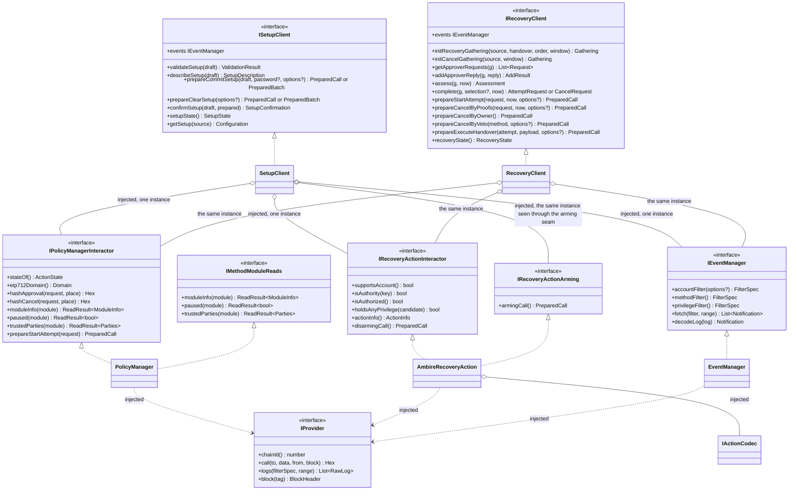
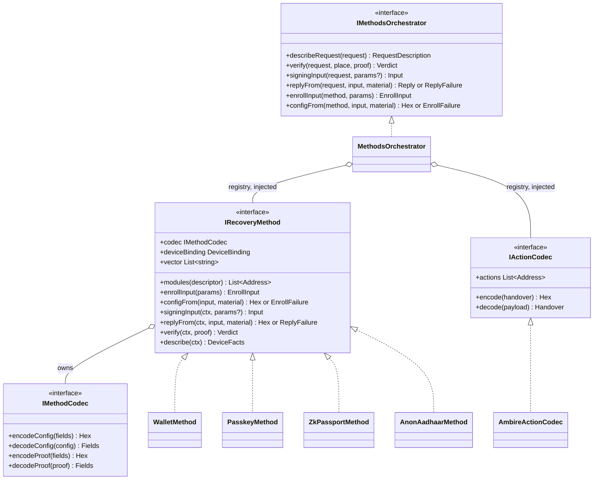
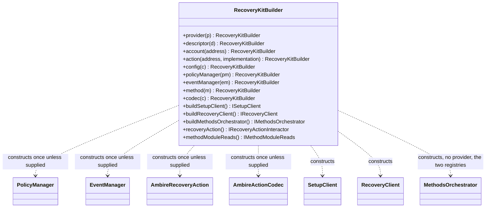
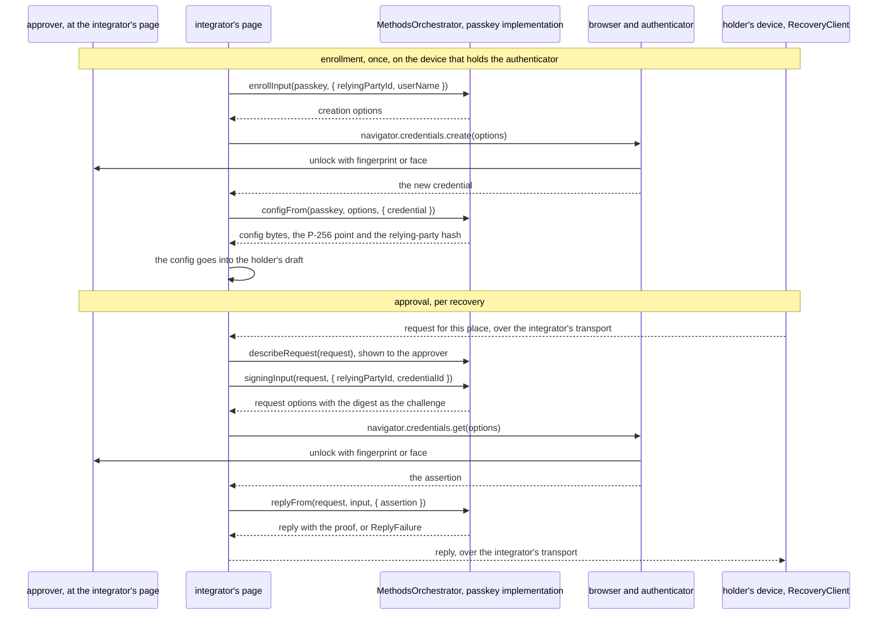
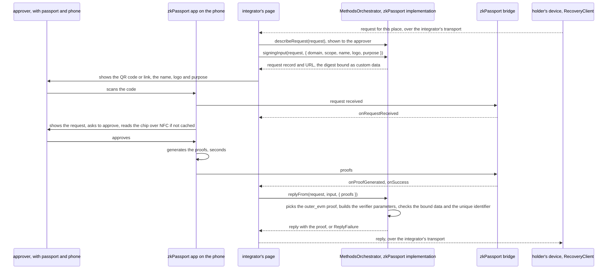
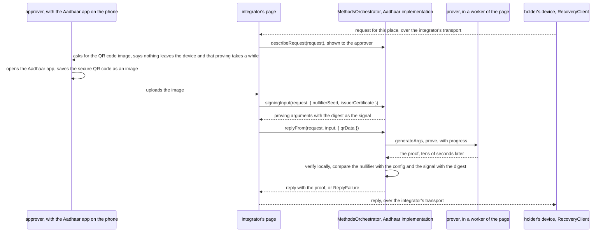
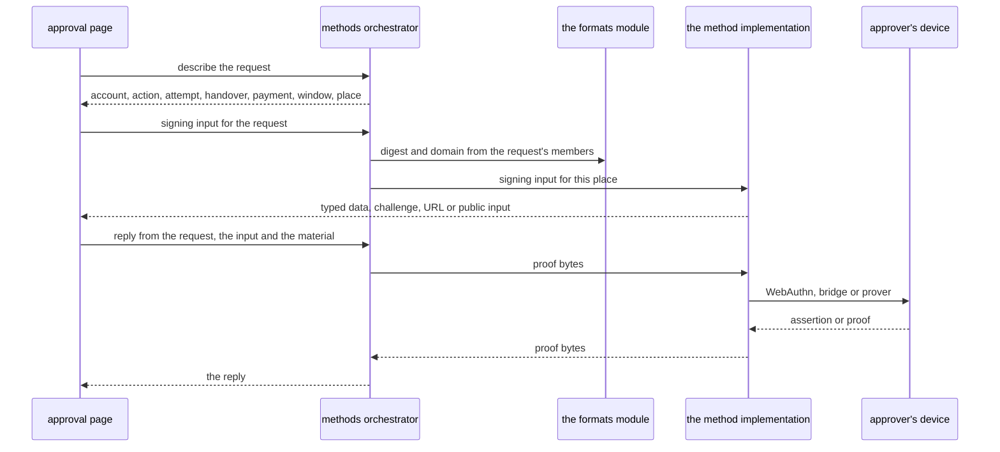
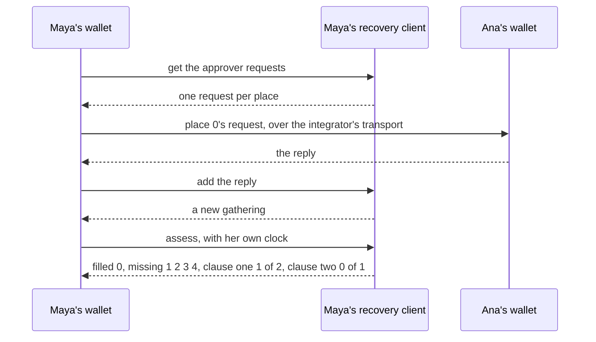

# SDK tech design

This chapter is the SDK half of the tech design, authored by @0xAaCE and written for the engineers who will build the SDK, for the wallet teams who will embed it, and for a reviewer who saw none of the design conversation. Sections mint ids from the D-200 to D-299 band that the ownership table in [`design/PRD.md`](../PRD.md) records. The chapter reasons about each responsibility first and proposes its interface inside that responsibility's own section, so the types arrive as conclusions rather than as a list. The code shape is decided in D-201 and nowhere else in this design. Its authority for every on-chain surface is [`design/onchain/contracts.md`](../onchain/contracts.md), and where a sentence here and a sentence there disagree, that chapter wins and D-210 records the disagreement.

## D-200 Scope

This section says what the SDK is, what it answers for, where it stops and which unsettled questions still shape a format the chapter declares. It covers every module of the chapter, and it freezes no interface.

The SDK is a wrapper around the recovery kit so that any wallet can use it. It holds no signer, so every write it offers is a prepared call the integrator signs and sends.

Four words carry the whole chapter, and each keeps one sense throughout.

- The holder is the person whose account the kit protects, the one who arranges recovery while they still hold their signing key and needs the arrangement back after they lose it.
- An approver is anyone whose credential the holder's rule can call on, a friend with a wallet, a friend with a passkey, the holder's own hardware wallet in a drawer, or an identity document. The idea draft calls the same person a helper, and this chapter says approver so the word never collides with the utilities the SDK ships. A wallet guardian is one kind of approver, the one whose credential is an address the wallet method checks a signature against, and this chapter uses the narrower word only for that credential.
- The integrator is the wallet or application that embeds the SDK. The Kohaku extension is the first one, and it owns every screen, every transport and every signer the SDK does not hold.
- A prepared call is a target address, a value, calldata and the caller the target contract accepts it from, unsigned, together with the result of the simulation the SDK ran while preparing it. It is a record with no members of its own, and the integrator signs it and sends it.

The SDK answers for seven things, one section each. The word is responsibility rather than component, because how the code is arranged is D-201's answer and not this list's.

| responsibility | what it answers for | section |
| --- | --- | --- |
| contract interactor | every call prepared for the kit's contracts and every view read from them | D-202 |
| event reader and notification | the kit's logs turned into typed notifications an integrator distributes | D-203 |
| formatter | every byte format the kit computes off chain, commitments, digests, requests and proofs | D-204 |
| utilities | validation, description and error decoding, the three parts that assist without acting | D-205 |
| methods orchestrator | what differs per method between an approver's device and the bytes a module verifies | D-206 |
| recovery proof gathering | the assembly of a recovery or a cancellation out of the proofs approvers return | D-207 |
| factories | the construction of one bound instance for one chain, one deployment and one account | D-208 |

An integrator plans around the boundary, so the list below names what the SDK never does.

- It holds no signer, no key and no passphrase, and it never sends a transaction.
- It runs no server and operates no transport. How a request reaches an approver and how a reply comes back is the integrator's, per D-2 of the idea draft and Q-8.
- It stores nothing by itself. It returns values the integrator persists, and it reads the chain for everything else.
- It delivers no alert. It produces typed notifications from events, and the channel that reaches a holder is the integrator's, per Q-13.
- It enforces no security policy beyond the errors validation names. Warnings and descriptions are supplied and never gated, since what a partner's users must be shown or stopped on is that partner's own call.
- It is not a wallet SDK. Account creation, day-to-day signing and migration between manager deployments belong to the integrator's own account library, and the SDK prepares calls for an account that library owns, whether it already stands on the chain or lands in the transaction that carries the commit.

Four rules hold across every module below, and each one is delivered by a mechanism rather than by a request.

- The SDK is device agnostic. Its core runs in a browser extension, a mobile wallet, a server-side indexer or a script, with no dependency that ties it to one runtime. Some methods are tied to a device by their nature, a passkey to a platform authenticator and zkPassport to a phone that reads the document, and that binding lives in the method's own implementation under D-206 rather than in the core.
- The SDK is agnostic about the chain library. It returns ABI-level calldata, typed-data objects and raw bytes rather than the objects of one client library, so an integrator on any library uses it and the kit inherits no library's release cycle. The provider of D-208 is the whole of its chain access.
- One setup client and one recovery client serve one chain and one account, sharing the parts that read the chain. The design serves one chain per Q-15, and every manager read and write is keyed by the account and the action under D-103. Each client therefore binds the chain, the deployment, the account and the action at construction, no member of either takes an account or an action as an argument, and the two hold one instance of each part that reaches the chain between them.
- The SDK's versioning is tied to the contracts. A build carries the digest version it derives typed data under and the manager address its setup body encoder is keyed to. Construction compares both against the deployment before it hands a client back, so a build pointed at a deployment it does not read refuses rather than computing bytes nobody can verify. The build checks itself against what `eip712Domain()` publishes and never computes under it, since a build that derived under whatever the chain said would produce bytes its own vectors never covered.

The SDK's tests run under the battery's existing jobs rather than a job of their own. `build` typechecks the four packages with `typescript` and runs their unit tests on node's own runner, `node:test`, beside `forge build`, `coverage` runs node's own coverage beside Foundry's, and `fuzz-invariants` runs the property tests, written with `fast-check`, at the budget preset a task names, mapped to a run count. `typescript` and `fast-check` are pinned in the toolchain manifest and `fast-check` has a registry entry, while `node:test` ships with the runtime. The source keeps to the syntax node runs by stripping types, so it uses no enum, namespace or parameter property, and the typecheck enforces it.

Byte layouts freeze late as vector files under [`design/kats/`](../kats/), and every encoding this chapter declares is the proposal those vectors will freeze rather than the frozen bytes. Invariants I-21 and I-22 demand them, and D-204 holds the inventory. The interfaces freeze when the ownership table in [`design/PRD.md`](../PRD.md) records them, and they wait on every blocking open question whose answer shapes a format declared here.

Five questions that once shaped these formats are settled, and this chapter cites each answer where it landed rather than waiting on it.

- The six timing and sizing numbers the SDK applies are D-107's, which names them and puts them in client code, the wait below which the setup screen warns among them. They land in the client configuration of D-208, each as an exported default an integrator may override, and the validation codes of D-205 read them.
- The backup's posture and its padding are the idea draft's. The backup is the holder's normal rebuild source, and fixed-size padding closes the length leak, and D-204 fixes the cipher and the key derivation.
- That a full proof set arrives in one act rather than incrementally is I-9, which the idea draft states, and it is the whole span D-207 covers and the request format D-204 encodes.
- The disclosure an approver's cleartext configuration carries is D-103's, which publishes the used credentials' configurations in the transaction's calldata and every credential hash of the rule in the opening event. That sentence decides what D-205's request description discloses.
- A handover moves one key, which D-105 decides, so the payload the codec of D-204 writes carries two addresses and nothing else.

Six questions of [`design/open-questions.yaml`](../open-questions.yaml) are open and shape this chapter, and one of them is blocking.

- Q-8 is blocking, and its waiver leaves what the screens render as the sdk and ux chapters' duty rather than the contracts chapter's. D-209 answers the branch the waiver leaves standing, written as a table of duties, and its rows bind a page only where I-15 does, at the setup description shown in full before a commit, and every other row about what a page shows names what the person in front of the screen loses rather than binding one, since I-15 makes that screen's disclosure the SDK's own.
- Q-13 owes where a holder's alert comes from, since no party in this design operates one. D-203 produces the notifications an alert is built from and D-209 carries the delivery as the integrator's.
- Q-5 owes who pays for a keyless holder's production submission, and it names the disclosure a simulating sponsor reads, which D-205 warns on.
- Q-15 owes what production does about one account address on several chains, which is why every client of D-208 binds one chain.
- Q-22 owes who re-checks the two identity methods, on what date, and what the setup screen says when a real credential still does not verify, and it carries whether a renewed document reproduces the identity commitment either stack derives. D-205 discloses each method's standing per credential and D-206 defines the two identity implementations.
- Q-24 owes whether the opt-out from a method's stop is one choice per method rather than one per setup, which shapes the setup body D-204 encodes and the choice D-205 describes.

I-19 bounds every pause read this chapter makes. No state of a stop makes the manager accept a request or spend an attempt the committed setup does not authorize, so the SDK reads a stop to explain a refusal and never to justify a path it would otherwise refuse.

Eight further questions are this chapter's own, and it invents no ids for them. D-212 states each in the shape `design/open-questions.yaml` uses, with no id, so that file's count and this chapter's stand side by side.

## D-201 Architecture

This section decides the code shape of the whole SDK, which parts are classes, which are interfaces a stranger implements, which are modules of plain functions, and how anything is constructed. It covers every module of the chapter, `sdk/setup-client`, `sdk/recovery-client`, `sdk/methods`, `sdk/policy-manager`, `sdk/recovery-action`, `sdk/event-manager`, `sdk/gathering`, `sdk/formats`, `sdk/salts`, `sdk/encryption`, `sdk/utilities` and `sdk/builder`. Its last subsection lists in one place every interface and value record the chapter freezes, while each interface is declared frozen by the sentence that opens the section defining its members.

### Plain words

Nine words carry the rest of this section, and each one is defined here before it is used below.

A facade is one object an integrator holds that answers every question of one kind, delegating each answer to a smaller object behind it. Each facade here is bound to one account, so it carries the configuration its callers would otherwise repeat on every call.

An entry class is a facade an integrator builds for one kind of user at one moment, and it manages that user's flow from the first chain read to the last prepared call.

A shared part is an object that reaches the chain, bound to one contract, and the two clients hold one instance of each, so no contract of a deployment is ever reached through two objects at once.

A provider is the small object the integrator supplies so the SDK can reach one chain. It answers a chain id, an `eth_call` that honours a `from` address and a block tag, an `eth_getLogs`, and a block read that returns one block's number, timestamp and hash for a tag, and D-208 fixes those four reads. The SDK holds no connection, no client library and no wall clock of its own, so chain time is the one time it reads.

A codec is a pair of pure functions over one layout, one that writes the bytes and one that reads them back. The action's payload has a codec because its layout is that action's own, and it names the action addresses it serves so a registry finds it from the address a request carries. Every method implementation carries a codec of its own for its config and its proof, and D-204 defines both codec types.

Four things this chapter names carry the word action, and each keeps its own term everywhere below. The action contract is the deployed contract D-105 specifies. The action part is `AmbireRecoveryAction`, the SDK object that reads and prepares calls against that contract. The action address is the value a setup commits to and a client binds. The action's codec is `AmbireActionCodec`, the pair of functions over that contract's payload layout.

A method implementation is the client-side half of one on-chain method module, the code that turns a request into something an approver's device signs or proves and turns what that device returned into the bytes the module's `verify` reads.

A builder is the one class that constructs other classes, and this design has exactly one. It collects the parts an integrator names, fills every other part with the shipped implementation, constructs each shared part once, and returns whichever entry class was asked for.

A place is the flat index of one credential across every clause of the rule in body order, so the first credential of the first clause is place 0 and the numbering runs on into the next clause. D-103 fixes that numbering and the manager reads a place through `credentialAt`.

### The shape

The entry points are split by who uses them and when, and each member sits on the entry that answers for what it does rather than on the one whose user happens to call it. Twenty entries make the whole surface, three entry classes, three shared parts that reach the chain, two read seams over two of those parts, the arming seam `IRecoveryActionArming` over the action part and the module-read seam `IMethodModuleReads` over the manager part, three interfaces a stranger implements, `IRecoveryMethod`, `IActionCodec` and `IProvider`, the provider counted among them since the integrator writes it, `IMethodCodec` beside them as the codec type a method implementation owns, one builder, three utility namespaces inside `sdk/utilities` and four internal modules. Two of the entry classes stand over the three shared parts, and the third holds no provider and reaches no chain. The list below says what each entry is and what it holds, and the items between them say how a member behaves where its name does not.

- `ISetupClient` is the entry a holder's integrator builds while the holder still holds their key, and `SetupClient` is its shipped implementation. Its two reads, `setupState()` and `getSetup(source)`, need no key, so a keyless device builds the same client for them and for nothing else. It manages the policy through `validateSetup(draft)` and `describeSetup(draft)`, which read what those two judgments need, `prepareCommitSetup(draft, password?, options?)` and `prepareClearSetup(options?)`, `confirmSetup(draft, prepared)`, the optional confirmation read D-202 defines for after the transaction lands, `setupState()` for the setup-side reading of D-202, `getSetup(source)` for the configuration restore the same section defines, and watching through the shared event manager. The commit's password defaults to none, and no password means no encrypted backup. The `options` every prepare but `prepareCancelByOwner` takes is `{ simulate?: boolean, from?: Address }`, where `simulate` defaults to the configuration's simulation default and `from` is the address a permissionless call's simulation runs from, per D-202. The three setup judgments read independently: `validateSetup`, `describeSetup` and `prepareCommitSetup` each make their own reads and cache nothing between them, so one commit flow pays the view reads three times and the manager's account-wide history read twice, since `describeSetup` describes a draft and reads no log, and every log read a setup member makes passes the blocks D-203's table gives it. It receives the three shared parts, the action part's arming seam `IRecoveryActionArming` beside them, the account address, the action address, the deployment descriptor and the client configuration through its constructor, and it constructs nothing.
- Each member sits on one client by what it answers for rather than by who builds it, so the two lists above and below are the whole surface and neither carries a general `state()`. Watching is the one member both clients share, and the event manager behind it is one instance.
- `prepareCommitSetup` returns one call or two, which its name does not say and this sentence does. On an account that already authorizes the action it returns the manager's `commitSetup` alone, since a holder modifies a policy by committing another one over it and nothing is revoked to make room. Whenever `setupState()` reports `isAuthorized` false, on the first commit and on the re-authorization of an action the account stopped honoring alike, it returns a `PreparedBatch` of two calls marked atomic, the account's `setAddrPrivilege(KIT_SLOT, binding)` first and the manager's `commitSetup` behind it, where the binding value is `keccak256(abi.encode(action, bytes("")))` per D-105. The arming write never comes back from this prepare without a `commitSetup` behind it, since a re-authorization alone revives a dormant setup as committed and releases any attempt that ran its wait out while the action was off, per D-110, and the commit's nonce cancels what waits and retires the proofs behind it. Each call of the batch carries its own simulation, run in sequence at one pinned block, and the account's own `execute` around them is not covered.
- `prepareClearSetup(options?)` is the one prepare a holder leaving the kit calls, and the shape it returns follows the setup state it reads, `hasSetup` and `isAuthorized` at one pinned block. Where a setup stands and the account authorizes the action it returns a `PreparedBatch` of the manager's `clearSetup` and the action's disarming call, marked atomic like the first commit's arming batch, so the setup and the account's authorization go together. Where a setup stands and the account does not authorize the action it returns `clearSetup` alone, since the disarming call would write a zero over an entry already at zero. Where no setup stands it returns the disarming call alone, since `clearSetup` reverts for a holder whose setup is already gone and a batch carrying both would revert whole. It mirrors `prepareCommitSetup`, which arms on the first commit and commits alone afterwards.
- The arming call has no public home. `IRecoveryActionArming` is a second, narrower interface with the one member `armingCall()`, the account's own write authorizing the action, and the builder hands it to the setup client alone and never returns it, so the one way the SDK composes that call is `prepareCommitSetup`. The guarantee is a documented boundary the two interfaces make hard to cross by accident rather than a wall, since `AmbireRecoveryAction` implements both of them over its own `prepareSetAddrPrivilege(value)`, the one member named in Ambire's vocabulary, so leaving the kit needs no cast to the concrete class and the same member composes an arming value for whoever reaches for it on purpose. Reviving the dormant setup D-110 names therefore costs an integrator a deliberate privilege write in the account's own vocabulary, which D-209's re-arming row asks it not to make, and no accidental path through the kit's own members reaches it. The disarming call stays public as `disarmingCall()` on `IRecoveryActionInteractor`, reached through the builder's `recoveryAction()`, for a holder who takes the authorization back and keeps the setup, and it carries no finding, since the status description of D-205 is where such a holder reads the dormant setup that outlives the privilege, per D-202.
- `IRecoveryClient` is the entry built when a key is lost, and `RecoveryClient` is its shipped implementation. A holder's integrator builds one to gather a recovery or a cancellation, from the password or the holder's configuration, and anyone may build one for the two calls no gathering stands behind, the veto and the execute. It manages that flow end to end through `initRecoveryGathering(source, handover, order, window)`, `initCancelGathering(source, window)`, `getApproverRequests(gathering)`, `addApproverReply(gathering, reply)`, `assess(gathering, now)`, `complete(gathering, selection?, now)`, `prepareStartAttempt(request, now, options?)`, `prepareCancelByProofs(request, now, options?)`, `prepareCancelByOwner()`, `prepareCancelByVeto(method, options?)`, `prepareExecuteHandover(attempt, payload, options?)`, `recoveryState()` for the recovery-side reading of D-202, and watching through the same shared event manager. The `now` every judgment takes is the moment the caller compares against, and `selection` defaults to none, which leaves the choice of places to the SDK. The handover `initRecoveryGathering` takes carries the new authority and the authority the handover removes, the second being the integrator's to pass and optional only where the client configuration carries the account's creation triple, from which the client infers it over the account's privilege writes, and the init refuses where it has neither, per D-202. The execute has this one home, so anyone who executes a ripe attempt builds a recovery client for it.
- `prepareCancelByOwner()` sits on the recovery client rather than on the setup client, because what it answers for is ending an attempt and not arranging a policy. A holder who still holds a key and wants to cancel therefore builds a recovery client, which costs that integrator one build and keeps the three cancel doors in one place.
- `prepareCancelByVeto(method, options?)` is the one prepare no gathering stands behind, since D-103 makes the stop itself the authorization and the call carries no proofs. It sits on the recovery client for the same reason the holder's own cancel does, and anyone may send it.
- The recovery client reads the chain itself for the next attempt id, the setup nonce and each rule method's `paused()`, and derives every digest under the domain the builder cached at construction, so no record of those reads crosses to an integrator. The opening event's payload is the one value the execute takes from the integrator, which fetches the opening notification through the event manager and hands the payload to `prepareExecuteHandover`, per D-209. The Gathering of D-207 stays a value the integrator persists and moves, and the client holds no state between calls beyond its injected parts.
- `IMethodsOrchestrator` is the entry of both sides that hold a credential rather than an account, built by whoever fills a place and by whoever enrolls one, and `MethodsOrchestrator` is its shipped implementation. It receives a registry of `IRecoveryMethod` implementations and a registry of `IActionCodec` implementations through its constructor, holds no provider, reads no chain and binds nothing about a deployment, and it answers `describeRequest`, `verify`, `signingInput`, `replyFrom`, `enrollInput` and `configFrom`. It works from the request alone: the request's chain id, manager address and digest version build the domain, its action address picks the codec out of the codec registry, and its method address picks the implementation out of the method registry. The enrolling side builds the same class for the last two, since a ceremony that mints a credential needs the method's implementation and no chain at all, and the config bytes it returns go into the draft the setup client judges. The two enrollment calls run on whichever device holds the authenticator, the holder's own in the kit's demonstration, and the records they take and return are what an integrator carries between devices where it wants a credential enrolled elsewhere.
- `IPolicyManagerInteractor` is the interface of the shared part for the manager, and `PolicyManager` is its shipped implementation, receiving the provider, the descriptor and the two addresses through its constructor. Its writes are the six prepares the manager's own functions name, each taking the contract's own argument list and nothing more, so the part's `prepareStartAttempt(request)` encodes the call while the recovery client's member of the same name validates, simulates and takes the options before calling it, and its reads are `stateOf`, `hashApproval`, `hashCancel`, `eip712Domain`, `name`, `version` and `supportsInterface`, the last three being the manager's own views and nobody else's.
- The method modules' views belong to `IPolicyManagerInteractor` as well, three reads each taking as an argument the module address a draft names. `moduleInfo(module)` returns the module's name, its version and whether it answers the ERC-165 probe for the method interface, whose id the SDK exports as `POLICY_METHOD_INTERFACE_ID`. `paused(module)` returns the module's standing under the rule of D-111, stopped on a successful call returning exactly the ABI encoding of true and not stopped on a revert, an empty return or any other value, so a method that carries no pause answers not stopped. `trustedParties(module)` returns the five values D-104 declares. Each of the three says whether it was answered at all beside what it answered, so a provider that failed is told from a contract that replied, and the two-valued rule above governs what an answer means rather than whether there was one. A fourth shared part for them would add an instance to inject, replace and document for three views no prepare depends on, and the cost of this choice is that one part reads a contract it is not named after.
- `IMethodModuleReads` is a second, narrower interface over those same three members, and the builder's `methodModuleReads()` hands the manager part out through it, so a screen that wants a module's standing or its declared parties reads them without holding the manager's six prepares. `PolicyManager` implements it over its own members, so the seam adds no instance and no second reader of one contract, and it mirrors the arming seam in shape while differing in purpose, since this one is handed to whoever asks and that one to the setup client alone.
- `IRecoveryActionInteractor` is the interface of the shared part for one action contract, the client-side half of D-105, and the one the builder's `recoveryAction()` hands out. It binds the account at construction, so its members take no account. They are `supportsAccount()`, `isAuthority(key)`, `isAuthorized()` and `holdsAnyPrivilege(candidate)`, each the client-side half of the contract's own view over the bound account, `actionInfo()`, and `disarmingCall()`, the privilege write that takes the account's authorization back. The spend has one home, `prepareExecuteHandover` on the recovery client, which composes the call to the bound action address over this part's reads and the codec the registry holds for that address, so the part the builder hands out reads and disarms and prepares no spend. `actionInfo()` returns the action's name, its version and whether it answers the ERC-165 probe for the policy-action interface D-105 defines, whose id the SDK exports as `POLICY_ACTION_INTERFACE_ID` beside `POLICY_METHOD_INTERFACE_ID`, mirroring `moduleInfo(module)` on the manager part. That probe is advisory in the same sense the method probe is, since a hostile action answers whatever it likes and the trust an action carries is the account's own grant, so a failed probe is a value the unaudited-action warning of D-205 carries and never a refusal.
- `AmbireRecoveryAction` is the shipped implementation of `IRecoveryActionInteractor` and of `IRecoveryActionArming` beside it, receiving the provider, the descriptor, the account and an `IActionCodec` through its constructor, taking `KIT_SLOT` and its binding value from the pure functions `kitSlot(action)` and `kitBinding(action)` of `formats`, so the class composing the call and the test replaying the vector use one derivation, and adding `prepareSetAddrPrivilege(value)` as the one member named in Ambire's own vocabulary, over which it implements the two privilege calls.
- The action part for Ambire's account is the one this chapter ships, and an account whose keys live in a keystore takes an action of another shape, which D-102 and D-105 name and [`design/future-work.md`](../future-work.md) records. Such an action runs its spend as a static call and so cannot call `consume`, while this interface and the execute prepare of D-202 are written for the batch that puts `consume` first, so serving a keystore account needs a second shape of the interface rather than a second implementation of this one. Nothing else in this chapter covers that account, and D-210 records the second shape as a debt of this chapter.
- `IEventManager` is the interface of the shared part for the logs. It builds three filters, the per-account filter over the manager, the method filter over the methods the deployment descriptor lists together with the modules the registered implementations serve, and the privilege filter over the account's own privilege writes, none of the three carrying a block range, per D-203, and it holds the fourteen decoders D-203 names. `EventManager` is its shipped implementation, receiving the provider, the method registry its method filter reads, the descriptor and the two addresses through its constructor.
- Both clients hold the same instance of each of those three parts. One chain access is configured once, one filter set is built once, and no contract of the deployment is reachable through two objects whose answers could disagree.
- `IRecoveryMethod` is the interface I-5 makes permissionless on the client side, one implementation per method module, drawn once in the approving side's graph below with its ten members, `modules(descriptor)`, `enrollInput`, `configFrom`, `signingInput`, `replyFrom`, `verify`, `codec`, `deviceBinding`, `describe` and `vector`, and D-206 explains what each answers. `WalletMethod`, `PasskeyMethod`, `ZkPassportMethod` and `AnonAadhaarMethod` are the four shipped implementations, each owning its config and proof codec and each answering the enrollment pair.
- `IActionCodec` is an interface of one list and two pure functions, `actions`, the addresses of the deployed action contracts this codec serves, one per chain for the kit's own, then `encode`, turning a handover into payload bytes, and `decode`, turning payload bytes back into the handover's fields, per action layout. The shipped or an honest codec promises a round trip, that encoding the fields a decode returned reproduces exactly the bytes that decode was given or the decoder refuses them, so no caller ever shows fields the bytes do not hold, while what a third-party action's codec discloses rests on the unaudited-action warning of D-205 and on nothing this law can bind. `AmbireActionCodec` is the shipped codec for the `Handover` layout of D-105, and it ships in the core package rather than beside the action part.
- `IProvider` is the integrator's four-member chain access, the only object the SDK reaches a chain through, and every read it makes carries the block tag the client configuration set for that read. Its `block(tag)` returns one block's number, timestamp and hash, and it is where every pinned reading and every chain timestamp in this chapter comes from, the hash travelling in every pinned record so a caller tells a replaced block from a re-read.
- `RecoveryKitBuilder` is the only class that constructs a class. It takes the provider, the descriptor, the account, the client configuration and any part the integrator replaces, it fills one method registry through `.method(m)`, calling the implementation's `modules(descriptor)` with its own descriptor as it registers it and keying the registry on the answer, and one codec registry through `.codec(c)`, keyed by each codec's `actions`, and it hands both registries to the two clients and to the orchestrator alike, and the method registry to the event manager beside them. It takes the action as `.action(address, implementation)` so the address a setup commits to and the code that serves it arrive together, and it answers `buildSetupClient()`, `buildRecoveryClient()` and `buildMethodsOrchestrator()`, beside `recoveryAction()`, which hands out the one action part as `IRecoveryActionInteractor` so an integrator reaches its reads and `disarmingCall()` on it, and never as `IRecoveryActionArming`, the seam the builder hands to the setup client alone. It answers `methodModuleReads()` beside it, which hands the same manager part out as `IMethodModuleReads` so a screen reaches the three module views without holding the six prepares. `recoveryAction()` and `methodModuleReads()` each run the construction checks of D-208 before returning, each counts as a build for the setter freeze below, and under the version escape the action part reads and refuses its prepares while the three module views read as they always do. It constructs each shared part once and hands the same instance to both clients, it runs the construction checks of D-208 for each client, and the approving side's build needs no provider while the two clients' builds do.
- One builder memoizes everything it constructs, so two builds on one builder hand back the same clients over the same shared parts and a fresh builder constructs a fresh set of everything. A setter called after any build refuses, since a part swapped under a client already handed out would leave two clients disagreeing about one contract. The freeze binds `.method(m)` and `.codec(c)` for a reason of their own: the two registries are handed to the built clients and to the event filter at build, so an implementation added afterwards would reach one holder of the registry and not the other, and the method filter would miss a module the descriptions name. The builder also reads the manager once, its domain with the `fields` bitmap and its version, and caches that reading for every build behind it, so the second client costs no chain read, and a builder accepts another builder's cached reading of the same manager in place of its own, so a backend building many accounts on one deployment reads the manager once.
- `validate` holds `validateSetup` and `validateRequest`, which return errors and warnings and never throw. The setup client reaches the first over its own reads and the two submission prepares reach the second.
- `describe` holds `describeSetup`, `describeRequest` and `describeStatus`, each returning one closed typed object. The setup client reaches `describeSetup` over its own reads, and the orchestrator composes `describeRequest(request, codecs, methods)` on a device that reaches no chain, handing it the two registries it holds, since the approver's keys are decoded from the bytes the digest binds and the method's device facts come from its implementation. `describeStatus(setupState, recoveryState, latest)` is exposed by no class at all. It is a pure function an integrator imports on its own, taking the two state records of D-202 and the latest notifications of D-203, showing state alone and decoding no handover, so the screen that shows a status composes it from values it already holds rather than from a client's further reads.
- `errors` holds `decodeRevert` over revert data and the error ABI it reads against, exported beside it.
- Four internal modules hold the arithmetic. `formats` holds the byte formats I-21 names, as pure functions replayed against the vector files, `kitSlot(action)`, `kitBinding(action)` and `creationPrivileges(factory, bytecode, salt)` among them, the last being the reading of an account's creation triple the handover builder of D-202 starts its replay from. `salts` holds the default salt derivation of D-110, the one derivation the SDK performs, since a salt the holder supplied is taken as given. `encryption` seals and opens the backup payload under the scheme D-204 chooses, taking and returning the configuration record, with the serialization that turns the configuration into plaintext and the step that turns the password into a key both inside those two functions. `gathering` holds the arithmetic of D-207, and it carries one function per operation the recovery client exposes over it, the place map, the seed a record starts from, the requests cut for the approvers, the filing of a reply, the assessment counting and the completion ordering, so every operation of D-207 has a pure half a fixture replays.

Refusals throw. `prepareCommitSetup`, `prepareClearSetup`, `prepareStartAttempt`, `prepareCancelByProofs`, `prepareCancelByVeto`, `prepareExecuteHandover`, `initRecoveryGathering`, `initCancelGathering`, `complete`, `getSetup` and `confirmSetup` throw an ordinary error when they refuse, and an error raised by validation carries the findings, so a screen reads every error at once off the thrown value. The value `getSetup` throws carries one more field, the restore cause D-205 names, so a person on a fresh device is told which of the three steps refused rather than that the restore failed. `signingInput` and `enrollInput` on the orchestrator throw the same way. `replyFrom`, `configFrom` and `addApproverReply` keep the typed results the drawings give them, since the page acts on the cause each returns, and no `Refusal` type exists beside those three.

The four internal modules are exported and documented as internal rather than hidden, since the vector tests replay them directly, the gathering tests replay the arithmetic from a fixture with no client, and a third-party method author needs the credential hash and the digest to write an implementation at all. Nothing in the package enforces the distinction, and the documentation is all of it.

One name collides with the contracts chapter's on purpose, and this paragraph is where the two are told apart. `PolicyManager` here is the SDK's client-side object and the deployed artifact of the same name in D-103 is the contract it calls. The two interfaces over one kit contract carry the suffix `Interactor`, `IPolicyManagerInteractor` and `IRecoveryActionInteractor`, so they share no name with the Solidity interfaces `IPolicyManager` and `IRecoveryAction` of D-103 and D-105. The Discussion weighs what the remaining collision costs a repository that holds both.

### Modularity

Four rules make every part replaceable, and they are what lets an integrator swap a collaborator by passing one object and a test replace one with a double.

- Every class is written against an interface and depends on that interface rather than on any implementation.
- Every class receives every collaborator through its constructor, and `RecoveryKitBuilder` is the one exception to the rule that no class instantiates another, since somewhere has to construct them and this design puts that somewhere in one class.
- The only things a class imports from the SDK's own modules are standalone functions, the formats, the salts, the encryption, the gathering arithmetic, the validation, the descriptions and the error decoding.
- An interface carries the `I` prefix and its shipped implementation carries the bare name, while an implementation bound to one account implementation or one action carries that name instead, `AmbireRecoveryAction` and `AmbireActionCodec`.

### The two clients and their shared parts

The two clients and the three parts they share are the first graph, and both clients name the same three instances. Illustrative, since the exact members freeze with the value records the later sections define.



### The approving side

The approving side is the second graph, and the enrolling side builds the same one. It has no edge to the first, so it runs on a device that reaches no chain at all. Illustrative on the same terms.



### The builder

The builder is the only code that constructs a class, and the dotted arrows below are the only construction edges in the SDK. Everything it constructs is a default the integrator replaces by handing it an object of the same interface, and everything it constructs it memoizes, so each arrow below fires once per builder.



`recoveryAction()` is drawn as a getter and behaves as a build. It runs the construction checks before it hands the part out, it freezes the setters the way the three build calls do, and the part it returns under the version escape reads and refuses its prepares. It returns the part as `IRecoveryActionInteractor` and never as `IRecoveryActionArming`, which the builder hands to the setup client's constructor and to nothing else. `methodModuleReads()` behaves the same way over the manager part, returning it as `IMethodModuleReads` and never as `IPolicyManagerInteractor`, so the prepares the manager's own functions name stay inside the two clients.

### The utilities and the internals

The three utility namespaces and the four internal modules sit under all three graphs and are callable from any of them, since none of them reads a chain. Illustrative.

```mermaid
classDiagram
    class validate {
        +validateSetup(draft, context) ValidationResult
        +validateRequest(request, context) ValidationResult
    }
    class describe {
        +describeSetup(draft, context) SetupDescription
        +describeRequest(request, codecs, methods) RequestDescription
        +describeStatus(setupState, recoveryState, latest) StatusDescription
    }
    class errors {
        +decodeRevert(data) KitError
    }
    class formats {
        +credentialHash(method, config, salt) Hex
        +approvalTypedData(members, place) TypedData
        +cancellationTypedData(members, place) TypedData
        +encodeAttemptRequest(request) Hex
        +encodeCancelRequest(request) Hex
        +kitSlot(action) Address
        +kitBinding(action) Hex
        +creationPrivileges(factory, bytecode, salt) CreationPrivileges
    }
    class salts {
        +defaultSalt(account, place) Hex
    }
    class encryption {
        +sealBackup(configuration, password, nonce, paddingSize, authenticated) Hex
        +openBackup(payload, password, authenticated) Configuration
    }
    class gathering {
        +placeMap(body, configuration, standings) List~Place~
        +seed(members, placeMap) Gathering
        +requests(record) List~Request~
        +fileReply(record, reply) AddResult
        +count(record, now) Assessment
        +order(record, selection?, now) List~ProofPlace~
    }
```



### The patterns, each beside the alternative it beat

Every pattern the design leans on is named below with what it replaced, so a reader can weigh the choice rather than infer it.

- The facade appears three times, one per kind of user at one moment, and each one owns its flow rather than a slice of the machinery. It beat threaded arguments by binding the account, the action, the provider and the descriptor once at construction, since every manager read and write is keyed by the account and the action under D-103.
- The facade that owns the flow beat a pure gathering class standing beside a client. The record that crossed between the two sides had no settled shape, so the hand-off cost a typed record nobody could freeze, and a client that reads the chain itself removes the record rather than naming it.
- The shared part beat two interactors per contract. Two clients each constructing their own manager object would have configured one chain access twice and left two answers about one contract able to disagree, so the builder constructs each part once and hands the same instance to both.
- Dependency injection with the dependency inverted beat construction inside the class, since a client that built its own manager could be pointed at neither a double nor another implementation without a code change.
- One builder beat two. The two clients and the approving side draw on one set of parts, and two builders would have constructed the shared parts twice or made one builder take the other's output, so three build calls sit on one class and the shared parts are constructed once behind them.
- The per-account binding beat a separate account handle object, because a client that already knows the chain can know the account too and the extra hop bought nothing.
- Composition of three shared parts beat one class holding every read and every prepare, since a reader finds the manager's surface in one place and the action's in another.
- The strategy appears twice, as `IRecoveryMethod` and as `IRecoveryActionInteractor`, and it beat a switch on the module or action address, which would have closed I-5 on the client side.
- The separated codec is `IActionCodec`, which beat a codec method on the action class, since the approving side needs the decode and cannot hold a class that reads a chain.
- The registry is the builder's two lookup tables, one of method implementations keyed by what each answers to `modules(descriptor)` and one of codecs keyed by `actions`, handed to the orchestrator, to both clients and to the event manager whose method filter reads the first of them, which beat discovery from the chain, since D-104 treats every module as hostile and a descriptor a module handed back would run a stranger's instructions in an approver's browser.
- The functional core is the internal `gathering` module, pure and holding no provider, which beat arithmetic written inside the client's own members, since an assessment replays from a fixture with no stub only where the counting is a function.
- The value object is the Gathering, the prepared call, the assessment, the three descriptions and every finding, which beat a session object holding a connection, because the integrator persists and moves these records and a second representation would drift from them.
- The command is the prepared call, a serializable record the integrator executes later, which beat a send method and beat a prepared call carrying its own simulate closure, since a record with a function inside crosses no storage boundary.
- The pure function replayed against a frozen vector is `formats`, which beat encoding inside the flows, since a byte comparison would then need a chain and a stub before it could reach one hash.

### The package layout

One core package plus one package per heavy method implementation is the proposal, and the argument for it is dependency weight rather than code size. The zkPassport and AnonAadhaar implementations pull proving stacks that need entries in `registry/`, and the Aadhaar one carries a WASM asset a browser extension must package with itself. A wallet that ships only the wallet and passkey methods must not pay for either, and a wallet that ships all four must be able to pin them separately when a stack moves.

- `@kit/recovery-sdk` holds the three entry classes, the three shared parts, `RecoveryKitBuilder`, the seam interfaces, the three utility namespaces, the four internal modules, the wallet and passkey implementations, and `AmbireRecoveryAction` with `AmbireActionCodec`. It depends on the language runtime, on WebCrypto for the backup's cipher and key derivation, and on `viem` for keccak256 and ABI encoding, which no runtime supplies and which every format of D-204 needs, and on `ox`, the library `viem` itself rests on, for the passkey implementation's WebAuthn calls and P-256 byte handling. Those two are the core's outside dependencies, each is a delta until `registry/` pins it, and D-210 carries both entries as owed.
- `@kit/recovery-method-zkpassport` holds that implementation and its stack dependency, and depends on the core alone.
- `@kit/recovery-method-aadhaar` holds that implementation, its prover and its WASM asset, and depends on the core alone.
- `@kit/recovery-vectors` holds the harness that replays the vector files under [`design/kats/`](../kats/), and it is a development dependency of every other package.

The four package roots, each with its manifest, exports map, compiler configuration and test and property configuration, are created by the task that declares the interfaces, so every later task writes into a package that already builds.

The action part for Ambire's account and its codec live in the core rather than in a package of their own, and the codec split forces that placement. Every approver's device must decode the one handover the kit ships, and a device that had to install an action package to read two addresses would show an undecoded payload for that handover. The action part has a reason of its own for the same placement: the demo's one account implementation ships where the demo's integrator already is, so the wallet that builds the setup and recovery clients installs nothing beyond the core to reach the account it serves. A part for another account implementation is a package, and its codec ships with it, which is the case the codec registry exists for.

The core exports every interface, the two method implementations it holds, the builder, the utility namespaces, the internal modules, every value type, the error ABI, the method interface's own `verify(config, digest, proof)` ABI with the magic value a verdict must equal beside it, the selector of that function per D-104, which a verdict equals as a whole word rather than as its first four bytes, per D-202, the two default deployment descriptors of D-208 and the shipped numbers an integrator may override, so an integrator passes the builder its own implementation of any interface and a page that holds a provider makes the module's own verification call for itself. Each implementation package exports one factory function returning its interface and nothing else, so an integrator adds a method by adding a dependency and passing one object. No implementation package depends on another, so a stranger's implementation stays reviewable against the interface alone.

### Usage

Everything below is illustrative TypeScript against the surface this section proposes, and every name that reaches a contract is the contracts chapter's. Construction goes through one builder, which constructs each shared part once and hands the same instance to both clients.

```ts
// illustrative
import { RecoveryKitBuilder, sepolia } from "@kit/recovery-sdk";

const kit = new RecoveryKitBuilder()
  .provider(provider).descriptor(sepolia).account("0xMaya")
  .method(walletMethod()).method(passkeyMethod())          // one method registry, keyed by each implementation's modules(descriptor) answer
  .config({ tokens: [usdc], candidateKeys: ["0xLost"],
            creation: { factory, bytecode, salt, block: 18000000 },   // the triple the removed-key computation checks against the account address, and the block D-203's table hands its privilege replay
            blockTags: { read: "latest", watch: "finalized" } });

const setup = await kit.buildSetupClient();
const recovery = await kit.buildRecoveryClient();
// the builder constructs PolicyManager, EventManager, AmbireRecoveryAction and its codec once and memoizes them,
// hands the same three and the two registries to both clients, reads eip712Domain() and version() once for both,
// and refuses a deployment this build does not read. .action(address, implementation), .policyManager(x),
// .eventManager(x) or .codec(c) replaces or adds a part before the first build and refuses after it, and
// recoveryAction() and methodModuleReads() each count as a build, and .method(m) is bound by the same freeze. A test passes doubles the same way.
```

A setup is two judgments and one prepare, and each call of the setup client reads for itself what it needs. Each credential's salt is `keccak256(account, place)` unless the holder supplied one in the draft, per D-110, so a fresh device recomputes the default from the account and the place and reads a supplied one out of the backup or the holder's own record.

```ts
// illustrative
const draft = {
  wait: 432_000n,
  clauses: [                         // each credential is { method, config, label?, salt? }
    { threshold: 2, credentials: [ana, ben, carla] },   // ana is { method: ecdsa, config: "0xAna", label: "Ana", salt: "0xA11a…" }
    { threshold: 1, credentials: [hardwareWallet, mayaPasskey] },   // either device satisfies the clause; no salt given, so the SDK fills keccak256(account, place) at each place
  ],
  ignoresPause: false,               // whether a method's stop reaches this holder's attempts, per D-111
  privacy: { publicMetadata: "0x", backup: "encrypted" },
};
// label is the integrator's contact-book name for the person, the one field of a credential the commitment does not cover
// salt is the holder's own value where given and keccak256(account, place) where absent; the SDK derives nothing from a supplied one and the backup carries it
const findings = await setup.validateSetup(draft);   // { errors: [], warnings: [clause.shared-failure] }, the three wallet credentials of clause one sharing one verifier
const shown = await setup.describeSetup(draft);      // reads moduleInfo, paused, trustedParties, actionInfo, isAuthority, stateOf
const commit = await setup.prepareCommitSetup(draft, password);   // a PreparedBatch here, since this account is not armed yet
// a third argument { simulate, from } overrides the configuration's simulation default for this one prepare
// password encrypts the backup and nothing else; no password means a clear or an empty backup, as privacy.backup says
// the prepare throws while an error stands, and the thrown error carries the findings validateSetup would have returned
// there is no salt argument: each credential's salt is the one its draft record carries, or keccak256(account, place) where it carries none
// commit.kind === 'batch'; commit.calls[0] on the account: setAddrPrivilege(KIT_SLOT, keccak256(abi.encode(action, bytes(""))))
// commit.calls[1] on the manager: commitSetup(action, commitment, nonce, publicMetadata, privateMetadata)
// both carry sender 'account', the batch is atomic, and each call carries its own simulation at one pinned block
// a later edit of this policy returns commitSetup alone, since the account already authorizes the action
const leave = await setup.prepareClearSetup();   // a PreparedBatch while a setup stands on an account that authorizes the action: clearSetup(action) on the manager and setAddrPrivilege(KIT_SLOT, 0) on the account, atomic
// with a setup standing on an account that does not authorize the action it returns clearSetup alone, and with no setup standing it returns the disarming call alone, since clearSetup would revert with NoSetup
const landed = await setup.confirmSetup(draft, commit);   // optional, after the transaction lands: SetupCommitted at the predicted nonce through events.fetch, isAuthorized() beside it, the commitment recomputed from the draft
```

From a device holding the password, the account address and whatever record of the account its integrator kept, the recovery client restores the configuration and opens the gathering in one call, reading the chain through the parts both clients share. The configuration above carries a creation triple, so the block below leaves the removed authority out; a device whose integrator kept no such record passes that address instead. The same restore has one public home, `getSetup(source)` on the setup client, for a screen that wants the configuration back with no gathering behind it. An approver's device holds no client and no provider, and the request carries the chain id, the manager address and the digest version, so that side builds the domain from the record alone.

```ts
// illustrative
const configuration = await setup.getSetup({ password });   // pins a block, reads stateOf at it, then the latest SetupCommitted through fetch, the backup opened, the commitment recomputed
const gathering = await recovery.initRecoveryGathering(
  { password },   // or { configuration }: the client runs the same restore inside, checking its commitment against stateOf
  { newAuthority: "0xNew" },   // removedAuthority is optional only because this configuration carries a creation triple; with neither, the init refuses, per D-202
  { token: usdc, amount: 4_000_000n, payee: sponsor },   // payee: zero leaves the order open, per D-107
  { window: 3 * 24 * 3600 },   // validUntil is the pinned block's timestamp plus this many seconds
);
// the client reads block(tag) once, then the next attempt id, the setup nonce and, per rule method, paused() and the pause holder of its trustedParties at that block, and derives under the domain the builder cached
const requests = recovery.getApproverRequests(gathering);       // one per place, Ana's naming Ana alone; the wallet chooses which to send

const orchestrator = new RecoveryKitBuilder()
  .descriptor(sepolia)                                     // handed to each implementation's modules(descriptor) as it registers; the orchestrator binds nothing of it
  .method(walletMethod()).method(passkeyMethod())
  .buildMethodsOrchestrator();                             // no provider; shipped codecs unless replaced; works from the request alone
const shown = orchestrator.describeRequest(anasRequest);   // the two keys read out of the payload, re-encoded and compared, beside the method's device facts
const input = orchestrator.signingInput(anasRequest);      // { primaryType: 'Approval', ... }; a passkey passes { rpId } as the second argument
const reply = await orchestrator.replyFrom(anasRequest, input, await anaWallet.signTypedData(input));
// reply.kind === 'reply-failure' with cause 'device-refused' where Ana's wallet said no, never a thrown error
```

Replies are filed into the record, the record is assessed on demand, watching is a filter beside a decoder, and the one place a rejected proof surfaces is the simulation inside the prepare.

```ts
// illustrative
const added = recovery.addApproverReply(gathering, anasReply);   // { gathering, displaced?, reason? }: a refusal names which rule refused
let g = added.gathering;                                          // a new record, never the one passed in
const assessment = recovery.assess(g, now);   // now is the moment the caller judges against; the SDK reads no wall clock
// { filled: [0,1,3], missing: [2,4],
//   clauses: [{ clause: 0, threshold: 2, filled: 2 }, { clause: 1, threshold: 1, filled: 1 }], ruleSatisfied: true, findings: [] }
const request = recovery.complete(g, undefined, now);   // no selection, so the SDK orders the set as D-207 says
const startCall = await recovery.prepareStartAttempt(request, now, { from: sponsor });   // kind 'call', sender 'anyone', simulated from the sponsor
// simulation.error === { name: 'ProofRejected', place: 1, method: '0xEcdsa' }, so Ben signs again

const at = await provider.block("latest");     // a screen pins at the read tag, per D-203
const filter = setup.events.accountFilter();   // addresses and topics, per D-203
const latest = await setup.events.fetch(filter, { from: sepolia.deployedAt, to: at.number });   // the blocks are the caller's, per D-203's table; a wallet holding a cursor passes that instead
const n = setup.events.decodeLog(log);         // undefined for a log the reader does not own
const state = await setup.setupState();        // isAuthorized, hasSetup, the commitment, the nonce, setupCommittedAtBlock, attemptActive, all of it pinned to one reading block carried by number and hash
const live = await recovery.recoveryState();   // the recovery-side record, carrying the attempt as a named sub-record
const status = describeStatus(state, live, latest);   // imported on its own, state only, no codec; marks the pair where the two records carry different block hashes
const byOwner = await recovery.prepareCancelByOwner();                     // sender 'account'
const byVeto = await recovery.prepareCancelByVeto(stoppedMethod);          // sender 'anyone', no proofs
const opening = latest.find(n => n.kind === 'attempt-started' && n.attemptId === live.attempt.attemptId);   // the wallet fetches the opening notification and hands its payload over
const exec = await recovery.prepareExecuteHandover(live.attempt, opening.payload, { from: sponsor });   // on the action contract, after the wait; from is the address that will send it
// exec.describes holds the three or four calls the action will run, a description and never something to sign
```

A cancellation is started the same way as a recovery, by the holder from the password or the configuration, since the holder holds every salt and every configuration. Each approver fills the place the holder's request names, through the approving side, and no approver starts a cancellation alone.

```ts
// illustrative
const cancel = await recovery.initCancelGathering({ password }, { window });
// pins a block, reads the live attempt id and its consumableAfter from stateOf, restores the configuration behind that reading, returns a cancellation gathering
const requests = recovery.getApproverRequests(cancel);   // one per place, under the cancel purpose
```

### What this chapter freezes

Everything this chapter freezes is listed once, here, so a reader counting the SDK's owned interfaces reads one list rather than eight. Each interface is declared frozen by the sentence that opens the section defining its members, D-202, D-203, D-204, D-206 and D-208, and the ownership table in [`design/PRD.md`](../PRD.md) records the twelve as this chapter's owned interfaces. A section after this one defines what its own name means and adds nothing to the list.

- `ISetupClient` and `IRecoveryClient`, the two entries a holder's integrator builds, with the members listed above.
- `IMethodsOrchestrator`, the approving and enrolling side's entry, with the six calls D-206 states.
- `IPolicyManagerInteractor` and `IEventManager`, the two shared parts whose members D-202 and D-203 define, and `IMethodModuleReads` beside them, the read seam over the manager part's three module views.
- The three interfaces a stranger implements, `IProvider` with the four reads D-208 fixes, `IRecoveryMethod` with the ten members the approving side's drawing above holds and D-206 explains, and `IActionCodec` with the list and the two functions D-204 defines, beside `IMethodCodec`, the method codec type D-204 defines next to it.
- The refusal shape of every frozen member: `prepareCommitSetup`, `prepareClearSetup`, `prepareStartAttempt`, `prepareCancelByProofs`, `prepareCancelByVeto`, `prepareExecuteHandover`, `initRecoveryGathering`, `initCancelGathering`, `complete`, `getSetup`, `confirmSetup`, `signingInput` and `enrollInput` throw an ordinary error when they refuse, an error raised by validation carrying the findings and the one `getSetup` throws carrying its restore cause, while `replyFrom`, `configFrom`, `addApproverReply` and the two verdict members, five in all, return the typed results drawn above, a verdict being an answer rather than a refusal since a proof that does not satisfy a credential is the ordinary outcome of asking.
- The records the frozen members take, the setup draft `validateSetup`, `describeSetup` and `prepareCommitSetup` read, the handover, the order and the window the opening init of D-207 takes with the window the cancel init takes beside them, the range `fetch` takes, a first block and a last under D-203, and the `ctx` D-206 defines, which the orchestrator builds and every implementation reads.
- `signingInput`, `replyFrom`, `enrollInput` and `configFrom` name one act on two interfaces and take different first arguments there: on `IMethodsOrchestrator` each takes what the page that holds the credential holds, approving or enrolling, the request or the method address, and on `IRecoveryMethod` each takes what the orchestrator built from it, the `ctx` for the two approving calls and the parameters and input for the two enrolling ones.
- The records the frozen members return, the two state records, the configuration record and the confirmation record `confirmSetup` yields of D-202, the module record `moduleInfo` yields and the action record `actionInfo` yields, the add result and the assessment of D-207, the enrollment failure and the verdict of D-206, each frozen with the member that returns it and carrying no version field of its own.
- The three gathering records of D-207, the request one approver receives, the reply they return and the gathering the assembling wallet holds.
- The prepared call and the prepared batch of D-202, the two records every write comes back as, beside the two state records the same section defines.
- The three descriptions, the two finding sets and the three restore causes of D-205, the types the ux chapter renders.
- The deployment descriptor and the client configuration of D-208, the two records a client is built from.
- `IRecoveryActionInteractor` and `IRecoveryActionArming`, with the arming seam's one member `armingCall()`. The account whose keys live in a keystore, which D-210 records, needs a second shape of the first interface, and that shape is a later interface rather than a change to these.

## D-202 Contract interactor

Freezes ISetupClient, IRecoveryClient, IPolicyManagerInteractor, IMethodModuleReads, IRecoveryActionInteractor, IRecoveryActionArming.

This section says what the SDK prepares for the kit's contracts and what it reads back from them, for the one account and the one action a client is bound to. It covers `sdk/setup-client`, `sdk/recovery-client`, `sdk/policy-manager` and `sdk/recovery-action`, and the freeze list at the end of D-201 carries the prepared call, the prepared batch, the two state records, the configuration record and the confirmation record this section defines. The two entry classes carry these acts and the shared parts `PolicyManager` and `AmbireRecoveryAction` make the calls behind them, per D-201.

This is the SDK's main use case, the one the other six responsibilities serve. Every call an integrator asks for ends either in a prepared call the integrator signs and sends or in a typed read of the chain, and both are here. Every prepare ends at the same boundary, and nothing crosses it. The SDK hands back bytes, and signing them, paying for them and putting them on chain is the integrator's, through its own account library and its own submission path.

### The prepared call and the prepared batch

An integrator receives a prepared call from every write below. It is a record with no members of its own, so an integrator persists it, moves it to an offline signer or hands it to its account library as it stands, and running the simulation again is a second prepare against the chain as it is then.

| field | what it holds |
| --- | --- |
| kind | `call`, the discriminant that tells this record from a batch |
| target | the manager, the account or the action contract |
| value | zero, for every call this section prepares |
| data | the calldata of the call |
| sender | `account` or `anyone`, the caller the target accepts this call from |
| block | the block this prepare pinned its reads to, by number and by hash, which the confirmation read of this section takes as the first block of its log read |
| simulation | success, or a typed error with the address the simulation ran from, and absent when the integrator skipped it |
| describes | absent on every call but the execute, where it holds the batch the action will run, a description for a screen and never something to sign |

A prepared batch is the second shape, and two prepares in this chapter return it. Its `kind` is `batch`, and it holds a list of prepared calls that are one transaction and a flag saying they are atomic. Each call in the list carries its own simulation, run in sequence at the one block the batch pinned, which the batch carries the way a single call does, so the record says which of the two would fail and why. The first commit of a setup and the clear over a standing setup on an armed account are the two places it appears, and an integrator that receives it signs the list as one batch rather than as two transactions.

The `sender` field carries the manager's own division of its surface, which D-103 states as two groups of functions. Configuration comes from the account and from nobody else, so `commitSetup`, `clearSetup` and `cancelByOwner` are prepared with the account as the sender, and so is the account's own `setAddrPrivilege` write that authorizes or revokes the action, since the account is the only caller of its own privilege table under D-105. Attempt operations are authorized by proofs alone and the caller has no role, so `startAttempt` and `cancelByProofs` are prepared with anyone as the sender, and so is the action contract's `executeHandover`, which anyone may call once the wait is over.

The field is two values rather than an address. The kit's surface has exactly two doors, the account's and everyone's, and naming a concrete submitter would suggest the SDK knows who pays, which it never does.

A call whose sender is the account reaches its target as one call inside a batch the account runs with its own authority, which on Ambire's account is `execute(calls, signature)` over `Transaction(to, value, data)` tuples per D-105. The SDK returns the inner call, the tuple's three fields, and the integrator's account library wraps it in the account's own `execute` and signs it. The first commit comes back as a prepared batch of two such inner calls, so the authorization and the setup land or fail together, and the clear over a standing setup on an armed account comes back the same way, so the two leave together. Wrapping is the account library's because a call riding a batch with others, a call inside an account operation and a direct call from the account each want a different wrapper.

Simulation runs inside every prepare, because the prepare is the only place that knows which caller the target accepts. Five rules bind it.

- It runs unless the prepare's `options.simulate` says otherwise, and where the prepare passes no option the configuration's simulation default of D-208 decides, so an integrator turns it off once for calls prepared offline or per call for one embedded in an account operation to be sent later.
- It is a chain read and nothing else. An `eth_call` needs no signature, so the SDK holding no signer is no obstacle, and one simulation costs the integrator one request to its own node. It runs at the block tag the client configuration names for a read, `latest` by default, since a simulation against a finalized block would judge a call by a state thirteen minutes old.
- A prepared batch is simulated one call at a time, in list order, every call at the one block `block(tag)` returned, since neither call's outcome depends on the other. The privilege write reads nothing the setup write writes and the setup write reads nothing the privilege write writes, on the commit and on the clear alike, so two readings of one block say what the batch would do. The account's own `execute` around the two is not covered, which the paragraph below states with the rest of what the simulation leaves out.
- A call whose sender is the account is simulated with `from` set to the account, since the inner call of the account's own batch reaches its target from that address. A call whose sender is anyone is simulated from the prepare's `options.from`, or from an arbitrary address where the option was omitted, since `eth_call` charges no gas and every attempt function is permissionless. The execute is the one exception, since `executeHandover` encodes its own caller as the payee of an open order, so its simulation runs from the `from` the integrator passed whenever the order's payee is `address(0)`, and where the payee is open and no `from` was given the `payment.open-payee` warning of D-205 carries that fact, since the simulation then judged a payment leg that pays an arbitrary address.
- A failure comes back as a typed error rather than a thrown one, decoded by the error decoding of D-205 from the revert data of the manager, the action or the account.

The simulation covers the manager's own checks, its pause reads among them, the manager's dispatch of every proof to its method, the action's pre-check inside `executeHandover`, and the batch the account runs behind it. The pause reads are the ones D-103 makes once per distinct method before any proof of that method, refusing the whole request as `MethodStopped`, so a method stopped since the gathering began surfaces here. It does not cover the account's own `execute` wrapper around a call or a batch the account sends, the account's validation of the outer transaction or the bundler's rules for an account operation, none of which the SDK sees, so a prepared call whose simulation passed can still be refused by the account that sends it. Those belong to the integrator's account library. It does not cover the future either: I-22 records that what a verifier accepts can change between the gathering and the submission, which the design counts as a provider failure and no vector certifies against, so a clean simulation is a reading of one block rather than a promise about the next.

The simulation of an attempt call discloses nothing new. It is a request to the node the integrator already configured, which holds every request that integrator builds, so it is a different act from the sponsor simulation Q-5 describes, where a named party off chain reads the cleartext request before deciding to pay. The warning about that party is validation's own finding, and turning this simulation off does not remove it.

### Policies setup

Committing a setup takes the arrangement a holder wrote on a screen and returns the call that commits it, one call on an armed account and a batch of two on the first commit, and leaving the kit is the mirror prepare near the end of the list, with the confirmation read after it. Its parts run in the order below.

- The rule builder takes the holder's clauses, each with its threshold and its credentials, and each credential with its method's address and its config in that method's own layout, from D-2 for the rule's shape and D-104 for each config. The config bytes come from that method's own enrollment pair under D-206, run by the screen on the device that holds the authenticator before the draft reaches this act, so this builder receives bytes rather than a ceremony, and the draft is where several credentials collect before one commit. Each credential also carries an optional `label` the integrator's contact book supplies, the one field of a credential the commitment does not cover, so it never enters a credential hash and never reaches the chain.
- The salt derivation fills each credential's salt the draft left empty with `keccak256(account, place)` and never draws one at random, per D-110. That default is public and needs no secret, while the rule's contents still come from the backup or the holder's own record, which D-110 makes load-bearing for the default too. A credential whose draft record carries a `salt` keeps it as given, so the SDK derives nothing from a supplied salt, and a holder who wants unguessable wallet guardians brings one value per credential. What it costs is that the holder keeps those values, and the backup carries them with the rest of the configuration so a rebuild reproduces the same hashes.
- The commitment computation is D-204's, which encodes the setup body of D-103, the wait, the holder's pause choice and the clauses, and hashes the account, the action, the nonce and the body into the setup commitment D-5 fixes. This act calls it and recomputes no bytes of its own.
- The action check makes four kinds of read, and D-105 and D-108 place the first three off chain at setup. It calls the action part's `supportsAccount()`, the contract's `supportsAccount(account)`, whose answer the fit check below reads in three ways. It calls `isAuthority(key)`, the contract's `isAuthority(account, key)`, once per address in the configuration's `candidateKeys`, which says which of them the account holds as a key today. It calls `isAuthorized()`, the contract's `isAuthorized(account)`, to report whether the account already honors the action. The candidate list is the integrator's own list of addresses worth asking about and never the account's signer set, which Ambire's privilege table cannot be asked to list, and listing the account's other privilege entries is the account's and the wallet's rather than the kit's, per D-210. The fourth read is each named method's `paused()`, which D-111 asks of the screen before arming so a holder never commits a setup onto a stopped method without seeing it. No handover exists at setup, so `holdsAnyPrivilege` is not read here and runs at the handover builder and again inside request validation. On Ambire's account an action committed wrong can never be repaired by an upgrade, so the check runs at commit time.
- The fit check reads `supportsAccount()` in three ways, since D-105 folds an account whose implementation this action does not serve and an address holding no code at all into one no, and no read the provider offers tells those two apart. A yes is the fit checked, and the commit proceeds. A no where the client configuration names the account implementation the integrator is about to deploy is judged against the implementation the descriptor says this action serves, and a mismatch refuses as `action.unsupported` of D-205, since the account that would land is one this action never serves. A no where the configuration names no implementation raises the warning `action.fit-unchecked` and the commit proceeds, since an integrator that deploys the account in the transaction carrying the commit is the ordinary case rather than an error.
- The nonce predictor reads the stored setup nonce through `stateOf(account, action)` and adds one, since the manager refuses a commitment computed over any other nonce and raises `WrongSetupNonce`.
- The public metadata builder encodes whatever the holder's privacy dial chose to show the world, empty by default, for the `publicMetadata` field D-103 declares and I-16 bounds.
- The private metadata builder asks D-204 for the backup payload, encrypted, clear or empty as the holder chose, for the `privateMetadata` field of the same call. The password is the commit prepare's second argument, it encrypts the backup and does nothing else, and no password means the clear or the empty form the draft's backup choice names. Every commit carries the backup the draft's choice names, an edit that rewrites the identical rule included, since a rebuild client reads the last write that created or replaced a setup alone and treats an empty field there as no backup rather than as a reason to walk the history, the duty D-103 hands the SDK because the manager never reads the field.
- `prepareCommitSetup(draft, password?, options?)` returns the manager's `commitSetup(action, setupCommitment, nonce, publicMetadata, privateMetadata)`, sent by the account, whenever `isAuthorized()` is already true. A holder modifies a policy by committing another one over it, so an edit is that one call and nothing is revoked to make room for it.
- Where that read is false, on the first commit and on a re-authorization alike, the same prepare returns the arming pair of D-108 as one prepared batch marked atomic, since an arming write sent alone over a committed setup revives it as it stands and releases any attempt that ran its wait out while the action was off, per D-110, and the commit behind it is what cancels that attempt and retires its proofs. The first call targets the account with `setAddrPrivilege(KIT_SLOT, keccak256(abi.encode(action, bytes(""))))`, where `KIT_SLOT` is `address(uint160(uint256(keccak256(abi.encode("kit", action)))))` per D-105, and the binding's data is empty because the action contract reads nothing from it. The second is the `commitSetup` above. Each of the two carries its own simulation at one pinned block, and the integrator signs the batch as one transaction, so a first setup never exists without its authorization or the reverse.
- `prepareClearSetup(options?)` reads `hasSetup` and `isAuthorized` at one pinned block and returns the leaving of the kit as one record. Where a setup stands and the account authorizes the action it returns a prepared batch marked atomic of two calls sent by the account, `clearSetup(action)` on the manager and the action part's disarming call, the account's `setAddrPrivilege(KIT_SLOT, 0)`, each carrying its own simulation at that block, so the leaving itself leaves neither a dormant setup nor an authorization with nothing behind it. The two writes are independent, one at the manager and one at the account, and their order in the batch carries no meaning, so an integrator flattening this batch with another keeps either order. Where a setup stands and the account does not authorize the action it returns `clearSetup` alone, since the dormant setup D-110 names is the one this prepare exists to clear and pairing it with a write of zero over an entry already at zero would risk the whole batch on a call that may revert. Where no setup stands it returns the disarming call alone, since `clearSetup` reverts with the manager's `NoSetup` for a holder whose setup is already gone and a batch carrying both would revert whole. A holder who replaces a policy needs no clear, since a commit over a standing setup replaces it. A holder who takes the authorization back and keeps the setup reaches `disarmingCall()` on the action part through `recoveryAction()`, and reads the status description of D-205 first, whose `armed` and `setup` fields side by side show the dormant setup D-110 names, one that still admits an attempt and that a later re-authorization revives.
- `confirmSetup(draft, prepared)` is the confirmation read, taking the draft and the record the commit prepare returned. It is optional as a member and not as a duty: D-103 puts the re-derivation on the committing client before its screen reports success, and D-209 carries that on the integrator, since this chapter computes the answer and the screen is the integrator's. It calls the event manager's `fetch` over the per-account filter for `SetupCommitted` at the nonce the prepare predicted and reads `isAuthorized()` beside it, since the manager's events never say whether the account honors the action, then recomputes the commitment from the draft and answers whether the write landed as computed, the check D-103 asks of the committing client. It throws when the draft's commitment does not recompute to the one the prepare carried, since the record it was handed is then not the one that was sent, and otherwise returns the confirmation record: `landed`, whether the event at the predicted nonce was found with that commitment, `nonce`, `setupCommitment`, `isAuthorized` as read beside it, and `position`, the event's log position where one was found. A `landed` of false is an answer rather than a refusal, since a transaction that has not been included yet answers the same way. It pins at the read tag rather than at the watch tag, because a finalized read lags about thirteen minutes and would tell a holder their commit did not land. It reads `block(tag)` once at the read tag and pins both reads to it, and the log read passes the blocks D-203's table gives it, so it costs one chunk while the holder waits for the write to land. An integrator that skips the call loses the one check that catches a client committing a dead setup at the write rather than at the loss.

Setup validation runs inside the prepare, and the prepare refuses while an error stands, throwing an error that carries the findings, per D-201. Warnings never block it.

### Recovery request

Building a recovery request produces what the approvers approve and then the prepared call that opens the attempt with it. The builder runs on the holder's device before any approval exists, and the prepare runs after the gathering of D-207 is complete.

- The recovery client reads `block(tag)` once and pins every read behind it to that block, then reads the next attempt id, the setup nonce, the setup commitment and `setupCommittedAtBlock` through `stateOf(account, action)` and, per rule method, both `paused()` and the `pauseHolder` of that method's `trustedParties`, before it builds a gathering, since every digest is derived and every payload encoded from those values, the domain the builder cached at construction and the bound action's codec, and the init reads no `eip712Domain()` of its own, since the build derives under its own version and never under what the chain answers, per D-200. It refuses to build while an attempt is already waiting, since D-103 rejects a request predicting any id but the exact next one and raises `AttemptAlreadyActive` on a live attempt. The pause read is two-valued under D-111's rule, stopped on a successful call returning exactly the ABI encoding of true and not stopped on a revert, an empty return or any other value, so the wallet and passkey methods, which carry no pause, read as not stopped. A stopped method's places stay in the place map marked stopped, and the completion of D-207 prefers a satisfying set without them, since D-103 refuses the whole request as `MethodStopped` when a stopped method's proof is read and one refused proof beside a satisfying set fails everything. A setup that committed to ignore stops makes the standing moot, since the manager makes none of the reads for it. What severity a stopped method's finding carries, at setup and again at request build, is open. D-212 states the question.
- The configuration reload takes the holder's private configuration from the restore below or from the caller, and recomputes the setup commitment against the committed one, refusing a mismatch. That is the check D-5 assigns to a rebuilding client, run again here, since the manager refuses a request built over a stale arrangement as `SetupCommitmentMismatch`.
- The handover builder produces the payload bytes in the action contract's layout of D-105, the address of the new key and the address of the key being removed, and nothing else, since the grant value is fixed at `1` inside the action. It checks through the action part's `isAuthority(key)`, the contract's `isAuthority(account, key)`, that the removed key holds a key value today, through `holdsAnyPrivilege(candidate)`, the contract's `holdsAnyPrivilege(account, candidate)`, that the new key holds nothing at all, and that the two differ, the request-builder duties D-108 names. Request validation reads `holdsAnyPrivilege` again inside the two submission prepares, since a second authority on the account can hand the candidate key a privilege while the approvers are signing and D-110 makes that a revert at execution, so the check is worth its one call at the moment it is worth most. Those are the refusals the action applies at execution, a zero on either side or one address on both as `MalformedHandover`, and a removed entry that is not a key or a new key already holding a privilege as `ReservedAuthority`. A passkey signing key has no home in this payload and needs a different action, which [`design/future-work.md`](../future-work.md) records.
- The handover is `{ newAuthority, removedAuthority }`, two addresses and nothing else. The new one is always the integrator's wallet's to name. The removed one is the integrator's to pass too, and it is optional only because the SDK infers it where the client configuration carries what the inference needs, never because the SDK is the party that knows it. The key a holder lost is the holder's own to remember, kept by their wallet or written down where they keep such things, and a device that holds only a password and an account address gets it from the person rather than from the chain. Which address is the holder's recovery key is the integrator's wallet's convention, the contracts chapter recording the Kohaku extension's, a second key from the same seed phrase at the account's index plus one hundred thousand, so the wallet that derives a key by its convention is the wallet that names it here, and the SDK holds no seed and computes nothing of that derivation. It checks only what the action checks, that the removed address holds a key value, that the new one holds nothing and that the two differ, so a wallet that names a key its own convention never derives completes a recovery the SDK cannot tell from a right one. D-210 records that reading against the contracts chapter.
- The removed authority is inferred where the handover leaves it out and the client configuration carries what the inference needs, and it ends at one address rather than at a list. That configuration carries the account's creation triple, the factory address, the creation bytecode and the salt, which an integrator has where it created the account or kept its record and has not on a device that holds neither, and the SDK recomputes the `create2` address those three produce and refuses a triple that does not produce the bound account. It then reads the privileged address that creation code writes, under the pinned revision's layout D-210 records, replays the account's own `LogPrivilegeChanged` writes over that starting point through the privilege filter of D-203, from the first block that section's table gives it, and names the entry still holding a key value, confirmed through `isAuthority(key)`, as the address the handover removes. Where the configuration carries no triple, and where the replay leaves no such entry or more than one, the init refuses and names the cause, and the address the holder kept of the key they lost is what the integrator passes instead, which D-209 carries as the ordinary route on a device that kept no record of the account. Nothing of that walk reaches a screen: the SDK names the one address a handover needs and lists none of the account's other entries for a holder to read, which stays the account's and the wallet's per D-210.
- The payment order builder fills the token, the amount and the payee the submitter's arrangement asked for, with a zero amount meaning nobody is paid, per D-107 and D-110. A payee of zero is the open form D-107 names rather than a burn. It leaves that one field for whoever builds the executing batch to encode, `executeHandover` writing its own caller there, so a holder with no funded wallet needs nobody for the last step, and which form a request takes is the holder's choice when it is built.
- The window builder computes `validUntil` from chain time, the timestamp of the block `block(tag)` returned plus the window the caller asked for, inside the width the client configuration carries, since the manager checks the window once, before anything else, against its own block timestamp and the width is the signing client's discipline rather than a contract ceiling, per I-13 and D-107. The number itself is one of D-107's six, bounded above as well since a keyless holder cannot retire a gathered request before its window ends, and no wall clock enters the deadline.
- The handover, the order and the window reach the assembly of D-207 beside the configuration and the values the client read, and that responsibility fixes the request members every proof signs. Nothing of this act moves between devices, and no record of those reads leaves the client.
- `prepareStartAttempt(request, now, options?)` prepares the manager's `startAttempt(request)` over a complete request, is sent by anyone, and runs request validation inside against the moment the caller passed, refusing while an error stands. Its simulation runs the manager's own verification path, the checks before any proof, the commitment, each place's credential hash and the dispatch of each proof to its method, so a proof the chain would reject surfaces here as `ProofRejected(place, method)` before anyone pays for a transaction. No proof reaches its module anywhere earlier, so this simulation is the one place a proof the chain would reject shows, while the local `verify` of D-206 answers from the method's own cryptography and settles nothing about the manager's dispatch.

### Recovery cancel

Cancelling an attempt covers all three doors out of a waiting attempt, the holder's own, a proof set's and a stopped method's, and D-103 reverts on each of them when there is nothing to cancel. D-2 and I-8 keep the first two at equal strength, and the third is the one D-111 opens while a stop is on. A stop only ever refuses, per I-19, so none of the three ever releases what the committed setup did not authorize. The three are different acts and the SDK prepares them separately.

- `prepareCancelByOwner` prepares the manager's `cancelByOwner(action)`, sent by the account, since it is the same door `commitSetup` and `clearSetup` use, and its simulation catches `NoActiveAttempt`. It is the free cancel for a holder whose key works.
- One guardian is a door of that first kind as well. A credential the holder filled with their own second device, the hardware wallet in the drawer among them, is often an address that holds a key on the account too, and that holder ends an attempt through `cancelByOwner` from the device in one call rather than gathering proofs at all. The SDK cannot tell which guardian that is, since it reads no relation between a credential's config and the account's keys, so saying it to the holder is the integrator's and D-209 carries the row.
- The cancellation request builder names the live attempt id from `stateOf(account, action)` alone rather than the next one, copies the attempt's `consumableAfter` into the gathering record beside it, and carries its own validity window computed from chain time the same way, inside the cancel gathering's duration the client configuration holds. It carries no payment order, since a cancel is paid by whoever submits it. Its members are the account, the action, the attempt id, the setup nonce, the setup body and the window, and it is gathered under the cancel purpose so an approval never doubles as a cancel. A stopped method refuses cancel proofs exactly as it refuses approvals, per D-111, so its places carry the stopped standing in the map and the completion prefers a set without them unless the setup opted out of stops.
- `prepareCancelByProofs(request, now, options?)` prepares the manager's `cancelByProofs(request)`, is sent by anyone and runs request validation inside like the opening call, against the moment the caller passed. Its simulation covers the manager's checks and nothing else, since a cancel makes no account call and moves no payment.
- `prepareCancelByVeto(method, options?)` prepares the manager's `cancelByVeto(account, action, attemptId, method)`, sent by anyone, over the live attempt id and one of the methods that attempt's accepted set used. It gathers nothing and carries no proofs, since D-103 makes the stop itself the authorization. Its simulation surfaces the three refusals that path adds, `MethodNotUsed` where the named method is not one the attempt used, `AttemptIgnoresPause` where the attempt's setup committed to ignore stops, and `MethodNotStopped` where the method does not answer the pause read with exactly true.

One boundary belongs beside the calls. A code entry in the account's privilege table, the entry point's marker or a validator the holder bound, runs on the account's own path and can revert it, taking `cancelByOwner` with it, while a cancel by proofs makes no account call at all and stays open, the asymmetry D-110 names and I-7 carries. The SDK offers the second prepared call against it rather than a defense.

### Recovery execute

Executing a handover reports when an attempt becomes spendable and prepares the call that executes it. It has no builder, since everything the execution performs was fixed and published when the attempt opened, except the payee of an open order, which whoever builds the batch encodes at execution and which `executeHandover` fills with its own caller.

- The attempt read takes the attempt record and reports its state, its `consumableAfter` timestamp, its id and its committed payload hash, and reads the attempt's own `usedMethods` beside them. It answers no question about whether the wait is over, since the SDK reads no wall clock, so the raw timestamp travels to the screen beside the pinned block's own timestamp and the screen compares them against the clock it already trusts. Unless the attempt's `ignoresPause` is set, the execute prepare asks each of those methods for `paused()` under the two-valued rule, since D-109's `consume` vetoes the spend as `MethodVetoedSpend` on the first one that answers exactly true, per D-111.
- `prepareExecuteHandover(attempt, payload, options?)` sits on the recovery client alone, prepares `executeHandover(account, payload)` on the action contract rather than on the manager, is sent by anyone, and takes the attempt record beside the payload the opening event published, per D-105 and D-108, which the integrator fetches from the opening notification through the event manager and hands over, per D-209. It returns a prepared call whose `describes` member holds the batch the action will run, marked as a description and not for signing, so a screen shows what the execution will do to the account before anyone sends it. The consume, the grant and the revoke are described from the payload the codec decodes, and the payment leg is described from the attempt's own order, which the state record already holds, since the payload carries two addresses and no price. The payment leg is present only where that order's amount is nonzero, and where its payee is the open form `executeHandover` encodes its own caller there, so the described batch names the sender of this very call as the payee. On the shipped action those are the three or four calls D-105 fixes, and on another action they are whatever that action's own layout describes.
- This prepare reads no balance of its own, and a shortfall in the order's token reaches the caller as the token's revert decoded out of the simulated batch rather than as a finding. A token that answers false instead of reverting lets the batch land with nobody paid, per D-110, and neither a read nor a simulation catches that one, which is a cost to whoever expected to be paid rather than to the holder's account. At request build the shortfall is the warning `payment.insufficient` over the balance read at that moment, because days of wait sit between the two and a holder funds the account in them.
- The default simulation is worth more here than anywhere else, since the execution is the one call whose failure modes live outside the manager. It runs from the prepare's `options.from`, the address that will send the call, since `executeHandover` encodes that address as the payee of an open order, and where the payee is open and no `from` was given it runs from an arbitrary address and `payment.open-payee` says so, since the described payment leg then names a payee nobody will be. It covers the action's pre-check, which surfaces `NotConsumable` on an attempt that is not waiting, not yet at its wait or committed to another payload, and `MalformedHandover` on bytes that do not decode in the action's layout. It covers the account's callback, which reverts with `BatchNotApproved` naming the call that does not rebuild the approved batch, and the batch inside the account too, the consume with its own checks, the two privilege writes and the payment, whose shortfall surfaces as the token's revert bubbling out of the batch where the token reverts and not at all where it answers false. All of them leave the attempt waiting rather than consuming it, so the integrator retries the same call once the cause is gone.

### The two state records

Each client answers one typed read of the bound account, and the two carry different fields because the two clients answer for different things. Splitting them keeps a setup screen from reading an attempt's internals it has no use for and keeps a recovery screen from reading a setup surface it cannot act on, and neither record is a general snapshot either client could have returned.

`setupState()` on the setup client takes no argument, a holder with a key reads it before arranging anything, and a keyless holder's screen reads it for the status description of D-205. It carries the chain's facts and nothing else, `isAuthorized`, whether the account holds the kit slot for this action, `hasSetup`, the `setupCommitment`, the `setupNonce`, `setupCommittedAtBlock`, the block of the last setup write under this action with a clear among them, which D-203's table hands to a read, and `attemptActive`. The attempt is one flag rather than a record because the one thing a setup screen does with a live attempt is warn that committing again retires it, per I-12, and everything else about that attempt belongs to the other record. No per-method row is in it, since a method's standing is a fact about a draft, and `validateSetup(draft)` is where the setup side reads each named method's `paused()`.

A gathering starts from `recoveryState()` on the recovery client, and a status screen reads it for a waiting attempt. It carries the attempt as a named sub-record `attempt` holding the manager's `Attempt` fields in full, its `state`, `attemptId`, `setupNonce`, `consumableAfter`, `payloadHash`, `order`, `usedMethods` and `ignoresPause`, then the record's own `nextAttemptId`, the id the next request must carry, read as the field of that name `stateOf` returns and derived from nothing, and the record's own `setupCommitment` and `setupNonce`, the current ones the restore verifies its configuration against. The two nonces share one name under two records because the manager names them so: the attempt's `setupNonce` is the setup version it was judged under and the record's is the current one, and `request.stale-attempt` of D-205 compares exactly those two. Of the methods it names only the attempt's `usedMethods`, and it reads no pause, since the gathering init reads the rule's methods' standing into the place map and the execute prepare reads the used methods' at the spend.

The recovery record also carries `removedKey`, the address a handover would remove or the value saying no creation triple was given, computed by the inference the handover builder already runs, so a screen names the key a recovery takes off without a member of its own.

Both records read `block(tag)` once and pin every call behind them to the block it returned, carrying that block's number, timestamp and hash, so one record is one reading of one account at one height rather than a mix of two, and a caller comparing two records tells a replaced block from a re-read by the hash rather than by a number two chains can share. Both carry the manager's own `ActionState` and `Attempt` fields under the manager's own names, so no name in a record stands for something the contracts chapter calls something else. The status description of D-205 is computed from these two records and the notifications of D-203, and from no chain call of its own, and it reads the two records' hashes and marks a pair pinned to two blocks.

### Restoring the configuration

Restoring the configuration returns the holder's private configuration on a device that holds nothing, and it has one public home, `getSetup(source)` on the setup client. The recovery client runs the same restore inside `initRecoveryGathering` and `initCancelGathering`, which take the configuration's source as their first argument and expose no restore of their own, behind the block and the manager reading the init pins first. The private configuration is the holder's readable copy of their own setup, the clauses with their thresholds, each credential with its method, its config and the salt the holder supplied where they supplied one, the wait and the pause choice, and the chain never holds it in the clear. Each credential's `label` is optional and the integrator supplies it after a restore from its own contact book, since the backup payload of D-204 carries no label and a restored configuration comes back with none, and the integrator fills those labels on the configuration before passing it as the source of a gathering, the one path by which a label reaches a place. A credential with no supplied salt carries none in the configuration, since its salt is `keccak256(account, place)` and recomputes from the account and the place.

A configuration is not a draft, and no act of this chapter passes one where a draft is expected. The configuration holds what the commitment closes over, the clauses, the salts, the wait and the pause choice, while a draft holds the holder's privacy dial and backup choice beside those, two values no chain field and no backup payload carries. So the re-commit a recovered holder owes assembles a draft from the restored configuration and the privacy and backup choices that holder makes again at the screen, and a screen that skipped them would commit a setup whose `privateMetadata` is empty and leave that holder no backup, per D-103.

The source is `{ password }` or the configuration itself, and any salt the holder supplied travels inside the backup the password opens or inside the configuration, so no source carries a salt of its own. With a password the SDK reads `block(tag)` once and pins both of its readings to that block, reads `stateOf` at it for the committed commitment the check below needs and for `setupCommittedAtBlock` beside it, and refuses where no setup stands. It then calls the event manager's `fetch` over the per-account filter, passing the blocks D-203's table gives that read, for the account's latest `SetupCommitted` event, reads its `privateMetadata` field, asks D-204 to open the encrypted backup with the password, and hands the cipher the account, the action, the setup commitment, the setup nonce and the payload version as the associated data it authenticates under, so a payload sealed under any other five opens as no payload at all. Both readings being at one block is what keeps a commit landing while the restore runs outside the answer rather than inside it, and inside the two gathering inits the pinned block and the `stateOf` reading are the init's own, so the init reads each once. It pins at the read tag rather than at the watch tag, since a restore on a fresh device is a person waiting at a screen and the commitment check catches anything a reorganization moves. With the configuration itself, cached by a wallet or read off a clear backup, the SDK pins a block and reads `stateOf` at it for the committed commitment the check below needs, and fetches no event, since the configuration it would have opened is the one it was handed. Nothing links the password to any salt, since the password encrypts the backup and no salt is derived from it.

The clear and the empty backup have no reader here, and that is deliberate. A holder who chose the clear form reads their own arrangement off the chain, where anyone else can read it too, and hands it back as the configuration source, so the SDK carries one opener for the encrypted form rather than two paths into one record. The clear form buys that holder a rebuild with no password, and it costs the permanent disclosure D-205 warns about at setup.

Every source ends the same way. The SDK recomputes `keccak256(abi.encode(account, action, nonce, body))` from the configuration and refuses a mismatch against the committed commitment, the check D-5 assigns to a client that restores a configuration. The configuration record comes back in memory, returned to the caller by `getSetup` and held for the gathering the two inits open. The SDK writes it nowhere, since it defines no storage format, and the configuration's store is the backup on chain or the holder's own copy, which a wallet caches in its own way or not at all.

A restore refuses in three places and says which of them refused. The value `getSetup` throws carries a cause beside the ordinary error D-201 names, one of the three restore codes D-205 lists, so a person standing at a fresh device is told that the chain holds nothing to open, with the code's own field saying whether no setup stands or a standing setup kept no backup, that nothing opened the backup it found, which a wrong password, damaged bytes and a backup of another setup version all reach, or that what opened does not match the setup the chain holds. A wrong password and a damaged payload are one cause rather than two, since the cipher authenticates the ciphertext and cannot tell them apart. A read that never answered is none of the three and reaches the caller as the transport failure it is.

Two consequences follow from the refusal. A wallet whose cached copy is stale learns it here rather than at a request the manager rejects. A holder whose backup was written by a broken client learns that their configuration cannot be trusted while the mismatch is still the only damage, since verification runs against the commitment and a mismatched reveal misleads only a reader.

### The read surface

Every view this section calls is listed here, so a reviewer can check the read surface against the contracts chapter. One account read appears beside the action's views, the account's own privilege-change events, read for the kit slot, for the key a past handover removed and for the address the next handover removes, and for no list of the account's other entries a holder reads, and one read reaches an address the request names rather than one the descriptor pins, the order's token.

| contract | views | read by | what this section does with them | derives from |
| --- | --- | --- | --- | --- |
| the manager | `stateOf`, `name`, `version`, `supportsInterface` | `PolicyManager`, for the two state records, the recovery client's own reads and the restore | the setup, the nonce, the next attempt id, `setupCommittedAtBlock` as the block of the last setup write, which D-203's table hands to a read, and the attempt record with its used methods and its pause choice | D-103 |
| the manager | `hashApproval`, `hashCancel`, `eip712Domain` | `PolicyManager`, for the recovery client's cross-check and for the builder's construction check | the cross-check against the typed data D-204 derives locally, and the domain the build checks itself against once at construction and never derives under, per D-208 | D-103, D-108 |
| the action contract | `supportsAccount`, `isAuthority`, `isAuthorized`, `holdsAnyPrivilege`, and `name`, `version` and `supportsInterface` folded into `actionInfo()` | `AmbireRecoveryAction` over the bound account, for the setup client at setup and the recovery client at the handover | the fit check at setup, which of the configured candidate keys the account holds, whether the account honors the action, the action's name and version with its answer to the policy-action probe for the unaudited-action warning, and, at the handover and again inside request validation, that the key it installs holds nothing | D-105, D-108 |
| a method module | `name`, `version` and `supportsInterface` folded into `moduleInfo(module)`, then `paused(module)` and `trustedParties(module)` | `PolicyManager` by module address, for setup validation, the setup description, the gathering init and the execute prepare | the validation and the description rather than any prepare, so a screen shows the key admin, the pause holder and both pending holders out of the declaration's five values, and whether the method is stopped right now under the two-valued rule, and the gathering init reads the same declaration for its pause holder alone, the value that says whether a method carries a stop at all | D-104, D-111 |
| the account | its `LogPrivilegeChanged` events | `EventManager` through `privilegeFilter` and the fourteenth decoder, for the integrator's watcher, which reads the kit slot's moves and, after a handover, the removed key's own entry among the notifications, and for the recovery client's own replay at the handover | whether the kit slot moved and the alert on a write to it that revives a dormant setup, the exact address of the key a handover removed, and the address the next handover removes, replayed over the privileged address the creation code wrote, with no list of the account's other entries reaching a screen, which is the account's and the wallet's per D-210 | D-105, D-108 |
| the order's token | `balanceOf(account)` | `RecoveryClient`, for the shortfall warning at request build | the account's balance in the order's token, a read of an address the request names rather than one the descriptor pins, so a read of code nobody audited, like a method module's | D-103, D-110 |
| the chain | `block(tag)` | every state record, every gathering init, every prepare, the three setup judgments, the restore and the confirmation read | the block every read behind one answer is pinned to, by number and by hash, and the timestamp `validUntil` is computed from | D-107, I-13 |

A read that can fail without answering says so, and the three module reads are where that matters most. Each of them carries whether it was answered at all beside what it answered, so a screen tells a provider that failed from a module that replied, and the two-valued pause rule of D-111 keeps governing what an answer means rather than whether there was one. Every other read here either answers or fails the call it was made for, since a revert is a contract answering and an unreachable node is not, and no read of this chapter reports a default where nothing was read.

The module's own `verify` is never dispatched by the SDK. The manager dispatches it inside the simulation of `startAttempt` and `cancelByProofs`, which is the one verification path this design has, and the local `verify` a method implementation answers under D-206 reaches no chain and speaks for no contract. A verdict counts only when that static call succeeds and returns exactly one word whose whole value equals the magic value, so a return of four matching bytes followed by anything and a return longer than one word are both refusals, the rule D-103 fixes and the same shape as the two-valued pause rule above. A page that wants the module's verdict over one reply makes that static call through its own provider, against the verify ABI and the magic value the core exports.

### One recovery, prepared

Maya's story from D-2 runs through this section as the reads and prepared calls below.

Her setup screen holds the draft, two of Ana, Ben and Carla, then either her hardware wallet or the passkey on her phone, then five days, with stops reaching her attempts, on her Ambire account with one key. The rule builder assembles it, the salt derivation fills five salts from the account and each place, since no credential in her draft carries one, and the action check reports that the action serves the account, names Maya's key as the one of her wallet's candidate keys the account holds, finds the account not yet armed and reads each named method's `paused()`, which on the wallet and passkey methods her rule names carry no pause and so read as not stopped. The nonce predictor reads a setup nonce of zero and predicts one, D-204 returns the commitment and the backup payload sealed under her password, and setup validation returns the one warning `clause.shared-failure`, on the clause whose three credentials share the wallet verifier, and no error. Because the account is not armed yet, the prepare returns a batch of two, the `KIT_SLOT` write on her account and `commitSetup(action, commitment, 1, "", payload)` on the manager, both sent by the account and each simulated from it at one pinned block. Her wallet signs the batch as one transaction, and `confirmSetup`, given the draft and the batch, fetches the setup event at nonce one, reads the action authorized beside it and recomputes the commitment from the draft. Had she edited that policy a month later, the same prepare would have returned `commitSetup` alone.

Two years later her new laptop holds nothing. The setup state record reports the action authorized, no live attempt, a commitment at nonce one and the block that commitment was written in, all pinned to one block. `getSetup` takes her password and opens the backup from the latest setup event, or takes the configuration her old wallet cached and her new one imported, and either way it recomputes the commitment, matches it and returns the configuration in memory.

Her wallet builds a recovery client, whose state record reads the next attempt id as 1, since nothing has ever been attempted on this account. The init pins a block, reads both methods' standing and declared pause holder into every place of the map, not stopped and not stoppable since neither the wallet method nor the passkey method carries a pause, and every place goes out in a request. Her wallet names her new key by its own convention and hands the client the lost one beside it, out of the record Maya kept of the key she is replacing, since a laptop she set up this morning holds nothing of the account and its configuration carries no creation triple for the client to infer from. The handover builder encodes the two, checks through `isAuthority` that the lost key holds a key value and through `holdsAnyPrivilege` that the new one holds nothing, takes the order her sponsor asked for and computes the window's end from the pinned block's timestamp inside the client's width. The gathering of D-207 seeds a record from those members, and Ana, Ben and the hardware wallet return their replies over whatever transport her wallet uses.

The prepare for `startAttempt` takes the completed request and the moment her wallet passed, runs request validation, which counts three filled places against the rule and finds no error, and simulates the call from the sponsor's address, the `from` her wallet passed. The simulation comes back with `ProofRejected(1, method)`, since Ben signed the wrong request, so Ben signs again and a second prepare simulates clean. The sponsor sends it, the attempt opens and the five days start. On day five the attempt read reports the attempt waiting with its `consumableAfter` behind the pinned block's timestamp, and the prepare for `executeHandover`, given the attempt record, the payload her wallet read off the opening notification and the sponsor as `from`, describes the batch in its `describes` member and comes back with the account short of the order's amount as the token's revert decoded out of the simulated batch rather than as a transaction nobody would have wanted to pay for. Someone funds the account, a second prepare simulates clean, and the execution lands. Had Maya found her old seed phrase on day three instead, the prepare for `cancelByOwner` would have come back as one call from the key that works, with no gathering at all.

## D-203 Event reader and notification

Freezes IEventManager.

This section says what the SDK reads out of the kit's logs, what it turns them into and where it stops. It covers `sdk/event-manager`, and the fourteen typed notifications, the three filter specifications and the `fetch` below are part of the `IEventManager` the freeze list at the end of D-201 names. `EventManager` is the shared part that carries them, per D-201, and both clients expose it.

Fetching, decoding and typing are the whole of what this responsibility does. The kit runs no server, so the chain is the only source, and the SDK delivers no alert, so the channel that reaches a holder is the integrator's. The reader fetches through the provider the integrator supplied, the same one every view read uses, and it subscribes to nothing, stores nothing and delivers nothing. The reader is bound to one chain, one account and one action, so no filter takes an account or an action as an argument, the one option on the per-account filter widens it from the bound action to every action the account committed, and an integrator watching many accounts holds one reader per account over one chain connection.

Watching is reached through the setup client and through the recovery client alike, over the one reader instance they share, because both sides of the design have something to watch for. A holder who still holds their key watches for an attempt opened without them, since the wait of I-6 and the cancel of I-7 protect only a holder who finds out in time, and a keyless holder watches the attempt they are gathering for or against.

### The events

Fourteen events are the reader's, the manager's five from D-103, eight on the methods from D-104, four the methods declare and four their two role handovers emit, which D-108 names together as the kit's read surface past the views, and one on the account, its `LogPrivilegeChanged`, the surface that carries the action's authorization and its removal. The manager and the action carry no event of their own beyond those five, since neither holds a pause or an owner. The account's event has three consumers in the SDK and no fourth: the kit's own authorization, whether the account is armed or not with the alert on a re-arming that revives a dormant setup, which the contracts chapter hands this chapter as the alerting surface for the account's authorization, the removed key's own entry, which the integrator's watcher reads after a handover, and the replay that names the address the next handover removes, per D-202. That replay ends at one address and produces no list, so what the account's other entries hold stays the account's and the wallet's to say, and D-210 records the enumeration D-108 names as one this chapter takes for that one address and declines for the rest.

| event | when it fires | what it carries | source |
| --- | --- | --- | --- |
| `SetupCommitted` | the account committed a setup for one action | `account`, `action`, `nonce`, `setupCommitment`, `publicMetadata`, `privateMetadata` | D-103 |
| `SetupCleared` | the account removed its setup for one action | `account`, `action`, `nonce` | D-103 |
| `AttemptStarted` | a complete proof set opened an attempt and the wait began | `account`, `action`, `attemptId`, `setupNonce`, `setupBody`, `usedPlaces`, `usedMethods`, `payload`, `order`, `consumableAfter` | D-103 |
| `AttemptCancelled` | the attempt was cancelled, by a key, by a proof set, by a stopped method's veto or by a setup write | `account`, `action`, `attemptId`, `canceller`, `vetoingMethod`, `setupNonce`, `usedPlaces` | D-103 |
| `AttemptConsumed` | the account spent the attempt through `consume` | `account`, `action`, `attemptId` | D-103 |
| `Paused` | a method's pause holder stopped it | `account`, the address that turned the stop on, and the emitting method from the log itself | D-104, D-111 |
| `Unpaused` | that holder let the method's proofs count again | the same two values | D-104, D-111 |
| `TrustedKeysUpdated` | a method's key admin replaced the keys it trusts | `previous`, `current`, and the emitting method from the log itself | D-104 |
| `AdminRenounced` | a method's key admin gave the role up for good | `previous`, and the emitting method from the log itself | D-104 |
| `AdminTransferOffered` | a method's key admin offered the role to another address, the one window in which the handover is visible before the new admin can set a key | `current`, `pending`, and the emitting method from the log itself | D-104, D-110 |
| `AdminTransferred` | the key admin role changed hands | `previous`, `current`, and the emitting method from the log itself | D-104, D-110 |
| `OwnershipTransferStarted` | a method's pause holder offered that role to another address, through OpenZeppelin's `Ownable2Step` | `previousOwner`, `newOwner`, and the emitting method from the log itself | D-104, D-111 |
| `OwnershipTransferred` | the pause holder role changed hands, through the same library | `previousOwner`, `newOwner`, and the emitting method from the log itself | D-104, D-111 |
| `LogPrivilegeChanged` | the account wrote one entry of its privilege table, the kit slot among them | `addr`, the address whose entry moved, and `priv`, the value it now holds, with the account as the emitting address | D-105, D-108 |

The fourteenth decoder reads the account's event under the layout `LogPrivilegeChanged(address indexed addr, bytes32 priv)`, the address as the one indexed topic and the value in the data, which is a reading of the pinned revision the action task confirms, per D-210, so a layout that differs is a failing test rather than an empty stream.

The reader decodes all eight method events from every method the deployment names, since D-108 puts them on the SDK's read surface. D-110 names a key update as an alert a watcher raises and D-111 names a stop as one, and both arrive as typed notifications rather than as an integrator's own filter with no decoder behind it. The two-step transfer of either role emits at the offer and at the acceptance, so a watcher learns of a handover before the new holder can set a key or turn a stop on, and a screen reads both pending holders out of `trustedParties` as the current value beside those notifications.

Five fields of the opening event do work no view does. The `setupBody` arrives in the clear, since a recovery publishes the rule anyway, so a reader learns the clauses, the thresholds, the credential hashes, the wait and the holder's pause choice while holding no configuration of its own. The `usedPlaces` array names which places the accepted set filled. The `usedMethods` array names the distinct methods it used, which are the methods that can veto the spend and the only ones `cancelByVeto` accepts, so a watcher routes a stop alert to exactly the accounts with a live attempt through the stopped method. The `payload` is the outcome the approvers signed, as bytes in the committed action's own layout, and anyone hands it to `executeHandover` once the wait is over. The `consumableAfter` timestamp says when the spend becomes possible, so a reader that touches no view says how long a holder has left.

The setup event carries the holder's own two blobs and the reader hands both back as bytes. The public note is whatever the writing client encoded, and which responsibility owns its format is open, so the reader treats it as opaque. Opening the backup belongs to `getSetup` of D-202.

The eight method events name no account of the kit's, so the emitting address in the log says which method moved. A `Paused` notification is one method's stop reaching four places in the manager, per D-111, refusing that method's proofs at an opening and at a cancel by proofs, vetoing the spend of an attempt that used it, and authorizing anyone to end that attempt through `cancelByVeto`. It reaches only the holders whose setup did not commit to ignore stops, since that choice passes all four reads, and Q-13 records that the stopped method itself names no audience, so only a client holding the holder's configuration routes the alert to a holder who merely named the method. The holders with a live attempt through it are the exception, since `usedMethods` publishes them.

### Filters

Every manager event indexes the account first and the action second and nothing else, so two topics select one holder's whole history under the bound action and the account topic alone selects it under every action, and the reader supplies both from the addresses it was constructed with. The SDK returns each filter as one or more addresses and a topics array of hex strings, with no object of any client library in it, and the integrator passes it to `eth_getLogs`, to a subscription or to whatever its library wraps those in. Three shapes cover the reads, and no filter member takes a block range, since a filter is addresses and topics and the blocks a read covers are `fetch`'s own argument, so one read has one bound and no caller has to know which of two wins.

- `accountFilter(options?)` names the manager's address, the topics of the five manager events, the account as the first indexed topic and the action as the second, which reads one holder's whole history under that action. Its one option leaves the action topic open, so one log query over the holder's account returns the events of every action the account ever committed, and two readers need that shape: the `manager.already-armed` warning of D-205, which pairs the last `SetupCommitted` against the last `SetupCleared` per action over that query and names an action whose last write is a commit, an inference from events since the client makes no `stateOf` read for another action, and a fresh device that holds the manager's address and does not know which action the holder used.
- `methodFilter()` names the addresses of the methods the deployment descriptor lists together with the modules the registered method implementations serve, with the topics of `Paused`, `Unpaused`, `TrustedKeysUpdated`, `AdminRenounced`, `AdminTransferOffered`, `AdminTransferred`, `OwnershipTransferStarted` and `OwnershipTransferred` and no indexed field it selects on, which reads every role and stop move on the methods this build can meet. A third-party method a holder named reaches the filter through the implementation the builder registered for it, since a method nobody registered is one no screen can describe anyway. The manager and the action contract carry none of those events, so neither address belongs in this filter.
- `privilegeFilter()` names the account's own address with the topic of `LogPrivilegeChanged`, which reads every write to the account's privilege table, the kit slot's among them. It feeds the three consumers of the account's event, the kit's own authorization with the alert on a re-arming that revives a dormant setup, the removed key's own entry, which the integrator's watcher reads after a handover, and the replay of D-202 that names the address the next handover removes, and nothing in the SDK turns it into a list of the account's other entries for a holder to read.

Reading one attempt or one setup write is a selection over the per-account filter's results rather than a filter of its own, since D-103 indexes neither the attempt id nor the nonce. The reader selects the notifications whose id or nonce matches over the decoded data fields, and the per-account read is small enough for that, since it holds one holder's setup writes and attempts under one action. The `canceller` is a data field too, so no filter selects by who cancelled. Asking the contracts author for more topics would spend gas on every event to save a client a small scan.

Two facts bound the reads. An instance is configured for one chain, so no filter carries a chain id and a caller reading two chains builds two instances. A read's blocks are the other, and they belong to the read rather than to the filter, since a filter is addresses and topics and two reads over one filter want different spans. `fetch(filter, range)` therefore takes its bounds as an argument and defaults none, so the range is required rather than optional, and it is two block numbers, a first and a last, since a walk in chunks needs a last chunk and a caller that pins at a tag resolves it to a number before it reads. The table below is the one place this chapter gives a read its blocks, so every other passage points here rather than restating them.

| read | first block | last block |
| --- | --- | --- |
| the configuration restore of D-202 | the manager's `setupCommittedAtBlock`, out of the same `stateOf` reading the commitment check uses | the block the restore pinned, or the init's where it runs inside one |
| the confirmation read of D-202 | the block the prepare pinned, which the prepared record carries, since a commit cannot land below the block the prepare read the chain at | the block the confirmation read pinned |
| the account-wide history read behind the `manager.already-armed` warning | the descriptor's `deployedAt` | the block the setup judgment making it pinned |
| the privilege replay of D-202 | the account's creation block, which the client configuration carries in its creation record | the block the gathering init pinned |
| a fresh device discovering which actions the holder committed, per D-209 | the descriptor's `deployedAt` | a block the integrator pins at the read tag |
| a status screen and the opening-notification read the execute of D-209 needs | the integrator's own cursor, and the descriptor's `deployedAt` where it holds none | a block the integrator pins at the read tag |
| a watcher | the integrator's own cursor, and where it holds none the descriptor's `deployedAt` over the manager or the methods and a block the integrator names over the account, since a configuration carrying no creation record leaves the SDK none to offer | a block the integrator pins at the watch tag |

Every read above runs at one pinned block, the way the state records and the gathering inits of D-202 already do, so a last block is a number rather than a moving tag and two readings made for one answer are made at one height. Which tag the pinning read takes is the reorg rule below, the read tag for a screen somebody is waiting at and the watch tag for an alert.

Three things follow. Nothing is clamped, so a first block below the earliest block a filter's addresses could have logged returns the same events and costs the requests of the empty prefix, which is why `deployedAt` and the creation block are values this table names rather than bounds anything enforces, and why a method or an account older than the manager is readable by a caller that passes a lower block. The restore's first block is always a commit's, since the field holds the block of the last setup write with a clear among them, per D-103, and the restore refuses before it fetches where its own `stateOf` reading shows no setup standing. A caller holding a cursor reads one chunk where a caller holding none reads the history, which is why D-209 leaves the cursor with the integrator.

A read from a first block far behind the head is too wide for most nodes to answer in one request, so `fetch(filter, range)` reads in bounded ranges and never in one span. It walks from the range's first block to its last in chunks of a width the client configuration sets, issues one `eth_getLogs` per chunk through the provider, and returns the decoded notifications of every chunk in log order. A chunk the provider does not answer fails the whole read rather than dropping out of it, since a short list reads exactly like a quiet account and a caller that took it for one would restore an older setup or miss an attempt. Every read of the table above goes through it, the four rows the SDK makes itself and the three the integrator makes. The width is the integrator's because the ceiling is its own node's, which the SDK cannot ask about. The shipped width is a default the integrator sets to its own node's limit. The impact is that a read with no cursor behind it is several requests rather than one failed request, while a read whose first block is near the head is usually one chunk.

### Typed notifications

One notification per event, each carrying the values a screen needs and the position of the log it came from. The sketch below is illustrative and the exact types freeze with this section.

```ts
// illustrative
type LogPosition = { blockNumber: number; blockHash: Hex; logIndex: number; transactionHash: Hex; removed: boolean };

type CancelledBy = 'cancelByOwner' | 'cancelByProofs' | 'cancelByVeto' | 'setupWrite';   // the manager function, as far as one log can tell

type Notification =
  | { kind: 'setup-committed'; account: Address; action: Address; nonce: bigint; setupCommitment: Hex;
      publicMetadata: Hex; privateMetadata: Hex; at: LogPosition }
  | { kind: 'setup-cleared'; account: Address; action: Address; nonce: bigint; at: LogPosition }
  | { kind: 'attempt-started'; account: Address; action: Address; attemptId: bigint; setupNonce: bigint;
      setupBody: Hex; usedPlaces: bigint[]; usedMethods: Address[]; payload: Hex; order: PaymentOrder;
      consumableAfter: number; at: LogPosition }
  | { kind: 'attempt-cancelled'; account: Address; action: Address; attemptId: bigint; canceller: Address;
      vetoingMethod: Address; cancelledBy: CancelledBy; setupNonce: bigint; usedPlaces: bigint[]; at: LogPosition }
  | { kind: 'attempt-consumed'; account: Address; action: Address; attemptId: bigint; at: LogPosition }
  | { kind: 'method-paused'; method: Address; by: Address; at: LogPosition }
  | { kind: 'method-unpaused'; method: Address; by: Address; at: LogPosition }
  | { kind: 'method-keys-updated'; method: Address; previous: Hex[]; current: Hex[]; at: LogPosition }
  | { kind: 'method-admin-renounced'; method: Address; previous: Address; at: LogPosition }
  | { kind: 'method-admin-transfer-offered'; method: Address; current: Address; pending: Address; at: LogPosition }
  | { kind: 'method-admin-transferred'; method: Address; previous: Address; current: Address; at: LogPosition }
  | { kind: 'method-pause-holder-transfer-started'; method: Address; previous: Address; pending: Address; at: LogPosition }
  | { kind: 'method-pause-holder-transferred'; method: Address; previous: Address; current: Address; at: LogPosition }
  | { kind: 'privilege-changed'; account: Address; addr: Address; priv: Hex; at: LogPosition };   // the fourteenth, the account's own
```

The reader offers three operations over these shapes. Decoding takes one raw log and returns one notification, or nothing for a log the reader does not own, and the reader owns a log by its emitting address alone: the manager, the account, a method the descriptor names or a module a registered implementation serves, so a topic match on a log from any other address is not ownership and a `Paused` log from some other pausable contract returns nothing rather than a method notification. Filtering returns one of the three filters above. Fetching takes a filter and a range, reads through the provider in chunks and returns the decoded notifications in log order, so an integrator that already runs its own client library uses the filter and the decoder alone and one that does not uses all three.

Four rules bind the shape. Every notification is one decoded log and never a summary across several, so a reader hands the SDK logs in any order. Every one carries its position, so a caller orders and deduplicates by block number and log index rather than by arrival. Every one carries values and never sentences, since the ux chapter owns the words under `rules/ux-copy.md`. A log the reader does not own returns nothing rather than throwing, so a caller filtering loosely is not punished for it.

The payload stays bytes in the notification. Its layout is the committed action's own, so the reader decodes none of it and the status description of D-205 decodes none of it either. A screen that wants the two keys out of it holds the action's codec, which the core package ships for every action the kit ships, and calls its decode itself. A screen holding no codec for a third-party action shows the payload as bytes it could not decode, which is the same fact the approval page reports for such a request.

The `cancelledBy` field is the one value the reader derives rather than decodes, and it names the manager function that cancelled the attempt as far as one log can tell. A nonzero `vetoingMethod` is read first and settles the case alone, since D-103 sets it on a cancel by veto and leaves it at zero on every other path. With it at zero, a non-empty `usedPlaces` array is a cancel by proofs, whoever submitted it, an empty array with the account as the canceller is the holder's own cancel, and a canceller of zero is a setup write, since `commitSetup` and `clearSetup` both cancel through one path and the event carries only the zero, so the reader does not guess between them. The same transaction emits a setup event beside the cancel, and a caller holding the whole transaction's logs refines that case to one of the two, a join that is the caller's since one notification is one decoded log.

The two raw fields are read together because either alone lies in a case the design allows. A holder who submits a satisfying proof set from their own account address appears as the account in the canceller field, and a setup write, a holder's cancel and a cancel by veto all leave the places array empty. Getting this wrong would tell a holder that their approvers backed out of a recovery an administrative stop ended, which is the reading D-103 gives `vetoingMethod` to prevent.

### What the stream does not carry

Four facts a screen wants are absent from the log, and each has somewhere else to come from.

- Which person stands behind a place is not in the stream. The places array names places in the rule, and the method, config and salt that would identify a person travel in the request's calldata, which the manager emits none of, so a notification names places and a screen names people only where the integrator holds the configuration that maps a place to a person. Under the default salt an approver's own device finds its own place, since the salt is `keccak256(account, place)` and the device holds its own method and config to hash against the published body, and one place is all it finds, since a cancel by proofs needs a satisfying set the holder assembles. The one cancel anybody sends with no proof and no configuration is `cancelByVeto`, which the opening notification's `usedMethods` array names the methods for.
- Whether the account still authorizes the action is not the manager's fact to tell. Granting and removing the `KIT_SLOT` privilege are the account's own self-calls, no hook reaches the manager, and no manager event says either happened. The account's own `LogPrivilegeChanged` events carry every write to that slot, which D-108 names as the stream and the privilege filter reads, so a watcher over that filter sees the re-arming that revives a dormant setup, and the action part's `isAuthorized()`, the contract's `isAuthorized(account)`, is the check against the current value rather than a poll. A client that drove a screen from the setup event alone would tell a holder the kit protects an account whose authorization was removed, the dormant setup D-110 names.
- What a setup contains before any recovery is not in the stream. The setup event carries the commitment and whatever the holder chose to publish, so a rule stays hidden until the holder published metadata or a recovery revealed the body, per I-16. A reader with no configuration and no recovery to read knows that a setup exists and when it was edited, and nothing about its shape.
- What the batch around the spend performed is not in the stream. The consume event carries the account, the action and the attempt id, and the manager saw nothing else, so the key writes and the payment are the account's own transaction to read, through the action's `isAuthority` for the keys and the token's own transfer log for the payment. A screen that reported a completed handover from the consume alone would report the keys moved without having read that they did.

### Deriving status

The status description of D-205 is computed from the two state records of D-202 and the latest notifications of this section, and one screen reads both. It is a pure function no class exposes, taking the two state records, which hold every view it needs, and the notifications fetched through `fetch`, so a caller composes it from values it already has and the description makes no read of its own and decodes no payload. The events answer two of its fields no view answers. The latest opening event for the live attempt gives the payload in the clear as bytes, which storage holds only as a hash, and the places the accepted set filled, which storage holds not at all. The latest setup event gives the metadata a local copy is checked against, and the method notifications say when a stop went on or came off for a method the attempt used. Nothing in it says which client opened the attempt, since no log carries that and a client that answered it would be answering from its own memory rather than from the chain.

The configuration restore, `getSetup` of D-202, uses one event and one rule when the holder's source is the password. It calls `fetch` over the per-account filter, passing the blocks the table above gives it, takes the account's latest setup event under the bound action, the one whose nonce is highest and which the stored setup nonce confirms as current, and opens the configuration out of its `privateMetadata`, an empty field there being no backup rather than a reason to walk the history, per D-103. Taking the highest nonce matters because a holder who edited their setup three times has three of these logs and only the last one describes the arrangement the chain will judge. When the holder's source is their own configuration the restore reads no event at all, since each default salt recomputes from the account and the place, each supplied salt sits inside the configuration, and the body recomputes from both. This section supplies the input for the commitment check and never performs it.

The order is reported once, at the opening, and settlement is reported never. The opening notification carries the order the approvers signed, the cancel notification carries no payment since a cancel carries no order, and the consume notification carries none either since the manager saw the spend and nothing of the batch around it. The manager reads no balance, so whoever needs the settled amount reads the account's own transaction and the token's own transfer log.

### Reorgs and finality

A reorganization replaces the chain's most recent block or two with different ones, when two validators propose for one slot or a late block loses to the next proposer building on its parent. A log in a replaced block never happened, so a watcher that acted on it alerted a holder about a recovery that does not exist, or missed one that does. Three rules answer it.

- Every notification carries its log position, the block number, the block hash, the log index and the removal flag where the client library reports one, and the SDK judges none of them, since a policy needs a cursor and a record of what was delivered and the SDK stores nothing.
- A read that watches pins at the watch tag rather than at the read tag, so an alert rests only on blocks the protocol has finalized and never has to be taken back. The recovery's wait is days, so the roughly thirteen minutes this costs an alert is nothing against it.
- An integrator that passes the latest block for faster alerts owns the retraction problem it bought, and D-209 states that obligation, that such a watcher re-reads after a reorganization and treats a removed log as a retraction.

Which tag a read pins at is a field of the client configuration rather than one rule for the whole SDK, because the two kinds of read want opposite answers. Watching wants the finalized tag, since an alert that has to be taken back is worse than an alert thirteen minutes late, and the wait is days. Every other read wants the latest tag, since a holder is standing in front of the screen. `confirmSetup` after a setup write is the case that decides it: at the finalized tag it would report no setup for thirteen minutes after the commit landed, which reads to a holder as a commit that did not land, and a holder who commits again in those minutes pays for a second setup they did not need. The restore pins at the latest tag for the same reason, and its commitment check makes that safe, since a configuration opened from a log a reorganization later removes fails to match the committed commitment and is refused. The default pair is therefore latest for reading and finalized for watching, and an integrator moves either.

### The watcher role, split

D-4 gives the watcher role two jobs, and this section owns the machine half of each. The alert is the piece that told Maya a recovery is running on her account, and it matters because the wait of I-6 and the cancel power of I-7 protect only a holder who finds out in time. The fresh start is the holder standing on a new device with nothing, rebuilding their arrangement from the same stream.

The SDK decodes the fourteen events and returns typed notifications, so an integrator writes no ABI and no topic hashes of its own. It supplies the three filter specifications and fetches through the provider when asked, through `fetch`. It carries the wait's end through, so a reader knows when the spend becomes possible without reading a view. It derives the cancel cause, so a screen distinguishes the holder's own cancel from a cancel by proofs, from a cancel by veto and from a setup write. It types the eight method events from every method the deployment names. It hands the configuration restore its input, the latest setup event by nonce.

Everything that reaches a person is the integrator's, per Q-13, the client library that fetches or subscribes, the cursor that says how far it has read, the channel and its infrastructure, the binding of a holder to that channel, and the decision whether to watch at all. D-209 carries each as an obligation, because the design leans on the alert and nobody operates it, and a holder whose integrator watches nothing is protected by the wait alone.

## D-204 Formatter

Freezes IActionCodec, IMethodCodec.

This section says which byte formats the SDK computes and where each one's derivation comes from, so that every commitment, digest, request and proof the kit exchanges has one derivation, one test and one vector file behind it. It covers `sdk/formats`, `sdk/salts` and `sdk/encryption`, together with the place map and the rule evaluation the `gathering` module of D-201 owns, and every derivation and encoding named below freezes as a vector file rather than as an interface, so the freeze list at the end of D-201 carries only the two codec types this section shapes, `IActionCodec` and `IMethodCodec`. The internal modules of D-201 carry them, and the inventory at the end says which vector file each is replayed against.

A format is the exact bytes two pieces of code must agree on, a hash preimage, an encoded struct or a signed message. Two stacks can hold the same fields in the same order and still produce different bytes, which is the whole reason this responsibility exists. Every format here is one exported pure function, so the SDK's test suite calls it with nothing but a vector file in front of it and an approver's device builds a digest from the request it received with no chain access at all.

This section reads no chain and holds no configuration of its own. Every on-chain value a format needs arrives as an argument from the caller, the EIP-712 domain the build carries, the setup nonce and the next attempt id among them, and the reads that fetch them belong to D-202 and to the construction check of D-208.

### Commitments and the setup body

This group holds what a holder commits at setup and what the manager recomputes from calldata at recovery, four derivations and one predicate.

- The credential commitment is `keccak256(abi.encode(method, config, salt))` over one credential's method address, its written-out config and its salt, the hash the manager recomputes at every place before it dispatches a proof, per D-103's verification order.
- The setup body codec encodes and decodes a wait of `uint48`, then a bool `ignoresPause`, then an array of clauses, each a `uint8` threshold with an array of credential hashes, the body the setup commitment closes over and a request reveals in full, per D-103. The flag is the holder's choice about whether a method's stop reaches their accepted attempts, one choice for the whole setup, and whether it should instead be one choice per method is Q-24's, which would change these bytes. The body carries no version byte and no action. The action is signed inside every digest and hashed into the setup commitment, so a body committed under one action never verifies under another.
- The place map numbers a body's credentials as the flat index across its clauses in body order, so a place names one clause and one position inside it and a proof array sorted by place walks the clauses in order. The map turns a place number into the clause a screen labels and back. `placeMap(body, configuration, standings)` in the `gathering` module of D-201 is the one function that computes it, over the decoded body for the numbering and the configuration and the standings for what each place carries, so the derivation this group fixes and the list D-207 seeds a record from are one piece of code.
- The setup commitment is `keccak256(abi.encode(account, action, nonce, setupBody))` over the account, the action, the nonce the write will hold and the encoded body, per D-103. The same derivation over zero-length bytes yields the one dead preimage the manager refuses as `InvalidCommitment`, so a caller compares against a computed value rather than a guessed one. An encoded body with no clauses is not zero-length, so that body commits cleanly and fails later at every attempt.
- The local rule evaluation counts each clause's filled places against its threshold and returns the first clause that misses, mirroring the manager's own predicate. `count(record, now)` in the same `gathering` module is the one function that computes it, and the three readings that need it take its answer rather than counting again, `request.rule-unsatisfied` in the request validation of D-205, `ruleSatisfied` in the `assess` of D-207 and the ordering inside `complete`. It is false for a body with no clauses and false for a rule whose every clause sits at a threshold of zero, the two shapes D-103 refuses on its own, and it allows a single clause at zero, which D-110 keeps because the rule is the AND of its clauses and every other clause still has to be met.

### The salts

This group fills each credential's default salt, and nothing in the SDK draws one at random or derives one from a secret. D-5 and D-110 are the source, and the one derivation sits beside the formats as a pure function of its inputs.

- The default salt is `keccak256(account, place)`, recomputable on a fresh device from the account and the place alone, so the default needs no secret. It still needs the rule's contents, which the backup or the holder's own record holds, and D-110 makes that backup load-bearing for the default too, since nobody recites a P-256 point or an identity commitment from memory. The default salt is public by design, and D-110 records the other cost, a guessable salt for wallet guardians whose addresses an attacker can list.
- A supplied salt is any value the holder gave a credential at setup, and the SDK takes it as given, so a holder who wants their wallet guardians unguessable brings one value per credential and makes it however they like. Where the holder chose those values independently, one revealed salt reveals no other, since such values share no secret, and a recovery still publishes the salts of the places it used, so a supplied salt is as strong as the holder made it. What it costs is keeping it, since a salt the holder cannot reproduce is a credential they cannot use, so it travels in the backup or the holder's own record with the rest of the configuration.
- The derivation takes the account and the place and nothing else, so it is a pure function of its inputs and no password reaches this module. Its preimage is `abi.encode` over exactly those two values in that order, the rule D-103 states for every preimage the kit writes as a hash over a list, so `keccak256(account, place)` is the shorthand for that encoding and never a packed one. The password does one thing in the SDK, it encrypts the backup, and the step that turns it into a cipher key lives inside the backup scheme below.

The custody consequence is the same whichever salt a credential carries. The holder supplies each approver's salt inside the request, the default computed from the account and the place or the value they supplied at setup, so an approver's device never derives a salt and never reads the body the opening event published. D-207 states it in full.

### The digest

This group holds the message an approver's credential approves and says how the SDK builds it without a transaction. D-103's digest section is the source of all of it.

- The domain comes from `eip712Domain()`, the ERC-5267 view, which returns the name `PolicyManager`, the digest version, the chain id and the manager's own address. The SDK reads the domain there and never from `name()` or `version()`, which are the deployment's human-readable label and its release number and belong to no digest. Deriving the domain from those two would read a release number into a signed message, and a release bump would then silently kill every gathered approval.
- The typed data has two message types over one nested struct, and the distinct type name stops an approval from ever counting as a cancel. The `Approval` type carries the account, the action, the attempt id, the setup nonce, the setup body hash, the payload as bytes, the order as one nested `PaymentOrder` of token, amount and payee, the validity window and the place. The `Cancellation` type carries the account, the action, the attempt id, the setup nonce, the setup body hash, the validity window and the place, and no payment order, since a cancel is paid by whoever submits it.
- The payload is a bytes member and the order is the one nested struct. The manager cannot type an action's layout, so a wallet's signing screen renders the payload as hex and the approval page decodes it through the action's codec below. A request therefore carries the payload bytes and never decoded fields beside them. The nested `PaymentOrder` is the same struct the request carries and the attempt stores, which D-103 nests so the three places that hold it agree byte for byte, and the digest vector carries the nesting for that reason.
- One request produces one message per filled place. Three approvers filling three places sign three messages that differ in the place field alone, so the message is built for a place rather than for a request.
- The setup nonce in the message comes from the manager's storage rather than from the request, so the caller passes the nonce it read. An approval given under a retired setup fails as `WrongSetupNonce` the moment that nonce moves.
- The setup body hash is `keccak256` over the setup body's own bytes and nothing else, which D-103 states and this transcribes. It is the same preimage the commitment closes over with the account, the action and the nonce, so a client that hashes the body one way for the commitment and another for the digest produces a request no proof verifies, and the vector carries both hashes over one body.
- The SDK derives the typed data locally, since a wallet's signing call takes the domain, the types and the message rather than a hash, and a passkey or an identity approver needs the digest before any transaction exists. The manager's `hashApproval` and `hashCancel` are cross-checks a caller with chain access may compare its own derivation against, and never the source a proof is gathered from. Sourcing the digest from the chain would leave the SDK's own derivation untested exactly where I-21 says it matters.

### Request and proof encodings

These are the calldata structs of D-103, encoded for a prepared call and decoded for a screen. The chapter's widths are deliberate and the vectors freeze them, timestamps as `uint48` and a place as `uint256`.

| struct | what it carries | derives from |
| --- | --- | --- |
| `AttemptRequest` | the account, the action, the exact next attempt id, the setup nonce, the revealed setup body, the payload as bytes, the payment order, the validity window, the proof array | D-103 |
| `CancelRequest` | the account, the action, the live attempt id, the setup nonce, the revealed setup body, the validity window, the proof array, and no payload and no order | D-103 |
| `ProofPlace` | one filled place as place, method address, config, salt and proof, the first four recommitting to the credential hash at that place | D-103 |
| `PaymentOrder` | the token, the amount and the payee the account pays inside the action's batch, zero amount meaning nobody is paid and a zero payee leaving the order open, for whoever builds the executing batch to encode, `executeHandover` writing its own caller there | D-103, D-105, D-107 |

The encoder sorts the proof array by place and rejects a repeat, so the strictly increasing order the manager demands is a property of the bytes the SDK produces rather than a rule the caller remembers.

### The action payload codec

Each action fixes the layout of the payload its approvers sign, per D-105, so the payload has one codec per action and freezes as that action's own vector. The manager never decodes it. It stores the hash at `startAttempt`, publishes the bytes in the opening event and checks the hash again at `consume`, so the SDK and the action are the two stacks that read the layout.

- The Ambire recovery action's layout is `Handover`, a new authority address and a removed authority address in that order and nothing after them. The grant value is fixed at `1` inside the action, per D-105, so no privilege value travels in the payload and the approvers approve two addresses.
- The action refuses a zero address on either side and one address on both as `MalformedHandover`, and it refuses a removed entry that is not a key holding power today, or a new key already holding any privilege, as `ReservedAuthority`. The SDK's encoder refuses the same inputs before any approver signs, the guard validation reports in D-205.
- The layout has one canonical form, so the decoder checks the length as well as the fields. A payload carrying the same two addresses with bytes trailing behind them decodes cleanly and hashes to something else, which D-105 puts in the vector as a negative case and leaves to whoever validates a request, since the action contract catches it only when it rebuilds the canonical form and the manager treats the payload as opaque bytes. The round-trip promise below is how the SDK catches it instead.
- A passkey signing key has no home in this layout, so a handover to a passkey needs a different action, which [`design/future-work.md`](../future-work.md) records.
- Every codec names the action addresses it serves in its `actions` list, one per chain for the kit's own, taken from the deployment descriptor, so the codec registry the builder fills through `.codec(c)` finds a codec from the action address a request carries. That address is the deployed recovery action contract of D-105 on that chain, every setup and every attempt is keyed by the account and by it, and the request carries it for this lookup.
- The codec of every action the kit ships is part of the SDK's core, so an approver's device decodes a shipped handover with no chain read. A device holding no codec for a third-party action describes the payload as one it could not decode, and the request never carries decoded fields the device would have to trust instead.
- The shipped codec, and any honest one, promises a round trip, and that promise makes the canonical form checkable without the action contract. Encoding the fields a decode returned reproduces exactly the bytes that decode was given, or the decoder refuses those bytes, so the trailing-bytes case above is caught by the codec rather than left to the caller. The request description of D-205 re-encodes and compares before it shows a handover, so a payload that decodes to two honest addresses and hashes to something else is never rendered as if the two addresses were what the attempt would perform. A third-party action's codec is that action's author's code, so what it discloses rests on the unaudited-action warning of D-205 and not on this law.

### The shipped methods' layouts

Each method judges one credential through `verify(config, digest, proof)` and defines the two byte strings this section carries for it, the config the commitment closes over and the proof the request delivers. D-104's shipped-methods section is the source, and each method's vector under I-22 is the authority on the bytes.

| method | config | proof | notes |
| --- | --- | --- | --- |
| `method-ecdsa` | the approver's address | a signature over the place's digest | one proof layout serves an ordinary key and a contract approver, since the module tries `ecrecover` and then ERC-1271 |
| `method-passkey` | the P-256 public key as x and y, and the hash of the relying-party id enrolled under | the assertion as the authenticator produced it, the authenticator data, the client data JSON, and the signature's r and s | the SDK normalizes a high-s signature to the low form before submitting |
| `method-zkpassport` | the identity commitment the stack defines for one document under one scope | the zero-knowledge proof with its public inputs | the digest enters the circuit through the mapping that stack uses for an outside signal, which the method's vector fixes |
| `method-aadhaar` | the identity commitment the stack defines for one document under one scope | the zero-knowledge proof with its public inputs | the same mapping question, answered by that method's own vector |

Two things stay outside this section by their own sources. The passkey field-by-field check list is the method task's to implement and its vector's to pin, per D-104, and the digest-to-public-input mapping differs between the identity stacks and D-104 names each one, which this chapter meets rather than chooses. The codec for a method's config and its proof is owned by that method's implementation under D-206, and this section defines the codec type alone, what any codec must be. That type is `IMethodCodec`, four pure functions over the method's two layouts, `encodeConfig` and `decodeConfig` over the config the commitment closes over and `encodeProof` and `decodeProof` over the proof the request delivers, each decode refusing bytes its encode would not reproduce, and it is the `codec` member of `IRecoveryMethod`. A third-party method therefore arrives as an implementation and never as a change here, and each method's I-22 vector is replayed through that implementation's codec. The verdict's magic value is one of the formats I-22 covers, since every method author reproduces that constant and a wrong one rejects every proof, so the shipped implementations carry it as a pinned value rather than as a computed one. The core exports that value beside the module's own `verify(config, digest, proof)` ABI, so a page holding a provider makes the module's verification call itself and reads the verdict against the same constant every implementation carries.

### The backup payload

This is the `privateMetadata` of `commitSetup`, the holder's own copy of their arrangement. The idea draft makes the backup the holder's normal rebuild source, since a rebuild reproduces the exact preimage and the chain confirms it only by a matching hash, and the default salt keeps it optional rather than making it unnecessary, while a supplied salt travels in it.

- The payload carries what a fresh device needs before any recovery can begin, the rule with each credential's method and config, any salt the holder supplied for a credential, the wait and the holder's `ignoresPause` choice. The flag is in the list because the commitment closes over it, so a rebuilding client that guessed it would recompute a commitment the chain refuses. It carries no default salt and nothing about the password, since the default salt recomputes from the account and the place and the password encrypts the payload rather than entering it.
- It authenticates the account, the action, the setup commitment, the setup nonce and its own payload version, with ciphertext integrity, so a replayed or mismatched backup fails to open rather than opening as somebody else's arrangement.
- It has three states, encrypted under the holder's password, in the clear where the holder's privacy dial chose that, or empty, per D-5 and I-16.
- It is padded to one fixed size, which closes the length leak the idea draft names, a passive reader bucketing a rule by the size of its ciphertext. That size is one number the SDK ships and no integrator overrides, 16 credentials multiplied by the widest config the four shipped methods carry plus a supplied salt, since a passkey config is three words where a wallet config is one, and the vector row `backup-payload.json` below states and freezes both the count and the size. It is not derived from the rule bound of D-107, which prices a submission rather than the credentials a rule names, so a rule under that bound can still name more credentials than this size holds. `sealBackup` refuses a plaintext that exceeds it, and setup validation raises `backup.too-wide` of D-205 with the plaintext size and the padding as values, so the holder learns it at the draft rather than at the seal. A third-party method with a config wider than any shipped one is the case the number does not cover, and its holder gets `backup.too-wide` where the rule fills the padding. The cost is calldata on every commit, which the fourth axis below weighs.

The scheme is decided, WebCrypto alone, so the backup adds no dependency and no pin. Four axes carried the choice, and each is stated with the alternative it beat.

- The password's key derivation is PBKDF2-HMAC-SHA256 at 600,000 iterations, which ships in every WebCrypto runtime. It beat a memory-hard function such as scrypt or Argon2id, which would raise an offline attacker's cost by orders of magnitude at the price of a dependency `registry/` must pin and seconds of work on a low-end phone. The payload version constant is what changes when the scheme changes, so a later move to a memory-hard derivation is one version bump and a second vector row, with no migration of what the chain holds, and the ux chapter's password step carries the strength guidance. The step lives inside `sealBackup` and `openBackup` with its parameters pinned, the two functions take the password and derive the key themselves, and the vector row below carries the password as an input so the pinned parameters are what the vector replays.
- The cipher is AES-256-GCM with a 96-bit random nonce, native to WebCrypto and supplying the ciphertext integrity through its tag. It beat XChaCha20-Poly1305, which has a wider nonce and no nonce-reuse cliff and needs a library.
- The five authenticated values bind as the cipher's associated data rather than as a cleartext header. A header would spare the reader reconstructing them and would cost bytes on every commit, and the reconstruction is free here, since the restore reads the payload out of the account's own latest setup event and that event publishes the account, the action, the commitment and the nonce beside the blob, the version being the SDK's own. What the choice costs is one distinction at the restore: with nothing in the payload to read those values from, a payload that authenticates to another setup version fails exactly as a wrong password does, so the restore names three causes rather than four and the commitment check one step later is what catches a stale read.
- The padding is one fixed size for every backup, sized for 16 credentials at the widest shipped config plus a supplied salt and the method address, which closes the length leak whole and pays that size in calldata on every commit. It beat a small set of buckets, which pays less and leaves a coarse version of the same leak.

Whatever the scheme, this section's own half stays a function. `sealBackup(configuration, password, nonce, paddingSize, authenticated)` and `openBackup(payload, password, authenticated)` both speak the configuration record, and the serialization that turns the configuration into plaintext and back is named inside `encryption`, so sealing is determined by the configuration, the password, the nonce, the padding size and the five authenticated values, the serialization and the key derivation running inside under pinned rules, and a vector replays it with the configuration, the password and the nonce as inputs, while drawing the nonce is the impure half and sits in the setup flow. Without that split the payload could never have a vector, which matters the day a second reader ships.

### The version constants

The SDK carries the format knowledge of the deployment it targets and checks both halves against the manager.

- The digest version is the digest format's version, and the build carries the one it derives typed data under rather than deriving under whatever the chain answers with. The manager publishes its own through `eip712Domain()`, construction compares the two and refuses a mismatch, per D-208, so the version a vector was frozen under is the version every digest is built under.
- The setup body carries no version byte and the manager publishes no body version view. The body layout is fixed for the life of each deployment, since nothing upgrades in place, so the SDK keys its body encoder on the manager's address, which D-103 fixes and which construction checks against the descriptor.
- Both belong to one deployment, so a mismatch between a build and a deployment surfaces before a setup is committed rather than at a loss. How a build maps a manager address to an encoder, and whether one build serves two live deployments, is a rule this chapter still owes, and D-212 states the question.

### Formats and vectors

The table below is the inventory of the formats, each with its inputs and its output, and it says which invariant demands a vector, which file under [`design/kats/`](../kats/) that vector lands in, and which stacks replay it. Every file name in it is the name this chapter proposes rather than a file that exists, since no vector file exists yet. The files are JSON, which Foundry and node both parse without a library. They are produced under a build-poc act on a fresh context, the abi, keccak and EIP-712 rows through Foundry's `cast`, the passkey rows from the WebAuthn specification's published assertions and a P-256 reference, and the identity rows from each stack's published fixtures once the verifiers are pinned, with the reference script committed beside the files and the owner blessing them before the replay tasks materialize. The battery runs every TypeScript replay under `test/kat/` by path on every push, so each kat invariant's `check_ref` keeps naming one Foundry test. One test per format calls the same exported function every flow calls and asserts the file's input-to-output pairs byte for byte, boundary rows included, the zero values, maximum lengths and empty payloads [`design/kats/README.md`](../kats/README.md) demands. The SDK never regenerates a vector, since a stack cannot fail against bytes it produced.

| format | inputs | output | invariant | vector file | stacks that replay it |
| --- | --- | --- | --- | --- | --- |
| the credential commitment | method address, config bytes, salt | 32 bytes | I-21 | `credential-commitment.json` | SDK, manager |
| the default salt | account and place | 32 bytes | I-21 | `default-salt.json` | SDK, and every rebuild client that recomputes it, which is why I-21 names this derivation among the shared formats |
| the setup body codec | wait, the pause choice and clauses, or the encoded bytes | the encoded bytes, or the three back | I-21 | `setup-body.json`, whose bodies are the fixtures `setup-commitment.json` names, so one body is hashed on both sides rather than two | SDK, manager |
| the place map, `placeMap` in the `gathering` module | a decoded body, with the configuration and the standings for what each place carries | the clause and position of every place | none, derived from the body codec | the body codec's file | SDK, checked against `credentialAt` |
| the setup commitment | account, action, nonce, encoded body | 32 bytes, with the commitment of zero-length bytes as one row | I-21 | `setup-commitment.json`, taking its bodies from `setup-body.json` rather than carrying its own | SDK, manager |
| the local rule evaluation, `count` in the `gathering` module | a gathering record, whose place map carries the decoded body's places and the replies filed against them | satisfied, or the first failing clause | none, mirrors the manager's predicate | the body codec's file | SDK, checked against the manager |
| the `Approval` and `Cancellation` typed data | the request's members with the order nested, the setup nonce, the place, the domain | the typed data object and its digest | I-21 | `approval-digest.json` and `cancellation-digest.json` | SDK, manager through `hashApproval` and `hashCancel` |
| the `AttemptRequest` and `CancelRequest` codecs | the request's members and its proofs | calldata bytes, proofs sorted by place | I-21 | `attempt-request.json` and `cancel-request.json` | SDK, manager |
| the `ProofPlace` and `PaymentOrder` codecs | their members | calldata bytes | I-21 | `proof-place.json` and `payment-order.json` | SDK, manager |
| each action's authorization slot and binding value | the action address | the slot address and the binding hash | I-21 | `ambire-kit-slot.json` | SDK through the pure `kitSlot` and `kitBinding` of `formats`, which `AmbireRecoveryAction` calls, and the action contract, the account for the binding value alone, which it compares against the entry the slot holds |
| each action's payload layout | the new authority and the removed authority | payload bytes, with the trailing-bytes case as a negative row | I-21 | `ambire-handover.json` | SDK, the action contract, the manager as bytes |
| the account's creation privileges, `creationPrivileges` in `formats` | the factory address, the creation bytecode and the salt | the account address those three produce and the privileged address that code writes | I-21, since the account's own deployment produced what this recomputes | `ambire-creation-privileges.json` | SDK, checked against an account that revision's factory deploys |
| the manager's five event layouts | each event's fields | the topics the manager indexes and the data it writes, per event | I-21 | `manager-events.json` | the manager, and the SDK's fourteen decoders and three filters |
| the verdict's magic value | the method interface's `verify` signature | the one word a verdict must equal, the selector left-aligned | I-22 | `method-verdict.json` | the manager, the SDK, and every method author who reproduces the constant |
| the guardian method's config | the approver's address | config bytes | I-22 | `method-ecdsa-config.json` | the wallet implementation, `method-ecdsa` |
| the guardian method's signed message | the digest | a signature the method recovers or asks ERC-1271 about | I-22 | `method-ecdsa-proof.json` | the wallet implementation, `method-ecdsa` |
| the passkey method's config | the P-256 point and the relying-party id's hash | config bytes | I-22 | `method-passkey-config.json` | the passkey implementation, `method-passkey` |
| the passkey assertion layout and check list | the digest as challenge | the assertion bytes | I-22 | `method-passkey-proof.json` | the passkey implementation, `method-passkey` |
| each identity method's config | that stack's identity commitment for one document under one scope | config bytes | I-22 | `method-zkpassport-config.json` and `method-aadhaar-config.json` | that implementation and its module |
| each identity proof's digest mapping and public inputs | the digest and the document | the proof and its public inputs | I-22 | `method-zkpassport-proof.json` and `method-aadhaar-proof.json` | that implementation and its module, joining as the method ships |
| the recovered holder's typed-data wrapping, which is Ambire's envelope and not the SDK's | the typed data and the account address | the wrapped digest the account's own check accepts | I-21 | `recovered-signing-wrapper.json` | the extension's signing path and the account of the pinned revision |
| the backup payload | the configuration, password, nonce, the shipped padding size, the five authenticated values, the serialization and the key derivation's pinned parameters | the sealed bytes | none today | `backup-payload.json` | SDK alone, joining I-21 when a reader beyond the SDK ships |

The padding size is the one number this table freezes beside a format rather than inside one. It is the credential count this version fixes multiplied by the widest config the four shipped methods carry plus a thirty-two byte supplied salt, and both the count and the size land in `backup-payload.json`, so the row freezes the number and the paragraph above says where it comes from.

The three gathering records of D-207 are not in the table. They are versioned rather than frozen, serialized under the version their kind carries, a reader refuses a version it does not read, and a change to a record bumps the version instead of changing a vector file. They join the table only if a reader beyond the SDK ships, the same condition the backup payload carries.

## D-205 Utilities

This section says what the SDK offers an integrator that assists without acting, in three parts, validation, description and error decoding. It covers `sdk/utilities`, and the two validation results with their codes, the restore causes beside them, the three descriptions and the error ABI set below are what the freeze list at the end of D-201 names for this section. The three utility namespaces of D-201 carry them, and `validateSetup` and `describeSetup` are reached through the setup client, which makes the reads they need. Each stays an exported pure function over a draft and the values read for it, so a test calls it from a fixture with no client.

Five rules hold across all three parts.

- A utility supplies and never gates. The setup prepare and the two submission prepares proceed whether or not a description was computed, and no call asks a screen to acknowledge a warning.
- A utility enforces no security policy beyond the errors validation names, since a partner integrating the kit may not share this engagement's security view.
- A utility returns codes, names and values, never sentences, so the ux chapter owns the words and this chapter owns which facts exist.
- A utility is deterministic over its inputs, so the SDK's client tests assert each output from a fixture and an integrator never meets one the tests did not. The moment is one of those inputs wherever a judgment needs one, since the SDK reads no wall clock and a caller that compares a deadline passes the moment it is comparing against, chain time from `block(tag)` being the one time the SDK reads on its own.
- A utility hands back what a module said, as it said it. Every string and every array a method module returns, its name, its version and the addresses in its declared parties, travels into a finding or a description unchanged, since any trimming the SDK did would be the SDK deciding what a hostile module may claim. Rendering those values safely and bounding their length is the integrator's, and D-209 carries it as an obligation.

Simulation is not a utility. It lives inside every prepare, per D-202, and it is the largest consumer of the error decoding below. The direction is one way, since the prepare calls the decoder and the decoder knows nothing about a prepared call.

### Validation

Validation checks a draft setup or an assembled request against the rules the design gave the client, before anything goes on chain. Two operations return errors and warnings together and never throw, one over a setup draft and one over a request, and each returns findings carrying a stable code, the subject the finding is about and the concrete values behind it.

One principle decides which side a check lands on. An error is one of two things, and everything else is a warning.

- A check the chain itself would fail, at the commit, at `startAttempt`, at `cancelByProofs` or at `executeHandover`, moved earlier so the holder learns it before paying gas.
- A delegated guard, a check the contract would run over the rule if it could read it rather than its hash. An empty rule, an empty clause, a threshold above the count and a duplicated credential are these, which D-2 names, and a threshold the body's `uint8` field cannot hold joins them from the field widths D-103 fixes, the credential list being a `bytes32[]` that width does not bound. D-103 allows a repeated credential and a single clause at zero on chain, so both stay the client's to judge, the first as an error and the second as a warning.

Everything else warns, however costly the outcome it names, because the design chose disclosure with redundancy over mechanism. An unaudited action, a second setup for one outcome, a payment that reaches nobody and a short wait are disclosed and never refused, since D-105, D-106 and D-110 put them on the holder's side of the line.

Four rules bind the shape. Neither operation throws on a finding, so a screen shows every error and warning at once rather than one per attempt. The commit prepare runs setup validation and the prepares of the two submissions run request validation, before any call is built, and each refuses while the errors are non-empty, throwing an error that carries the findings, per D-201. Both operations are deterministic over the draft or request, the on-chain reads, the moment the caller passed and the client configuration. Findings carry values and codes and never sentences.

Setup validation reads the draft, the rule with its clauses, credentials and wait, the action the setup will name, any salt the holder supplied for a credential and the backup choice. The setup client makes every chain read below and hands the values to the judgment, so a screen asks for one call rather than for a read and a call. Each of the three setup judgments reads `block(tag)` once and pins its own reads to that block, this validation's log read of D-203 among them, so one judgment is one reading of one height and two judgments never mix two. It reads each named method module through `moduleInfo` for its name, its version and its answer to the method interface probe, through `trustedParties` for its five values and through `paused` under the two-valued rule of D-111, each of the three carrying whether it was answered at all, and compares the address against the deployment's shipped set. It reads the action contract through the action part's `actionInfo()` for its name, its version and its answer to the policy-action probe, through `supportsAccount()` and through `isAuthority(key)` for each address the configuration's `candidateKeys` names, and against the descriptor's audited set, and it reads no `holdsAnyPrivilege`, since no handover exists at setup. Where `supportsAccount()` answers no it compares the account implementation the configuration names, where one is named, against the implementation the descriptor says this action serves, which is how a no on an account that holds no code yet is told from a no on an account this action never serves. It reads the manager through `stateOf(account, action)` and through its events over the account with the action topic left open, pairing the last commit against the last clear per action for any other action whose setup still stands for this account. It reads nothing of the account except through the action contract, since Ambire's account exposes no signer list and no threshold and listing its privilege entries is the wallet's rather than the kit's. It reads the client configuration for the six numbers D-107 names and the padding size as the constant D-204 ships, which no configuration carries, and it calls no server.

The setup errors are the reverts the chain would produce later and the delegated guards D-2 names.

| code | subject | values | why it errors | derives from |
| --- | --- | --- | --- | --- |
| `rule.empty` | setup | no clauses | `RuleUnsatisfied` at every attempt, the commit itself passing since an encoded body with no clauses is not zero-length | D-2, D-103 |
| `clause.empty` | clause | the clause with no credentials | unsatisfiable, a dead setup | D-2 |
| `rule.all-thresholds-zero` | setup | every clause and its threshold of zero | `RuleUnsatisfied`, since D-103 refuses the one rule shape a request with no proof at all satisfies | D-2, D-103, D-110 |
| `clause.threshold-above-count` | clause | threshold, credential count | unsatisfiable, a dead setup | D-2 |
| `clause.threshold-too-wide` | clause | the threshold, the width the threshold field holds | a threshold above what the body's `uint8` field holds, which the body encoder cannot write, while the clause's credential list carries no such bound | D-2, D-103 |
| `rule.too-wide` | setup | the costliest set that satisfies the rule, the methods its places name with their summed verification cost, and the block budget the client accepts | a submission carries a satisfying set rather than every credential the rule names, so the bound prices the costliest set the rule admits, and a rule whose costliest set runs past the budget is one no attempt can ever open, which is how D-107 puts the bound on the client, as a cost summed over the methods rather than a count of credentials, the figure waiting on measured costs per method | D-103, D-107 |
| `credential.duplicate` | credential | the two places sharing one method and config pair, compared across places rather than by hash, since the default salt gives one credential two hashes at two places, and two places sharing one hash under a repeated supplied salt is the same finding | one credential fills two places, the duplicate-thinned set D-2 names | D-2, D-103 |
| `wait.field-width` | setup | the wait, what the chain's `uint48` width leaves over the current time | `startAttempt` computes `consumableAfter` in that width and reverts on a sum past it rather than wrapping into a shorter wait | D-103 |
| `wait.above-maximum` | setup | the wait, the largest wait the client configuration accepts | no revert, since the contract holds no ceiling, and the client refuses because D-107 puts the number on it | D-107 |
| `action.unsupported` | action | action, account, the `supportsAccount` answer, and where that answer is no the implementation the client configuration names beside the descriptor's `servedImplementation` | no named revert, since a batch that does not fit the account performs no handover and the attempt waits for a cancel, so the setup is the dead one D-105 asks the screen to refuse at commit, and a no on an account holding no code reaches this row only where the named implementation is not the one this action serves | D-105 |
| `backup.too-wide` | setup | the plaintext size, the shipped padding size | no revert, since the manager never reads the field, and the client refuses because `sealBackup` refuses a plaintext past the one padding size D-204 ships, which a rule naming more credentials than that size holds reaches and a third-party method with a config wider than any shipped one reaches | D-204 |

The setup warnings are the risks the design discloses rather than forbids.

| code | subject | values | derives from |
| --- | --- | --- | --- |
| `clause.single-point` | clause | threshold equal to count, or one credential | D-5 |
| `clause.threshold-zero` | clause | the one clause at zero, and that every other clause still has to be met | D-2, D-103, D-110 |
| `clause.shared-failure` | clause | the one method every credential shares, the count | D-6 |
| `clause.secondary-only` | clause | the secondary methods, threshold against the forgeable count | D-5, Q-22 |
| `method.unshipped` | credential | the module address, whether the ERC-165 probe passed, whether this build holds an implementation that serves it, the shipped set it was judged against and whose descriptor that set came from | D-4, D-104, I-5 |
| `method.no-declaration` | credential | the module address, shown as unknown parties | I-4, I-15 |
| `method.stopped` | credential | the module address, that it answers `paused()` with true today, and whether this draft ignores stops | D-111, I-19 |
| `action.unaudited` | action | the address, whether the policy-action probe passed, the audited set it was judged against and whose descriptor that set came from | D-105 |
| `action.fit-unchecked` | action | the action, the account, that `supportsAccount` answered no while the client configuration names no implementation, so nothing the SDK reads says whether this action fits the account it will serve | D-105 |
| `manager.already-armed` | account | the other action whose setup still stands for this account, inferred from the manager's events with the action topic left open by pairing the last commit against the last clear per action, an event inference and never a state read since the client makes no `stateOf` call for another action, or the other manager deployment, whose read D-212 leaves open | I-10, D-103, D-106 |
| `setup.wait-short` | setup | the wait, the shipped minimum it sits under, that nobody operates alerting | D-6, D-107, Q-13 |
| `setup.wait-zero` | setup | that an attempt becomes spendable in the block that opens it, so no notice reaches the holder at all | D-6, D-107, D-110 |
| `backup.clear` | setup | that the clear form publishes the rule, its configs, the people behind them and every salt the holder supplied for as long as the chain exists, that no later edit takes it back, and the credentials whose supplied salt it publishes, since a published salt voids the unguessability that salt was chosen for | D-5, I-16 |
| `backup.empty` | setup | the credentials whose kind no memory reproduces, a P-256 point or an identity commitment among them, and the credentials carrying a salt the holder supplied, whatever their kind, since that salt is a value no memory reproduces either, so a setup with no backup is one this holder rebuilds from a wallet's cache or not at all | D-5, D-110 |
| `rule.repeated-person` | setup | the credentials the integrator's contact book maps to one person | D-2 |

One warning of an earlier shape has no subject on the shipped action. A count of how many recoveries a threshold account would need to repair itself read a signer threshold, and Ambire's account has none, so one handover moves one key and the field is absent. An action for an account that does carry a threshold brings the code back with that action.

Request validation judges an assembled request record, the `AttemptRequest` or `CancelRequest` a completion produced, and never the replies a gathering still holds. It runs inside `prepareStartAttempt` and `prepareCancelByProofs` and nowhere else, since every read it makes is the recovery client's own and that client is where they are already made. One row of the table below, `handover.removed-unknown`, is raised earlier than the rest, at a gathering initiation, because a handover the SDK cannot complete leaves no request for this validation to judge. It reads the stored setup and attempt through `stateOf(account, action)`, `paused()` on every method the request's places name under the two-valued rule and beside whether that read was answered, the action part's `isAuthority(key)` for the key the handover removes and `holdsAnyPrivilege(candidate)` for the key it installs, and the token allowlist with the account's balance in the order's token. It takes the moment as an argument rather than reading a wall clock, and compares that moment against the pinned block's timestamp, since a device clock that drifts makes the two disagree. It dispatches no proof to any method, and whether the rule is satisfied is a count over the request's own proof array, the filled places per clause against that clause's threshold.

| code | subject | values | why it errors | derives from |
| --- | --- | --- | --- | --- |
| `request.attempt-id` | request | the request's id, the next id or the live one for a cancel | `WrongAttemptId` | D-103 |
| `request.expired` | request | the window, the moment the caller passed | `RequestExpired` | I-13 |
| `request.attempt-active` | request | the live attempt's id, its `consumableAfter`, and whether that id is the one this gathering signed for | `AttemptAlreadyActive` on an opening request while an attempt waits | D-103 |
| `request.no-active-attempt` | request | the action, that the stored attempt is not waiting | `NoActiveAttempt` on a cancellation aimed at an attempt already cancelled, consumed or never opened | D-103 |
| `request.stale-attempt` | request | the nonce the attempt was judged under, the current nonce | `StaleAttempt` on a cancel after the setup nonce moved | D-103, I-12 |
| `request.body-mismatch` | request | the recomputed commitment, the committed one | `SetupCommitmentMismatch` | D-103 |
| `request.rule-unsatisfied` | request | the clause whose filled places miss its threshold, by count | `RuleUnsatisfied` | D-103 |
| `request.method-stopped` | request | the place, the method, whether the setup ignores stops | `MethodStopped`, since the manager reads the pause before any proof of that method | D-103, D-111 |
| `proof.places-unordered` | request | the place out of order or repeated | `PlacesNotStrictlyIncreasing` | D-103 |
| `handover.removed-not-authority` | request | the removed authority, its `isAuthority` answer | `ReservedAuthority` from the action, which refuses to remove any entry that is not a key holding power today | D-105, D-108 |
| `handover.new-holds-privilege` | request | the new authority, its `holdsAnyPrivilege` answer | `ReservedAuthority` from the action, which refuses to install a key already holding any authority | D-105, D-108 |
| `handover.same-authority` | request | the two authorities | `MalformedHandover` from the action, which refuses one address on both sides | D-105, D-108 |
| `handover.malformed` | request | a zero key on either side, or bytes that do not decode in the action's layout | `MalformedHandover` | D-105 |
| `handover.removed-unknown` | request | the account, and whether the configuration carried a creation triple | no revert, since no request is built, and this one is raised by a gathering initiation rather than by request validation, where the handover carries no removed authority and the SDK cannot infer one, either because the configuration carries no creation triple or because the replay over it leaves no single entry still holding a key value | D-108, D-202 |

Two of those rows are read from the stored state alone and need no request built, the live attempt and the moved nonce, so a holder learns that another attempt is running, or that their own setup edit retired the attempt, before asking anyone to sign. The live-attempt row carries which attempt it found, because the two cases behind it are different situations. An attempt whose id is the one this gathering's own proofs signed for is this holder's own request already submitted, so the answer is to watch it rather than to gather again. An attempt at any other id is a stranger's, which took the number every proof here signed, so this gathering is dead and the holder's next question is whether to cancel that attempt.

The request warnings are the costs a request pays without any contract refusing it. Every payment row applies to an opening request whose order carries a nonzero amount, since a zero amount pays nobody and a cancellation carries no payment order and is paid by whoever submits it, and every payment row is raised by request validation inside the two submission prepares alone, since each of them rests on a chain read. Four request codes reach a gathering as well, `request.expired` from the error table above together with `request.window-short`, `request.moment-skew` and `cancel.window-late` below, which the `assess` of D-207 raises over the record and the moment it was handed. A fifth reaches a gathering earlier still, `handover.removed-unknown`, which a gathering initiation raises before any request exists. Every other code of both tables is raised by the request validation the two prepares run.

| code | subject | values | derives from |
| --- | --- | --- | --- |
| `payment.insufficient` | payment | the amount, the account's balance in that token now | D-103, D-110 |
| `method.unshipped` | request | the same code at the second moment, naming the methods this build holds no implementation that serves, so the assembling side cannot produce a proof for their places | D-4, D-104, I-5 |
| `payment.open-payee` | payment | that the payee is open, so `executeHandover` encodes its caller as the payee while a batch built outside it carries whatever payee its builder chose, that no sponsor is repaid for the opening, and at the execute prepare whether a `from` option was given, since without one the simulation ran from an arbitrary address and judged a payment leg that pays nobody who will send the call | D-105, D-107, D-202 |
| `payment.token-unknown` | payment | the token, the allowlist, and the three shapes D-110 names that leave the batch successful and nobody paid, a token returning false instead of reverting, a token address with no code on this chain, and an address whose fallback accepts any call and returns nothing | D-110 |
| `request.window-wide` | request | the window against the client's width, where the window runs past it | D-107 |
| `request.window-short` | request | the window against the same width entry of the client configuration, where the window sits under the floor that entry carries beside its ceiling, on the opening gathering and on the cancel gathering alike, since a window too short for the slowest approver costs a full round of asking | D-107, D-207 |
| `request.moment-skew` | request | the moment the caller passed, the pinned block's timestamp, and the span the SDK ships for their distance, sized to cover a block interval and ordinary clock drift, since a device clock past that span makes the assessment and the manager disagree about the window | D-202, I-13 |
| `cancel.window-late` | request | the cancel gathering's window end and the attempt's `consumableAfter`, raised by `assess` on a cancel gathering whose window ends after the attempt becomes spendable, since replies gathered past that point approve a cancel of an attempt anyone may already have spent | D-103, D-207 |
| `payment.sponsor-sees` | request | that a simulating sponsor reads the cleartext request | D-2, Q-5 |

A shortfall in the order's token is a warning wherever this section raises it. At request build `payment.insufficient` carries the balance read at that block, since the wait stands between that block and the spend and a holder funds the account inside it, and refusing there would stop a recovery over a balance nobody needs yet. `prepareExecuteHandover` reads no balance and raises no finding of its own, so a shortfall at the spend reaches the caller as the token's revert decoded out of the simulated batch, per D-202, which leaves the attempt waiting and repeats when the cause is gone. A token that answers false rather than reverting is the case neither the read nor the simulation catches, and D-110 names it: the batch lands, the handover is done and nobody is paid, a cost to whoever expected the payment rather than to the account.

A rejected proof is not a row in either table. The manager's verdict at `startAttempt` is `ProofRejected(place, method)`, and the one place it surfaces before submission is the simulation inside the prepare, whose decoded revert names the place and the method, so the holder asks that one approver again and nothing is sent. Validation holds no proof verdict of its own, and the same holds for a cancellation.

The SDK enforces errors and nothing else. A warning changes nothing in the SDK, and the prepares take no acknowledgement of warnings, ask for no proof that a screen rendered them and proceed whether the integrator showed them or not. The reason is stated here so it is not reargued. The SDK stays agnostic about what counts as an acceptable risk, since a partner embedding the kit may not share this engagement's security view, and a risk that reads as unsafe here may be a deliberate product choice there. Security enforcement is therefore the integrator's, and D-209 is where every such duty is written down. The SDK's job is to make every finding available, typed and tested, so an integrator that wants to enforce can and one that does not has still been told.

Restoring a configuration refuses instead of returning findings, and three causes are what the refusal names. They carry codes of this section like every other finding, so one catalogue holds what a screen reads, and they travel on the value `getSetup` throws and on the same value from the two gathering inits that run the restore first, per D-202. A read that never answered is none of them and propagates as the transport failure it is.

| code | subject | values | what refused | derives from |
| --- | --- | --- | --- | --- |
| `restore.no-backup` | restore | the account, the action, which of the two cases fired, and the nonce of the setup write where one stands | no setup stands for this action, so there is nothing to restore and the next step is to commit one, or a setup stands whose write carries an empty `privateMetadata`, so this holder kept no backup on chain and rebuilds from their own copy | D-103, D-204 |
| `restore.backup-unopened` | restore | the payload's size and the five values the opening was attempted under | the payload does not open under those five, which a wrong password, damaged bytes and a payload sealed under another setup version reach alike, since the five bind as the cipher's associated data and nothing is readable out of a payload that did not open | D-204 |
| `restore.commitment-mismatch` | restore | the recomputed commitment, the committed one | the configuration does not recompute to the commitment the manager holds, the check D-5 assigns to a client that restores a configuration | D-5, D-103 |

### Describe

Describe hands a screen the typed facts a person needs in front of them at one moment. Three operations return one closed typed object each, the setup description a holder reads before committing, the request description an approver reads before producing a proof, and the status description a holder reads whether their key works or not. Each field traces to a design section, an invariant or an open question, so adding a field is a design change, and the SDK computes every field of every description completely so that nothing a page might want is missing from it. Which of them a screen shows is the integrator's everywhere I-15 does not bind it, and I-15 binds the setup description, so D-209 names what the person in front of the screen loses where one of the free fields is hidden.

Several facts appear in both utilities, by design rather than by accident. The shared failure domains sit beside the shared-failure warning, the backup choice beside the clear-backup warning and the wait beside the short-wait warning. The two answer different questions over one set of facts. Describe always shows the whole picture, whatever the draft looks like, so a holder reads their entire arrangement before committing, and validation flags the case the design calls risky so a screen raises it above the rest. Both compute from one set of facts inside the SDK, so a description and a warning about one clause can never disagree. Removing from describe whatever validation warns on was weighed and rejected, since it would leave the setup description incomplete for exactly the holders whose rules carry the most risk.

The setup description is the disclosure I-15 binds to the SDK, the full configuration being committed together with every party it trusts that the design can name. It is computed from the draft, from each named method's `moduleInfo`, `trustedParties` and `paused`, from the action part's `actionInfo()` and its `isAuthority(key)` over the configuration's candidate keys, from `stateOf(account, action)` and from the holder's privacy, pause and backup choices, all of them read by the setup client that composes it, and it reads no `holdsAnyPrivilege`, since no handover exists at setup, and no privilege event of the account, since listing its entries is the wallet's.

| field | values | derives from |
| --- | --- | --- |
| `rule` | the clauses with thresholds and credentials, each credential with its method name and its person label where the integrator's contact book has one, and no salt | D-2, D-5, D-110 |
| `wait` | the committed wait in seconds, the client's default beside it | D-2, I-6, D-107 |
| `failureDomains` | per clause, the methods its credentials share and how many share each | D-6 |
| `parties` | per method, the key admin able to change its keys, the address one acceptance away from that role, the trusted values, an issuer key's hash for one shipped method and a certificate root for the other, the pause holder and the address one acceptance away from holding that stop, all marked self-attested and all read at this moment, since either role transfers afterwards without asking the holder; per wallet guardian, the address itself, with the fact that the SDK makes no code read and so cannot say whether that address is a person's key or a contract whose own wallet governs the verdict | D-104, D-105, D-111, I-15 |
| `methodStanding` | per method, shipped or third party, whether it declares parties, whether it passed the ERC-165 probe, primary or secondary tier, whether it answers `paused()` with true today, and whether that read was answered at all, so a provider that failed reaches the screen as an unanswered read rather than as a method that is not stopped | D-4, D-5, D-104, D-111 |
| `passkeyDomains` | per passkey credential, the hash of the relying-party id it is bound to, which is all the config holds, and that the rule dies with the domain behind that hash, its cancel by proofs with it, since the passkey method carries no pause for a cancel by veto to read | D-104, D-110 |
| `candidateKeys` | per address the configuration's candidate keys name, its `isAuthority` answer, the list being the integrator's own and never an enumeration of the account's entries, which the account and the wallet list and no setup read of the kit's does, with the weakest-door caveat that a door the list does not name survives the handover | D-6, D-105, D-108, I-17 |
| `removedKey` | the address a handover on this setup would remove, computed by the same inference the handover builder runs, or the value saying no creation triple was given | D-105, D-202 |
| `privacy` | the dial value and what each level reveals, commitment only, public metadata, backup encrypted or clear | D-5, I-16 |
| `backup` | encrypted or clear, the password cost on one side and the permanent public disclosure on the other, that the clear form has no reader in the SDK and is re-entered by hand, whether any credential carries a salt the holder supplied, and that the rule's contents and any supplied salt come from here on a rebuild | D-5, D-110, I-16 |
| `reveals` | that any submitted request, accepted or not, publishes the rule and the used places' method, config and salt, so the used approvers' identities, that an accepted opening publishes every credential hash of the rule in its event, used and unused alike, that a default salt is recomputable by anyone while a supplied one is as strong as the holder made it, and that a config revealed under the default salt tests against any other account's commitment | D-5, D-103, D-110, I-16 |
| `cancel` | that the holder's key cancels through `cancelByOwner`, that any satisfying set cancels through `cancelByProofs` and pays for that submission itself, that a stopped method refuses cancel proofs exactly as it refuses approvals, that anyone ends an attempt through `cancelByVeto` while a method it used is stopped unless this setup opted out, and that a method which dies or turns hostile during the wait removes the cancel by proofs that leaned on it and not the attempt, a stop being the exception since `cancelByVeto` ends the attempt on it | D-2, D-6, D-103, D-110, D-111 |
| `upgrade` | that an account which can be upgraded makes the upgrade a moment to re-commit, and that Ambire's account cannot be upgraded in place, so a wrong action committed at setup is the one mismatch and `supportsAccount` at commit is the guard | D-105, D-106 |
| `pause` | per named method, whether it is stopped right now and who holds that stop, and what this setup's own choice means in the holder's words, that a security stop on a method will not stop their recoveries and will not stop a forged one against them either | D-104, D-111, Q-24 |

The request description is the case Q-8 turns on. A guardian's wallet renders the typed data, so the wallet shows the account, the attempt number and the payment in the clear and the payload as hex, since the manager cannot type an action's layout, and a passkey or identity approver signs a digest that renders nothing. For every method the approval page is therefore the only place the two keys of the handover are read out, and a page that shows the wrong key lets a phisher name their own while honest approvers approve it unseen. The description is `describeRequest(request, codecs, methods)`, computed from the request and the two registries with no chain read, since the request carries the chain id, the manager address, the digest version, the action address, the setup nonce and the payload bytes, the payload's keys are decoded on the approver's device by the codec the action address selects out of the codec registry, and the method's facts about the device come from the implementation the method address selects out of the method registry. The codec registry is an argument because the approver's keys must be decoded from the bytes the digest binds and from nothing else.

| field | values | derives from |
| --- | --- | --- |
| `account` | the account under recovery | D-3, D-103 |
| `chainId` | the chain this approval is for, which the domain binds and an approver on two chains needs told apart | D-103, D-107 |
| `manager` | the manager address the domain binds, so an approver reads which deployment they are approving under | D-103 |
| `action` | the action the setup was committed under, by address | D-103, D-105 |
| `attemptId` | the id the manager allocates next, or the live one for a cancellation | D-3, D-103 |
| `setupNonce` | the version of the holder's setup this request was built under, so a second ask under another nonce is an ask under another arrangement, the case I-12 names where an edit retires every proof given under the old one | D-103, I-12 |
| `purpose` | approval or cancellation | D-3, I-8 |
| `handover` | the new key and the removed key decoded from the payload bytes and re-encoded back to them, or the fact that the payload could not be decoded, where no codec for that action is present or where the round trip failed | D-3, D-103, D-105 |
| `order` | token and amount, with the payee as a named address or as open where the order names none, in which case `executeHandover` encodes its caller there, absent on a cancellation | D-3, D-103, D-105, D-107 |
| `validUntil` | the request's window | I-13 |
| `place` | which place this credential fills, and no clause, since the request carries the setup body only as its hash | D-3, D-103 |
| `identityPublic` | that submission publishes this credential's method, config and salt on chain, the disclosure D-103 states for every used credential | D-103 |
| `device` | the method implementation's facts about the approver's device, its kind, a wallet signing typed data, a WebAuthn authenticator or an external proving app, and whatever else that implementation's `describe` states, or that no registered implementation serves the method | D-104, D-206 |

The object is the same for an approval and a cancellation, with the handover and the order absent on a cancellation, since a cancel approves no outcome and carries no order. A description whose handover says the payload could not be decoded is a description with no destination in it, and a screen shows that fact rather than an empty field.

The status description carries the two duties D-110 and the watcher role assign to a screen, a waiting attempt shown beside a key that works again, and the alert when an attempt opens. It is the one description no class exposes. It is `describeStatus(setupState, recoveryState, latest)`, a pure function over the two state records of D-202 and the latest notifications of D-203, so the integrator that holds those three composes it and the SDK makes no read behind it. It shows state alone and decodes no handover, so it takes no codec, and a screen that wants the two keys out of the payload calls the action's codec itself. The two records passed to it carry the same block hash, and the description marks a pair that does not, so the `armed` and `attempt` fields below are read at one height or the screen is told they are not.

| field | values | derives from |
| --- | --- | --- |
| `block` | the block hash both records carry, or that the two carry different hashes, in which case every other field is read across two heights and the screen composes again | D-202, D-203 |
| `attempt` | none, or the attempt with its state, its id, its raw `consumableAfter` beside the pinned block's timestamp for the screen's own clock to judge, the methods it used, the places the accepted set filled, whether it ignores stops, the payload the latest opening event published as bytes, and the payment order, read from the state record's own attempt or from that event alike since the two carry one value | D-103, D-105, D-110, D-111 |
| `armed` | whether the account honors the action right now, from the setup record's `isAuthorized` | D-102, D-105, D-108 |
| `setup` | the commitment, the nonce and the block of the last setup write from the setup record | D-103, D-5 |
| `stops` | per method the attempt used, the latest notification saying its stop went on or came off, from the notifications alone, since neither state record carries a pause read | D-103, D-111, I-19 |

A setup committed while the armed field is false is the dormant setup D-110 names, one that still admits an attempt and that a re-authorization revives, releasing any attempt that ran its wait out while the action was off, and the two fields side by side are what lets a screen show it as the warning it is. This field is the whole of what the SDK does about it. No member of the recovery side reads the authorization and none refuses on it, so a keyless holder who gathers and waits on a dormant setup learns it from this description or from the revert the execute simulates, and putting the check earlier is a choice an integrator makes by reading this field first.

Salts never enter a description. The default is public and recomputes from the account and the place, a supplied one is the holder's own value, and neither is a fact a person reads off a screen, so they stay with the private configuration.

The ux chapter builds against these three types. This chapter owns the fields, their values and the computation, and the ux chapter owns the words, the order on the screen and the interaction.

### Error decoding

Error decoding turns revert data into a typed error with its values, so an integrator reads a failure rather than a hash. D-103 gives its errors arguments on purpose, so that a failed recovery is a debuggable one, and it does so for a second reason, that a method module's revert reads as a false verdict and the manager's own reverts must look visibly different. What those arguments hold differs by row rather than uniformly: most name the value that failed, while `NoSetup` and `NoActiveAttempt` name the account and the action the caller asked about and nothing about what was wrong, since there is nothing to name. That intent survives only if something on the client side reads the bytes, and the SDK is the only place in this design that holds every error signature the kit deploys.

The set is closed at twenty-five rows, twenty-one on the manager and four on the action contract, and the account's own reverts stand outside it as a class. Every row below is declared in the contracts chapter, and the column saying who raises it tells an integrator where the failure happened.

| error | arguments | raised by | the failing condition |
| --- | --- | --- | --- |
| `InvalidCommitment` | `bytes32 supplied` | manager, at `commitSetup` | the commitment is the no-setup sentinel or the commitment of zero-length bytes, the one dead preimage the write can name |
| `WrongSetupNonce` | `uint64 supplied, uint64 expected` | manager, at `commitSetup` and at acceptance | the commitment was computed over a nonce this write will not hold, or the request was signed under a nonce that is not the stored one |
| `MethodStopped` | `uint256 place, address method` | manager, at acceptance | the method at that place reports itself stopped and the setup did not opt out of stops |
| `MethodVetoedSpend` | `address method` | manager, at `consume` | a method the accepted set used answered the spend's pause read with true |
| `MethodNotUsed` | `uint64 attemptId, address method` | manager, at `cancelByVeto` | the named method is not one this attempt's accepted set used |
| `AttemptIgnoresPause` | `uint64 attemptId` | manager, at `cancelByVeto` | the attempt's setup committed to ignore a method's stop |
| `MethodNotStopped` | `address method` | manager, at `cancelByVeto` | the named method did not answer the pause read with exactly true |
| `PlaceOutOfRange` | `uint256 place, uint256 count` | manager, at acceptance | a proof named a place past the end of the revealed rule |
| `NoSetup` | `address account, address action` | manager | an attempt or a clear asked of an action with no committed setup |
| `NoActiveAttempt` | `address account, address action` | manager | a cancel or a consume found nothing running |
| `AttemptAlreadyActive` | `address account, address action, uint64 attemptId` | manager, at `startAttempt` | an attempt is already waiting on that action |
| `WrongAttemptId` | `uint64 supplied, uint64 expected` | manager | the id is not the next one, or not the live one for a cancel or a consume |
| `SetupCommitmentMismatch` | `bytes32 recomputed, bytes32 committed` | manager, at acceptance | the written-out body does not hash to the commitment |
| `StaleAttempt` | `uint64 judgedUnder, uint64 currentNonce` | manager | the setup nonce moved since the attempt was judged |
| `CredentialMismatch` | `uint256 place, bytes32 recomputed` | manager, at acceptance | method, config and salt do not hash to the credential at that place |
| `PlacesNotStrictlyIncreasing` | `uint256 place` | manager, at acceptance | a place in the proofs array repeats or runs backwards |
| `RequestExpired` | `uint48 blockTimestamp, uint48 validUntil` | manager, at acceptance | the request arrived after its own deadline |
| `ProofRejected` | `uint256 place, address method` | manager, at acceptance | the method at that place did not return the magic value |
| `RuleUnsatisfied` | `uint256 clause` | manager, at acceptance | every proof verified and this clause's filled places miss its threshold |
| `WaitNotOver` | `uint48 blockTimestamp, uint48 consumableAfter` | manager, at `consume` | the spend arrived before the wait ended |
| `WrongPayload` | `bytes32 supplied, bytes32 committed` | manager, at `consume` | the spend named a payload hash that is not the attempt's |
| `BatchNotApproved` | `uint256 callIndex` | the action contract, inside `validateSig` | the batch is not the one this attempt approves, at the call the index names, a call that is not the one the action would have built there, a payment the order does not name, or a handover the grant and the revoke do not rebuild, and a wrong call count names the first index the batch does not have |
| `MalformedHandover` | `bytes payload` | the action contract, at `executeHandover` and inside `validateSig` | the payload does not decode in the action's layout, names a zero key, or names one address on both sides |
| `ReservedAuthority` | `address authority` | the action contract, at `executeHandover` and inside `validateSig` | the removed entry is not a key holding power today, or the new key already holds a privilege |
| `NotConsumable` | `address account, AttemptState state, uint48 consumableAfter, bytes32 committedPayloadHash` | the action contract, at the early exit inside `executeHandover` and inside `validateSig` | the attempt is not waiting, not yet at its wait, or not committed to this payload |

The action's callback refuses by reverting with one of its four named errors rather than by answering false, so the account's own call site turns each into a failed batch and the bytes that reach the decoder there are the action's. Beyond those rows the account raises errors the kit did not declare, and the SDK carries them as a class rather than as a list. Ambire's account raises its own reverts when a call inside the action's batch fails, and the action task pins their signatures from the vendored revision. The Solidity language raises `Panic(uint256)` and `Error(string)`, which is how the checked sum of the timestamp and the wait reports an overflow at `startAttempt`. The SDK ships the language pair and the reverts of the exact account revision the action task pins, and it enumerates none of them here, since those signatures belong to a pinned dependency rather than to the kit and change when the pin does. That class is the weakest part of this section and it is marked as such, because the account's reverts are the ones an integrator meets most often at `executeHandover`.

One operation reads revert data and answers with a typed error carrying four things, the source that raised it, one of manager, action, account or language, the error's name, its selector and its argument values by name. The unknown result carries the selector where one exists and the raw bytes. The error ABI set is exported beside the operation, so whoever decodes in a place the SDK does not reach reads against the same signatures. Five rules bind it, and each exists because a decoder that broke it would mislead.

- The operation never throws. Revert data arrives from a chain the SDK does not control, and a decoder that threw on a surprise would turn one unreadable failure into two.
- An unrecognized selector returns the unknown result with the raw bytes and no guess, and data shorter than four bytes returns the same result with no selector, since that is how an empty revert arrives.
- A call inside the action's batch that fails reverts the account's `execute` with that call's own revert data, so there is no wrapper to unwrap. That propagation is a reading of the pinned revision rather than a fact this chapter checked, so D-210 records it as a claim the action task confirms, and a wrapper found there would add one unwrapping step to this operation. The bytes reaching the decoder at `executeHandover` are Ambire's when the grant, the revoke or the payment failed, and the manager's when the consume did.
- The operation is pure and reads no chain, so the same bytes decode the same way in a browser, in a test and in an indexer, and a caller that wants the account address or the attempt id beside the error passes them from its own context.
- The set is checked for selector collisions by a test over the shipped ABI, since two errors of one signature are indistinguishable in revert data and the SDK must not report the wrong one silently.

A method module's error never arrives as a method error. The manager reads any revert from `verify` as a false verdict, so what it raises instead is `ProofRejected(place, method)`, which names the place and the module and carries nothing of the module's reason. The SDK makes no static call of its own to a module and so never holds a module's revert data, and the one place a rejected proof becomes visible is the simulation inside the prepare. Whether the four shipped methods' own signatures join the shipped set, for an integrator that simulates a module directly, is open, and D-212 states the question.

Two callers consume the decoder and only one is inside the SDK. The simulation of D-202 calls it on every reverting prepare. The integrator hands back the revert data of a transaction it sent and lost, from the receipt or from its own replay, and the decoder names it, which is why the decoder takes bytes rather than a call. The gathering of D-207 uses none of it, since assessing a record is counting and a finding about one proof comes from the simulation.

Each validation error table above names the chain error its row anticipates, so a screen author learns one vocabulary rather than two, and warnings name none since a warning anticipates no revert. Reading those columns in both directions gives two facts. Four of the validation errors are delegated guards anticipating no revert at all today, the empty clause, the threshold above the count, the threshold too wide for its clause and the duplicated credential, and the last of those is the one D-210 asks the contracts chapter to refuse on chain as a debt. Three more anticipate no named revert and are the client's own limits rather than delegated guards, the wait above the client's maximum, the backup past the shipped padding and the action the account does not support, and the rule past its width anticipates running out of gas rather than a declared error. The empty rule sits beside them and anticipates `RuleUnsatisfied` at every attempt while the commit it gates passes on chain, which is the principle stated above, that the SDK is the only gate exactly where the chain sees a hash instead of a rule. Fourteen of the twenty-five shipped errors carry no validation code, and thirteen of the fourteen mean the SDK, the deployment or the moment was wrong rather than the holder's input. `ProofRejected` is the fourteenth and stands apart, because it reports one approver's proof and reaches the holder from the simulation.

## D-206 Methods orchestrator

Freezes IMethodsOrchestrator, IRecoveryMethod.

This section says what differs per method between one approver's device and the bytes a method module verifies, and what differs at enrollment between a ceremony and the config a commitment closes over. It covers `sdk/methods`, and the ten members a method implementation carries are the `IRecoveryMethod` the freeze list at the end of D-201 names and the approving side's graph in D-201 draws, beside the `IMethodsOrchestrator` that calls them. `MethodsOrchestrator` and the four shipped implementations carry them, per D-201.

I-5 makes methods permissionless on chain, and this section makes them permissionless in the same way on the client side. A third-party module that verifies proofs on chain is worth nothing to a holder if no wallet can produce those proofs, so this section states the questions and the four shipped methods are the first four things that answer them.

The approving side runs with no provider and no chain access, and whoever fills a place builds it, an approver's wallet or the holder's own wallet reaching for the hardware wallet in the drawer. It binds nothing about a deployment, and everything it needs travels inside the request. The request's chain id, manager address and digest version build the domain under the name `PolicyManager` with no `eip712Domain()` read, its action address selects the codec that decodes the payload out of the codec registry, and its method address selects the implementation out of the method registry. A crafted request choosing a foreign domain, another chain, another manager or another version, yields proofs that verify nowhere, since every proof is judged where the victim's account committed a setup and that manager derives under its own domain, so the approving side checks nothing about the deployment and the request description of D-205 shows the manager address for the approver to read. The payload bytes and the payment order enter the digest as the signed members they are, the order as one nested struct, and the place, the method address, the config and the salt name the credential. D-204 derives the place's digest from those members exactly as the manager does, and no method implementation ever computes it.

### What a method implementation answers

A method implementation carries ten members and nothing else, nine answers with enrollment taking two calls for one of them, and the list below names each member beside what it answers.

- `modules(descriptor)` is its identity, a function that takes a deployment descriptor and returns the module addresses it serves on that deployment. The builder calls it with its own descriptor as `.method(m)` registers the implementation and keys the registry on the answer, and the orchestrator looks the method address a request carries up in the registry it received, so no implementation is handed a descriptor anywhere else. A shipped implementation returns the descriptor's own field for its method and a third-party one returns its own list, and the answer is a list rather than one address because a stack that redeploys its module or ships a second instance of the same method must not need a second implementation.
- `enrollInput(params)` and `configFrom(input, material)` are its enrollment, two pure calls that turn a holder's intent into the config bytes a credential commits to and mirror the two the approving side makes. The first takes the parameters the integrator supplies for this ceremony and returns what the ceremony needs, or nothing for a method whose config the integrator already holds. The second takes that input and the material the ceremony produced and returns the config bytes, or `EnrollFailure`, a typed failure of the same shape as the reply failure below, naming why the material was not a config. The bytes go into the draft and then into the credential commitment. Every parameter a ceremony needs arrives here rather than from the client configuration, since a ceremony is the integrator's own act at one moment and the config the chain sees holds no more than its result.
- `signingInput(ctx, params?)` turns the request into what this method needs before anything acts, and its type is the implementation's own rather than one shared union, since the input differs per method by its nature. The optional parameters default to none and are the method's own, the relying-party id for the passkey method, the domain and the scope for zkPassport and the nullifier seed and the issuer certificate for Aadhaar, supplied by the integrator at this moment as they were at enrollment.
- `replyFrom(ctx, input, material)` is its packaging, turning the material the approver's side supplies into the proof bytes `verify(config, digest, proof)` expects, and on the way it runs the device call or the proving its own method needs.
- `verify(ctx, proof)` is its local check, answering whether those proof bytes would satisfy this credential under the method's own cryptography, with no chain read, no provider and no device asked for anything, so a page reaches it through the orchestrator's own verdict member on the approving side and on the holder's side alike. It gates nothing, since no prepare and no gathering operation of the SDK's calls it, the orchestrator's own verdict member being the one call that does. It answers three ways, satisfied, rejected, and not judged where the verdict needs a contract's own word. The guardian whose address holds code is that third case, since ERC-1271 is a chain read this member does not make, and it is deferred rather than designed. A satisfied answer is the method's cryptography rather than the manager's, so the simulation inside the prepare stays the one arbiter of what the chain will do, per D-202, and a page that wants the module's own verdict makes the static call itself against the ABI and the magic value the core exports.
- `codec` encodes and decodes the credential's config and its proof in the method's own bytes, per D-104, as the `IMethodCodec` D-204 defines, and D-204 holds none of the four implementations.
- `deviceBinding` declares where the approver's device has to be, one of four values and no other: `none` for a method whose calls run wherever the core runs, `browser-authenticator` for one needing a WebAuthn authenticator on the enrolled domain, `external-app` for one whose proof is made in a separate application the approver holds, and `in-browser-prover` for one that proves inside the page. The set is closed so that a runtime can judge a stranger's implementation by it, and the orchestrator's `signingInput` refuses a method whose binding this runtime cannot meet before any device is asked for anything.
- `describe(ctx)` states what this method contributes as facts about its own approver's device, values a page may read and never a judgment about what the page should show, and the request description of D-205 carries them in its `device` row. The one fact every implementation states is its device kind, a wallet signing typed data, a WebAuthn authenticator, an external proving app or a prover inside the page.
- `vector` names the files under [`design/kats/`](../kats/) its tests replay, a list rather than one name because a method freezes its config bytes and its proof bytes in a file each, the I-22 agreement that the bytes an implementation produces are the bytes its module reads, the verdict's magic value among them.

The `ctx` four of those members take is one record, the same on all four, and the orchestrator builds it and nothing else does, which is why the orchestrator carries a verdict member of its own, `verify(request, place, proof)`, that builds the record for one place and hands the implementation's verdict back, so a page reaches the implementation's own `verify` without ever holding a `ctx` of its own. It carries the request's own members as D-205 fixes them, the place this call fills, the digest D-204 derives from those members for that place, and the typed data the manager's domain and the request's purpose give that digest. An implementation reads what it needs off that record, which is what lets the second rule below hold: the values no implementation may compute arrive already computed.

Three rules bind the shape, and they are what makes an implementation testable and safe to accept from a stranger.

- An implementation is stateless and reads no chain, so its pure parts replay from a vector with no device while the device call sits behind one interface a test replaces.
- No implementation computes the digest or the domain, so a stranger's code cannot drift from the digest vector I-21 freezes.
- An implementation receives one request for one place and never the gathering it belongs to, which is the client-side mirror of I-14, since the orchestrator hands a hostile implementation no other approver's material.

The approving side offers two calls for every method and nothing in one step. The first returns the signing input and acts on nothing, so the approver's side decides when the second runs and the moment a device is asked is always visible to the integrator. The second takes the request, the input and the material, runs the device call or the prover, and returns the reply. The orchestrator refuses a method address no implementation serves rather than guessing a layout, `signingInput` by throwing and `replyFrom` as the typed failure whose cause names the unsupported method. It reads the registered implementation's `deviceBinding` in the same breath and `signingInput` throws on a binding this runtime cannot meet, before any device is asked, since asking an approver for a credential their runtime cannot produce spends the one moment they are present. A holder who named a module their wallet cannot produce proofs for still commits the setup, and learns the standing from the unshipped-method warning at setup and again at request build.

The two device-facing calls, `replyFrom` and `configFrom`, return a typed result because the page acts on the cause, and every other refusal of the orchestrator throws, per D-201. `replyFrom` returns either a reply or a typed failure naming one of five causes, the device refused, the device was unavailable, the material was rejected as the wrong shape for this method, no implementation serves the method the request names, or the request's kind or version is one this build does not read. An approver's device saying no is an ordinary outcome of asking, so a page that has to catch an exception to show it would be catching the normal case, and a closed set of causes lets that page say something different for a declined prompt than for a phone that never answered. The enrollment's second call fails in the same shape, so one failure type serves both sides.

Enrollment runs on whichever device holds the authenticator, and the same class carries it. The two calls are pure, records in and records out, so no enrollment transport and no enrollment record exist in the SDK. In the kit's own demonstration that device is the holder's own, the holder enrolls their own passkey and their own identity proof there, and a wallet guardian is enrolled by address with no ceremony at all. A setup screen builds a `MethodsOrchestrator` with no provider, calls the enrollment pair for each credential the holder adds, and puts the config bytes it returns into the draft the setup client validates and commits, the draft being where several credentials collect before one commit, so enrolling more than one method at a time needs no gathering. An integrator that wants a friend's passkey in the rule carries the two records between the two devices itself. Nothing about the ceremony reaches the chain except those bytes.

Describing a request on the approving side is one call over three parts, the request's own members as D-205 fixes them, the payload's two keys decoded through the codec the request's action address selects out of the codec registry, and the method implementation's facts about the approver's device out of the method registry, which is why `describeRequest(request, codecs, methods)` takes both registries. The shipped or an honest codec re-encodes what it decoded and compares the result with the bytes it was given before anything is shown, so a payload that decodes to two addresses that look honest and hashes to something else is reported as undecodable rather than rendered, and what a third-party action's codec discloses rests on the unaudited-action warning. A device holding no codec for a third-party action gets facts that say the payload could not be decoded rather than a description with no destination in it. A request must not carry decoded fields beside the bytes, because a hostile request author would pair honest fields with hostile bytes, the approver signs the bytes, and checking that the two agree needs the codec anyway.

Two consequences follow for the package. The proving stacks become dependencies of the SDK, and an unregistered dependency is a delta under this repository's rules, so `@zkpassport/sdk` and `@anon-aadhaar/core` need entries in `registry/` before any task touches them, and the members each implementation uses are named in its own subsection below. An implementation with a prover is asynchronous, reporting progress and honouring an abort through the optional callback and signal its own material record carries, since a material's shape is the implementation's own rather than the interface's, and the constraints a browser extension states, no dynamic code generation and a WASM asset packaged with the extension, become that package's own to meet.

#### The guardian method

`method-ecdsa` is the guardians' method: a friend with an ordinary wallet, or the holder's own hardware wallet in a drawer, is a credential by address. The config is the guardian's address, enrollment is typing that address, and an approval is the guardian signing one EIP-712 message in the wallet they already have. The SDK holds no signer, so it returns the typed data the guardian has to sign and takes the signature back as material; the wallet does the signing, whatever wallet it is. The module recovers the signer or asks the address's own code through ERC-1271, so a hardware wallet, a browser wallet and a smart account all fill the place the same way.

| member | this method |
| --- | --- |
| `modules(descriptor)` | the `method-ecdsa` address the descriptor it is given names |
| `enrollInput(params)` | `params: { address }`; returns nothing to perform, since no ceremony runs |
| `configFrom(input, material)` | `material: none`; returns the address as config bytes, or `EnrollFailure` on a malformed address |
| `signingInput(ctx)` | the typed data the guardian's wallet has to sign, under the manager's domain, `Approval` or `Cancellation` by the request's purpose, with the place and the payload among its members and the `PaymentOrder` nested inside; the page hands it to the wallet as it is |
| `replyFrom(ctx, input, material)` | `material: { signature }`, the bytes the guardian's wallet returned; returns them as the proof, or `ReplyFailure` on empty bytes |
| `verify(ctx, proof)` | recovers the signer from the signature and compares it with the address the config holds, refusing the same shapes the module's own library refuses so a local yes is never wider than the chain's; answers not judged where that address holds code, since the verdict is then the account's own `isValidSignature` and this member reads no chain |
| `codec` | config is one ABI-encoded address; proof is the signature bytes as returned, since the module accepts a 65-byte signature or whatever bytes an ERC-1271 wallet checks. Where those bytes are a 65-byte secp256k1 signature the SDK normalizes a high `s` to the low form and a recovery byte of zero or one to twenty seven or twenty eight, the two the module's own library refuses otherwise, which is the same duty it carries for the passkey's P-256 half |
| `deviceBinding` | `none`, so it runs wherever the core runs |
| `describe(ctx)` | the guardian's address and that the SDK cannot tell a key from a contract |
| `vector` | `method-ecdsa-config.json`, `method-ecdsa-proof.json` |

This method uses no library of its own beyond the byte library the whole core carries, and it signs nothing.

| library | what is used | for |
| --- | --- | --- |
| `viem` | `hashTypedData`, `encodeAbiParameters`, `decodeAbiParameters` | the digest the SDK derives locally and the config bytes, on both sides |
| the guardian's wallet, outside the SDK | its own typed-data signing, the `eth_signTypedData_v4` request a browser wallet answers or a hardware wallet's own flow | the signature the guardian returns to the page, which becomes the reply's material |

The module accepts the EIP-712 form and no personal-message form, so a wallet that cannot sign typed data fills no place, and the setup screen asks that question before the credential is committed, per D-209. The module carries no pause, so the SDK reads its `paused()` as not stopped.

#### The passkey method

`method-passkey` turns the fingerprint or face unlock a phone or laptop already has into a credential. The config is the credential's P-256 public key and the hash of the relying-party id it was minted under. Enrollment mints a fresh credential on the device through WebAuthn, and an approval is one assertion over the place's digest as the challenge, with the user present and verified. The module rebuilds the signed message from the authenticator data and the client data and checks the signature through the P-256 precompile.

| member | this method |
| --- | --- |
| `modules(descriptor)` | the `method-passkey` address the descriptor it is given names |
| `enrollInput(params)` | `params: { relyingPartyId, userName }`; returns the creation options: `rp.id` the relying-party id, algorithm `-7` for ES256 on P-256, `userVerification: "required"`, `residentKey: "required"`, attestation `none` |
| `configFrom(input, material)` | `material: { credential }`, the `PublicKeyCredential` the browser returned; returns the P-256 point beside `sha256(relyingPartyId)` as config bytes, or `EnrollFailure` on a key that is not P-256 or a mismatched relying-party hash |
| `signingInput(ctx, params)` | `params: { relyingPartyId, credentialId? }`; returns the request options: the digest as the challenge, `rpId`, `userVerification: "required"`, the credential id in `allowCredentials` where the integrator has it, discoverable where it does not |
| `replyFrom(ctx, input, material)` | `material: { assertion }`, the `PublicKeyCredential` the browser returned; returns the proof, or `ReplyFailure` on a challenge that is not the digest, a relying-party hash that is not the config's, a missing user-verified flag or a signature that does not verify locally |
| `verify(ctx, proof)` | rebuilds the signed message from the authenticator data and the client data and checks the P-256 signature against the config's point, the same check `replyFrom` runs before a reply leaves the device |
| `codec` | config is `(x, y, rpIdHash)` ABI-encoded; proof is `(authenticatorData, clientDataJSON, r, s)` with `s` in the low half, the digest sitting in the client data as the base64url text D-104 names, the exact layout and the flag bits the method vector fixes |
| `deviceBinding` | `browser-authenticator`, a browser or platform authenticator on the enrolled domain |
| `describe(ctx)` | the device kind and the relying-party hash the config holds |
| `vector` | `method-passkey-config.json`, `method-passkey-proof.json` |

One library carries the browser calls and the byte handling, and it is the one `viem` itself depends on.

| library | what is used | for |
| --- | --- | --- |
| `ox`, module `WebAuthnP256` | `getCredentialCreationOptions`, `createCredential` | the enrollment options and the `navigator.credentials.create` call that mints the credential |
| `ox`, module `WebAuthnP256` | `getCredentialRequestOptions`, `sign` | the assertion options and the `navigator.credentials.get` call; `sign` returns the authenticator data, the client data JSON, the challenge and type offsets and the signature as the authenticator produced it. Nothing in the pinned version lowers a high `s`, since the low-half option belongs to signing with a private key and an authenticator signs elsewhere, so the SDK lowers it itself, which is the normalization D-104 assigns this chapter and D-204 states |
| `ox`, module `WebAuthnP256` | `getSignPayload`, `verify` | the local check inside `replyFrom` that the assertion verifies under the config's key before the reply leaves the device |
| `ox`, module `CoseKey` | `toPublicKey` | the P-256 point out of the attestation object where the browser does not expose `getPublicKey()`, which the Android WebView does not |
| `ox`, module `Signature` | `fromDerBytes` | the DER signature the authenticator returns, into `r` and `s` |

Two readings of that library are confirmed by the method task rather than by this chapter: that the module's export path is `ox/WebAuthnP256` at the pinned release, and that `sign` normalizes `s` at every release the registry pins. The relying-party id enters at enrollment and at signing as a parameter and the config holds its hash alone, per D-104.



The page that asks for the unlock is where the approver reads the request description, the account, the two keys of the handover and the payment among its fields, since the authenticator itself shows nothing about what is signed, and D-209 leaves the choice of what that page shows to the integrator. A passkey enrolled under another relying-party id produces an assertion the module rejects, which surfaces as `ProofRejected(place, method)` in the simulation inside `prepareStartAttempt`, and the module carries no pause, so the SDK reads its `paused()` as not stopped.

#### zkPassport, the first of the identity pair

`method-zkpassport` turns a passport or national identity card into a credential without revealing who holds it. The config is the scoped identity commitment the zkPassport stack derives for one document under the domain and the scope the integrator supplies, the value the same document reproduces and another cannot. Enrollment and approval are the same ceremony: the approver's phone, running the zkPassport app, reads the document's chip and produces a proof for a request the integrator's page built, and the proof carries the place's digest as bound data. The module hands the proof to the zkPassport verifier contract, then checks that the identity commitment the verifier returns equals the config and that the bound data equals the digest.

| member | this method |
| --- | --- |
| `modules(descriptor)` | the `method-zkpassport` address the descriptor it is given names |
| `enrollInput(params)` | `params: { domain, scope, name, logo, purpose }`; returns a request record whose bound data is the enrollment marker rather than a digest, and the URL the phone reads |
| `configFrom(input, material)` | `material: { result }`, the result the page received when the proof arrived; reads the domain and the scope off the input the first call returned rather than taking them again, and returns the unique identifier as config bytes, or `EnrollFailure` when the proof did not verify or was made in dev mode |
| `signingInput(ctx, params)` | `params: { domain, scope, name, logo, purpose }`; returns a request record bound to the digest and the URL the phone reads |
| `replyFrom(ctx, input, material)` | `material: { proofs }`, the proofs the page received; reads the domain and the scope off the input the signing call returned, and returns the verifier parameters as the proof bytes, or `ReplyFailure` when no EVM proof is among them, the bound data is not the digest or the unique identifier is not the config's |
| `verify(ctx, proof)` | checks the encoded proof against the circuit's verification key through the stack's own verification, then compares the bound data with the digest and the unique identifier with the config |
| `codec` | config is the unique identifier as `bytes32`; proof is the ABI encoding of the verifier's `ProofVerificationParams`, the layout the method vector fixes |
| `deviceBinding` | `external-app`, the zkPassport app on a phone that reads the document |
| `describe(ctx)` | the device kind, an external proving app, and that the phone shows the request's name, logo and purpose |
| `vector` | `method-zkpassport-config.json`, `method-zkpassport-proof.json` |

| library | what is used | for |
| --- | --- | --- |
| `@zkpassport/sdk`, class `ZKPassport` | `new ZKPassport(domain)` | one instance per integrator domain, since the domain is part of the scope the identity commitment is derived under |
| `@zkpassport/sdk`, class `ZKPassport` | `request({ name, logo, purpose, scope, mode: "compressed-evm", devMode: false })` | the request; `compressed-evm` is the one mode whose proof the chain verifies, and `devMode` off is what makes every mock proof fail |
| `@zkpassport/sdk`, the query builder | `.bind("custom_data", digestText).done()` | binding the digest into the proof; the bound data is committed inside the proof and checked on chain, and it travels as text, so the digest is bound in the rendering D-104 fixes, the `0x` prefix followed by sixty four lowercase hexadecimal characters |
| `@zkpassport/sdk`, the request result | `url`, `onRequestReceived`, `onGeneratingProof`, `onProofGenerated`, `onSuccess`, `onReject`, `onError` | the code the page renders and the events it shows the approver while the phone works |
| `@zkpassport/sdk`, class `ZKPassport` | `getSolidityVerifierParameters({ proof, scope, domain, devMode: false })`, `getSolidityVerifierDetails()` | the parameters the module's verifier call takes, from the proof named `outer_evm`, and the verifier's address and ABI to compare against the method module's own configuration |
| the zkPassport verifier contract | `verify(params)` returning validity, the unique identifier and a helper; `helper.getBoundData(committedInputs)` | what the module calls on chain, the identity commitment it compares with the config and the bound data it compares with the digest |

Four readings of that stack are confirmed by the method task rather than by this chapter: that the bound data's on-chain form is a string, so the digest is compared as text; that the unique identifier the verifier returns is the scoped nullifier and is stable for one document under one domain and scope; that the verifier's address is one deterministic address on every chain it is deployed on; and that the certificate root the verifier checks against is the registry the zkPassport project publishes, which is the trusted root D-104 has the module's key admin pin.



Enrollment runs the same diagram once with the enrollment marker in place of the digest, and the holder's draft takes the unique identifier as the config. The integrator supplies the same domain and the same scope at enrollment and at every approval, since a different scope derives a different identifier for the same document, which is one of the duties D-209 records, and the setup screen says which app the approver needs.

#### AnonAadhaar, the second of the identity pair

`method-aadhaar` turns an Aadhaar identity card into a credential without revealing who holds it. The approver's Aadhaar app produces a signed QR code, the approver uploads its image to the integrator's page, and the page proves inside the browser that the QR code carries the identity issuer's signature. The config is the nullifier the circuit derives from the nullifier seed the integrator supplies and the photo bytes inside the QR code, the value the same card reproduces and another cannot. The place's digest enters the proof as the circuit's signal, hashed the same way on both sides. The module hands the proof to the Anon Aadhaar verifier, then checks that the nullifier equals the config and the signal equals the digest.

| member | this method |
| --- | --- |
| `modules(descriptor)` | the `method-aadhaar` address the descriptor it is given names |
| `enrollInput(params)` | `params: { nullifierSeed, issuerCertificate }`; returns the argument shape the proving call takes, carrying the seed and the certificate and no fields to reveal |
| `configFrom(input, material)` | `material: { qrData, onProgress?, signal? }`, the decoded QR code as the app produces it beside an optional progress callback and an optional abort signal; takes the seed and the certificate off the input the first call returned, runs the prover once with the enrollment marker as the circuit's signal and returns the nullifier as config bytes, or `EnrollFailure` when the signature does not verify under the certificate the input carries |
| `signingInput(ctx, params)` | `params: { nullifierSeed, issuerCertificate }`; returns the proving arguments with the digest as the circuit's signal, the seed and the certificate and no fields to reveal |
| `replyFrom(ctx, input, material)` | `material: { qrData, onProgress?, signal? }`; takes the seed and the certificate off the input the signing call returned, runs the prover for tens of seconds, reporting progress through the callback and honouring the abort signal, and returns the proof, or `ReplyFailure` when the nullifier is not the config's or the signature does not verify |
| `verify(ctx, proof)` | checks the Groth16 proof against the circuit's verification key through the library's own `verify`, then compares the nullifier with the config and the signal with the digest |
| `codec` | config is the nullifier as `bytes32`; proof is the ABI encoding of the verifier's arguments, the nullifier seed, the nullifier, the timestamp, the signal, the four reveal flags and the eight Groth16 words, the layout the method vector fixes |
| `deviceBinding` | `in-browser-prover`, a browser with the proving artifacts available, on any device that can receive the QR image |
| `describe(ctx)` | the device kind, an in-browser prover, that the QR image never leaves the device and that proving takes tens of seconds |
| `vector` | `method-aadhaar-config.json`, `method-aadhaar-proof.json` |

| library | what is used | for |
| --- | --- | --- |
| `@anon-aadhaar/core` | `init({ wasmURL, zkeyURL, vkeyURL, artifactsOrigin })` | telling the prover where the circuit's artifacts are, packaged with the extension or fetched, once per page |
| `@anon-aadhaar/core` | `generateArgs({ qrData, certificateFile, nullifierSeed, fieldsToRevealArray, signal })` | turning the QR code, the issuer certificate, the seed the integrator supplied and the digest into the circuit's inputs; the signal is the digest as a 256-bit number |
| `@anon-aadhaar/core` | `prove(args, onProgress)` and `verify(proof)` | producing the Groth16 proof in the browser and checking it locally before the reply leaves the device |
| the Anon Aadhaar verifier contract | `verifyAnonAadhaarProof(nullifierSeed, nullifier, timestamp, signal, revealArray, groth16Proof)` | what the module calls on chain, after comparing the nullifier with the config and the signal with the digest |
| `@anon-aadhaar/react` | `LogInWithAnonAadhaar`, `useProver` | an integrator's option for the upload and progress screens; the SDK uses the core package alone |

Five readings of that stack are confirmed by the method task rather than by this chapter, and two of them shape the deployment. The signal hash is the keccak of the value zero-padded to 32 bytes, shifted right by three bits, the mapping D-104 names for this module, so a 32-byte digest binds as one number on both sides. The nullifier is a Poseidon hash over the seed and the photo bytes, stable for one card under one seed, and whether it survives a card renewal is Q-22's. The proving artifacts are large, a circuit of about ten megabytes and a proving key of several hundred megabytes, so the package ships them chunked or fetches them, and the extension's constraints decide which. The published prover runs on the page's main thread, so the package runs it in a worker of its own. The verifier contract the stack ships holds the issuer's key hash as an immutable, so the module holds the key hash itself and calls the Groth16 verifier through the module's own key, which is what lets its key admin rotate per D-104, and the issuer key the stack's constants name is one the issuer has since rotated, which is the liveness question Q-22 carries with a concrete case: a card signed under the newer key proves and fails verification until the module's key admin writes the new hash.



Enrollment runs the same diagram once with the enrollment marker as the signal, and the holder's draft takes the nullifier as the config. The integrator supplies the same nullifier seed and the same issuer certificate at enrollment and at every approval, since a different seed derives a different nullifier for the same card, which is one of the duties D-209 records.

The two identity methods share three rules. Each module holds the trusted key its stack checks against and its key admin may rotate it, which the implementation never reads; a rotation between an enrollment and an approval makes an honest proof fail rather than mislead anyone, surfacing as `ProofRejected(place, method)` when the holder's device simulates the submission. The key admin, the keys, the pause holder and both pending holders reach the setup screen through the module's `trustedParties`, which the holder's side reads at setup beside `paused()` and the approving side never does. Whether a real credential of either method verifies at the showcase, who re-checks that and what the setup screen says when the answer is no, is Q-22's, and if that question cuts a method the implementation leaves with its module and the ten members are unchanged.

### One approver, walked through

Nothing in the sequence below touches the chain and nothing in it moves a message.



### The refusals

The other half of the contract is what a method implementation must never do, and these four refusals let an integrator accept an implementation from a stranger.

- It never holds a key, a signer or a passphrase, never renders anything and never touches a page. The device call it makes is its own method's and never the wallet that signs typed data, which is the integrator's.
- It never sends a transaction and never moves a reply anywhere.
- It never stores anything between calls, so two approvals of one credential share no state and an implementation has nothing to leak.
- It never reads the chain and never computes the digest or the domain, so the bytes it produces depend on its context alone.

A third-party method needs nobody's permission on either side, which is I-5 read from the client's end. Its module is deployed by whoever wrote it and adopted by any holder who names it, and its implementation is code the integrator adds to the approving side it builds. The kit ships four implementations, the wallet and passkey ones in the core and one in each identity package, and the integrator registers the ones its approving side supports, since that side is built with no provider and the builder of D-208 gives it no default method. Because the ten members are the SDK's rather than each wallet's, one implementation works in every wallet that embeds the SDK. Nothing about a third-party implementation is vouched for by this engagement, and what a screen has instead is the three reads the holder's side makes at setup, `moduleInfo` with its advisory ERC-165 probe and the module's name and version, the self-attested declaration of trusted parties with its pause holder among them, and the module's own `paused()`. An implementation declares no standing of its own, since a declaration its own author writes about it adds nothing a reader can check.

## D-207 Recovery proof gathering

This section says how a recovery or a cancellation is assembled out of the proofs approvers return, in the span between a holder preparing it and a complete request reaching the chain. It covers `sdk/gathering`, and the three records below are the ones the freeze list at the end of D-201 names, beside the six operations of `IRecoveryClient` that produce them. `RecoveryClient` carries the operations and the internal `gathering` module holds their arithmetic, per D-201.

Three boundaries keep this responsibility small. It knows nothing about any method, since a proof arrives as opaque bytes and only the credential's own module judges it. It moves nothing, since the kit runs no server and the transport between two wallets is the integrator's. Its arithmetic reads no chain, since the client reads the next attempt id, the setup nonce and each rule method's stop and declared pause holder when a gathering is initiated, derives under the domain the build carries, and copies the members a digest closes over into the record. Everything after that first read is counting over the record, so the same assembly runs on an approver's device that never held a key.

### The three records

Each is a versioned record the integrator moves and may store, and none is an on-chain type. The names stop at the chain's edge, since a gathering yields an `AttemptRequest` or a `CancelRequest` and one reply becomes one `ProofPlace`.

Two rules hold across all three. Every field whose value can exceed a JavaScript number travels as a decimal string, the attempt id, the setup nonce, the payment amount and `validUntil` among them, the last a `uint48` timestamp the rule covers, while the place travels as a number, since the rule width bounds it far under that limit whatever its `uint256` width on chain, so a record survives an ordinary JSON parse on either side without losing its low bits and the examples below agree with the rule. Every record carries one `version` field naming its own kind's version, which a reader compares and refuses when it does not read it, and nothing beyond that field is promised about how versions move. The readers are named: `initRecoveryGathering` and `initCancelGathering` write the version this build carries, `assess` and `complete` refuse a gathering record whose kind or version they do not read, as do `getApproverRequests` and `addApproverReply`, the filing refuses such a reply, and the orchestrator of D-206 refuses such a request, so a record stored by an older build is refused where it is handed back rather than read under the newer shape.

The request one approver receives holds what that approver needs in order to produce one proof, and nothing else. Each approver gets their own, carrying their own credential alone, because a request that traveled whole would hand every approver the configuration of every other approver in the rule. D-103 accepts a real third-party exposure on chain, publishing the used credentials' configurations in calldata and every credential hash of the rule in the event, and a request that leaked the whole rule to each recipient would pay that cost off chain as well, for approvers who never even sign. The SDK cannot keep one request to the one approver it names, since the transport is the integrator's and the record carries no encryption of its own, so D-209 carries that confidentiality and the authenticity of a reply as obligations of whoever moves them. Illustrative, since the serialization is versioned rather than frozen.

```json
{ "kind": "recovery-proof-request", "version": 1, "purpose": "approval",
  "chainId": "1", "manager": "0xManager", "digestVersion": "1",
  "account": "0xMaya", "action": "0xAction", "attemptId": "1", "setupNonce": "1", "setupBodyHash": "0x",
  "payload": "0x",
  "order": { "token": "0x0000", "amount": "0", "payee": "0x0000" },
  "validUntil": "1790000000",
  "place": 0, "method": "0xEcdsa", "config": "0xAna", "salt": "0x" }
```

The fields naming the account, the action, the attempt, the setup, the payload, the order, the window and the place are the members of the approval type, so the approver's side derives the typed data locally and signs it. The three fields before them say where to compute the digest and the three after them say which credential fills the place. The body arrives as a hash rather than in full because the approval type binds the body hash and nothing more, so the hash is all a proof needs and the written-out rule stays with the holder. The approving side reads no chain and checks nothing about the deployment, per D-206, so the three domain fields of the record are what it derives under, and a request naming a foreign domain yields a proof that verifies nowhere rather than one the SDK catches. A cancellation request is the same record under the cancellation purpose with no payload and no order, since a cancel approves no outcome and is paid by whoever submits it. The record holds a person's own credential and no label, since the labels in the holder's contact book never leave the holder's wallet.

The reply one approver sends back carries the proof, the digest that proof was made against and enough identity for the assembling wallet to place it. Illustrative on the same terms.

```json
{ "kind": "recovery-proof-reply", "version": 1, "chainId": "1", "manager": "0xManager",
  "account": "0xMaya", "action": "0xAction", "attemptId": "1", "purpose": "approval",
  "place": 0, "method": "0xEcdsa", "config": "0xAna", "salt": "0x",
  "digest": "0x", "proof": "0x" }
```

Six fields bind the reply to one gathering by inspection, the chain id, the manager, the account, the action, the attempt id and the purpose, which are the values the domain and the two message types carry to keep a proof to one chain, one deployment, one account, one action, one attempt and one act. The digest field binds it to everything else. Filing recomputes the digest of this reply's place from the gathering's own members and refuses a reply carrying any other value, so the match runs over every member the digest binds, the window, the payload, the order and the setup nonce included, rather than over the six the record spells out. The reply therefore carries no window and no payload, since a proof made against another one produces another digest and the filing sees that in one comparison. The method, config and salt travel back with the proof so the reply becomes a `ProofPlace` without consulting anything.

The gathering the assembling wallet holds stores only what cannot be recomputed. It carries no satisfied, filled or verified field, so nothing in it can disagree with the chain or with itself. Illustrative on the same terms.

```json
{ "kind": "gathering", "version": 1, "purpose": "approval",
  "request": { "chainId": "1", "manager": "0xManager", "digestVersion": "1",
               "account": "0xMaya", "action": "0xAction", "attemptId": "1", "setupNonce": "1",
               "setupBody": "0x", "payload": "0x", "order": { }, "validUntil": "1790000000",
               "block": { "number": 21000000, "timestamp": "1789913600", "hash": "0xBlock" } },
  "places": [ { "place": 0, "method": "0xEcdsa", "config": "0xAna", "salt": "0x", "label": "Ana",
               "standing": "not-stopped", "stoppable": false } ],
  "replies": [ ] }
```

The request block holds the members every digest in this gathering closes over, the three domain facts the requests cut from it need, and the written-out body besides, because the on-chain request carries the body in full while each approver saw only its hash. It also holds the block the init pinned, its number, its timestamp and its hash, copied there for the same reason, since the assessment below judges a window and a caller's moment against that timestamp and can make no read of its own. On a cancellation it also holds the attempt's `consumableAfter`, copied from `stateOf` at init, so the assessment below reads it from the record. The places array is the place map, always whole, one entry per credential the rule names in body order, each with the configuration and the salt the holder's configuration holds, its `standing`, stopped or not stopped under D-111's two-valued rule, and its `stoppable`, whether the method carries a pause at all, which a nonzero `pauseHolder` among that method's declared parties answers and the two-valued stop read cannot, both read once at init and never again. The label is the integrator's own, taken from its contact book, so a screen says Ana rather than place 0, and it never enters a request and never reaches the chain. The assembling wallet holds the record for the life of the window, and the integrator stores those bytes if it wants the gathering to survive a closed tab.

### The operations

Six operations sit on the recovery client, `initRecoveryGathering`, `initCancelGathering`, `getApproverRequests`, `addApproverReply`, `assess` and `complete`. The two that open a record read the chain for what a digest closes over, and the four after them are the internal `gathering` module's arithmetic over the record, sending nothing and reading nothing.

- `initRecoveryGathering` takes the configuration's source, a password that opens the backup or the configuration itself, then the handover, the payment order and the window, and returns a record with an empty replies array. The client pins a block through `block(tag)`, reads the next attempt id, the setup nonce, the setup commitment and `setupCommittedAtBlock` and, per rule method, both `paused()` and the `pauseHolder` of that method's `trustedParties` at that block, restores the configuration behind that reading per D-202, and takes the domain from the builder's cached reading, the configuration supplies the place map and the wait, the pause choice and the clauses that make the body, every place gets its `standing` from the first of those two reads and its `stoppable` from the second, a nonzero pause holder being a method that carries a stop, the window's end is that block's timestamp plus the window, and the handover is encoded to payload bytes through the action's codec. The check of the handover through `isAuthority` for the removed key and `holdsAnyPrivilege` for the new one is D-202's and runs before this operation returns, and so does the computation of the removed authority where the handover the caller passed carries none.
- `initCancelGathering` takes a source and a window of its own, and takes no handover and no order, since a cancellation request carries neither. That window sits inside the cancel gathering's own duration, which is one of D-107's six numbers and a field of the client configuration, so the argument names a window and the configuration bounds it. The live attempt id comes from `stateOf` alone, never from an argument and never from a notification, and the attempt's `consumableAfter` is copied into the record beside it. It pins a block through `block(tag)` and makes that reading at it, the way the opening init does. The source is the password or the holder's own configuration, restored behind that reading as D-202 says, the same two sources a recovery takes, so the place map always carries every configuration. No approver opens a cancellation on their own, and a notification is never a configuration source.
- `getApproverRequests` produces one request per place in the map, each carrying that place's method, config and salt and no other place's, and the integrator chooses which of them to send. It copies into every one the request block's members that a digest closes over, replaces the body with its hash and drops the labels, and it copies neither the pinned block nor the attempt's spendable moment, which the record holds for the assessment alone and no digest binds.
- `addApproverReply` returns a new record with the reply in it and never mutates the one it was given, so a gathering stays a value the integrator serializes at any point. Its result, the `AddResult`, names the reply it displaced, or nothing when the place was empty, and on a refusal carries a `reason` of the same shape as the reply failure of D-206, naming which of the five refusals fired. The five are a kind or version it does not read, six binding fields that do not match, a digest that is not the one this gathering's own members produce for that place, a place the map does not name, and a method, config or salt that is not exactly the place's. A refusal comes back as that typed result and never as a thrown error, and the record the caller passed in comes back unchanged, so a page that files a stranger's reply shows the cause and keeps the gathering it had. It judges no proof, since matching a digest says which bytes were approved and nothing about whether the credential's own module will accept the proof over them, and a page that wants a local verdict at that moment calls the orchestrator's own `verify(request, place, proof)` of D-206 beside the filing rather than inside it.
- `assess` returns the filled places in ascending order, the places the rule names that no reply fills, each clause's threshold beside its filled count, whether the rule is satisfied under the same arithmetic the manager applies, every clause meeting its own threshold and a body with no clauses satisfying nothing, and a `findings` list carrying the four request codes of D-205 its own arithmetic reaches, while every code resting on a chain read waits for the request validation the prepares run. It takes the moment to judge the window against as an argument, since the SDK reads no wall clock, reports a passed window in the findings under the expiry code, raises `request.window-short` on either gathering whose window sits under the configuration's floor, the window being the record's own end less the pinned timestamp it also holds, and raises `request.moment-skew` where the caller's moment sits further from that same pinned timestamp than the shipped span. On a cancellation it reads the attempt's `consumableAfter` from the record and raises `cancel.window-late`, with the window's end and `consumableAfter` as values, when the gathering's own window ends after it, since replies gathered past that point approve a cancel of an attempt anyone may already have spent. It carries no verdict on any proof and writes nothing back.
- `complete(gathering, selection?, now)` turns a gathering into the request the chain takes, an `AttemptRequest` under the approval purpose and a `CancelRequest` under the cancellation one, its proofs array in strictly increasing place order. From the replies the record holds at the moment the holder completes, it orders the satisfying sets by the record alone, a set with no stopped method first, then the smallest set, then the fewest stoppable methods, then the earliest filed replies, and takes the first, so a set of five honest replies never beats a set of three that satisfies the same rule. The optional `selection` defaults to none, and where the integrator passes a set of places it overrides that choice. When the holder completes is the holder's, and nothing in the SDK sends a request at the moment the rule is first satisfied, so a holder may keep gathering past the first satisfying set and complete later. It refuses a record whose window has passed at the moment the caller passed and one whose replies do not satisfy the rule, since both would fail at the manager's own checks for a reason no chain read is needed to see, and it refuses nothing else. What it chose and what it left behind are both readable off the two values the caller already holds, the chosen set being the places of the request's own proof array and the left-out replies being the record's replies at every other place, since the record handed in comes back untouched. A screen that tells an approver their reply went unsent reads that difference rather than a field the completion returns.

### The rules the assembly enforces

Eight rules bind the assembly, and each traces to a sentence of the contracts chapter or to an invariant.

- One request carries one place's method, config and salt, which is the shape a `ProofPlace` needs from that approver and the whole of what they need to see (D-103).
- Every request cut from one gathering carries the same window, because the manager checks that field once, before anything else, and every proof in the request signs it (D-103, I-13).
- A stopped method's place stays in the map with its standing marked, and the completion prefers a satisfying set without it, since the manager reads that stop before any proof of that method and refuses the whole request as `MethodStopped`, and one refused proof beside a satisfying set fails everything. A setup that committed to ignore stops is the exception, since the manager makes none of the four reads for it (D-103, D-111).
- A reply belongs to one gathering, matched on every member the digest binds before any chain read, through the digest the reply carries and the six fields it spells out, so a reply intended for one recovery, one chain or one window cannot be filed under another (D-103, I-11).
- A reply must fit its place, its method, config and salt exactly the place map's, since the manager recommits those three against the credential hash at that place and a wrong one fails as `CredentialMismatch` (D-103).
- A second reply for one place replaces the first, naming the reply it displaced and judging neither. An approver whose first attempt produced a bad proof is the common case, and refusing the resend would strand the place for the life of the window.
- Places go out in strictly increasing order, because the manager walks the proofs in that order and rejects anything else as `PlacesNotStrictlyIncreasing`, and that order makes a duplicate place unrepresentable rather than merely forbidden (D-103).
- The rule is satisfied over the body and the filled places, every clause meeting its own threshold, and a body with no clauses satisfies nothing (D-103).

Findings about a proof come from the simulation and from nowhere in the gathering. A proof the credential's method rejects surfaces as `ProofRejected(place, method)`, a request the chain has moved past surfaces as `WrongAttemptId`, `WrongSetupNonce` or `AttemptAlreadyActive`, and a method stopped since the gathering was initiated surfaces as `MethodStopped(place, method)`. One path to the verdict the manager will honour therefore exists rather than two. The trade is that a bad proof is learned when the gathering looks complete rather than when the reply lands, so several bad proofs cost several serial repair rounds inside one fixed window. The codes of D-205 are the only codes the assembly uses, so no second catalogue exists.

Expiry ends a gathering rather than pausing it. Past its window the record yields nothing, every reply already in it is worthless, and the holder initiates a fresh gathering with a new window and gathers again from the start. The window sits inside every digest, so no reply can be carried across, and lengthening the window of a gathering already in flight is not a thing the SDK offers. The impact is that a window too short for the slowest approver costs a full round of asking, which is why its width is one of the six numbers D-107 names.

Staleness ends it the same way and is learned at the simulation rather than in the gathering, since telling it needs a chain read. Five causes have to be told apart on the screen. A live attempt whose id is the one this gathering's proofs signed for is this holder's own request, already submitted from another device or another tab, so the answer is to watch that attempt rather than to gather again. A live attempt at any other id is a stranger's, which took the number every proof signed, so this gathering is dead and the holder's next question is whether to cancel that attempt. A wrong setup nonce means either that the holder edited their own setup, which retires every proof given under the old one by I-12, and nothing in the SDK notices that edit while a gathering is in flight, so D-209 puts the check on the integrator that holds both, or that the node the provider wraps lagged or lied at the init and reported a nonce the canonical chain does not hold, which the pinned block's hash lets the integrator tell apart, so the screen names both causes rather than attributing a node's fault to the holder. A `MethodStopped` at a place means that method was stopped after the gathering began, so the holder rebuilds the request without it where the rest of the rule still satisfies, and waits for the lift where it does not.

### Cancellation and salt custody

A cancellation is the same machinery under a different purpose, and it exists so that a holder's honest approvers can veto a recovery nobody wanted (I-8, D-6). Two differences are the contracts chapter's. The attempt id is the live one rather than the next, so a cancellation is initiated after the attempt exists and its opening event has published its id. And the manager accepts a cancel for as long as the attempt is still waiting, which is until somebody consumes it rather than until the wait ends, so a cancel gathered after the wait is not refused by the contract and is a race against whoever executes. Inside the wait it is reliable, since nobody can spend the attempt yet, and that is why the assessment carries `consumableAfter` and raises `cancel.window-late` when the gathering's window reaches past it. The duration a cancel gathering gets is another of D-107's six numbers.

One cancel needs no gathering at all. While a method the attempt used answers `paused()` with true, D-111 lets anyone end that attempt through `cancelByVeto`, with no proof and no configuration, and the SDK offers `prepareCancelByVeto` of D-202 for it. It reaches only an attempt whose setup did not commit to ignore stops, and it ends an honest attempt as readily as a forged one, so a stop destroys work already gathered rather than preserving it.

Who starts one does not depend on which salt a credential carries. The holder starts it from the password or the configuration, and each approver fills the place the holder's request names, exactly as in a recovery. The opening event publishes the body, the used places and the attempt id, and the SDK reads the attempt id from `stateOf` alone, but the body carries credential hashes only, so no approver learns who else is in the rule from it and the SDK does not try. The cost is that a cancellation by proofs needs the holder, or whoever holds the backup password, reachable inside the wait; a holder whose key and password are both gone has no veto, while the holder with a key cancels through `cancelByOwner`. The design accepts that cost, since the custody model is keeping every salt with the holder, and an approver working alone could fill one place from the published body and never assemble the satisfying set a cancel by proofs needs.

Two custody models were weighed. Giving each approver their own salt at enrollment buys a veto the approvers start alone and costs an approver-side secret that must survive years, and an approver who lost it would lose their veto while keeping their approval. Keeping every salt with the holder keeps the secrets in one place and costs the veto its independence. The second is the design's answer whichever salt a credential carries. The default salt is public, so an approver's device could recompute its own, but the body publishes credential hashes and no configurations, and a cancellation needs a satisfying set, so the independence a public salt seems to buy stops at one signature and the design does not build on it.

One asymmetry belongs on the screen rather than in the code. An accepted attempt was judged once and stays judged, while a cancellation is proved fresh, so a method that dies or turns hostile during the wait removes the cancel by proofs that leaned on it and never the attempt, a stop the method reports being the exception, since `cancelByVeto` then ends the attempt on that answer alone (D-6, D-110, D-111). A gathering for a cancel can therefore fail for a reason an opening gathering never met.

### One gathering, walked through

Maya's rule is D-2's, so the place map has five entries, Ana at 0, Ben at 1, Carla at 2, the hardware wallet at 3 and the passkey on her phone at 4, the flat numbering across both clauses. From her new laptop the recovery client pins a block, reads the next attempt id as 1, the nonce and each rule method's standing at it, restores her configuration behind that reading, and she prepares the handover to her new key, so that client opens one gathering with a window one of D-107's numbers bounds, under the domain the build carries, every place not stopped and not stoppable since neither the wallet method nor the passkey method carries a pause.



Ana's request carries Ana's address and Ana's salt at place 0, the payload bytes and the payment order, and tells her nothing about Ben, Carla or the drawer. Ben's reply names the right place and the right digest and carries a signature over something else, and nothing in the gathering can tell, since filing compares the digest and verifies no proof. Maya opens the drawer and signs place 3 herself, assessing now reads clause one at two filled of two and clause two at one of one, and completing builds the request with three proof entries at places 0, 1 and 3. The simulation inside the prepare reports the rejection at place 1, so Maya asks Ben again, his second reply replaces the first and names it as displaced, and the second prepare simulates clean. Carla's request and the passkey's expire unused, so neither credential reaches the chain, and had Carla's reply arrived before Maya completed it would have been sent beside the other three and her address published with theirs. Had the window closed before Ben's second signature, all three replies would have died with it and Maya would have asked the same three people again.

## D-208 Factories

Freezes IProvider.

This section says what a client is bound to, where those values come from and what the SDK checks before it hands the client back. It covers `sdk/builder`, and the deployment descriptor, the client configuration and the provider's four reads are part of what the freeze list at the end of D-201 names. The one builder of D-201 carries the construction, no class in the SDK is called a factory, and this section's title is the responsibility's name from D-200 rather than a class, since Ambire's account factory is a contract that deploys accounts and the two never meet.

Construction stands in front of everything on the holder's side and answers one question, which contracts and which account this integrator is talking to. Nothing else in the SDK reads a configuration file or an environment variable of its own, so the builder is the single place a wrong address can enter and the single place to read one back. `RecoveryKitBuilder` has three build calls, `buildSetupClient`, `buildRecoveryClient` and `buildMethodsOrchestrator`, beside `recoveryAction()` and `methodModuleReads()`, which run the same checks, count as a build and hand out `IRecoveryActionInteractor` and `IMethodModuleReads` alone, never the `IRecoveryActionArming` seam the setup client receives and never the whole `IPolicyManagerInteractor`, and it constructs each part that reaches the chain once and hands the same instance to both clients, so a second build for one account adds no second reader of any contract. The approving side stands apart in one way. Its build takes no provider and makes no chain read, since the orchestrator of D-206 binds nothing about the deployment and takes the chain id, the manager address, the digest version and the action address from the request it receives, and the descriptor's one use on that side is the `modules(descriptor)` call the builder makes as each implementation registers.

The descriptor is the record of one deployment, and each field traces to the contracts chapter. Addresses are unknown at design time, so what this section fixes is the field list and where each value comes from.

| field | what it holds | derives from |
| --- | --- | --- |
| `chainId` | the one chain the clients are bound to | Q-15, D-103 |
| `manager` | the policy manager, the contract every setup and attempt call targets | D-103 |
| `methodEcdsa` | the guardian method's module | D-104 |
| `methodPasskey` | the passkey method's module | D-104 |
| `methodAadhaar` | one of the secondary identity pair | D-104 |
| `methodZkpassport` | the other of the pair | D-104 |
| `action` | the recovery action contract for Ambire's account, the address a client binds unless the integrator names another beside its own implementation | D-105 |
| `servedImplementation` | the account implementation this action was deployed to serve, which the fit check of D-202 compares a named implementation against where `supportsAccount()` answers no, and which nothing reads otherwise | D-102, D-105 |
| `deployedAt` | the block the manager was deployed in, a first block D-203's table hands the reads over the kit's own logs | D-103, with D-203 |
| `digestVersion` | the domain version the manager's digests carry | D-103 |
| `managerVersion` | the release string this deployment publishes, a claim construction checks against `version()` so a descriptor pointing at the wrong deployment fails loudly, while the body encoder is keyed on the manager's address rather than on this string | D-103 |
| `shippedMethods` | the method addresses the kit audited on this chain | D-104 |
| `auditedActions` | the action addresses the kit audited on this chain | D-105 |

The two sets are not the four method fields and the action field read back. They are a claim about what was audited, carried in the descriptor beside the addresses so that one record says both what to call and what stands behind it. On a shipped descriptor that claim is the kit's own and only a new SDK release moves it. On a descriptor an integrator passed whole the claim is that integrator's, since every field of a descriptor comes from whoever supplied it, so the two adoption warnings of D-205 name the list they judged against and say whose it is. A holder reading that a method is unshipped is therefore reading it against a list their own wallet chose, which is the honest statement and the reason the warnings carry the list in their values. The descriptor holds only what the SDK reads, so it carries no entry point, since nothing in the manager reads one, no account factory, since an account's own creation is one account's fact and travels in the client configuration, and no body version, since the body of D-103 carries none.

A second block says what this client accepts, which the two utilities, the window builder and every prepare depend on. Each client is built from a descriptor, a provider, an account, an action and this configuration, and every reader takes the values from the client it was built into.

- The six numbers D-107 names travel here, the default wait a setup screen proposes, the wait below which the setup screen warns, the largest wait the SDK accepts, the width of a request's validity window, whose entry carries a floor beside its ceiling so that `request.window-short` and `request.window-wide` of D-205 read one entry, the cancel gathering's own duration and the rule cost beyond which the SDK refuses, summed over the methods the costliest satisfying set names rather than counted in credentials, whose figure waits on measured costs per method. Each ships as an exported default the integrator may override, so a wallet with its own view of a reasonable wait sets it and every client it builds reads that one. The shipped values are a default wait of 48 hours, a short-wait warning below 48 hours, a largest wait of 30 days, a request validity window of 24 hours by default with a floor of 1 hour and a ceiling of 72 hours, a cancel gathering window of 12 hours, and a rule cost bound of 10,000,000 gas summed over the methods of the costliest satisfying set. The rule cost bound is provisional until the passkey and identity method tasks report measured `verify` costs, when one edit of this section fixes the figure.
- The wait below which the screen warns is the one of the six that warns where the others refuse, since the contract puts no floor under the wait and the screen's default alone keeps a holder from committing zero, so the short-wait warning of D-205 keys on it as a disclosure threshold rather than a limit.
- The account's creation triple travels here where the integrator has one, the factory address, the creation bytecode and the salt, and the handover builder of D-202 is the one reader of those three. The account's creation block travels in the same record, and which reads pass it is D-203's to state. That builder recomputes the `create2` address the three produce, refuses a triple that does not produce the bound account, and replays the account's privilege writes over the address that creation code privileged, which is how an integrator holding the account's creation record names the key a handover removes without asking the holder for it. None of it reaches a screen, since the walk ends at one address and the account's other entries stay the account's and the wallet's to list, per D-210, and a configuration that carries no triple leaves the naming to the integrator's wallet.
- The account implementation the integrator is about to deploy travels here, optional and read by the fit check alone, which compares it against the descriptor's `servedImplementation` wherever `supportsAccount()` answers no, per D-202.
- The candidate keys travel here, the addresses the integrator asks `isAuthority` about for the `candidateKeys` field of the setup description. The list is the integrator's own, from its own key store or from what it has seen, and never the account's signer set, which Ambire's privilege table cannot be asked to produce, and listing the account's other privilege entries is the account's and the wallet's rather than the kit's, per D-210, so the creation triple above is read for the one address a handover removes and for no list of the rest.
- The block tags travel here, one for reading and one for watching, defaulting to `latest` and `finalized` for the reasons D-203 gives, together with the block width the log reader chunks its fetches into, which is bounded by the integrator's own node rather than by anything the SDK can ask.
- The token allowlist travels here, the list the unknown-token warning reads and the one D-110 asks whoever accepts an order to keep to.
- A simulation default travels here, so an integrator that prepares calls offline sets it once rather than per call, and a prepare's `options.simulate` overrides it for one call.
- No method list travels here. The method implementations are the builder's own registry, filled through `.method(m)` and keyed by what each implementation answers to `modules(descriptor)`, and that one registry puts a third-party module's address in the method filter of D-203 and its name in the descriptions of D-205, so the configuration carries no second list that could disagree with it.

Two chains carry a default descriptor, Sepolia for the showcase D-0 names and Ethereum mainnet for the production target Q-15 confirms, and every field of both is a placeholder until each deployment lands. Each default ships inside the package as an exported value rather than as a file the SDK reads at runtime, so an integrator's build carries the addresses it was built with and no start-up fetch can move them. A new deployment on either chain is a new SDK release, the same coupling the version rule already creates, and adding a third chain is adding a row.

An integrator may replace any part of a default, and each replacement is a value construction takes rather than a call a client makes later. An integrator running its own deployment passes a whole descriptor, every field required, so a partial one is a type error rather than a silent default. An integrator serving another account implementation passes its own action as one call taking two arguments, the address a setup will commit to together with the implementation that prepares its spend and reads and writes its payload layout, since an address with no implementation behind it is a client that cannot describe what it is about to do. An integrator supporting a third-party method passes its implementation through `.method(m)`, whose `modules(descriptor)` answer names the addresses it serves on this deployment, the pair I-5 requires arriving as one object. Registering an implementation never widens the two audited sets, so a third-party action carries the unaudited warning on every draft naming it and a third-party method carries the unshipped warning on every credential of it. That is the intended outcome, since an integrator that could silence a warning by registering the code it warns about could silence the design's own statement about its own work. Replacing the whole descriptor is the one move that changes the sets, and it changes whose claim they are rather than silencing anything, and the warnings say so.

The provider is the whole of the SDK's chain access, and its size is D-200's rule about the chain library made concrete. It answers four reads.

- It answers the chain id of the connection it wraps, which construction reads once for the mismatch check.
- It runs one `eth_call` over a target address and calldata, honouring a `from` address and a block tag, since a prepare simulates as the caller the target accepts and every read of this chapter names the block it wants to be answered at, and it rejects a reverted call with the raw revert data.
- It runs one `eth_getLogs` over a filter specification of addresses and topics and the two blocks the reader's chunk names, which is why its argument list carries both, for the fourteen decoders of D-203, the account's own `LogPrivilegeChanged` among them, and nothing beyond them.
- It answers `block(tag)`, one block's number, timestamp and hash for a tag, which every state record and every gathering init reads once to pin the reads behind it to that block, and which the window builder of D-202 takes `validUntil` from, so the SDK reads chain time and never a wall clock. A pinned record carries the hash beside the number, so a caller tells a block a reorganization replaced from a re-read of the same number, which a number alone cannot say.

What the provider cannot do matters as much as what it does. It cannot send a transaction, which is the boundary of holding no signer made mechanical rather than stated in prose. It has no subscription, so nothing in the SDK holds a socket open and the reader fetches on the integrator's own schedule. It has no code read, and the construction checks are built so that none is needed. It names no browser object, no file system and no fetch, which is the rule that the SDK favors no device, delivered by the same absence. The revert data requirement is one of two demands the SDK places on the integrator's wrapper, since a wrapper that turns a revert into a message string loses the bytes the error decoding of D-205 reads, and D-209 carries it as an obligation rather than a check. The second is that a read the wrapper could not make reaches the SDK as a failure rather than as an empty answer, since a revert is a contract answering and an unreachable node is not, and every read of this chapter would otherwise report a default nothing established. D-209 carries that one the same way.

Building the first client on a builder runs a fixed sequence, and it reads the manager twice and nothing else on chain, or not at all where the integrator handed it another builder's cached reading of the same manager, per D-201. A second build on the same builder runs none of it, since the builder memoized what the first read, and `recoveryAction()` runs it when it is the first build. Building the orchestrator runs none of it, since that build takes no provider. The list below is the one place the construction checks are written, and each carries its mark, refuses always, refuses unless escaped by the option the last paragraph names, or warns.

1. It resolves the descriptor, from the named chain's default or from the one the integrator passed, and refuses a descriptor missing any field. Refuses always.
2. It reads the chain id from the provider and refuses when the answer differs from the descriptor's. Refuses always.
3. It calls `eip712Domain()` on the manager and takes five answers from it, that a response at all proves there is code at that address, that the domain's chain id proves the manager agrees with both of the above, that the domain's version is this deployment's digest version, that the domain's verifying contract is the manager address this build derives under, and that the `fields` bitmap says which members that domain actually carries. No response, or a chain id disagreeing with the two above, refuses always.
4. It refuses a bitmap that is anything but the name, the version, the chain id and the verifying contract. A domain carrying a salt or an extension the SDK does not derive under produces a different digest from the same message. Reading the bitmap once turns that into a refusal at construction rather than into proofs that verify nowhere. Refuses unless escaped.
5. It refuses when the domain's digest version differs from the one this build carries, and refuses when the domain's name is not `PolicyManager`. Refuses unless escaped.
6. It refuses when the manager's address is not one this build's body encoder is keyed to, since D-103 fixes the body layout for the life of each deployment and keys the encoder on that address. Refuses unless escaped. It calls `version()` beside the check and warns when the answer disagrees with the descriptor's own release claim, since the release string enters no byte the build computes.
7. It probes no other address, and it reads neither the account's code nor its creation triple, since the fit a draft's action is judged by is a setup-time read and the triple, where the configuration carries one, is arithmetic over values it already holds, checked at the handover that uses it. The method and action addresses are read when a setup draft names them, into the values validation judges, which is why the provider needs no code read and a third-party address costs nothing at start-up.

No method's stop is read at construction. A stop is state, read at setup and again when a request is built, and a deployment with a stopped method still constructs so that a watcher or a status screen reports the stop.

Refusing beats warning on the three escapable checks. A mismatch is not a risk a holder chose, it is the SDK computing the wrong bytes. A wrong digest version makes every proof an approver returns verify nowhere, which the holder discovers after gathering. A body encoder keyed on the wrong deployment makes a committed setup one no recovery can open, which the holder discovers at the loss. A domain carrying members the SDK does not derive under does the same damage as the wrong version, one message hashing two ways. Under validation's own principle all three are errors rather than warnings. One escape stays, an option the integrator sets deliberately that downgrades all three to a finding the client carries. A client built under it reads the chain and composes every description, so a watcher or a status screen keeps working across a version bump, and it refuses every prepare, since a prepare is where the bytes this build cannot compute would be written. The action part `recoveryAction()` hands out under it refuses its prepares the same way. The integrator that sets it gets the half of the client that stays true and never the half that would lie.

## D-209 Integrator obligations

This section is the one place every duty the SDK documents and cannot enforce is written down. It covers no module and freezes no interface. It exists because the design leans on renders and channels nobody in this repository can check, which Q-8 asks to be made exact, and because I-15 is the one invariant checked human-only.

The SDK's part of each row is to compute the fact completely and deterministically. The integrator's part is to act on it. Nothing in the SDK's control flow prevents an integrator from ignoring a row. Most rows here name a call to make, a transport to run or a value the SDK cannot compute, and every one of those is a duty, since the SDK has no way to do it and the flow does not work unless somebody does. The rows about what a page shows are the ones that divide, and an invariant is what divides them. A page-showing row is a duty exactly where an invariant binds it, I-15 at the setup description shown in full before a commit and I-10 at the refusal of a second setup for one outcome, and those two are checked the way their invariants are. Every other page-showing row is advice, of any description and of any finding the SDK raises, since the SDK computes each of them completely and which of them a screen shows is the integrator's.

| obligation | the source sentence | who checks it |
| --- | --- | --- |
| show the setup description in full before a commit, the parties every named method declares and what the backup choice publishes above all, since the commit is the last moment that holder reads the arrangement while their key still works | I-15, Q-8, D-205 | review, and the ux chapter |
| weigh what an approver loses where a field of the request description is hidden, the two keys of the handover above all, since a hidden destination is a phisher's own key approved unseen and the wallet renders the payload as hex, and choose what the page shows | Q-8, D-3, D-205 | advice, the choice being the integrator's |
| what a holder loses where a page hides the status description's waiting attempt beside a key that works again, which is the recovery they did not ask for running while their key still works | D-110, D-205 | advice, the choice being the integrator's |
| what a holder loses where a page hides the short-wait warning, which is a wait too short for anyone watching to reach them | Q-8, D-107, D-205 | advice, the choice being the integrator's |
| show the setup description's failure-domain field, so a holder reads what a mandatory single-credential clause costs the cancel by proofs, that clause being one failure for both the recovery and its veto, which is the description's own field rather than the warning validation raises over the same fact | I-15, Q-8, D-110, D-205 | review, and the ux chapter |
| what a holder loses where a page does not tell them they owe a re-commit after a recovery, since the setup survives the spend and the same set can open another attempt | Q-8, D-110 | advice, the choice being the integrator's |
| show the setup description's standing field for each named method, read before arming, so no holder commits a setup onto a stopped method unseen, which is the description's own field rather than the warning validation raises over the same fact | I-15, Q-8, D-111, D-205 | review, and the ux chapter |
| state what the holder's own pause choice means for them in words rather than by naming the mechanism, that a security stop will not stop their recoveries and will not stop a forged one against them | I-15, Q-8, D-111, D-205 | review, and the ux chapter |
| show the parties a method declares, read at this moment, and say that either role transfers afterwards without asking the holder, so a party they were never shown can come to hold one, which the setup disclosure I-15 binds rather than leaves to the page | I-15, D-104, D-205 | review, and the ux chapter |
| call `confirmSetup` before a screen reports a commit succeeded, since the commitment hides the body and D-103 puts the re-derivation on the committing client, and a preimage computed over the wrong action is otherwise found only when the holder has lost their key | D-103, D-202 | review, and the ux chapter |
| re-arm a dormant setup through `prepareCommitSetup`, the one place the SDK composes the arming call | Q-8, D-110, D-202 | review, and the ux chapter |
| what a holder loses where a page does not show a re-authorization as releasing any attempt that ran its wait out while the action was off | Q-8, D-110, D-202 | advice, the choice being the integrator's |
| ask what a guardian's wallet can sign before committing a wallet credential, since the module accepts the EIP-712 digest and no other form | D-104, D-206 | review, and the ux chapter |
| sign the typed data a recovered holder is asked to sign through the extension's own Ambire envelope, since the grant value refuses the unwrapped form | D-105, D-108 | review, and the ux chapter |
| keep passkey enrollment and assertion on one exact origin, and supply the same relying-party id to the enrollment call and to the signing call, since the relying-party hash binds a domain family rather than a page and the SDK reads only the hash, so which origin serves the two ceremonies is a fact the SDK never sees | D-104, Q-8, D-206 | review |
| supply the same identity parameters at enrollment and at every approval, the zkPassport domain and scope and the Aadhaar nullifier seed and issuer certificate, since each of them enters the commitment the config holds, so a deployment that changes one invalidates every identity credential committed under the old value | D-104, D-206 | review |
| fetch the opening notification for the live attempt through `events.fetch`, over blocks it bounds itself per D-203, and hand its payload to `prepareExecuteHandover`, since the execute prepare takes the payload as an argument and the client reads no event for it | D-105, D-108, D-202, D-203 | review |
| build a recovery client from the approval page's own provider and the descriptor for the request's chain where that page wants the attempt state or the current setup nonce, and reach the account's authorization through the action part the same builder hands out or through the status description's `armed` field, since the orchestrator holds no provider and anyone may build the client the veto and the execute already need | D-201, D-206, D-208 | the integrator alone |
| what a holder loses where a page does not tell them that their own second device filling a credential, the hardware wallet in the drawer among them, can end a waiting attempt in one call through `cancelByOwner`, since the SDK reads no relation between a credential's config and the account's keys and cannot tell which guardian that is | D-103, D-202, I-7 | advice, the choice being the integrator's |
| serve the approval surface to an outside approver, since the page that renders the request description is the holder's integrator's to host, and carry a link to it in the transport that delivers the request | Q-8, D-2, D-205, D-207 | the integrator alone |
| render every string and array a method module returned as untrusted text, bounding its length and escaping it, since the SDK hands them back as read | D-104, D-205 | review |
| operate the transport that carries a request to an approver and a reply back | D-2, Q-8, D-207 | the integrator alone |
| keep each request to the one approver it names, since the record carries one credential in the clear and the SDK encrypts nothing for the transport | D-2, D-207, I-16 | the integrator alone |
| establish that a reply came from the approver it claims before filing it, since filing checks the digest and the credential and can say nothing about who sent the bytes | D-207, I-11 | the integrator alone |
| check, before a gathering is completed, whether the holder's own setup was edited since it opened, since I-12 retires every proof given under the old nonce and the SDK notices only at the simulation | I-12, D-207 | the integrator alone |
| migrate between manager deployments with D-106's four writes, the two the old client's `prepareClearSetup` returns as one batch and the two the new client's `prepareCommitSetup` returns as one batch, flattening the two clients' batches into one transaction, since the SDK binds one deployment per client and sees neither move from the other, the order inside the clear batch carries no meaning per D-202, and the atomic flag on either client's batch is advisory there | I-10, D-103, D-106 | the integrator alone |
| store the gathering record and the holder's own configuration, or ask for the password at every recovery | D-207, D-202 | the integrator alone |
| hold the contact book that maps a place to a person | D-2, D-205, D-207 | the integrator alone |
| discover the holder's account and the manager's address on a fresh device, since no event of the kit or of the account publishes the manager, while every action the holder committed is read through `accountFilter` with the action topic left open | Q-8, D-108, D-203 | the integrator alone |
| name the authority a handover removes, from the holder's own record of the key they lost or from the wallet's record of the account, which is the ordinary route on a device holding only a password and an account address, since the SDK infers that address only where the client configuration carries the creation triple and the replay over it leaves one entry still holding a key value, and refuses rather than guessing where it cannot | D-108, D-202, D-210 | the integrator alone |
| deliver the alert inside the wait, bind a holder to a channel, and hold the cursor | Q-13, D-6, D-203 | the integrator alone |
| re-read and retract after a reorganization when reading past the finalized head | D-203 | the integrator alone |
| sign the first commit's two calls as one atomic batch, and the two calls `prepareClearSetup` returns over a standing setup on an armed account the same way | D-108, D-202 | review |
| refuse a second setup for one outcome, and warn on a second manager deployment | I-10, D-103, D-106, D-205 | review, and the ux chapter, since I-10 binds the screen and the SDK warns rather than refusing |
| choose which warnings the SDK supplies a screen shows and which of them it enforces, since a warning nobody shows is a risk the holder was never told about and the SDK gates on none of them, the setup description's own fields staying bound by I-15 however a page treats the findings raised over the same facts | D-205, Q-8 | advice, the choice being the integrator's |
| reject a reverted call with its raw revert data from the provider | D-208 | review |
| fail a read the provider could not make rather than answering it empty, since a revert is a contract's answer while an unreachable node is no answer at all, and a short log list reads exactly like a quiet account | D-203, D-208 | review |

The alert row splits by audience, and Q-13 says why. A holder with a live attempt through a stopped method is reachable from the events alone, since the opening event publishes the methods that attempt used. A holder who merely named the method is not, since I-16 hides which accounts name which method, so only a client already holding that holder's configuration routes the alert to them. An integrator that watches the method filter and holds no configurations reaches the first audience and never the second.

One of those rows is the one a third-party wallet can break with nothing in this repository able to notice, the alert, which is a channel to run rather than a field to show, and the page-showing rows no invariant binds sit beside it as advice rather than as duties a reviewer holds a wallet to. The kit's own integration is this engagement's to build, the ux chapter carries all three there, and I-15 binds the setup disclosure on that screen, which review reads. For every other wallet the rows that name a call, a transport or a value the SDK cannot compute are a documented conformance requirement checked by review, which is the branch Q-8's waiver leaves standing, while a page-showing row binds that wallet only where an invariant does, at the setup description and at the refusal of a second setup. The waiver's reasoning is that the render cannot move onto a surface the kit controls, so what remains reaches an integrator who runs the SDK and not a phisher who does not.

## D-210 The boundaries with the other chapters

This section says what this chapter takes from the contracts chapter, what it owes the ux chapter, and which sentences of the contracts chapter it asks that chapter to change. It covers no module and freezes no interface.

This chapter consumes D-102's list of what an account must provide, D-103's manager in full, D-104's four method modules with their config, proof and role layouts, D-105's action and its `Handover` payload of two addresses, D-106's immutability with the key admin and the pause holder it names as the only two roles, D-107's six numbers that live in client code, D-108's three general facts and its seven items on the demo's account, D-110's risk list and D-111's pause. Every name this chapter writes for a contract, a function, a struct, an event or an error is that chapter's exactly.

This chapter owes the ux chapter three things. The three description objects of D-205 are the first, and this chapter owns their fields, their values and their computation while the ux chapter owns the words, the order on a screen and the interaction. The findings of D-205 are the second, codes and values for a screen to raise. The notifications of D-203 are the third. The obligations of D-209 are what the ux chapter discharges for the kit's own integration.

Twelve sentences in `design/onchain/contracts.md` put a duty on the client, and each is quoted here with what this chapter does about it, as a change that chapter is asked to make rather than as a change this one makes. Nine carry an ask or a recorded disagreement, and two, the smallest satisfying set and the threshold's width, are already what the SDK does.

- D-103's verification order says the SDK "verifies each proof by the same static call before it submits anything". The simulation inside the prepare of `startAttempt` or `cancelByProofs` runs the manager's own dispatch of every proof before anything is signed, so the proofs are verified before submission through that simulation and through no separate call of the SDK's own. The sentence is satisfied and is asked only to name the simulation as the call.
- The same sentence asks the SDK to submit "the smallest set that satisfies the rule rather than everything it gathered", preferring among equally small sets "the one naming the fewest methods that carry a stop". The `complete` of D-207 orders the satisfying sets by the record at the moment the holder completes, a set with no stopped method first, then the smallest set, then the fewest stoppable methods, then the earliest replies, and the holder chooses that moment, so nothing is asked of the contracts chapter here.
- D-110 says the SDK's "token list and request builder keep to tokens that revert and payees that exist". The SDK warns on an unknown token and on the open payee and submits if the holder proceeds, so the sentence is asked to say warns.
- D-107 says the payload's practical bound is the block and that "the SDK keeps it small like the rule's width". No number in the client configuration bounds a payload, since the shipped action's payload is two addresses and a third party's is that action's own, so the sentence is asked to name the rule width alone or to name the party that bounds a third-party payload.
- D-107 says an order is priced when the approvers sign and paid days later, "so the SDK prices the wait into the amount". The SDK carries the token, the amount and the payee the submitter's arrangement asked for and computes no price, since it reads no market and no gas oracle, so the sentence is asked to name the integrator or the sponsor as the party that prices, with the stale-order repair staying as it is written.
- D-110's attempt-blocking note asks the SDK to check that a payee a request names can receive value. No code in D-205 carries that check, and D-212 proposes it as an open question, so the sentence is asked to wait on that answer.
- D-105 says "the request builder derives the new authority the way the extension does, a duty the SDK carries", D-108's fourth item repeats it and asks this chapter to fix what the offset applies to, and I-21 names the derivation among the shared formats whose vector this chapter writes. This chapter disagrees with all three and records the disagreement here. The SDK holds no seed and computes nothing of the derivation: it takes the new authority and the removed authority as two addresses the integrator's wallet names by its own convention and checks only what the action checks, through `isAuthority`, `holdsAnyPrivilege` and the two differing. D-105 also says the removed authority is "read from the account's own privilege entries rather than from what a wallet displays" and that "discovery always runs through the three steps D-108 names", and this chapter disagrees with both: those three steps run only where the client configuration carries the account's creation triple, and the address is the holder's own to remember and the integrator's to pass where it does not. No vector of this engagement freezes that derivation and no invariant of it covers the derivation any longer, which D-211 records as a named assumption on the wallet with the consequence stated, so the vector is the wallet's to write and not this chapter's, so the three sentences are asked to name the wallet as the party that derives, D-105's discovery sentence is asked to make its three steps the path an integrator holding the creation record takes rather than the only one, and D-108 item 4 and I-21 stand recorded as the two places this chapter disagrees with.
- D-108's fifth item says listing an account's privilege entries takes three steps, the creation code's privileges, the `LogPrivilegeChanged` events over them and a current read per address, and names the setup screen as where the account's code entries are listed. This chapter takes those three steps for one address where the client configuration carries what they need, declines the list, and leaves that one address with the caller where it does not. The handover builder of D-202 recomputes the account from the creation triple its configuration carries, reads the address that creation code privileged, replays the account's `LogPrivilegeChanged` writes over it and confirms the surviving key entry through `isAuthority`, which is the exact address a handover removes, and no reading of that walk becomes a list of the account's other entries for a holder to read, since saying what else an account holds is the account's and the wallet's rather than the kit's. The sentence is asked to keep the rebuild client as the party that infers the removed key where it can, to leave that address with the caller where it cannot, and to name the wallet as the party that lists the code entries.
- D-110 says "The SDK therefore pairs the removal with `clearSetup` in one batch". This chapter keeps `disarmingCall()` public on `IRecoveryActionInteractor`, unpaired, for a holder who takes the authorization back and keeps the setup, and D-202 gives that holder the status description to read first rather than a refusal. The sentence is asked to make the pairing what `prepareClearSetup` returns rather than what the SDK does everywhere, since a holder who wants the dormant setup D-110 names is a holder this chapter serves deliberately.
- D-103's state machine says "The SDK checks the balance before submitting". The provider of D-208 reads no native balance, so the sentence is asked to narrow to an order in an ERC-20 token unless the provider gains a read, and D-212 carries the question of whether it should.
- D-103's setup-body section says a clause's threshold is a `uint8`, "which bounds how many credentials a clause can require and not how many it lists, the list being a `bytes32[]`", and D-205 carries `clause.threshold-too-wide` for the one shape that width refuses, a threshold the field cannot hold and the body encoder cannot write. A clause listing more credentials than the width counts is a rule the manager evaluates like any other, so nothing is asked of the contracts chapter here.
- D-108 assigned this chapter the recovered holder's signing, and it is the extension's instead. The envelope is Ambire's own, which the account's signature validator rebuilds and the extension's signing library already builds for a plain message, so one ux task extends that path to typed data, covers the message kinds a recovered holder meets and replays the vector row against the pinned account. I-21's list of shared formats still names the recovered holder's signature wrapping, and its vector row stands under that invariant with the extension and the account as its stacks.

Two things are recorded rather than asked, and both are this chapter's own debts. D-102 and D-105 name an account whose keys live in a keystore, served by an action that runs its spend as a static call and so cannot call `consume`. The `IRecoveryActionInteractor` interface of D-201 and the execute prepare of D-202 are written for the batch that puts `consume` first, so such an account needs a second shape of that interface rather than a second implementation of this one. It is out of scope here, `design/future-work.md` carries the action, and the freeze list marks the interface as proposed for that reason.

The second debt is a registry entry. The core package depends on `viem` for keccak256 and ABI encoding, which no language runtime supplies and every format of D-204 needs, and on `ox` for the passkey's browser calls, and `registry/` names neither today. An unregistered dependency is a delta under this repository's rules, so the repository's maintainers file the entry before any task touches the formats, beside the proving-stack entries D-206 already names for the two identity methods.

Four claims about the vendored account stand unconfirmed, and each is marked as such where it appears. This chapter says that a call failing inside the action's batch reverts the account's `execute` with that call's own revert data, so the error decoding of D-205 meets Ambire's bytes rather than a wrapper's. D-209 says that the wallet of the pinned revision refuses to sign ordinary typed data with a key it does not hold as reserved, which the extension's signing path is repaired for. D-203 says that the account's privilege event has the layout `LogPrivilegeChanged(address indexed addr, bytes32 priv)`, which the fourteenth decoder reads under. D-202 says that the account's creation code writes one privileged address which the SDK reads out of the creation bytecode under that revision's layout, and that the account's own address is the `create2` address its factory, that bytecode and the salt produce, both of which `creationPrivileges` of D-204 replays against a vector. All four are readings of the pinned revision rather than facts anything here executed, and the action task confirms them against that revision with the rest of the account's claims.

## D-211 Security notes

This section names the risks this chapter's own shape adds, each beside what contains it, and it covers no module and freezes no interface. D-6 carries the risks of the design as a whole and D-110 those the contracts add, and these are the ones the client's shape creates.

- A page that omits a description field leaves an approver signing what they cannot see. The wallet renders the payload as hex and a passkey or identity approver's device renders nothing, so a page that drops the destination key lets a phisher name their own while honest approvers approve it unseen. The containment is that the description exists, is closed and is computed completely, so nothing a page might show is missing from it, and D-209 names what the approver loses where a field is hidden. Nothing in the SDK's control flow prevents it, and gating the approving side on the page passing the description back would stop a forgotten render and not a malicious one. What a page shows is the integrator's, since the SDK enforces nothing about screens.
- A weak supplied salt is ground offline from what a recovery publishes. A recovery publishes the salts of the places it used, so an attacker who can guess how a holder made a supplied salt tests the guess against a published one and, where the values share a pattern, learns the rest from the one that matches. The SDK takes each supplied salt as given and derives nothing from a password, so a supplied salt is as strong as the holder made it, and the containment is a value no guess reaches, kept in the backup or the holder's own record. The default salt is public by design and needs no secret at all, while it still needs the rule's contents, which D-110 puts in the backup or the holder's own record, so it removes the secret rather than the backup. The password's own grinding surface is the backup's, contained by the key derivation D-204 pins inside `sealBackup` and `openBackup`.
- A build pointed at a deployment it does not read computes bytes nobody can verify. The containment is that construction refuses on the digest version, on a domain whose `fields` bitmap is not the four members the SDK derives under, and on a manager address this build's body encoder is not keyed to, per D-208. The one deliberate escape leaves a client that reads and describes and refuses every prepare, so the consumer that takes it can never be the one that writes bytes.
- A grindable backup discloses the holder's approvers even where it produces no approval. The blob is public and permanent, so cracking it names them, which is the same third-party exposure D-103 already accepts at a recovery's submission. The containment is the fixed-size padding, the authentication over the account, the action, the commitment, the nonce and the version, and the clear path being an informed choice rather than a default.
- A gathering carried by an altered transport reaches an approver with a payload the holder never built, or reaches the holder with a reply somebody else wrote. The containment on the way out is that the approver's own device decodes the payload through the shipped codec, which re-encodes and compares before the description renders the two keys, so an altered destination is visible on the page, that a request never carries decoded fields beside the bytes, since a hostile request author would pair honest fields with hostile bytes, and that for a third-party action the unaudited-action warning stands where this law cannot bind the codec. The containment on the way back is thinner. Filing checks the digest and the credential, so a forged reply that does not verify costs one simulation and no account, while who sent the bytes is something only the transport knows, and D-209 puts that authenticity on the integrator that runs it.
- A simulation that passed and a transaction that raced leave the integrator holding a call the chain now refuses. A simulation reads one block, so an attempt opening first, a setup edit landing between, or a method stopped in between makes the sent call revert. The containment is that a failed submission changes no account state, that re-simulation is a second prepare, and that the staleness causes are told apart on the screen, per D-207.
- A third-party method or action implementation the integrator adds runs code this engagement did not review, and a method implementation reaches an authenticator or a prover. The containment is the four refusals of D-206, an implementation that receives one place's request and never the gathering, the interface being narrow enough to review against, and the unshipped and unaudited warnings of D-205 that registering an implementation cannot silence.
- A hostile module returns a name, a version or a party list built to break the page that shows it. The SDK hands every such string and array back as it was read, since trimming them would be the SDK deciding what a module may claim, so the page meets a name of a megabyte or one carrying markup. The containment is that the values are typed as what they are, untrusted text from an address the holder named, that D-209 puts the bounding and the escaping on the integrator, and that a method nobody named is never read at all.
- An approver's device without the codec for a third-party action shows a payload it could not decode. The containment is that the fact is a field of the description rather than an empty space on the page, and that the codec of every action the kit ships is in the core package, so the case reaches only a third-party action.
- The address a recovery installs is derived by the integrator's wallet and checked by nobody. This is the one assumption on this list whose drift completes a recovery rather than failing it. The wallet names the new authority by its own convention, the contracts chapter recording the Kohaku extension's, and the SDK holds no seed, computes nothing of that derivation and checks only what the action checks, that the address holds nothing and differs from the one being removed. A wallet whose convention drifts hands the account to an address its holder cannot sign for, and the recovery reports success. No invariant of this engagement covers it, since an axiom nothing here can check reads as covered and is not, and no vector freezes it, since the party that would replay one writes no code in this repository. The containment is that one wallet derives the key and the same wallet later proves it, so the drift is a wallet's own regression rather than a disagreement between two parties, and D-210 records the three sentences that ask this chapter to carry the derivation instead.
- The public default salt lets anyone test a guessed address against a published body. D-110 states the cost and this chapter states the client's half. The default salt makes a recovery need no secret, and it buys no independent veto, since a cancel by proofs needs a satisfying set the holder assembles and the one cancel anybody sends alone is `cancelByVeto`, which reads a stop rather than a salt. A salt the holder supplies per credential is their choice against the guessing cost, and the SDK takes it as given. A recovery under either salt reveals the used credentials, the disclosure D-103 accepts.
- A gathering can die to a pause cycle the client never sees coming. D-110 records that nothing bounds a pause cycle, so a method's holder stops it in front of one spend or one cancel and lifts immediately after, and with `cancelByVeto` beside it that sequence also ends the attempt it caught, so one recovery dies and the method keeps working. The client's half is that a gathering assembled against a live method can be worthless by the time it is submitted, and that an accepted attempt can be destroyed inside its own wait. The containment is thin. Redundancy across methods does not reach it, since whoever submits a request chooses which methods the attempt records as used and may add a place of their own method to a set that did not need it, per D-110, which is one more reason `complete` prefers the set naming the fewest stoppable methods and an integrator whose selection widens it takes that exposure on the holder's behalf. What remains is naming no method whose pause holder the holder has reason to distrust, the `MethodStopped` and `MethodVetoedSpend` findings that name the cause, and the holder's own opt-out, which buys that protection by giving up the stop entirely. No pause state lets a recovery through, per I-19, so the damage is denial rather than an account taken.
- A surplus proof puts a method in front of the spend that the rule did not need. D-103 names the cost, that a surplus proof "makes the whole request depend on a method the rule did not need and puts that method's stop in front of the spend". The `complete` of D-207 therefore prefers a satisfying set with no stopped method, then the smallest set, then the fewest stoppable methods, then the earliest replies, and an integrator whose selection widens it takes that exposure on the holder's behalf.

## D-212 Open questions this chapter proposes

This section holds the entries this chapter proposes for minting into [`design/open-questions.yaml`](../open-questions.yaml), since ids are allocated centrally and this chapter invents none. It covers no module and freezes no interface, and each entry is written in that file's shape and carries no id. The block below is illustrative in that one respect and normative in its content.

```yaml
- statement: What severity a stopped method carries, at setup and again when a request is built. D-111 asks the setup screen to read each named method's paused state before arming, and D-103 refuses a request as MethodStopped when a stopped method's proof is read, so the same fact is a disclosure at one moment and a revert at the other. Whether the setup draft naming a stopped method is an error or a warning, whether the request builder refuses or silently leaves that method's places out, and what either says to a holder whose setup opted out of stops, wait on the answer.
  surface: reversible
  modules: [sdk]
  blocking: false
  resolution: Decide both severities in the tech design before the task cut, and state whether the request builder refuses or narrows. The setup-side answer is the one that binds a holder, since a keyless holder cannot edit the setup afterwards.
- statement: How a build maps a manager address to a body encoder, and whether one SDK build serves two live deployments at once. D-103 keys the encoder on the manager's address rather than on a release string, so a build carries a set of addresses it can encode for and a new deployment is a new release. How strict the construction check of D-208 is, and whether the set holds more than one address at a time, wait on the answer.
  surface: irreversible
  modules: [sdk]
  blocking: true
  resolution: Fix the mapping rule in the tech design before the setup-body vector freezes, since a build that picks the wrong encoder commits a setup no recovery can open.
- statement: Whether a payee a request names that cannot receive value is a finding, under which code and at which severity. D-110 asks the SDK to check that a named payee can receive, since a reverting payee blocks the attempt until a cancel clears it and can sell the unblock, and no code in D-205 carries the check. An open payee executed through executeHandover pays the caller, who chose to be paid, and a batch built outside it is one the SDK never prepares, so the question is about the named form alone. A contract payee cannot be probed without a call that spends value, so the options are a code read the provider does not have, a warning on any payee with code, or no check at all.
  surface: reversible
  modules: [sdk]
  blocking: false
  resolution: Decide the code and the severity in the tech design before the task cut, and narrow D-110's sentence to match, per D-210.
- statement: Which responsibility defines the format of the setup's public metadata. D-202 encodes whatever the holder's privacy dial chose, D-204 carries no format for it, and D-203 hands it back as bytes, so no part of this chapter says what those bytes are. What a reader of another wallet's public note can rely on waits on the answer.
  surface: reversible
  modules: [sdk]
  blocking: false
  resolution: Either define the encoding in the tech design as a format under D-204 with its own vector, or state that the field is opaque to every reader but its writer.
- statement: Whether the provider takes a fourth read for the account's native balance. The insufficient-payment warning of D-205 reads the account's balance in the order's token, which is an eth_call for an ERC-20 and neither a call nor a log query for the native asset, and no section names the read that answers it. Whether that finding exists for a native order waits on the answer.
  surface: reversible
  modules: [sdk]
  blocking: false
  resolution: Either add the read to the provider of D-208, which widens the integrator's obligation, or narrow the finding to ERC-20 orders and narrow D-103's balance sentence with it, per D-210.
- statement: How the SDK sees the second manager deployment its already-armed warning names. The second action half of the warning reads the manager's events over the account with the action topic left open, per D-203, while a client is bound to one manager and a second deployment is a different address that needs a different descriptor, so that half of the warning has no read behind it. Whether the integrator supplies the candidate deployments, or the warning narrows to the deployment one instance is bound to, waits on the answer.
  surface: reversible
  modules: [sdk]
  blocking: false
  resolution: Decide in the tech design before the task cut, since I-10 calls the migration order a screen duty and the screen needs a read that finds it.
- statement: Whether the four shipped methods' own error signatures join the SDK's error ABI set. D-104 declares none and leaves them to each module's author, and the manager reads any method revert as a false verdict, so the SDK never meets one through the kit. The question is one of convenience for an integrator that simulates a module directly.
  surface: reversible
  modules: [sdk]
  blocking: false
  resolution: Wait on the method tasks declaring any error, then add or refuse the rows in one change.
- statement: Whether Ambire's setAddrPrivilege refuses a write that changes nothing or lands it silently. The handover findings of D-205 do not wait on that, since D-105 puts the refusals in the action's own MalformedHandover and ReservedAuthority and the callback applies them before the account writes anything. What a batch does when the grant or the revoke is a write the account already holds still waits on it, which decides whether a second recovery against an already-removed key completes empty or reverts, and so does the disarming call prepareClearSetup returns alone where no setup stands, a write of zero over an entry a holder who already took the authorization back holds at zero, which decides whether the last prepare of a leaving flow is a call that reverts. That same pairing is why the prepare branches on both facts and returns clearSetup alone where a setup stands and the account does not authorize the action, so an answer that makes the no-op write a revert costs a holder one prepare rather than the clearing of a dormant setup.
  surface: reversible
  modules: [sdk]
  blocking: false
  resolution: Wait on the action task pinning the vendored revision, then state the answer in D-202's execute act and in its clear prepare.
```

## Discussion

The position, stated to be attacked.

- Three entry classes, one per kind of user at one moment, rather than one client for everything a holder does. A holder with a key and a holder without one share nothing but the account, so one class serving both would carry the setup surface into a recovery and the recovery surface onto a setup screen. What a member answers for decides where it sits, rather than who builds it, which is why the holder's own cancel sits on the recovery client and why a holder with a working key builds one to reach it, and why neither client answers a general `state()`. Each entry is bound to one chain and one account, since the account and the action key every manager read and every manager write under D-103, and the parts that reach the chain are shared between the two clients so no contract is reached through two objects whose answers could disagree. Nothing is exported for watching many accounts, and a backend that watches a thousand builds a thousand clients over one shared provider, which costs a small object per account rather than a socket per account, since the classes hold no connection of their own.
- No proof reaches its module before it is submitted. The manager dispatches at `startAttempt` and the simulation inside each prepare is that dispatch, reporting the rejection with its place and its method before anything is signed, so one path to the manager's verdict exists rather than two. The local `verify` of D-206 sits beside it, the method's own cryptography over one reply with no chain behind it, so an approver's mistake shows on the page that made it while what the manager will accept stays the simulation's to report. The trade is serial repair rounds against a fixed window, since a bad proof is learned when the gathering looks complete rather than when the reply lands, the simulation reverts at the first rejected place, and every repair asks one approver again inside the same window that no reply can be carried out of. The alternative it beat is a static verify call inside the assessment, which bought the earlier signal and every failing place at once, at the price of a chain read in the counting. The design expects honest approvers on the shipped implementations, and the simulation at completion is the one check, so no probe over a partial gathering exists.
- The recovery client owns the assembly end to end and the arithmetic under it is an internal module of pure functions, so an assessment still replays from a fixture with no stub while nothing has to be handed across a boundary. The alternative it beat is a standalone pure gathering class beside a client, which read well and made the hand-off a typed record of chain reads that nobody could settle a shape for. The gain is that the reads a cancellation needs are made where the cancellation is assembled, in the holder's wallet, since the holder's integrator builds the recovery client for every gathering, while anyone may build one for the veto and the execute, the two calls no gathering stands behind.
- The action's codec is split from the action class, so the approving side decodes a shipped handover without holding a class that reads a chain. The alternative it beat is a request carrying decoded fields beside the bytes, which fails on its own terms, since a malicious request author would put honest fields beside hostile bytes and checking that the two agree needs the codec anyway.
- The approving side holds no provider, binds nothing about a deployment and neither client builds one, so whoever fills a place asks the builder for it and the request carries every value the digest needs. The alternative it beat is an orchestrator hanging off a client, which would have made the holder's side the only place a proof can be produced.
- Every class is an interface with its implementation injected, and one builder is the only construction in the SDK. The gain is that any part is replaceable by passing one object and testable against a double, that the shared parts are constructed exactly once, and that the whole wiring is readable in one class. The cost is one more name per part and a builder that hides its defaults from a reader of the call site, which the builder's own documentation has to make up for. The alternative it beat is one builder per side, which constructed the shared parts twice for one account.
- The internals are exported and documented as internal, since the vector tests replay the formats directly and a third-party method author needs the credential hash to write an implementation. The alternative it beat is a private module, which would have forced the tests through a facade and made I-21's replay a chain-reading test.
- The prepared call is a record with no members of its own and re-simulation is a second prepare. The alternative it beat is a call carrying its own simulate closure, which cannot be persisted or handed to an offline signer, and both of those are cases the boundary list names.
- Errors mirror the chain plus the delegated guards, and warnings carry every disclosed risk, the second setup for one outcome among them, where the screen duty I-10 names is discharged as the SDK's warning and the integrator's own refusal rather than as a refusal in the SDK. The SDK never invents a refusal the design did not already place on the client, and it asks no screen to acknowledge a warning, since a partner embedding the kit may not share this engagement's security view. The alternative it beat is a prepare that refused until the page passed back every warning code, which would have proved only that the page held the warnings and never that a person read them.
- A version mismatch refuses construction, with one deliberate escape that reads and describes and prepares nothing. This is the sharpest position in the chapter, and an integrator with a stale build is the reader who will argue against it first.
- One name this chapter uses is the contracts chapter's, `PolicyManager`, and the cost lands where a repository holds both, since typings generated from the Solidity artifacts carry that name too and an editor offers both to whoever types it. The import path tells them apart, the SDK's own package against the generated bindings, and a project that finds the collision expensive aliases at the import. Sharing the name stays the smaller cost for the class, since a reader looking for the client-side half of `commitSetup` finds it under the name of the function it prepares. The two interfaces over a kit contract take the suffix `Interactor` instead, since an interface has one owner across the two chapters and a shared interface name would give it two.
- The Ambire action and its codec ship in the core, against the one-package-per-implementation instinct, because every approver's device must decode the one handover the kit ships. The alternative it beat is a separate action package, which would have shown an undecoded payload to any wallet that did not install it.
- A method's stop is a fact the client reads and never a state it holds. The contracts chapter carries one pause on the two identity methods, and the manager reads it in four places. The client reads `paused()` three times, at setup, before a request is built, and beside the ripeness read. It prepares `cancelByVeto` for the third cancel door. The holder's own opt-out travels as a committed field of the body rather than as a flag an approver signs. Every reading of a stop in this chapter is the contracts chapter's, and D-210 lists the sentences this chapter asks that chapter to change.
