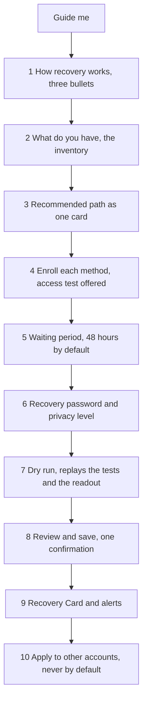
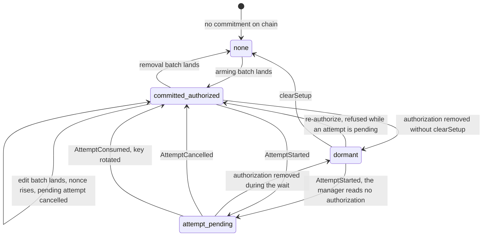
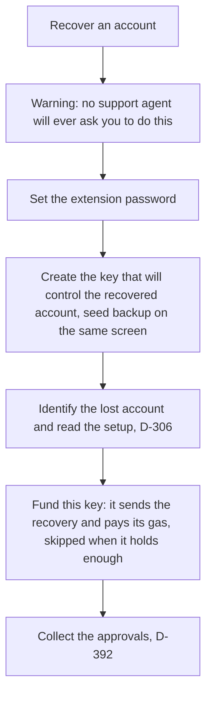
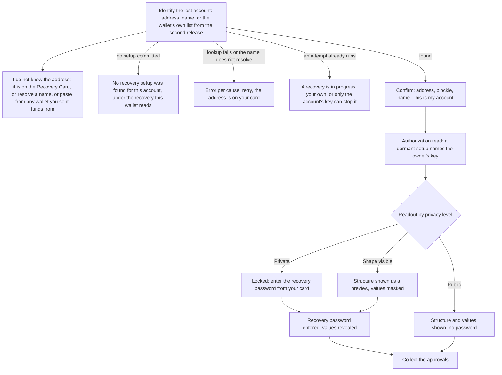
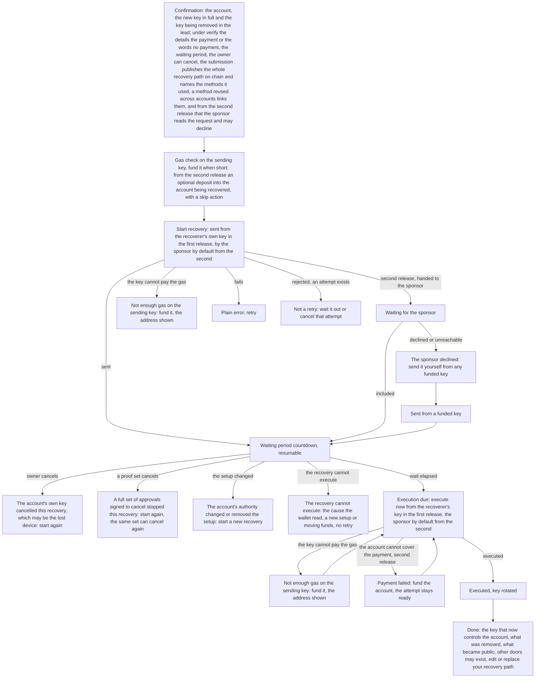
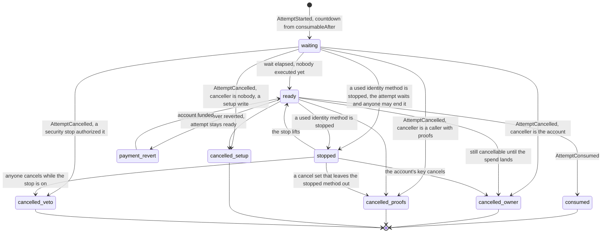

# UX tech design

@FiboApe authored the ux chapter of the tech design. Its readers are the partner's engineer who builds the recovery experience and the reviewer who never sat in the design conversation. Sections mint ids from the D-300 to D-399 band the ownership table in [`design/PRD.md`](../PRD.md) records. They deepen the idea draft's D-0, D-2, D-5 and D-6 and answer its Q-8 rather than restating them.

Three files beside this one carry the traceability set: `ux-user-requirements.md`, `ux-user-stories.md` and `ux-interfaces.md`, with the personas under `design/personas/`. The chapter validates the UX work imported under `design-context/spec-v1/ux/imports/` against the kit as the idea draft and the contracts chapter now state it. Where the two disagreed the chapter follows the kit.

The sections run in order. The front matter holds scope and vocabulary, personas and traceability, display rules and the wallet's recovery surfaces. Nine verticals follow: path building and credential enrollment, trust and risk disclosure before commit, privacy level, recovery password and the fresh-device backup, the setup lifecycle on chain, recovery entry and account discovery, approval gathering under one deadline, the guardian's approval surface, submission, payment, the wait and execution, watching and the owner's cancel. The chapter closes with what persists, the disclosure register, the decision record, the milestones, the edge cases and the discussion.

The verticals follow the ux plan at `design-context/spec-v1/ux/plan.md`. Every section id predates the reordering except the six the split of setup and recovery minted: D-316 to D-319, D-392 and D-393.

The user-facing words differ from the kit's, and this list glosses each one once.

- The user sees an account recovery feature, never a social recovery kit.
- A recovery path is the kit's rule, one AND of clauses.
- A method is the kit's credential, one enrolled thing that proves one row.
- A guardian is a person whose wallet signature is one method.
- A waiting period is the kit's wait.
- An approval is what a guardian produces, the kit's proof.

Four more words name what stands behind those screens.

- The policy manager is the kit's core contract of D-4, the one that judges the approvals and releases a recovery exactly once.
- The recovery action is the contract the account authorizes for the kit, which spends that release into the key change.
- A place is the kit's flat index of a credential across the path, which the interfaces call a slot and the screens show as a row, one thing under three names.
- When the waiting period ends the recovery executes, which the kit calls spending the approval.

The wallet is the Kohaku extension unless another integrator is named. The words policy, proof, relayer, atomic and EIP-712 stay in this prose and never reach a screen. D-302 fixes the screen words for the kit's nouns.

## Scope and vocabulary

This band says what the chapter covers, whom it serves and which words it uses.

## D-300 Scope and reader

This chapter specifies every screen and state of the recovery experience in the Kohaku extension, the first integration of the kit. It covers onboarding into recovery, the nudge of D-304, setup, recovery, the owner's cancel, the guardian's approval page, management and health checks, what the wallet persists, and the disclosures the holder and the guardian read. The chapter also states what the wallet owns that the kit does not: the setup draft, the recovery session, the backup set, the watcher, the guardian page, the safety grading and every user-facing string.

The chapter freezes no interface yet. The interfaces it consumes from the sdk chapter are proposals in `ux-interfaces.md`, and the ownership table fills as the sdk chapter freezes them.

The chapter runs on Kohaku's own smart account, the Ambire-derived account the extension already creates beside each ordinary key. The contracts chapter specifies in D-105 the recovery action for that account, the contract the account authorizes for the kit. D-312 records the choice of that account. The imported work assumed an account the wallet would build itself with an adapter the kit would owe. The account is the one the wallet has, and the action is the kit's.

The account's authority is one table of privileged keys, and a recovery grants the new key a privilege and zeroes the lost key's. The account therefore keeps its address through a recovery.

The recovery action of this release rotates address keys only. `design/future-work.md` records a passkey as the account's own signing key, a dedicated action nobody builds here.

The extension's i18n string tables are named under the `surfaces` block of `.harness/config.yaml`, so the existing copy-lint judges every string the screens ship against `rules/ux-copy.md`, as it judges the wireframes.

The modules this chapter names are the wallet's own: `ux/onboarding`, `ux/setup`, `ux/recovery`, `ux/cancel`, `ux/guardian-page`, `ux/management` and `ux/watcher`. Each names a surface of the extension the later task split cuts against. Each carries its invariants in `design/invariants.yaml` as `human-only` entries. An `I-` id names an entry of that file, a `Q-` id an entry of `design/open-questions.yaml`, and a `D-` id a section of a design chapter. Those entries stay human-only until the harness runs the persona replay, the copy lint and the surface baseline on this instance.

The chapter assumes the demo runs on Kohaku's account. If the partner builds the example account of `design/future-work.md` instead, four places re-enter as a correction. Those places are the create door of D-316, the fast track's key destination of D-303, the arming step of D-319 and the disarm pairing of D-309. The personas, the disclosures, the guardian page, the checklist and the privacy step stand under either path.

## Personas and traceability

This band names the people the design serves and the files that trace each rule to them.

## D-301 Who the design serves

Six personas bind this design, five holders and one guardian, each a fixture under `design/personas/` with journeys a verifier replays against the screens. The ux owner replays them by hand, once per milestone, against the demo build, and later integration tests go in the extension's Playwright suite.

Five personas hold an account. Sam holds one synced passkey and nothing else, and is the mainstream holder D-0 names. What the path gives him is the case a spare key does not cover, a laptop lost with no recovery phrase written down. The synced passkey survives the laptop and the seed on it does not. Alice holds five paper keys she controls herself and wants no company in her path, and D-312 records why she stays.

Three more holders combine methods. Carl holds a passkey and one friend, Sara, whose wallet holds an ordinary key, both required. Diana holds a passkey and a passport, either enough. Bob builds any two of three from a passkey, a hardware wallet and a passport, and recovers from a logged-in wallet. He is the one persona a hostile recovery is run against.

A sixth fixture, Sara, is Carl's guardian and never a holder here. She is the person on the other end of a guardian row, and she opens the approval page the extension serves from the first release. No persona holds an Aadhaar identity yet, and a seventh fixture for the Mumbai audience D-0 names is owed, D-312.

The design must carry every one of their journeys as written. Each journey step names the release it belongs to and its first-release substitute where the screen ships later. A journey that stops working is a finding with the weight of a broken invariant.

The personas came in with the imported work, where the mainstream holder's friends held no wallets. A guardian in this wallet is an address the recoverer asks a signature from, so a friend without a wallet is not a guardian here. These screens do not offer the kit's route of a friend's own passkey, D-312.

## D-315 Traceability

Every requirement traces a persona to a story to an interface.

- The personas are `design/personas/P-1-sam.md` through `P-5-bob.md`, with `P-6-sara.md` as the guardian fixture.
- The requirements table is `ux-user-requirements.md`, D-320 to D-349 with D-390, D-391, D-394 and D-395, each row naming its personas, its story, its release and the interface it lands on.
- The stories are `ux-user-stories.md`, D-350 to D-368, each covering the rows it satisfies.
- The interfaces consumed from the sdk chapter and the one surface exposed are `ux-interfaces.md`, D-370 to D-376.

A requirement with no persona or an interface no story reaches is unfinished.

## Display rules and status vocabulary

This band fixes how every value and every status renders, so the screens agree.

## D-302 Vocabulary, display rules and naming

This section fixes how the recovery surfaces render a value and which word names a thing. It sets one render form per value type and one status word per row and screen state. It also sets one screen word for each of the kit's nouns, and every screen this chapter draws follows it.

Every value type renders in one form on every screen, so a reader never learns two truncations for one thing. An address renders as its first four and last four hex digits after the prefix, `0x2b0F…6ef5`, on the recovery surfaces this chapter owns. The rest of the extension keeps its own form. An address renders in full on a review or confirmation block, on the cancel banner and wherever the reader copies or compares the value.

The full form covers the guardian row's new key, the approval page's fields and the key to fund. A truncated key is what a grinding attacker imitates. Where a surface renders the full form, the address renders whole, with no grouping of its digits, the account address on the Recovery Card of D-318 included. It renders beside its blockie where the screen draws one.

A name resolves in full and ellipsizes past 24 characters. A resolved name comes from the public name service the wallet reads. A resolved name standing beside a full address the reader is asked to check carries the caveat beside it, I-41. The caveat says that the name can change hands and that the full address is what to check.

A resolved name rendered alone for an address the reader is asked to act on carries the same caveat. A reader with no address on screen has nothing to check the name against. An account line is exempt only where the screen asks the reader to check nothing. The submission confirmation's lead therefore carries the caveat on its account line too. Its own words ask the reader to check the account before they start.

The other value types each keep one form too. A transaction hash or challenge shows twelve leading and six trailing digits. An approval blob shows twelve and eight, one form per screen. A hidden value renders as sixteen dots beside a hidden chip, so a masked value never looks like a load failure.

A member list shows three members then a count of the rest, except on the checklist of D-392, which shows every member. A user-typed method name, which a passkey or a device may carry and a guardian row never does, caps at 24 characters in interpolated copy.

The payment order renders as the token's symbol, a human amount and the payee beside it, one form on every screen. It reads `12.50 USDC` to a named address or to whoever executes. A request that names no payment renders the words no payment.

The guardian's surfaces, the approval page and the guardian row, name four values, and each keeps one name on every screen. The four are the new key, the key being removed, the payment or the words no payment, and the deadline. The deadline renders as a date and time in the reader's zone, the zone named, with a countdown beside it. The submission confirmation names the first three and the waiting period in the deadline's place.

The done screen is the one exception to one name per value. There the recovery has already run, and the two keys read controlled by and removed.

Status chips carry one vocabulary. A method in setup is not started, in progress, tested, not tested, test failed, test unavailable, not supported, not yet active, saved or live.

Each test outcome carries its own chip. A skipped test reads not tested until the holder runs it. A failed test reads test failed with the cause the test reported. A test that could not run reads test unavailable with retry. A document the method cannot serve reads not supported without one.

A guardian row reads not tested while no test has run for it, like any method. Saving never waits on any of them.

A guardian row keeps not tested until a test runs for it. The access test of D-305 and the health check's test link of D-309 leave a guardian row at not tested until the guardian's wallet signs the challenge. The row reads tested after. A ceremony the holder cancelled or the authenticator refused returns the row to its previous chip with a cancelled or refused note.

A row in collection is not asked, waiting, declined, unanswered, complete, not needed, did not answer or stopped. Did not answer names a row whose method did not answer this time, and a method whose test or hand-off returned nothing. Stopped names a row whose method the party its declaration names stopped, a state of the second release. Unanswered names a guardian who has not yet answered, and unanswered and did not answer never share a row.

A row nobody has acted on opens on not asked, whoever holds its address. Two rows of one group therefore never report the same fact in two words. Waiting names a row whose approval the recoverer has already asked for and not yet received. A row nobody asked reads not asked instead.

No read this wallet makes tells a provider that stopped for good from one that is unreachable this time. No row state therefore states that a method died.

The chips expired, void and setup changed end the whole request, D-392, and each drops every row to not asked. From the second release a security stop marks only the rows of the method it names and holds any approval signed for them until the stop lifts. A session before submission reads not submitted, and recovery in progress never renders for it. A gathering not yet sent is no attempt.

A running attempt reads recovery in progress on every surface that names it, and its countdown reads waiting or execution due, and stopped from the second release. The attempt's terminal reads cancelled. A group counts as one unit in every headline, so progress reads as a count of rows and groups done, in numerals.

The recovery status on the overview reads set up or not set up in the first releases. A graded meter labeled Recovery ready arrives with the grading of D-313. The meter degrades to needs attention on a row that did not answer, a stopped row or a dormant row. The label Protected never appears and no string says that recovery protects the account, I-26.

Three more chips name states other sections carry. Path locked renders beside set up where this device cannot read the path. Not active renders where the account no longer authorizes the setup. Cannot recover renders where the wallet refuses to recover the account. The editor adds still needed on a member the path cannot lose, D-309.

Two passwords exist and keep two names everywhere. The extension password unlocks the device, and the recovery password decrypts the recovery setup at the two hidden privacy levels. No screen takes both into one field, and a screen that needs both asks for them one after the other under their own labels.

Guardians have no names in the wallet, D-312. A guardian is an address, shown as a blockie with the address or a resolved name, and the wallet stores no contact label.

The role is a guardian in prose and help, and a member only inside a group header. Its artifact is an approval, and the word signature appears only inside the offline signing block. A key the holder keeps themselves is a guardian row in the kit's sense. It reads as a guardian row on every screen, D-305.

The kit's nouns have one screen word each and the prose keeps the kit's names. The action is the recovery module and its author is its publisher. The policy manager is the recovery registry. A method's pause holder is the party that can stop that method. A method's key admin is the method's admin.

The setup version is the setup number. The attempt's id is the attempt number, on the page and in the wallet's prompt alike. The digest, the nonce and the calldata never reach a screen. A method's pause reaches a screen as a security stop, and the row word is stopped.

No screen names the SDK either. Where a screen shows what the SDK computed, read or refused, the screen word is the wallet. A masked value reads none this wallet can see and a returned value reads as this wallet read it. A path is a recovery path and a credential a method on every screen, at the confirmation as at setup. What a recovery publishes is said as on chain in the clear.

Wireframe frames carry a code per screen, `C-06e`, and a frame is never renamed. A superseded frame moves to a dated outdated band, and its replacement is rebuilt under the original code. A review note written against a code therefore still points at a frame.

## Architecture of the wallet's recovery surfaces

This band names the surfaces the extension draws for recovery and the doors that reach them.

## D-316 The extension and its doors

This section says where the extension sits and what it owns, deepening D-4's roles on the wallet side. The extension computes no commitment, digest, proof or calldata itself. The SDK prepares all of them through the client of `ux-interfaces.md` D-370 and its two host adapters. Those adapters are a provider for reads and, from the second release, the sponsor rail.

The extension keeps its own storage and its own signer outside that client, `design/offchain/sdk.md` D-200. The extension is the layer that signs, broadcasts, polls and renders, and it holds every session state the kit refuses to hold.

The extension's code enters this repository as a git submodule of github.com/ethereum/kohaku-extension, pinned at a commit. A ux change is written in that repository directly, with no fork, and this repository moves the submodule pointer when the change lands, so each ux change is two pull requests, one in the extension and one here. The battery checks the submodule out with the rest of the tree.

Before the minimal setup's tasks materialize, the ux owner runs a proof of concept in the extension that answers four questions: whether it creates an Ambire v2 smart account by default, whether it deploys a counterfactual account inside the arming batch, whether the create door's picker exists, and which signing paths fail for a key at privilege value `1`. Its note lands under `design-context/spec-v1/ux/research/`. A gap it finds re-enters as a delta against the task that owns the surface, the create door's picker or the arming save first.

Ceremonies that die on focus loss, the passkey's among them, run in a full tab rather than the action popup. This section states the rule once and every section below assumes it. A hidden tab dispatches nothing to the background until it is shown again. A ceremony that hands off to a phone therefore reports its result when the tab returns.

Every signing request lands in the action window through the request queue. This section owns `ux/onboarding` with D-303.

The welcome screen offers three doors: the two Kohaku has, create a new account and add an existing account, and a third this chapter adds, recover an account.

The create door is Kohaku's own onboarding. It derives an ordinary key for each account slot. At that slot's index plus one hundred thousand it derives the second key, which holds the privilege on the smart account. It also derives the smart account itself, deployed counterfactually at its first operation. Contracts D-105 states that offset and states that the ordinary key at the same index holds nothing on the account.

The picker shows the smart account beside the keys, badged as controlled by the derived key's address. The wallet reads that address from the account's own privilege events rather than from the slot it displays. The picker selects the smart account by default, which is work this chapter asks of the onboarding, since the shipped picker hides smart accounts. The door says that recovery covers the smart account and not the key that controls it, and that this release recovers one ordinary key.

Whether that key carries a seed backup is Kohaku's onboarding's own matter. The recover door assumes the holder has lost whatever backup the key had, and the wallet asks no question about a seed, D-312. The create door arms no recovery. Setup enters from settings, D-305 to D-319, on an account that holds something worth recovering, D-312. The account need not have transacted, D-319.

The import door is unchanged. The recover door opens the fast track of D-303. Its warning screen takes the holder's acknowledgment, nobody claiming to be support asked me to do this, before the fast track accepts any input, I-36. The settings door of D-306 carries the same gate. The warning carries one pointer line, if you still have your recovery phrase, import it instead, the owner's ruling of 2026-09-08.

The two reset entries the extension already has, the password reset by email and the seed import, sit behind the same warning, I-36. The pointer line belongs to the recover door alone, and neither reset entry carries it. A holder who opened the seed import is already at the screen the pointer line would send them to. Each entry opens that warning screen with no step counter, since neither belongs to the fast track's three steps. Each takes its own acknowledgment, that nobody claiming to be support asked me to do this, and accepts no input until the holder gives it.

The seed keeps its product name, recovery phrase, and the chapter's recovery words are account recovery, recovery path and recovery password.

## V1 path building and credential enrollment

This vertical covers how a holder builds a recovery path and enrolls each method before anything is saved.

## D-305 Path building and credential enrollment

This section covers how a holder builds a recovery path and enrolls its methods, deepening D-2's rule and D-5's decisions on the method tiers. The trust list before the save is D-317, the privacy step D-318, the save itself D-319. It owns `ux/setup`.

Setup lives under settings, account recovery, and lands on the presets. The presets screen offers four shapes, each a whole path the holder adopts and may edit.

- Your device and your guardians is a required passkey and any two of three guardians.
- Your device and your ID is a passkey and a passport, both required, labeled deliberately strict.
- Either one works is a passkey and a passport in one group of any one of two, the shape the sizing rule below prefers at two items.
- Guardians only is any two of three guardians, the one preset with no device.

A fifth card, start from scratch, opens the same editor empty.

A preset loads its shape into the editor with its member slots empty, and the editor applies its own rules at save rather than on arrival, so a group of two of three opens with no member in it and refuses nothing until the holder saves. Above the grid two actions lead elsewhere: guide me opens the wizard, and customize opens the editor, which in the first release is the blank editor and later the advanced builder.

The presets screen states the three costs before any enrollment. It says that saving is one transaction the account's key pays, that the recoverer's own key pays for a recovery in the first release, and that cancelling a recovery is itself a transaction the account's own key pays for, which needs gas that key holds outside the account. A holder who keeps every asset inside the account reads the cancel's price first on the banner with the waiting period already running.

The presets screen says to a holder with one device that start from scratch builds a single-method path, and it carries the honesty note of D-304 in the first release, recovery helps if you lose your key, it cannot stop someone who already has it.

Group thresholds adapt to the members the holder enrolls, two of three being the starting suggestion. A two item inventory becomes one group of any one of two rather than two required rows, since lockout is the larger risk at that size. The sizing rule and the threshold guidance reach the holder as the rule lines stated below, generated from the path's own shape on the card, in the editors and on the review, rather than as rules the wallet enforces.

An account holds exactly one recovery path, an AND of required rows and groups, and there is no menu of alternative paths. A group is any N of its M members, and members mix freely: guardians, passkeys, passports, Aadhaar identities. Every group carries a threshold.

The wizard and the presets build required rows plus at most one group. The setup editor and the management editor can add and remove rows, members and groups, remove group included since a shape the editor can add it must be able to remove. They also move a member between a required row and a group with one action, move to group or make required, and the enrolled credential survives the move. A multi-group path and a group built from a strict preset are therefore both reachable in the first release through the editors, while the free canvas of the advanced builder ships later.

One enrolled method appears once across the path, never both as a required row and a member. The editor refuses a duplicate with a reason that never names the chain and offers no relaxation, since one key at two places of a group would let one signer fill both. The contract allows naming the same person twice, so this is the wallet's own policy.

The editor also refuses a path whose shape cannot be satisfied: an empty clause, a threshold outside its members and a threshold above the two hundred fifty-five its own field can count, contracts D-103. It also refuses a waiting period past the width the kit's field holds and a rule wider than a block can evaluate, contracts D-107. This check is the only gate between the holder and a setup that can never recover.

The threshold's field bounds how many credentials a clause requires and never how many it lists, contracts D-103, so a ceiling on how many members a group holds is the wallet's own rule wherever the editor applies one and its refusal names the wallet as the party that refuses, I-24.

Two different ceilings bound the waiting period and the copy keeps them apart. The kit's field width is the hard bound, and a wait past it reverts at the attempt and the SDK refuses it at the save. A wait inside that width can still run for centuries, so the picker carries its own ceiling besides, the largest wait the setup screen accepts, one of the six numbers contracts D-107 gives the SDK.

Each refusal names the wallet as the party that refuses and names whose limit it applies.

- This wallet cannot save a waiting period past the width the kit's field holds.
- This wallet cannot save a waiting period past the longest this picker offers.
- This wallet cannot check a path this large in one block.

The holder therefore reads who refuses, what the limit is and where it comes from. The picker's ceiling refuses first at every value a holder can type, so the field-width string is copy no holder reaches through the picker, and it stays for a value that arrives by another door.

The editor's rules panel carries every refusal the editor applies, the refusal of a threshold above the two hundred fifty-five its own field can count included, since a panel that lists five of the six teaches the holder a shape the save then refuses. A threshold below one sits outside its members like a threshold above them, so the editor refuses a group nothing has to fill.

The chain refuses one rule shape of its own, the rule whose every clause is zero, contracts D-103. On a one-group path the editor's refusal therefore repeats an enforcement the chain has, and on a path with a second clause the refusal is the wallet's alone, which is what its string says. The editor's rules panel states this refusal beside the upper one, since a panel that states one side alone reads as permission for the other.

A single method is a valid path. The recommended-path card, the editor and the review carry the single-method warning, that if you lose your key this one method is the only way back into the account. They offer a second passkey from another device beside it, or a hardware key where the holder has no second device, which the editor adds as a group of any one of two with the line that two passkeys behind one platform account share its fate.

The rule lines state a shape's consequences wherever the shape appears, on the recommended-path card, in the editors, on the review and on the recoverer's readout, generated from the whole path. They are the wallet's own calls on rule quality, since the SDK returns no verdict on a rule. A path with no group and N required rows carries all N must answer, losing any one locks you out, two rows reading both must answer, losing either locks you out, and a path of one row carries the single-method warning instead. A group of one member carries the single-method warning too, since one member is one method.

A group of any N of M carries any N of these M recover this account, losing more than M minus N locks you out. At a threshold of one with two members that line reads either one alone can recover this account and either one alone can also take it. At a threshold of one with more members it reads any one of these M alone can recover this account, and any one alone can also take it. Where the path has required rows or a second group, the line adds together with your required methods and one member of each other group. A group of more than one member whose threshold equals its member count carries every member must answer.

A group whose members all use one kind carries one failure domain, these members fail together if their kind does, kind being the screen word for a method family.

A setup line asks the holder to keep the methods of a path in different places. The editor states the sizing rule where the holder builds a two-item path as two required rows, that a group of any one of two is the shape it prefers at that size.

The identity method's weight line and the words primary and offered beside leave the screens, D-312. The kit's guidance to raise a threshold when a secondary credential joins a clause stays off the screens, the imported decision 94 this chapter keeps, D-312.

The wallet generates every line above from the holder's own path, so the frames draw examples of them rather than one frame per shape.

The wizard ships in the second release and runs nine numbered steps there, the counter reading of nine. The tenth step, apply to other accounts, arrives in the third release and a wallet with one account skips it, so the counter states the steps the release ships and never a step that does not exist. In the first release the presets and the start from scratch editor are the doors, and the education layer ships with the wizard.

The dry run of step seven replays the enrollment tests and shows the readout as a recoverer would see it. It rehearses no recovery, says which rows it rehearses and that a guardian row has nothing to rehearse, and its copy says so. At a hidden level it asks the recovery password once, to confirm the holder remembers it, a mismatch blocking nothing beyond the rehearsal.

The inventory offers another device, guardians with wallets, a passport, an Aadhaar identity listed last and badged, and keys you keep yourself on paper or hardware, which route to guardian address entry. Where the inventory answer is another device, the recommended path names a passkey on that device, enrolled through the browser's phone hand-off, rather than a passkey on this one.

Progress persists locally, an abandoned wizard re-enters at the last completed step, with enrollments not yet saved on chain shown as not yet active, and a resumed draft shows its age. Every step past the first keeps a back action, and an option chosen in the body sets state without advancing.

Every method offers an access test at enrollment and the wallet recommends it without enforcing it: a skipped or failed test never blocks the save, D-312. A skipped test reads not tested on the review with the line that an untested method may fail on the day it is needed. A failed test reads test failed with the cause the test reported and the line that this method may never work. A test that could not run, a node or a service unreachable, reads test unavailable with retry. A document the method cannot serve reads not supported with no retry, since the answer will not change.

This overrides the imported decision 54, which made the wizard's identity tests blocking, D-312. The passkey test and the guardian checks run locally, while the passport and Aadhaar tests verify against the deployed method's own pinned key on chain, contracts D-104. The wallet's verdict and the chain's therefore agree, and no test runs against an authority's current key the chain does not hold.

The wallet offers a passkey its access test right after creation and the holder may skip it, the row reading not tested until it runs. The wallet records whether the credential is synced or device-bound from its backup flags whatever the holder does with the test, telling the holder which one they have.

The passkey row carries the kind line and its loss consequence. The kind line reads what the authenticator's own flags report at enrollment and never names a platform from the operating system. A device-bound passkey lives only on this device, so losing the device also removes this method, and the path with it where nothing else can recover. A synced passkey follows the provider account that syncs it, an Apple or Google account for most holders, so it survives losing this device, whoever holds that account can start a recovery, and if that account closes or you cannot reach it this method is gone.

Every passkey works only from Kohaku on Chrome, the relying party of D-314. A synced passkey, or one a phone serves over the hybrid hand-off, answers from any device that runs Kohaku on Chrome. A build on a browser other than Chromium draws one state on every passkey row, at enrollment and on the checklist: passkeys need Kohaku on Chrome.

Enrollment runs on this device or through the browser's own phone hand-off, a QR the phone scans and a tunnel the browser vendor runs, which the hand-off sheet names. The hand-off runs in a full tab rather than the action popup, which dies on focus loss. A cancelled or refused ceremony returns to the row with its own note rather than an error. A passkey provider that refuses the extension as its relying party leaves the row in a refused state, which says the provider refused and names the browser's own passkey store as the route.

A passport runs zkPassport's own flow on the holder's phone, a phone able to read the document's chip, with progress, abort and a failed state that offers retry, and verifies against the on-chain verifier. The row names the hand-off to the phone and says that renewing the passport ends this credential, since the identifier is derived from the document, D-375.

An Aadhaar identity is a QR image the holder uploads and a test proof against the pinned authority key, with the same states. Its row carries the line the idea draft's D-5 asks for while the liveness finding stands, that current documents may not verify against the deployed key, so this method is discouraged until that is fixed. The holder presents the same QR again at recovery, which the row says.

A guardian address gets light checks only, a checksum, a name resolution shown as advisory, a contract detection and a same-seed warning where the wallet holds the seed. The name resolution is advisory since a resolved name is what the address's owner chose and never a check. The same-seed warning reads this address comes from the same seed as your key, so losing the seed loses both. No signature is demanded of a guardian at setup, so a guardian row reads not tested, and a guardian's liveness is a health check item of D-309.

The row states the precondition of the one pause every approval of that guardian waits on. It tells the holder that a guardian who can call them back on a number they already hold completes the check I-39 imposes on the day. The acknowledgment's second half answers only for a holder who is their own guardian. The row states that precondition for the holder to read and never reads a guardian as unanswerable.

Every guardian row offers the access test, a test challenge the guardian's wallet signs on this device or through the same offline block the approval page has. That block carries the challenge out by QR or file and carries the signature back, so a paper key never touches an online machine. The row reads tested after that challenge comes back signed. A guardian row is an address, whoever holds it, and no screen marks the holder's own key as theirs.

Every guardian row carries the conditional sentence, if this address is a smart account, whoever controls it can approve for it, whatever a test returned and whether or not detection fired, since a smart account is counterfactual until its first transaction and the kit tries both signature paths.

Both identity rows carry the line that this method shows the details on the document and not that the holder is the one using it now. The guardian row carries the line that a recovery publishes the whole recovery path on chain in the clear, every method in it and not only the ones it used.

The row's own sentence reads that if a recovery ever uses this guardian their address goes on chain in the clear, that even unused anyone who can guess it can find it, and to ask them first. The identity rows carry the same publication line for the identifier the document produces, since a recovery publishes it beside the account and every later setup with the same document is correlatable to it.

The waiting period is one per account. The picker offers 24 hours, 48 hours, 72 hours and 7 days as chips, 48 hours the default, and a custom entry that takes any value of 24 hours or more. The picker's ceiling is the largest wait the setup screen accepts, one of the six numbers contracts D-107 gives the SDK.

The other five are the default wait, the wait below which the setup screen warns, the width of a request's validity window, the cancel gathering's own duration and the rule cost beyond which the SDK refuses. This chapter sets the first two on its own screens, sets the third in its own configuration, and takes the rest from the sdk chapter. The minimum is the wallet's own and the chain enforces none, so no copy says the contract rejects a shorter wait.

Contracts D-107 binds the default from the other side: the wait exceeds the cancel gathering's own window and the time a watcher takes to reach the holder, taken together. The wallet's 48 hours stands against its own request window of 24 hours and a cancel gathering whose window no section fixes, so the sdk chapter owes that second number under that constraint and the wallet revisits its default once the sdk chapter sets it.

The same constraint bears on the floor, since a holder who takes the 24 hour chip or types 24 hours in the custom entry keeps a wait that must exceed those two windows too. The wallet therefore revisits the floor and that chip beside its default once the sdk chapter fixes the cancel gathering's window under the residue FR13-WAIT-WINDOW.

The contracts chapter's D-107 leaves the default wait to the SDK, and the idea draft's D-6 leans toward a span of days because no operated alerting exists, the gap Q-13 records. The wallet's position on it is the one stated here, 48 hours, with the alerts opt-in as the mitigation once alerts ship in the second release. Until then the waiting period step says the holder must open the browser during the wait to see a banner. That step also states what the holder must hold to use the window they are pricing, gas on the account's own key, held outside the account, since the cancel is a transaction that key sends.

The wallet offers applying the same setup to another account once, the tenth step the third release adds, and never applies it by default. It reuses the same methods under per-account values the SDK derives, so reuse is not visible on chain until a recovery, while a guardian's address is hidden only from someone who cannot guess it. The warning about linking accounts renders at the moment of choice on this screen and again where the link becomes visible, the submission of D-393 and the guardian surfaces of D-308.

Diana's walkthrough in the first release runs as follows: the presets, the either one works preset, the passkey enrolled and tested on her phone, the passport enrolled through zkPassport with its lines read and its test run, which is the rehearsal that release has for an identity row, 48 hours kept, Private kept and the password typed twice, the review with the identity line beside the passport row, one confirmation, the card printed. In the second release guide me, the inventory and the dry run join the same path.

## V2 trust and risk disclosure before commit

This vertical covers what the holder reads about every party and every pause before the setup is committed.

## D-317 The review and its trust list

This section covers what the holder reads before saving, deepening D-4's declaration of trusted parties, D-6's failure domains and the integrator obligation Q-8 names. It owns `ux/setup` with D-305.

The review leads with what decides the holder's risk. That lead carries the path with its rule lines and its waiting period, the sentence that in the first release the recoverer's own key sends and pays for a recovery and the account pays nothing, and from the second release the payment order the quote prices. It carries the publication line once. The trust list sits under a verify the details expander, the rule the guardian page of D-308 uses, so the holder reads the review rather than scrolling it. The trust list is the block of the review that names every party and every door a recovery on this path depends on.

The trust list names one row per method contract of the kit, however many path rows use it, with the parties its declaration names, or audited, and with no outside party where the declaration is empty. It names in the security stop block under it one row for every method the path names, each row generated from what that method declares rather than from the kind of method it is. The row reads the party that method declares as able to stop it, or that nobody can stop this method where the method declares no such party, which is what the passkey and the guardian methods declare today and what the two identity methods do not.

A third-party method that declares a pause holder of its own gets its row from the same rule. For a third-party module with no declaration the list carries the words unknown outside parties.

For every guardian address the list carries the conditional sentence of the enrollment row. That sentence reads if this address is a smart account whoever controls it can approve for it, and the list repeats it in bold where detection fired. For an identity method it names the method's admin with the line that this party can change the key this method trusts, so it could approve for this method. Where that method alone satisfies the whole rule, a group of threshold one with no required row beside it, the line reads that this party could recover the account alone.

The list names the action with its author, shown as the recovery module and its publisher, read from the wallet's own table of the kit's audited actions.

It names the account's other doors as the SDK returns them, the code entries contracts D-105 names and any key beside the one a recovery removes. It reads each code entry for what it is, the entry point's marker as code the account itself installed when it activated 4337 and every other entry as a validator somebody bound to the account, contracts D-110. A holder whose only code entry is the marker then reads why it is there rather than learning to skip the line and skipping a hostile validator with it. The doors carry the line that a recovery leaves them untouched and the account is only as safe as its weakest door, and where the SDK returns none, that the wallet cannot see every door.

The list names the node the wallet reads through, named by kind, a light client with its prover or a plain node, which sees the request before the chain does. It carries the line that a method whose provider stops working is dead for good, since methods ship immutable and a keyless holder cannot reconfigure. It repeats the identity line per identity row.

The wallet recovers accounts with one signer in this release, so the review offers no signer threshold control. Whether this release recovers the account and which key a recovery would remove is the SDK's answer, D-371, and the wallet renders it and counts nothing itself. For an account that has no code yet the answer is the derived controlling key the create door gave it, contracts D-105, read from the code the account will carry, a reading this chapter assumes.

Where a group has three or more members it also guides toward thresholds a hostile minority cannot reach, since a set that satisfies the rule can cancel a recovery at once. At a threshold of one it states the cost the line above already carries, that either one alone can take the account. It also carries one comparison for the holder: a spare key on this account is the cheaper way to survive a lost key and no help against a stolen one, the owner's ruling of 2026-09-08 in the words the review frame carries.

Every kit contract is immutable, the recovery registry and the recovery module carry no pause and no owner, and the only stop in the kit is the one an identity method carries, contracts D-111.

The review reads each method's own `trustedParties` and its own `paused()` through the SDK, in every release. It names in the security stop block under the trust list the party that can stop that method, and it names the address one acceptance away from each of the two roles, the admin's under the admin row and the stop holder's in the stop block. It reads nobody can stop this method where the method declares no such party. The trust list shows each method's stop state in every release. From the second release a stopped method's row adds the line that no recovery using it can start until the stop lifts. No stop of any kind refuses the save, contracts D-111.

Where a method's admin row and its stop row read the same address the review states in one line beside the two rows that one party holds both roles, so a holder never reads the stop as the defence against the admin the row beside it names, contracts D-110. In the security stop block under the trust list the list states in one sentence that this release ignores every stop: a stop on a method will not stop your recoveries, and it will not stop a forged one against you either. The setup body carries one such choice for the whole setup. The first release commits the opt-out and offers no control; from the second release the review carries the choice, defaulting to the opt-out.

From the second release, for a path with no redundancy, two required rows or one row, that holds a method something can stop, the review states that a security stop on any of its methods stops recovery for a holder without a key until the stop lifts. The graded warnings on single points of failure, shared failure domains and unvetted modules land here when the grading of D-313 exists, while their flat forms already ship in the lines above.

## V3 privacy level, recovery password and the fresh-device backup

This vertical covers the privacy level, the recovery password and the card a fresh device restores from.

## D-318 The privacy step and the card

This section covers what a stranger can read about the setup, the one secret a fresh device needs and the card that carries it. It deepens D-5's privacy dial, the clear path the contracts chapter's D-103 carries on the setup's private field, and the guessability D-110 records for a wallet guardian's address. The backup's carrier and its re-import are in D-310. It owns `ux/setup` with D-305.

The privacy step decides what a stranger can read about the setup, and the holder sets the recovery password there. Three levels exist, each described on its radio by one line stating what it reveals.

Private, the default, encrypts the shape and the values with the recovery password, so a stranger sees that this account has a recovery setup and nothing of what it is until a recovery runs, which publishes the whole rule on chain in the clear. That line rests on the padding the SDK applies to the private field, `ux-interfaces.md` D-375 and contracts D-107. The padding holds whole under one size for every backup, and under a set of buckets it narrows to the width of the bucket, which is why the ux chapter asks for the one size.

Shape visible publishes the shape of the setup, the line generated from the holder's own path, and encrypts which passkey, which guardians and which document. Public publishes everything and sets no password, so a fresh device rebuilds the setup from the chain alone and the card carries only the address a recovery still needs.

Every level carries one more line, the exposure line, whose two halves rest on different mechanisms. The guessability half belongs to the address rows alone, a guardian's address and a key the holder keeps being hidden from a stranger who cannot guess them, while a passkey's configuration and an identity method's are unguessable and lose nothing before a recovery, contracts D-110. The publication half holds for every row, since a recovery publishes the rule with its waiting period and every method in it, so every row is exposed, the ones that approved and the ones that did not, the disclosure D-110 asks the privacy step to carry.

The exposure line names the rows it speaks of in two forms, every guardian of your path where the path holds an address row, and every method of your path where it holds none. The guessability half renders only on a path that holds an address row, since an address is the only configuration a stranger can guess. Every surface that draws the exposure line draws that split, the privacy step and the path builder alike. A builder that named a passkey or a passport among the rows a stranger could guess would misstate what those rows cost the holder it asks to choose a level.

The kit encodes all three over the two metadata fields of the setup event, per D-375, and no level hides that a setup exists, so no copy says nobody can see you have one.

At Private and Shape visible the step requires the recovery password, asks the holder to enter it twice, and states both halves of the trade. Anyone holding the Recovery Card can read the recovery path and still cannot recover, and losing both the card and the password at a hidden level leaves a fresh device unable to begin a recovery. At Public no password field renders, and the level's line says that this level sets no password and the card carries only the address, never that no card is needed.

The Recovery Card carries six things and nothing else: the account address, the recovery password at the two hidden levels, a short guide to starting recovery on any device, the line that this card alone cannot move funds, the line keep this card away from the device that holds your wallet, and the line that a photograph of this card plus the chain can read the recovery path and still cannot recover. It carries no method, no address of a guardian, no threshold and no waiting period, so a photographed card alone names nothing to phish, while a photograph plus the chain reads the path at a hidden level and still cannot recover, which the card's own line says.

On the card screen the recovery password renders as a hidden value with a reveal action, so the holder reads back what the card will carry. The card download offers a file, print and a hand-off to a second device, says to keep the card off this device, and a re-download asks the extension password.

## V4 setup lifecycle on chain: arm, edit, disarm, dormant

This vertical covers the setup on chain: arming it, editing it, disarming it and what a dormant setup means.

## D-319 Arming the setup

This section covers the one batch that turns a reviewed path into a committed setup, deepening D-2's setup writes and the hazard D-4 names in a setup the account no longer authorizes, which this chapter calls dormant. Editing, removal and the repair of a dormant setup are D-309, and the empty state that leads into setup is D-304. It owns `ux/setup` with D-305 and `ux/management` with D-309.

Saving is one confirmation, one batch the account signs to itself that writes the kit's authorization into its privilege table and commits the setup at the policy manager. It gets the shared submitting and failed states every owner-signed write shares.

That shared failed state carries two readings, and every write in this chapter inherits both. A call the wallet never sent reads that nothing reached the chain and that the account stands as it did. A call that reached the chain and reverted reads as a revert, names the cause the receipt carries and says the gas it spent is gone. A holder who reads that the wallet sent nothing retries a call that cannot land.

The body the save commits carries the waiting period, the rule and one pause choice for the whole setup. In the first release the wallet commits the opt-out, so no security stop reaches a recovery this setup authorizes, contracts D-111. From the second release the holder chooses on the review, and the default stays the opt-out. The review states that choice in the security stop block, where every method of the path takes a row from its own declaration. The first releases surface no such choice, so no screen offers a control for it.

The account signs its own setup writes, and its controlling key sends them and pays their gas in the first release. On the demo network a smart account operation has no other route. A key that cannot pay gets a plain blocker naming the shortfall and the key's address.

That blocker offers both routes that fill it, a transfer from another account this wallet holds and a deposit from outside into the address it shows. A transfer out of the account the key operates is itself an operation that key must send and pay for. A key at zero therefore cannot take the first route alone. The wallet offers no sponsor for a setup write, and the presets screen's cost line says the same.

The save action stays disabled until every party on the trust list has rendered, I-37. A declaration read that fails renders unavailable with a retry action, and the save stays disabled with that reason on screen.

One derivation over the account's privilege stream, contracts D-108, feeds two reads of this screen, and the two run under two failure policies the record states once here. The key a recovery would remove carries the arming screen's disclosure of what the holder is committing to. A stream that cannot name that key blocks the save with that reason on screen, rather than letting a setup arm under a removed key the holder never read.

The account's other doors are the informational read, so a derivation that cannot complete renders the line that the wallet cannot see every door and leaves the save enabled. A holder whose node cannot serve that derivation would otherwise be locked out of setup altogether, and Q-8 asks for a disclosure rather than an absent one.

After the save batch lands the wallet runs one check before the screen reports success, the re-derivation of the commitment it committed and the authorization read back through the action, `ux-interfaces.md` D-371, contracts D-108. An authorization the action does not recognize after the batch gets the same failure state, so a setup born dormant never reports as live. A commitment that disagrees gets its own failure state after that landed transaction, pointing at removing and saving the setup again, contracts D-103. The screen never reports a dead setup as saved.

The wallet checks the digest version the manager publishes through its domain when it builds the client for the account, and that check refuses the client before anything is prepared. The wallet therefore draws the update the wallet state at the account step of D-306, and no post-save state carries it.

Before that confirmation the screen asks the SDK whether the action fits this account and which key a recovery would remove, and it shows that key as the SDK returns it. It names the action and its author as the party that will hold the account's authority, and it offers the kit's audited actions and nothing else.

An account that has never transacted has no code yet, so the extension prepends the deployment from its own account library to the save batch. That batch then deploys the account before it writes the authorization and commits the setup, contracts D-102 and D-105, and the cost line names the deployment's gas. No screen asks for a prior transaction, the ux owner's ruling of 2026-09-09, held again on 2026-09-18.

The SDK prepares the two calls after it and refuses an address that holds no code, so the ux side asks the sdk chapter to run the fit check against the code the account will carry. It refuses a second setup for the same account and action with the words this account already has a recovery setup, edit it instead. Those words name the rule as the wallet's own, since the chain refuses no second setup, I-24. When the wallet adds an action of another kind it states that the trust an action carries is per account rather than per action, contracts D-110. It refuses a setup on the manager it is configured with while that manager holds one for this account.

Whether the manager's events expose a setup on another deployment is a question for the sdk chapter. That disclosure speaks of an action of another kind and never of a second recovery action. Two setups for one outcome would take two action addresses and this screen refuses the second, contracts D-103, and recovery is the one outcome this chapter draws.

The setup as the wallet sees it, from the manager's storage and the account's authorization together:

Two of those states hold at once, since the authorization can be removed while an attempt waits. Where a screen would draw a dormant setup and a running attempt together the dormant reading wins. It states that the attempt cannot execute until the account authorizes the action again, the reading D-306 gives the recoverer and the overview of D-309 gives the holder.

## D-304 The nudge

This section covers the banner that draws a holder without a recovery path into setup, deepening D-6's remark that the setup screens push redundancy. It owns no module of its own and lives in `ux/management`.

Each dashboard open checks whether the account has a recovery path through the setup read of `ux-interfaces.md` D-371. While the read runs nothing shows, and a read that fails shows no banner, since a failed read is not the absence of a setup, I-28. The banner shows while the account has none: you have no recovery path yet, set up recovery, with set up recovery, dismiss and never remind me again.

In a wallet with several accounts the banner names the account it speaks of, shows once per open for the first account without a path, and never remind me again covers that account alone. Dismiss shows the banner again next open. Never again replaces it with a permanent shield badge in a warning state on the account row and on the settings entry, which never pops up and never blocks, and opens setup when tapped.

The nudge ships in the second release, D-313. In the first release the settings entry alone leads into setup and the presets screen carries the honesty note.

The banner carries the honesty note in these words: recovery helps if you lose your key, it cannot stop someone who already has it, the owner's wording of 2026-09-09, which keeps the sentence outside UXC-6's ban. The passkey kind line and its loss consequence live on the enrollment row of D-305 and not on the banner, since the banner shows before any passkey exists.

## D-309 Management and health checks

This section covers the settings overview after setup and the optional health checks, deepening D-4's roles on the wallet side. It owns `ux/management`.

The overview shows the status line, the one recovery path, the recover an account entry, the Recovery Card action and, from the second release, the alerts action, and a recovery in progress notice when an attempt runs. Before a setup exists it shows its empty state with set up recovery. A path this device cannot read shows as set up with the path locked and asks for the recovery password to show it.

A method whose trusted keys moved shows a notice, read from the method's key update event. From the second release a stopped method shows a notice too, read from that method's `Paused` and `Unpaused` events and from its own `paused()`, naming the rows it stops and clearing once the stop lifts. The moved-keys notice says what the method's admin can now do, approve for that method with the new trusted key. It offers the method's own test beside a route into the path editor, and it states that a passing test does not clear the risk. An admin who adds a key of their own beside the legitimate one leaves the holder's own document verifying.

It has no separate methods list: every member and method change happens inside the path editor and ends in a review of changes before one owner-signed transaction. That review of changes carries, for every row the edit adds, the trust list rows of D-317, the publication line and the security stop block. The management editor and the overview's readout of the path carry the rule lines of D-305, since a holder reads a shape's consequences where they change that shape.

Editing loads the path into the editor and states which committed values change. It states that a changed password or privacy level makes a printed card stale, and it offers changing the recovery password as one of those values. The editor blocks removing a member the path still needs in place with the fix, lower the threshold or add a replacement first. Saving while an attempt is pending carries the line saving will cancel the recovery in progress above the primary action. Removing recovery always warns that the account will have no recovery path, asks the holder to type to confirm, and while an attempt is pending adds that removing recovery cancels the recovery in progress.

Removal clears the setup and removes the action's authorization in one batch where the account can revoke it, which Kohaku's account can, contracts D-102. A committed setup whose action is no longer authorized on the account shows on the overview as a warning state with two actions, re-authorize and clear. Another wallet or a manual act can produce that state. Such a setup still admits an attempt, which publishes the rule and runs its clock while the missing authorization stops the spend alone, contracts D-102, and a later authorization would revive it under a rule the holder may no longer remember. The warning names both, and the setup must not sit there without a repair.

While an attempt is open on the account, pending or ready, the re-authorize control is absent or disabled with its reason on screen, rather than offered and refused on tap. That reason names the wallet as the party that refuses, I-42. Re-authorize commits the same body again rather than writing the authorization alone, `ux-interfaces.md` D-371. The action therefore asks for the recovery password where this device cannot read the path, shows the trust list first and saves the paired batch under one confirmation. It costs the holder the password step a lone privilege write would not have asked for.

The re-commit moves the setup nonce, so it would retire an attempt running against the old setup. The wallet refuses the action while such an attempt runs all the same, I-42, and its reason is that it keeps the cancel and the repair apart: a holder never ends an attempt as the side effect of a repair, so they cancel first and re-authorize after. The re-commit's own effect, the retired attempt, is not the reason, the owner's ruling of 2026-09-23 in D-312. While an attempt runs against such a setup the warning states that the attempt cannot execute until the account authorizes the action again, the dormant reading D-319 gives every screen that would draw both. A holder then reads a warning the facts support and pays for no clear against an attempt that could never have executed.

Clear sends the write that clears the setup, which cancels any attempt running against it. That action therefore carries the sentence that clearing ends the recovery in progress above it while an attempt is open, I-30. The mirror state is an authorization the account still holds with no setup behind it, which clearing the setup alone leaves. It shows the same warning with one action, remove the authorization, since a later save would re-arm the kit with no account write, contracts D-110.

Health checks are an optional capability and not the first focus. They reuse the enrollment tests over time. The passkey check asks the holder to tap their passkey, which is the interaction wanted, since no browser API silently reports whether a credential still exists. Unattended runs cover only the environment, and their failures render as unproven, never as deleted.

The guardian check asks the guardian's wallet for a signature over a test challenge, the only liveness a guardian row can have, since a guardian's account can change hands after setup without the holder knowing. The wallet holds no channel to a guardian, so the check hands the holder a test link to send the way they reach that guardian. Every guardian row offers that challenge on this device or through the offline block. The identity checks re-run the enrollment test against the pinned key.

The page that test link opens carries the same pause the approval page carries, the instruction to call the holder back on a number the guardian already holds. The acknowledgment keeps the signing action disabled until the guardian ticks it, I-39. A routine link that asked for a signature without that pause would teach every guardian the act a phisher copies. The routine runs often enough to build that habit. The guardian row keeps not tested until that challenge comes back signed and reads tested after.

The last check statistic renders only when the capability is on. The meter label stays Recovery ready, degrading to needs attention on a row that did not answer, a stopped row or a dormant row.

## V5 recovery entry and account discovery

This vertical covers how a recoverer enters, finds the account and reads its setup.

## D-303 The fast track

This section covers the fast track a keyless holder takes into recovery from a fresh install, deepening D-2's recovery story on the wallet side. The welcome screen and its three doors are D-316. It owns `ux/onboarding`.

The fast track is the ordinary first run shortened into a second keystore entry. The shipped first run writes the seed before the extension password, and the fast track keeps its own order. Three numbered steps open it, the warning, the extension password and the key with its seed.

The account step and the readout of D-306 follow with no step number, and the gas step follows them with no step number either. The gas step sits after the readout, so a recovery the account step refuses costs no gas, D-312. The wallet skips it when the key already holds gas, which breaks no count.

The logged-in route of D-306 numbers five stages, the owner, the account, the readout, the collection and the submission. A stage keeps its number across every screen it spans, so its gas check and its confirmation both read the fifth. The fresh-install route carries one plain header, the extension's name and the words recover an account. It carries no settings breadcrumb and no step counter from the account lookup through the done screen, while the logged-in route keeps its settings breadcrumb and its five-stage counter.

The recoverer may never have installed the extension, so they set the extension password here like on any first run. The key created here is a new seed entry with its backup ceremony kept in the flow rather than deferred. The key the recovery installs is the one derived from that entry at the account's index plus the extension's offset, contracts D-105. A key derived any other way leaves the recovered holder with an account this wallet cannot find. The step shows that derived address as the key that will control the account.

The destination key is always one the wallet holds, this key on the fast track or a key of the logged-in wallet on the route of D-306, D-312. A holder who wants a key of their own to control the account imports it through the import door first and recovers from settings. The step takes no pasted address, the owner's ruling of 2026-09-08. The copy at key creation says that the account stays at the same address and that this new key will control it. That is true on Kohaku's account, since a recovery rewrites one privileged key and never the address.

The recovery is self-funded in the first release. The sending key is the ordinary key of the seed entry created here and not the derived key the recovery installs. It sends the request and, after the wait, the execution, and pays their gas.

The gas step asks the holder to fund that key, names it as the sending key and shows its address and the amount the wallet estimates for the submission. It names the network the key must be funded on, the one chain the wallet reads. It says that the execution after the waiting period is a second funding, which the wallet asks for again at execution due at the fee of that day. It promises nowhere that one funding covers both. It says in plain words that the account cannot pay for itself until it is recovered.

The request names no payment order, and every approval surface reads the words no payment.

The second release adds the sponsor. A sponsor the wallet's integration arranges sends both by default. The recovered account pays it back at execution through the payment order the guardians approve, in the token the sdk chapter's token list settles.

When the wallet's integration arranges no sponsor or the sponsor declines, the recoverer sends the same calls from any funded key, the route D-393 draws. In that release the deposit moves before submission and funds the account being recovered, so it can pay the recovery back. It funds no address the holder has not confirmed.

Sam's walkthrough runs as follows: a lost laptop, a new one, the extension installed, the three doors, the warning read, a password set, a key created with its seed written down, the account step of D-306 reached in three screens, the address from his card, the readout unlocked with the recovery password, then gas sent to the key from an exchange, and the checklist.

## D-306 Recovery entry and the readout

This section covers the recoverer's entry, from a blank device or a logged-in wallet, to the readout of the setup, deepening D-2's attempt as the recoverer meets it. The readout is what the screen shows of the committed setup under the privacy level the holder chose. Gathering the approvals is D-392 and the submission D-393, and it owns `ux/recovery`.

A recovery needs a key that will receive control, and the wallet always holds it. The fast track of D-303 creates one. A logged-in wallet, whose keys were created or imported through the ordinary doors, offers recover an account from the settings overview. That entry sits behind a condensed anti-scam warning with an acknowledgment that nobody claiming to be support asked me to do this. It then asks which of the wallet's accounts receives control when it holds several.

Recovering into an existing account creates nothing and merges nothing, and that account's key is granted a privilege on the recovered account too. The copy names the address it installs, the chosen account's own key. It says that after recovery this key controls two accounts, publicly linked by it and sharing one fate, since losing it needs a recovery on each. The recovered account joins the wallet's accounts with that key as its signer, so I-29 covers it from the done screen on and the owner's cancel works there.

The wallet recovers accounts with one signer in this release. The wallet's request builder decides whether this release recovers the account and names the key a recovery would remove, D-373. The wallet renders that answer and counts no keys itself. Where the builder refuses, the screen reads this release cannot recover this account yet with the reason the builder gives, before any approval is gathered, the owner's ruling of 2026-09-08. A refusal about the destination key, one that already holds a privilege on the account or is already one of its keys, renders on the key's own step with the remedy of another address, never under that headline, I-28, contracts D-105.

The builder's fit check runs at that step and feeds the same refusal state. An account the recovery action does not serve is therefore refused before the gathering rather than at the execution. An address delegating to this implementation under EIP-7702 is one such account, contracts D-105 and `ux-interfaces.md` D-373.

The readout also reads whether the account still authorizes the action. A dormant setup reads this setup is not active on the account and only the account's own key can re-activate it, since an attempt against it could never execute. That reading offers no onward action: the flow stops there.

Where a dormant setup carries a running attempt the dormant reading wins on every screen that would draw both, D-319. It states that the attempt cannot execute while the authorization is missing. A holder then pays for no cancel against an attempt that could never have executed, and a recoverer blames the attempt for nothing.

A second shape of that route, a fresh account with the assets migrated across, is a second-release milestone with its own state. Its copy keeps the distinction that controlling two accounts moves nothing while migrating moves everything at a gas cost per asset.

A blank device knows nothing, so the account step says where the address is: printed on the Recovery Card, resolvable from a name, or on any explorer or wallet the holder sent funds from. It never renders an empty local list as the answer.

Only a lookup that finds no setup commitment says so, naming the chain and the action it searched under. The wallet reads one action at a time, and another client may have committed the setup under another.

That sentence reads that no recovery setup was found for this account on this chain under the recovery this wallet knows, I-28. It offers another address and says that a setup committed by another wallet may sit under an action this build does not read. The lookup step owns that dead end, so each route renders it once.

A name that does not resolve or a read that fails gets an error per cause with retry and the hint that the address is on the card, never that sentence. A configured account whose setup the device cannot read routes to the locked readout instead. Every chain read on this side has a loading state and a failed state with retry, and a failed read never renders as no setup.

From the second release the account step also offers watch this account, which adds the address to the watcher of D-307 without a key. A keyless holder between the loss and the recovery then sees the banner of I-29.

From the second release the step renders the stop states this device can read on its own before the readout. At the default privacy level the device cannot name a method until the recovery password arrives and cannot ask an unnamed method anything, D-318.

From the second release the per-method read of each method's own `paused()` and its `trustedParties` runs once the path is readable. A stopped method marks its rows stopped, says that no approval of this method counts while the stop is on, and names the party that can lift it. It says that a path with redundancy recovers without that method, while a path that needs it waits for the stop to lift, contracts D-111.

A lookup that finds an attempt already running shows a banner naming it, since the policy manager allows one attempt per account and action at a time. The banner compares the attempt's destination key with the keys this wallet holds and with the seed the fast track wrote down on this device. It reads this is your own recovery where they match and offers to import that key, since a recoverer who lost their local session must not cancel their own attempt.

The banner offers its cancel exit only to a reader who holds the account's key. For anyone else it reads wait it out, only the account's own key can stop this recovery, with the cancel set as a second-release line.

From the second release the clause that anyone may end the attempt while a method it used is stopped renders once the path is readable, D-318. That clause therefore lands after the readout rather than beside the banner.

The readout has three states by the privacy level chosen at setup. At Private nothing renders first: the entry is locked and reads we cannot show your setup yet, enter the recovery password from your Recovery Card. At Shape visible and Public the structure renders from the setup event without a password as a preview, the path with its rows and thresholds. At Shape visible the values stay masked as sixteen dots and collecting waits for the password, since every claim needs the credential's configuration. At Public alone the recoverer proceeds to the checklist with no password.

The readout's continue action carries the line to have every method within reach before continuing, since the request lasts 24 hours from the moment the checklist opens.

The readout is where the wallet first reads an origin mismatch, D-310. Once the configuration values are readable, the wallet compares each passkey config's committed relying-party hash with the hash of its own origin, before any gas is spent. A passkey row whose hash differs reads that this passkey was enrolled under another origin and cannot answer from this build.

A wrong or absent password at a hidden level is a blocker the screen states plainly, with retry and a pointer to the card, and never a degrade to hidden values. A correct password whose read of the setup event fails has its own state, naming the chain and offering retry. The manager pins that event to the block its `setupCommittedAtBlock` field names, a block number the manager's setup record carries, and a commitment on chain always has one.

That state offers no network change, since the wallet reads one chain. A bundle this build cannot read has its own state, update the wallet, never the no setup sentence. Every state says the account is configured and never that no recovery exists.

## V6 approval gathering under one deadline

This vertical covers how the recoverer gathers approvals under one deadline.

## D-392 The checklist

This section covers how the recoverer collects a complete set of approvals for one exact recovery under one deadline, deepening D-3's digest as the recoverer experiences it. The page a guardian opens is D-308. It owns `ux/recovery` with D-306.

The checklist is one row per required method. For a group it is one header with its count against its threshold above one row per member, and it shows every member. From the second release each row names the party that method's own declaration names as able to stop it. Where the declaration names none the row reads that nobody can stop this method. The wallet generates that line from the declaration as it generates the review's security stop block, D-317.

From that release a recoverer choosing which rows to answer reads what the builder weighs when it prefers the set naming the fewest stoppable methods. Where every member of a group is filled by one method the group header carries that line once, since no choice among those rows turns on it.

The session persists locally and resumes through a dedicated recovery in progress screen the home surface points at. A resumed session says whether it still holds the decrypted recovery path or asks the password again.

Each row explains how to obtain its approval and takes it in place. A passkey row completes on this device or through the browser's QR hand-off to a phone. Every passkey ceremony runs in a full tab rather than the action popup, which dies on focus loss. The row carries the enrollment's notes, cancelled, refused and failed with retry, and unreachable where the hand-off never connects. It carries the line that a synced passkey, or one a phone serves over the hybrid hand-off, answers from any device that runs Kohaku on Chrome.

A passport row runs zkPassport's flow on the holder's phone with the same notes and the same hand-off. Every hand-off step states what the phone it reaches reads, the account and the new key. That statement is the disclosure the guardian message carries for its own link. A recoverer who borrows a phone therefore knows what its lender learns.

A guardian row shows one artifact: the link to the approval page of D-308, which the extension serves from the first release. The page shows the guardian the one field list every other section points at: the account, the new key in full, the key being removed, the words no payment, the deadline, the setup number, the attempt number, the chain and the manager deployment. What the recoverer sends is what the guardian reads.

The row renders the account above the new key, and renders the new key, the key being removed and the words no payment under it. Those four values sit above its three carriers of the link, copy the link, copy a message with the link and show the QR code. Each of the three stays disabled until all four have rendered, I-27.

The message names the deadline, the install, the source the extension is installed from and the publisher to check on that source. A guardian who follows this instruction into a search result otherwise installs whatever a phisher listed there. The message tells the guardian to call the owner back on a number they already hold and to compare the account and the new key on that call before they sign. It says the link reveals the account and the new key, so the guardian does not forward it.

The row tells the recoverer to ask the guardian for that call rather than to place it, and to read the account and the new key when the guardian calls, I-39. It tells them to send the message with the link over a channel they already use. The message text is fixed copy the frames draw. It says that the guardian opens the link in a browser that has Kohaku and signs on the page with the wallet that holds the key or through the page's offline block on an air-gapped machine. It says how the approval comes back, one line pasted into the row.

The row renders the setup number and the attempt number beside those values. Those two numbers serve the wallet's paste check and the page's reads, and no human compares them. The paste check is the check the wallet runs on an approval the recoverer pastes into a row.

This release supports any guardian whose address can sign for itself: an ordinary key signs in its own wallet, and a smart account guardian signs through its own wallet on the approval page, D-312. The page carries the publication line and the instruction to compare the account and the new key with what the owner read on a call. The checklist reads every guardian row the same way, and a recoverer who holds a row's key answers it through the approval page like any guardian, I-39. Every row therefore offers open the approval page beside copy the link.

The recoverer marks a guardian who declines or never answers as declined or unanswered on that guardian's row. The recoverer clears that note with one tap. Off-chain gathering leaves no other trace, and the chain carries no record of a guardian's answer.

The request carries one validity deadline every approval signs, the wallet's own window of 24 hours from the moment the request is created. That moment is the checklist's opening. No screen asks the recoverer for that window. The deadline shows at the first row and as a countdown, with the sentence that every approval dies together. The first row carries the line that anyone holding the request's bytes can submit it until the window ends, I-40.

The window cannot change once the first approval is in, contracts D-107, so a recoverer slower than a day gathers the whole set again. The checklist's expired state carries that reading. Where one approval is the whole request, a one-row path or a group of threshold one, the line drops the words every approval dies together.

The wallet submits the smallest set that satisfies the rule rather than everything it gathered. From the second release it leaves out the proofs of every method whose stop is on when the request is built, contracts D-103. From that release, among the equally small sets that remain, it prefers the one naming the fewest methods that carry a stop, I-44. Once the rule is satisfied every row outside that set reads not needed, on the checklist and on the submission confirmation alike and whether or not that row already holds a claim, I-44. The recoverer stops gathering rather than adding a row the submission would drop.

The checklist polls the account's attempt, its setup nonce and the account's authorization of the action while it is open, and every named method's stop state from the second release. A death then renders within one poll rather than at submission, and the wallet reads an attempt that can never execute before the wait ends. A poll that fails or has not returned renders as a failed read with retry and never as the last good state, I-28's rule on this surface. Another attempt, a changed setup or a fresh stop would otherwise sit behind rows that still read complete.

The checklist verifies each approval through the same static call the SDK submits with, at paste and again before the confirmation. Complete therefore means verified against the state the wallet read. That call is a filter and never a guarantee, contracts D-103. The copy therefore claims a check and never a refund.

The request dies in three ways, and the checklist names each from the one-line reason D-310 keeps after the wipe.

- The deadline passed, so the request expired; the approvals are regathered whole, and where none was given the request starts afresh with a new window.
- Another attempt opened on the account, so the collected approvals are void, contracts D-103.
- The setup changed, which the wallet detects against the current setup nonce it reads, so every approval given under the old setup is void.

The void state names what the other attempt holds rather than offering a fresh gathering, contracts D-103. It says that the other attempt holds the account's one attempt slot and names who can clear it, that account's own key in the first release and anyone at all from the second release while a method the attempt used is stopped. From the second release it offers watching that attempt until the slot clears, through watch this account, D-312; in the first release it says the recoverer reopens the flow to see whether the slot cleared. A submission that meets an attempt opened since the last poll reverts, and that state reads the reverted case of D-319 with the gas gone; the poll's own refusal before sending reads that nothing was sent, the two readings every write inherits.

Once the manager reports that attempt ended the state reads that the slot is free and offers gathering again, contracts D-103. A rival attempt cancelled minutes later therefore leaves the recoverer's set void and the account's slot open. The cost is the head start a fresh gathering would give a recoverer whose rival attempt is cancelled quickly. The design takes that cost over a set the chain cannot accept and the request's own deadline then kills.

From the second release, on a setup that keeps stops in force, a security stop on a method the path names is a fourth state and not a death of the request. The checklist reads stopped on that method's rows, holds any approval signed for them and keeps every approval it already holds, contracts D-103. The request goes in once the stop lifts.

That fourth state names the party that can lift the stop and says the request's deadline keeps running meanwhile. It says that a path with redundancy across methods submits the set it already holds where that set leaves the stopped rows out, and it offers abandon. The stopped row states what that running deadline costs, that the request dies if the deadline passes before the stop lifts and every approval it held dies with it, I-38. A recoverer told to wait reads the trade before taking it. Only a path whose satisfying sets all name the stopped method gathers again.

When the path cannot be satisfied on the chain facts the wallet read, a required row whose method did not answer or a set the remaining rows cannot reach, the checklist says so and names the cause. It tells a method that did not answer this time apart from one that died for good, and it never reads the second, I-28. The wallet generates every exit these states offer from the holder's own path, the rule I-47 holds for the banner applied to every generated line. A path with no guardian row names no guardian to contact and a path with no device names no device to find. A recoverer sent after a row their path never held spends a running deadline looking for it.

A required row whose method did not answer reads that the method did not answer this time and offers retry. The checklist offers no abandon on that state, since the next read may answer. From the second release a stopped row keeps the reading its stop gives it, that no approval of that method counts while the stop is on and that the recovery goes on once the stop lifts. A row whose guardian has not answered reads that it is still open and the recovery goes on once they answer. Abandon stays on the states the recoverer judges themselves, and its wipe is the recoverer's own act under I-38, while a security stop wipes nothing.

Carl's walkthrough in the first release runs as follows: the presets, the your device and your guardians preset trimmed to his passkey and Sara, the passkey enrolled and tested on his Mac, Sara's row with its publication line, 48 hours kept, Private kept and the password typed twice, the review with two required rows and a security stop block that names nobody, the card printed.

Then a fresh install on a new laptop: the address from the card, the account confirmed, the readout locked until the recovery password, the gas step on his new key, the passkey row answered from his phone, Sara's row, the message with the link sent, her call back to compare the two values, her approval pasted, the confirmation, the 48 hour countdown, and the done screen naming his two required rows.

## V7 the guardian's approval surface

This vertical covers the page a guardian approves on.

## D-308 The guardian's approval

This section covers the page a guardian opens to approve or decline, deepening D-3's digest as the guardian sees it and the integrator obligation Q-8 names. It owns `ux/guardian-page`.

The page is the extension's own, ships in the first release at a relative path, and opens in a browser that has the extension, D-312. The guardian pastes the link into the address bar, since an extension page does not open from a click in another site. A guardian without the extension installs it first. A link opened in a browser without the extension shows that browser's own page and nothing of this design. The recoverer's row therefore offers a message to copy beside the link that names the install and the call, D-392.

A guardian whose only wallet lives on a phone cannot open the page in these releases, since a pasted text has no surface that asks a wallet to sign it. D-312 records that limit.

The page consumes the methods orchestrator's three calls, which describe the request, produce what the wallet signs and package the reply. It also consumes three chain reads, the attempt's state, the setup number and whether the account still authorizes the action, D-376. The recoverer's own client cuts the request the link carries and files the approval that comes back, so the page holds no client of the recoverer's, `ux-interfaces.md` D-374. Where the account no longer authorizes it the page reads that the attempt cannot execute until the account authorizes the action again, the dormant reading of D-319. The recoverer shares its link or QR over any channel.

The page leads in plain words: who asks, what approving does, and what it removes, with the new key rendered in full and never as a hash. The lead carries the account, the new key, the key being removed and the payment. The payment names its amount and its payee, a named address or whoever executes, or it reads the words no payment. A verify the details expander holds the deadline, the setup number, the attempt number, the chain as a fixed label and the manager deployment it is aimed at. Those five and the lead's four are the field list of D-392.

The chain and the manager go under that expander, D-312. The purpose the request carries stays off the page, and the place and the action stay off it too, D-312.

The page tells the guardian to compare the account and the new key with what the owner read on the call. The publication line sits in the lead: approving puts your address on chain in the clear and permanently public. Where the same method serves several accounts, approving links them visibly. Beside it the page says that a recovery on this account publishes the whole recovery path, so a reader who can guess this address reads it from the chain even where this approval was never used.

Beside the publication line the page says that anyone holding this request can submit it until the deadline, so the guardian knows what the window they sign exposes. It also says that the link reveals the account being recovered and the new key and nothing of the recovery path, so the guardian does not forward it. The link carries the hash of the setup body and never the body, so a guardian who signs one row reads that row's four values and not the holder's rows, thresholds and wait, `ux-interfaces.md` D-374.

The page reads the attempt's state on chain and renders the three deaths, expired, another attempt opened and setup changed, in place of the sign action. In that same place it renders a request the recoverer already submitted, reading that the recovery is now waiting and naming the time that wait ends. The owner's cancel runs until then, and a guardian who reopens the link is the tripwire the design relies on to warn them. It never reads that a submitted request was void.

The page draws no security stop state, D-376. A read that fails or has not returned renders as we could not read this request with retry, never as a death and never as a live request, I-28. A request whose domain disagrees with the manager's, `ux-interfaces.md` D-374, renders as this request is aimed at another deployment and this page cannot sign it, with no retry. The page compares the connected wallet's address with the credential the row fills and disables sign on a mismatch with the reason. That reason reads that the connected wallet is not the address this row names and asks the guardian to connect that address, since the comparison knows only that the two addresses differ, `ux-interfaces.md` D-374. The page re-reads the request when it opens and once a minute until the guardian signs the approval.

Three axioms gate the sign button together, I-27, I-39 and I-40. It stays disabled until the account being recovered, the new key, the key being removed and the payment, or the words no payment, have rendered, and until the request's deadline has rendered beside them. It also stays disabled until the guardian ticks the acknowledgment, I called the owner on a number I already had and they confirmed this, or I am the owner. A holder may be their own guardian.

The guardian places the call and never the link's sender. The tick is a pause rather than an enforcement, since a static page cannot verify the call. Beside the acknowledgment the page says that a call the guardian received does not answer it, whatever the caller named themselves, I-39. The box takes only a call the guardian placed on a number they already held.

The page offers decline and asks the guardian to tell the owner anyway, since off-chain gathering is invisible on chain and guardians are the owner's only tripwire during it. The page tells a guardian who signed and regrets it to tell the owner and the person who asked, since the owner's key cancels a recovery they did not start and an owner without a key can only warn the recoverer.

The guardian signs in their own wallet, injected or over WalletConnect. They sign offline instead by carrying the raw payload out by QR or file, signing air-gapped and pasting the signature back, the one way a signature returns from that route. The signing step renders the value block the lead carries, the account, the new key in full, the key being removed and the payment or the words no payment, I-27. That step renders the request's deadline beside the block with the sentence that anyone holding the request can submit it until the deadline passes, I-40. The offline block renders the request's deadline with that block and the same sentence, I-40. The block's add action stays disabled under the same acknowledgment as the sign action, I-39, since a signature made off the page is still an approval this page hands over.

A software wallet's prompt shows the account, the attempt number and the payment in the clear and the handover only as bytes, contracts D-103. The page is therefore the one place where the new key and the key being removed read as fields. A hardware wallet without a descriptor for this typed data shows two hashes and asks for blind signing. The page says so and tells the guardian to compare the account and the key it shows with what the owner read on the call, D-376.

The page carries the call instruction and the acknowledgment on every row, whoever holds that row's key, `ux-interfaces.md` D-374. The page renders whatever its link says, and a flag the link's sender set would remove the one pause I-39 imposes. A holder signing with a key they keep themselves ticks the same box through its second half, or I am the owner. They compare the values their signing device shows with the fields on the page, since they are both ends of that check. Where that device shows two hashes, they compare the page's fields with their own checklist row instead, since their own extension built the request, D-392.

The approval returns as one line the guardian sends back. The recoverer's paste validates it at once with four errors in written strings, this text is not an approval, this approval matches no method of this path, this approval is already in the list, and this approval has expired. The second error carries three causes the pasted bytes cannot tell apart, `ux-interfaces.md` D-374. They are a signer who is no member of the path, a member who signed a different request after a regathering, and a guardian whose smart account has not yet made its first transaction.

The error names a repair for each cause it cannot rule out, opening the link again and signing the current request, and for the third a first transaction from that smart account, contracts D-104. Re-signing before that transaction returns the same unmatched result. That sentence is a repair the recoverer reads after a paste failed rather than a warning the setup screens carry, so no screen still predicts an undeployed account. Without it the recoverer and the guardian repeat a loop the request's deadline ends. The error therefore never tells the recoverer that their guardian is not a member, since an approval matches its row by its signer and never by the row it was pasted into.

Every approval counts or fails on paste, and the paste check tries the two paths in turn rather than branching on whether the pasted signer holds code. It recovers the signer from an ordinary key's signature first and runs the address's own signature check after, the order the wallet method itself takes, contracts D-104. No row holds an approval as pending, and no screen warns of an undeployed account where no chain read can trigger the warning. The approval carries the request's deadline, which the page shows as a date and a countdown. It dies in the three ways of D-392, and from the second release it waits rather than dying while its own method is stopped.

Sara's walkthrough in the first release runs as follows: a link from Carl, a page naming his account and a key, a call to Carl to compare the account and the key, the box ticked, her wallet connected, a signature, one line sent back.

## V8 submission, payment, the wait and execution

This vertical covers the submission, its payment, the wait and the execution.

## D-393 Submission, the wait and execution

This section covers the confirmation, the payer, the wait and the endings, deepening D-2's attempt and D-5's payment order as the recoverer experiences them. It owns `ux/recovery` with D-306.

The confirmation asks for explicit consent to what the submission does. It leads with the three values a phisher would forge, the account, the new key in full and the key being removed as the wallet's request builder returned it. It holds the rest under a verify the details expander.

The expander holds the payment, the sponsor disclosure, the waiting period, the node and what the submission publishes. The payment the account makes is the words no payment in the first release, D-312. From the second release it is the payment order the guardians approved, priced for the wait by the quote of D-373 from the sponsor rail and paid to the payee the guardians approved at the execution.

The expander carries the disclosure Q-5 owes, that the sponsor reads the request before paying and may decline. It also carries the send it yourself route offered beside the sponsor for a holder who wants no third party. It then shows the waiting period, the node the wallet sends through named by kind as on the review, that the current owner can cancel during it, and what the submission publishes.

Where the SDK warns that the key this request installs came to it without the deriving wallet's certification, the expander carries that warning as one line, `ux-interfaces.md` D-373. The extension certifies the key it derives, and a request another client built may carry no certification.

Before submission the waiting period renders as a duration and never as an absolute end, contracts D-103. The absolute end renders from the attempt the manager reports and nowhere before it. That spares the recoverer a date that moves by a gas top-up, a retry or a declined sponsor.

The submission publishes the whole setup on chain in the clear, the rule with its waiting period and every method in it, used and unused alike. The submission publishes a guardian who never approved beside the ones who did, as a hash anyone who can guess their address can find. The methods the recovery uses publish their readable configuration too, so an approving guardian's address, the holder's own key and a document's identifier become public and permanent. A passkey or guardian reused across accounts becomes visibly shared.

The submit action stays disabled until the values it names have rendered and every approval has verified. Those values are the account being recovered, the new key, the key being removed, and the payment or the words no payment.

In the first release a gas check on the sending key precedes the submission, the fresh key of the fast track or the chosen account's key on the logged-in route. A key that holds too little gets a deposit step naming its address and the estimated amount rather than a failed transaction. On the logged-in route the step offers both routes, a transfer from another account this wallet holds and a deposit from outside into the address it shows. The product keeps funds in the account, and a transfer out of that account is an operation the key holding too little must itself send and pay for.

From the second release an optional gas deposit into the account being recovered, with a skip action, precedes the submission and funds the payback. The payback is the payment order the recovered account pays at execution, D-312. Its copy says so and never says that the holder funds the recovery themselves.

In the first release the submission is one transaction the recoverer's own key sends. From the second release the sponsor sends by default, and the screen waits on the sponsor and names that state. A sponsor that declines or cannot be reached gets its own state with the alternative every persona can take, send it yourself from any funded key. That route is the imported norm, and the idea draft and the contracts permit it.

The countdown reads its end from the attempt the manager reports, so every timer on this side has a chain source. The session of D-310 keeps the account and the attempt id as the countdown's record, so the countdown resumes from the home surface and prompts at execution due where the browser is open. A poll that fails or has not returned renders as a failed read with retry, never as a live wait carried on from the last good read, I-28's rule on the recoverer's side. A cancel, a security stop or a recovery that can no longer execute would otherwise go unshown behind a number that still counts down.

The submission screen carries a plain failure and two refusals the manager returns. A failed submission gets a plain error and retry. From the second release, on a setup that keeps stops in force, a submission the manager refuses because a method the request names is stopped reads that refusal with the stopped method and the party that can lift it named, contracts D-103. It says that retrying cannot help while the stop is on. A submission rejected because an attempt already runs gets its own copy, since retrying cannot help.

A recoverer's own submitted attempt carries the note that in the first release only this account's own key can cancel this recovery before it finishes, D-314. From the second release, on a setup that keeps stops in force, it adds that while a method it uses is stopped, anyone may end it, wherever a method the path names declares a party able to stop it, the key D-317's security stop block already reads. The method's own declaration decides rather than its family, contracts D-111.

The countdown ends in one of five ways, and every ending names the next act rather than leaving the recoverer without a reading.

1. The account's own key cancelled it, which may be the lost device, so the screen says so and points at starting again.
2. A full set of approvals signed for cancel stopped it. Where the rule's threshold is one, the screen says the same credential can cancel again and only the account's key repairs that, and it points at moving funds and at setting up recovery again from an account whose key the holder holds.
3. The account's authority changed or removed the setup, the account's key or a contract it authorized, so the screen says that and points at starting a new recovery.
4. The wait elapsed.
5. The recovery can no longer execute, which the wallet reads from the account rather than from the attempt: an authorization the account no longer holds, an account upgraded away from the action, or an authority the account moved during the wait.

The upgrade cause is defensive and speaks of the implementations the kit does not pin, since D-300 binds this chapter to Ambire's account, which cannot be upgraded in place, contracts D-102. A reader of the record therefore builds that cause and exercises it on no demo account.

A payment order whose payee refuses the payment joins those causes in the release that carries a payment order, contracts D-110. This release's request names no payment at all, and no read during the wait tells a refusing payee from a paying one. The wallet therefore reads the payee once when the request is built, and the countdown polls nothing for it.

The screen names the cause it read, says that the approvals die with the attempt, and states who clears the account's one attempt slot. Only the account's own key ends this attempt in the first release, so recovery on this deployment is closed until somebody holds that key. It offers neither a retry nor a new recovery, contracts D-103. The attempt holds that slot until the cancel the first release builds for the account's own key alone, D-307.

Moving funds and a new setup stay on the screen for a holder who holds that key, and a keyless recoverer reads that neither exit is theirs to take. Where the cause is an authorization the account no longer holds, the screen names the repair D-306 states, that only the account's own key re-activates the setup. It does not route the recoverer back to a step that refuses them at its first read. Where the reads cannot tell the causes apart the screen says the execution is refused and names what it read.

The attempt read names the canceller, so the first three cancels are distinct screens, each saying that every approval was wiped and a new gathering starts whole. From the second release, on a setup that keeps stops in force, a cancel a security stop authorized carries no screen of its own and lands as a reason line on the cancelled terminal, a security stop on the named method ended this attempt, gather the approvals again once the method works. Anyone may end a waiting attempt that used a stopped method, with no proof and no key, contracts D-111.

An elapsed wait is a state and not an ending, and the countdown reads execution due. No deadline to consume exists and anyone may call execute, contracts D-103. The execute now action sends the execution from the recoverer's own key in the first release, after the same gas check the submission had, and a key that holds too little gets the deposit step again. From the second release the sponsor executes by default and execute now stays for any funded key. From the second release an execution that reverts because the account cannot cover the payment order gets its own state naming the amount and pointing at the deposit screen, and the attempt stays ready.

The done screen says what the recovery removed and names the key the recovery handed the account to, as the consume event reports it rather than as the account's signer state reads, D-312; on the fast track that is a fresh key with no redundancy and on the logged-in route the chosen account's key now shared by two accounts. A later write that moves that key, or an approval spent with nothing executed, leaves the screen naming a key the account no longer holds, the cost D-312 records. It says that the recovery published the whole path on chain in the clear, the rule with its waiting period and every method in it, and it names the ones it used. It says that every guardian of your path is now discoverable, the ones who approved and the ones who did not. It says that reconfiguring with a changed rule and changed members makes the next setup unlinkable while nothing unpublishes the past, and that unlinking without a rule change comes in a later release.

The screen then names what the recovery did not settle and what the holder does next. It says that authorities outside the recovery action may still exist, since the wallet cannot see them all. It offers edit or replace your recovery path, since the setup survives the recovery and the wallet refuses a second one. Where the Recovery Card may have been on the lost device it says to change the recovery password in the editor, since the card carries it. On the fast track it says that the account is now in this wallet and adds it beside the key that now controls it, so the overview, the nudge and the banner have something to render.

The password change the screen points at is one transaction the account's key signs and pays for rather than a setting the wallet flips. It runs the same gas check every setup write runs, so a holder reads that cost before deferring a repair a stale card in somebody else's hands makes urgent.

The screen claims no exclusivity for the key it names, I-17. It states one limit of that key on this account besides. The account transacts with it at once, while the account cannot sign ordinary typed data until the wallet wraps that data the way it already wraps a plain message. The limit follows the grant value this recovery wrote rather than the key itself, contracts D-105.

Where the path holds a passkey the screen also says what that passkey's kind implies, in the first releases without the cleanup checklist of D-313. The block renders for every synced passkey, since the wallet cannot see whether the lost device is signed into the platform account. It reads that the passkey may still follow that account, so whoever holds that device can start a recovery.

The repair runs in one order. The holder signs the lost device out of the platform account first. They then add a fresh method that does not sync to it, a hardware key or a passkey on a device signed into another account where the holder has one device. They then remove the old row.

Revoking first would kill a path's only method, and a fresh passkey would sync to the account the finder holds. The screen points a holder who cannot reach the platform account at removing the row instead, the exit D-309 keeps.

A device-bound passkey on the lost device is dead, and the screen points at editing the path. Where the path is two required rows, or a group of two members, the screen says that removing one leaves the other as the whole rule, and a group of one member counts as one method. A path with no passkey carries no such sentence.

Where removing the old row would leave the path with one row, the exit reads that the row left behind becomes the whole rule and carries the single-method warning. A single method is a valid path, and a group of one member is one method, D-305. Where the removal would leave the path with none the editor refuses it, so there the exit for a holder who cannot reach the platform account reads add a method first, then remove the old row. The edit the done screen offers is a setup write like any other and runs the same gas check every write runs.

Where the path holds an identity method the unlinking sentence names the passport as the one method that later release never unlinks. On a path without one it says that unlinking without a rule change comes in a later release and nothing more.

The discoverability line names two sets and never every method of the path. It reads every guardian of your path where the path holds an address row. Beside them it names the methods this recovery used, whose readable configuration the submission published. A passkey row or an identity row the recovery did not use stays unguessable and loses nothing, contracts D-110.

One state comes from a method's security stop from the second release, on a setup that keeps stops in force, contracts D-111. When the party a method's declaration names stops a method the attempt used, a waiting or ready attempt reads stopped. That state says that a security stop on the named method holds this recovery, that nothing executes while the stop is on, and that anyone at all may end the attempt meanwhile, with no proof and no key. The countdown keeps counting to the same fixed end, contracts D-111, and reads execution due and stopped once it arrives.

Execute now renders disabled on that combined state with the stop as its reason, the precedent D-309 sets for the one other control a chain rule refuses. The manager refuses the spend of a method the accepted set used, and a recoverer who taps it funds the key a second time and loses that gas to a revert.

The state names what follows rather than a way to wait it out. The approvals die with the attempt if anyone ends it, so the recoverer plans on gathering them again once the method works. A recoverer whose path holds redundancy across methods opens a fresh request that leaves the stopped method out.

A stop never re-judges what the registry accepted. It refuses the spend while it is on. The registry also refuses a new request that carries a proof of a stopped method, and the account step of D-306 says so before anyone signs. The submission screen therefore never offers a retry for it. The attempt as the recoverer and the owner see it is the manager's machine, the ready state the wallet needs and the stopped state it draws from the second release, with a cancel by veto a reason line on the cancelled terminal rather than a screen of its own:

Alice's walkthrough runs as follows: the fast track, its key created, the address from her card, the password, the group with three of five needed, gas sent to her key, three of her own keys each signing on her air-gapped machine, the payload carried there by QR from the approval page's offline block and the signature carried back, every approval pasted back and verified, the confirmation naming the key being removed and the words no payment, the request sent from her key, 72 hours, execution due, executed from the same key, done.

## V9 watching and the owner's cancel

This vertical covers the watcher and the cancel the account's own key sends.

## D-307 The owner's cancel

This section covers the device of the current owner while a recovery they did not start runs, deepening D-2's cancelling and D-4's watcher role. It discharges the integrator's alerting obligation Q-13 names. It owns `ux/cancel` and `ux/watcher`. It covers the setups this extension committed itself, which carry the stop opt-out of D-319, so no security stop reaches an attempt on a setup of its own. Every stop sentence of this section therefore renders only for a setup whose holder kept stops in force, from the second release; on a setup that ignores stops no stop holds on the attempt, and the banner never says that anyone may end it. The attempt read of `ux-interfaces.md` D-371 returns whether the attempt's setup ignores stops, and every stop surface of the second release keys on that field rather than on a method's `paused()` alone.

The wallet is the watcher, and the watcher is new work. The extension has no periodic alarm today and polls only the selected account on timers the worker keeps alive. The watcher is therefore the extension's first browser alarm, its own loop running every minute while the browser is open, whether the popup is closed or not. It runs while the extension is locked too, badges then and shows the banner on unlock.

It reads at the latest block tag and never at the finalized one, which the sdk chapter's filters default to. A finalized read arrives about thirteen minutes after the opening, and I-29 promises the holder one minute. The cost is that a reorganization can drop an attempt the banner already named. The watcher drops that banner on the next poll that no longer reads the attempt, which the holder sees as a warning that came and went.

When an attempt is open the watcher shows a persistent banner on the dashboard, an ordinary dashboard banner whose two actions the shared library's action list gains. The banner names the new key in full, the countdown to execution, and the primary action it was not me, cancel it. The attempt record holds the payload as a hash alone, so the banner fetches the opening event and decodes it in the committed action's layout before it names a key, `ux-interfaces.md` D-374. A banner whose decode has not returned renders the countdown and no key rather than a key it guessed.

Beside that action it carries it is me, which dismisses this one attempt and warns again for the next. Under the action it states this hides the warning for this recovery only. From the second release, on an address the wallet only watches and holds no key for, the banner names the account it concerns in the name and truncated address of D-302, offers no cancel and reads only the account's key can stop this recovery. A holder watching several addresses cannot otherwise tell which one is under attack.

It watches every account the wallet holds on the one deployment the wallet reads, and from the second release every address added through watch this account, D-306. A poll that fails renders as a badge, never as no attempt, I-28's rule on this side. It raises a system notification where the holder turned alerts on, from the second release, and sets the badge. The notifications permission is one the extension already holds, so the opt-in is the wallet's own preference. The Safari build carries no alerts.

The polling means the holder must open the browser during the waiting period, a limit the alerts opt-in mitigates and the copy states. A holder whose only device is the lost one has no watcher at all until they install the wallet elsewhere, which the waiting period step says. Because the manager's attempt event carries the execution time in the clear, the countdown is exact at every privacy level.

The owner's surfaces carry two last readings, the wait that ended with nobody executing and the recovery that executed. Where the wait ends and nobody has executed, the banner and the pending screen read that the recovery can execute at any moment and that the account's own key still cancels it until the spend lands, contracts D-103. Where the recovery executed instead, the old device reads one terminal notice, that this account is no longer controlled from this device and when control moved. It offers no action on the account, since its key no longer signs for the account.

Four roads cancel a running attempt, and the banner names the ones that apply to the holder's own rule. An owner who only fixed the guardian list is therefore not surprised that the setup write cancelled the attempt. The extension builds two of those roads in these releases, the owner's cancel and the setup write that cancels as a side effect. It gathers no cancel set and renders no veto control, so the other two reach the screens as reason lines and never as actions.

The owner's key cancels outright as the account's own operation, since `cancelByOwner` accepts the account alone, `ux-interfaces.md` D-370. That key pays the gas in the first release, since the wallet's signer sends every call of that release from a key it holds. The cancel gets the shared gas check and failure state every write shares, naming the address to fund and offering both routes that fill it, a transfer from another account this wallet holds and a deposit from outside into that address. A transfer out of the account the key operates is itself an operation that key must send and pay for, and a key at zero cannot take it. The kit pays for no transaction.

Where that cancel reverts because the attempt was consumed or ended in the same block, the failed state reads the reverted case of D-319, names the attempt as already gone and names the account's controller as it now stands. Where another road ended the attempt, a cancel by proofs or a setup write, the same state names that road from the attempt read, D-312, with control unchanged and no move-funds action. The owner's cancel names no id, contracts D-103, so the cancelled terminal names the attempt the cancel event ended rather than the one the banner last read. At execution due the holder decides their next act, and a screen that repeats that the wait still runs states the opposite of what happened.

Editing the setup cancels it as the same act, and removing recovery, which clears the setup, cancels it too. Removing only the action's authorization cancels nothing and leaves a dormant setup, which is why the wallet pairs the two.

A third road needs no key: a full set of approvals signed for cancel, which protects an owner whose key is gone. The banner's sentence names only the roads the holder's saved rule carries and, from the second release, the live stop states allow, I-47. The wallet generates it from the rule and names the credentials each road takes. From that release a stopped method's credentials do not count in a cancel while the stop is on. On a rule with no such route the banner reads only your key can stop this recovery, and the word guardians never renders on a path without one.

The fourth road belongs to nobody in particular, from the second release and on a setup that keeps stops in force: while the party a method's declaration names stops a method the attempt used, anyone may end that attempt, the contracts' third cancel path, contracts D-111. That road carries no proof and asks for no key. The banner and the cancelled terminal carry it as a reason line, a security stop on the named method ended this attempt, gather the approvals again once the method works, rather than as a screen of its own.

In the first release the banner, the countdown and the cancelled terminal read that only this account's own key can cancel this recovery before it finishes. The cancel set line arrives in the second release as a reason line and never as an action; no release of this chapter gathers a cancel set, the owner's ruling of 2026-09-23 in D-312. That sentence is the extension's own statement about the cancel it offers, D-312. The ux owner ruled on 2026-09-17 that the sentence stays as it reads.

From the second release, on a setup that keeps stops in force, those three surfaces add that while a method it uses is stopped, anyone may end it. That sentence renders wherever a method the path names declares a party able to stop it, the key D-317's security stop block reads.

From the second release, on a setup that keeps stops in force, the owner's surfaces carry one stopped reading of their own while a security stop holds a method the attempt used. The banner and the countdown read that a security stop on the named method holds this recovery, so nothing executes while the stop is on. The clock keeps counting to the same fixed end, contracts D-111, and the wait does not restart when the stop lifts.

An attempt whose stop ran across the whole wait is therefore spendable in the first block after the lift, which this reading states rather than leaving the holder to read a plain wait. Those surfaces also state that anyone may end the attempt while the stop holds, with no proof and no key, I-45. A holder who reads only that their own key holds too little to send the cancel would otherwise read a wasted transaction as their one road.

Cancelling is not resolution, since the attacker still holds a working method. The triage screen after a cancel asks the recovery password only where this device cannot read the setup. It names the rows the attacker satisfied, read from the used places the opening event publishes. The overview's notice after an ended attempt reads the road from the attempt read, D-312: after the owner's cancel, that the methods it used still work; after a setup write that ended it, that every approval under the old setup is dead and the replaced rows cannot be used again.

The triage screen routes to the editor to replace a passkey or a guardian row and to remove an identity row, since the editor cannot replace a document. It states the repair order of D-393 where the satisfied row is a synced passkey, and suggests moving funds where the compromised method is unclear. The triage ships with the cleanup of D-313, and until then the cancelled terminal points at the same two defenses the done screen names.

The card and the alerts opt-in stay reachable from the management overview forever, and that overview is where the builder route meets the opt-in. Alerts ship in the second release as a preference over the notification permission the extension already holds. A build with no notifications, Safari, degrades the cancel side of D-307 to the banner alone, which the copy states.

Bob's walkthrough runs as follows: a banner on his other machine naming a key he does not know, cancel with his key, and in the third release the triage naming the two rows the attacker satisfied, since his rule is two of three, and the editor replacing the passkey; in the first release the cancelled terminal points him at the editor instead.

## What persists and what wipes it

## D-310 What persists

This section states what the wallet stores, where, and what wipes it. The SDK holds no session state, `ux-interfaces.md` D-370. Every record below lives in the extension's local storage, never in a background controller, since the worker restarts and clears its controllers. No record is a bare boolean or zero, since the storage read returns the default for either.

Six records hold the setup before the save. They are the setup draft, the inventory, the path, the enrollments, the waiting period and the password-set flag. They live on this device until the wallet saves the setup on chain, and they show their age when the holder resumes them. Save or start over wipes them, while platform credentials survive.

The recovery session's approvals and predicted attempt id live on this device across pauses and resumes. The predicted attempt id is the attempt id the wallet built the request against. Five events wipe both: the submission lands, the request's deadline passes, another attempt opens, the setup changes, or the recoverer abandons.

The wipe deletes the approvals and the predicted attempt id and keeps one line of reason on the session. The expired, void and setup changed states of D-392 and D-393 render from that line and nothing else. A security stop wipes nothing, I-38.

The session itself survives the submission as the countdown's record, holding the account address alone. The countdown takes the attempt id from the attempt read, D-371, so the fast track can return to the countdown and to execute now.

Once the recovery executes, the setup the recovery password unlocked on this device stays as this device's cache of the setup. The overview and the editor then read the path without asking the password again, the same cache a later device rebuilds from the chain. The pending attempt itself lives on chain and needs no local state.

A fresh device needs the configuration values the wallet holds for its own methods, beyond the setup event. Those values ride the setup event's private field under the recovery password, the carrier the imported decisions 84 and 97 already used. The wallet's storage is a cache of that field and re-imports it from the chain. A bundle a build cannot read renders its own state in D-306.

No shipped method adds a secret to that field. A zkPassport credential adds none, the verified claim D-375 carries. The passkey and wallet methods store no configuration secret. The Aadhaar method's input is the document's own QR the holder presents again, per D-372. Every shipped method therefore offers all three privacy levels.

A passkey commits on chain its public key as two coordinates and the hash of the full origin string the extension serves, `chrome-extension://` followed by its id. Both are fixed at enrollment for the life of that credential. An origin the extension no longer serves therefore leaves every credential committed under it unable to assert. The wallet reads that mismatch first at the readout of D-306, where it compares each passkey config's committed hash with the hash of its own origin before any gas is spent. The one manifest key of D-314 keeps the committed hash reachable.

## The disclosure register

## D-311 The disclosures

Which disclosures does the wallet owe the holder and the guardian, and where do they land? Q-8 of the idea draft lists them and this section is the answer. The wallet discharges each one on a named screen, so the sdk chapter's I-15 binding has a surface to point at.

- The wallet states the single point of failure and the shared failure domain flat at setup today. They land on the single-method warning, the passkey kind line, the one failure domain line of a single-method group and the dead-provider line of D-317. It states them graded once the grading of D-313 exists.
- Adopt at your own risk lands on the review's trust list as the words unknown outside parties beside a module that ships no declaration.
- The identity demonstration limit lands on both identity rows at enrollment and again on the review. The wallet generates the line from the holder's own path, so the frames draw examples of it rather than one frame per shape.
- What each privacy level reveals lands as one line per radio on the privacy step.
- The backup trade lands on the password step, both halves.
- The extra doors and the weakest door land on the review's trust list in the first release, as the other doors the SDK returns. They land again on the done screen.
- A live authorization with no setup behind it lands on the overview as the dormant warning's mirror. Its one action is remove the authorization, contracts D-110.
- The wait default as the whole notice window lands on the waiting period step and the alerts opt-in, the integrator's obligation Q-13 names.
- The self-attested nature of every declaration lands on the trust list in one sentence.
- One exact origin for passkey enrollment and assertion lands on passkey enrollment: this passkey works only from Kohaku on Chrome. A synced passkey follows the provider account that syncs it. The one manifest key of D-314 keeps Kohaku's origin the same on every holder-facing build.
- A contract guardian's own wallet is a party that credential trusts. That disclosure lands on every guardian row as a conditional sentence, if this address is a smart account whoever controls it can approve for it. It lands again on the review. The disclosure therefore never depends on a code detection the contracts chapter calls unreliable.
- The committed action and its author land on the review as the party that holds the account's authority.
- The party that can stop a method lands on the review in the security stop block under the trust list. Every method of the path takes a row from its own declaration. A method that declares such a party names the address that can stop it and lift the stop. A method that declares none reads that nobody can stop it, which the passkey and the guardian methods do today. The recovery registry and the recovery module carry no pause and no owner, contracts D-111. In that block the review states in one line that this release ignores every stop: a stop on a method will not stop your recoveries, and it will not stop a forged one against you either.
- The security stop lands on the account step, the checklist and the countdown from the second release. A stopped method's approvals are held until the stop lifts. Anyone can end a waiting attempt that used it while the stop is on, and the approvals already collected are kept, contracts D-111.
- The limit of this release is one ordinary key. That limit lands as the state the wallet's own refusal renders on the account step and the setup screen. The state reads that this release cannot recover this account yet. The wallet writes its reason from the fit check's code and the key count it reads over the privilege stream.
- A waiting attempt shown beside a key that works again lands on the overview's pending notice.
- The redundancy a member adds lands in the generated threshold lines of D-305. A group whose threshold equals its member count reads every member must answer. The identity method's tier stays off the screens, D-312.
- The sponsor disclosure lands on the submission confirmation from the second release. The sponsor reads the request before paying and may decline. The recoverer can send it from any funded key instead.
- The cost of a recovery lands on the presets screen and the setup review. In the first release the recoverer's own key pays and the account pays nothing. From the second release the line names the payment order in the token the quote names. The cost of the save, one transaction whose gas the account's controlling key pays, lands on the presets screen. The cost of the cancel lands on the presets screen and on the waiting period step. That step is where the holder prices the window the cancel runs in. That cancel is one transaction the account's own key sends and pays for with gas that key holds outside the account.
- The guardian page shows the key being removed, the payment or the words no payment and the new key. It shows them on the page and in the wallet prompt alike. It carries the line that a hardware wallet without a descriptor shows hashes and the text is what to compare.
- The publication lands on every guardian and identity row at enrollment, on the review, on the confirmation and on the done screen. A recovery publishes the whole path on chain in the clear, the rule with its waiting period and every method in it, used and unused alike. The used methods publish their readable configuration besides. An approving address and a document's identifier therefore become public and permanent. The whole guardian set is exposed, an unused row to a reader who can guess its address. The design owner's D-110 names this as the integrator disclosure.
- The node the wallet reads through lands on the review's trust list. Every read and the submission pass through the provider the wallet is configured with, named by kind. That provider is a light client with its prover service or a plain node. It sees the request before the chain does.
- The honesty note lands on the presets screen in the first release and on the nudge from the second. The note reads: recovery helps if you lose your key, it cannot stop someone who already has it.
- The per-account trust an action carries lands on the arming screen when a second action is added, contracts D-110.
- The passport renewal lands on the passport row at enrollment: renewing the document ends this method.
- An uncertified new authority lands on the submission confirmation of D-393 as one line. The line reads that the wallet could not certify the key this request installs, `ux-interfaces.md` D-373. It renders for a request another client built.
- The SDK raises two payment warnings, for an open payee and for an unknown token. Both land on no screen of the first release, which names no payment order at all. The wallet suppresses both and records the suppression here. They land on the submission confirmation in the release that carries an order.

- The limit on the recovered holder's signing lands on the done screen. The installed key transacts at once. It cannot sign ordinary typed data for this account until the wallet wraps that data. The wallet wraps it the way it already wraps a plain message. The limit belongs to the grant value this recovery wrote rather than to the key, contracts D-105.
- The re-commit the holder owes after a recovery lands on the done screen as edit or replace your recovery path. The setup survives the recovery and the wallet refuses a second one.
- The setup screen's offer of the kit's audited actions alone, with the action's supportsAccount read before commit, lands on the arming step of D-319.

Every item above ships flat in the first release on a screen that exists there, with four exceptions the release split fixes. The alerts opt-in joins the wait item in the second release. The sponsor disclosure lands on the submission confirmation in the second release. The payment order's line returns in the second release. The security stop item lands in the second release, since the first release's setup body ignores every stop.

Two disclosures Q-8 asks for stay off the screens. Q-8's warning on a committed wait below a stated span stays undischarged, by the owner's ruling of 2026-09-09. The demo keeps the picker as it is. Q-8's disclosure of what a mandatory single-credential clause does to the cancel by proofs is the second exception the register declares. The owner rejected it, since a holder whose path is one row already reads the single-method warning. The graded forms of the first two register items arrive with the grading of D-313.

## Decision record

## D-312 Decisions carried from the imported work

This is the decision record of the chapter, one entry per hard call the imported work settled and this chapter keeps. Each entry opens with the question it answers and stands alone for a reviewer hunting one answer. Calls the kit's own decisions overrode are not here. They became the prose above.

How many recovery paths does an account hold? One, an AND of required rows and groups. People reason poorly about alternative paths configured months apart, and every forgotten alternative stays a full door into the account. The menu of OR paths the imported work once drew moved to an outdated band.

Do the presets follow the kit's method tiers? No. The presets are the wallet's. Your device and your ID stays a required pair even though the kit ranks the identity pair secondary. A verdict on rule quality is the wallet's to make. Either one works sits beside it as the group shape the sizing rule prefers, added on 2026-09-08. The screens do not disclose the tier, since the threshold lines already say what redundancy a member adds and the tier is the kit's own.

Does the wallet store guardian names? Never. A guardian is an address shown with a blockie, so a leaked wallet leaks no contact list. The cost is that a holder recognizes guardians by address or name resolution alone.

Does the Recovery Card carry the recovery password? Yes, at the two hidden levels. A password the holder must memorize is the must-not-lose secret the kit set out not to require. The card is already the object a fresh device needs. The cost is that the card asks for real storage care, stated on the card.

Which privacy level is the default? Private. The kit's own posture is private by default, and the default level should not depend on a middle shape the sdk chapter has yet to adopt. The trade is the lockout. A holder who loses the card at Private cannot read their own setup on a fresh device. Private still wins, because a public setup tells an attacker whom to target and what to compromise.

A recovery that needs no password for a holder who remembers the path is deferred to the third release, D-313. The contracts carry it, since the body arrives in calldata and the default salt is derived from the account and the place. Rebuilding the commitment from what a holder types is a flow this chapter does not draw. The wallet's own salt ruling below keeps that derivation in the SDK, the reason corrected on 2026-09-08.

Who pays for a recovery? In the first release the recoverer pays, from the key that will control the account. The fast track's fresh key or the logged-in account's key sends the request and the execution and pays their gas. The request names no payment order. The gas step of the fast track follows the readout. The gas check runs before the submission and again at execution due, funding that key, and the wallet skips it where that key holds enough. The imported decision 87's first release carries this, with its deposit moved after the readout on 2026-09-08.

In the second release a sponsor sends both by default. The recovered account pays it back at execution through the payment order the guardians approve. The token is one the sdk chapter's token list settles. Any funded key is the route beside it, offered before the sponsor to a holder who wants no third party. The second release's arrangement is the imported decision's paymaster milestone.

The owner ruled sponsorship into the first release on 2026-09-02 and moved it back to the second on 2026-09-07 after the team review. The first release therefore depends on no unnamed payer, the idea draft's Q-5. The sponsor rail and the quote reach the sdk chapter as second-release proposals. The sdk chapter may pick one transport for the rail, a fresh key that delegates to account code under ERC-7702 to reach a paymaster. It changes no screen, since the paymaster is the sponsor.

Who pays for the setup save? The account's controlling key, which sends the batch the account signs to itself and pays its gas. No sponsor is offered for a setup write.

An account that has never transacted arms recovery in the same save. The batch is the account's first operation and deploys it, so its gas is higher and the cost line says so. A save the key cannot pay is a plain blocker naming the shortfall and the key's address. Setup enters from settings on an account that holds something worth recovering, and a setup inside the create flow stays out of this chapter. This narrows the imported decision 87, whose create-flow deposit served a setup this chapter no longer draws.

Are enrollment tests mandatory? No, optional everywhere. Every method offers its access test and the wallet recommends it. An untested method reads not tested on the review. No test ever blocks a save, since blocking a holder from setting up recovery costs more than an untested method does. This overrides the imported decision 54, which made the wizard's identity tests blocking while the advanced builder offered them without enforcing them.

Does zkPassport ship in the first release? Yes, ruled on 2026-09-02 over the imported research verdict of decision 80. That verdict had zkPassport as a demonstration of the open interface rather than a first-release method. The reason is the kit's own tiering in D-5, which ships zkPassport as the secondary pair's stronger anchor. The cost is the coverage the research names.

How many keys does the wallet recover? One. Kohaku's account may hold several privileged keys, and this release recovers accounts with one ordinary key.

The wallet's request builder answers whether an account is one this release recovers and which key a recovery removes. The wallet renders that answer as a refusal state or as the key being removed. The wallet counts no keys itself, since which key remains is the contracts' and the sdk's concern. The holder's goal is a new key with access to the account, the owner's ruling of 2026-09-08 that replaced a wallet-side count no interface could compute.

Which account does the wallet recover? Kohaku's own smart account, the Ambire-derived account the extension creates beside each ordinary key and controls with it. The recovery for that account runs through the recovery action the contracts chapter specifies in D-105. The chapter's author chose it on 2026-09-04 over the example account the engagement designed, since the wallet already has the account and its onboarding. The design owner's D-5 now records it as the demo's account.

The cost is the account's own door. The kit's authorization is a privilege entry the account writes to itself, so the wallet keeps that write and the commit paired. Nothing on the account tells the kit when the entry is removed.

Does the wallet handle the kit's salts? No. The SDK derives the default salt of every credential and the extension supplies none. The extension holds the salts only inside the gathering record and on each place's request, D-375.

The advanced path of the idea draft's D-5 is not offered on these screens, a salt per credential the holder supplies and the SDK takes as given. The only passwords the wallet handles are the extension password and the recovery password, I-33. The privacy step's lines say what a stranger can read at each level and say nothing about salts. Ruled by the chapter's author on 2026-09-04.

Who does the guardian page assume? A guardian who opens it in a browser that has the extension, the imported decision 51's assumption stated rather than dropped. The air-gapped route in every release is the page's offline block. The block hands the payload out by QR or file and takes the signature back. The owner's ruling of 2026-09-08 asked for that one artifact and one instruction.

Do the releases follow the imported milestones? Yes, decision 79 as amended by 82 and 96, validated with the team. The requirement rows for the wizard and the nudge read should, with the second release named. The approval page's rows read must for the first release. Every persona step that touches a later screen names its release and its first-release substitute.

Who hosts the guardian page? The extension, at a relative path, in the first release and after, since the page is integrator surface by the kit's own scope. Content addressed hosting is out. A guardian who cannot run the extension is a known limit of these releases, the owner's ruling of 2026-09-09. That guardian may be on a phone or in another browser.

Who grades a configuration? The wallet, from the metadata the SDK returns, since the kit serves many wallets each with its own bar. The graded meter and report ship with the grading, and until then the status line stays plain.

Do guardians approve on chain? No. Approvals gather off chain and reach the chain as one request, the kit's own shape, and the on-chain alternative would need a contract redesign.

Are the four cancel roads distinguishable on screen? Three terminals carry them. The attempt read names the canceller as the account, as the caller for a cancel by proofs and for a cancel by veto alike, or as nobody for a setup write. A setup edit and a removal are one road on that read.

A second field of the same event tells the last two apart, the vetoing method. It names the stopped method on a cancel by veto and is zero on every other path. An administrative cancellation therefore never reads as a set of approvals backing the recovery out, contracts D-103. `ux-interfaces.md` D-371 returns it beside the canceller.

The fourth road is a cancel a security stop authorized. It lands as a reason line on the cancelled terminal rather than as a terminal of its own. The act to take after it is the one the other cancels ask for, gather the approvals again. Removing the action's authorization alone is no road at all.

Is a friend's own passkey offered as a guardian? No. This release's guardians are addresses. A friend's passkey would need enrollment on the friend's own device, which no first-release screen does. The idea draft's D-2 keeps the route in the kit, and a later release may draw it. Ruled by the chapter's author on 2026-09-08.

May the destination key be one the holder already controls? Only by importing it first. Every key that receives control is one the wallet holds, created by the fast track or created or imported through the ordinary doors and used from the logged-in route. The wallet signs for the account afterwards. The fast track takes no pasted address. Ruled on 2026-09-08, revising the same day's first ruling after a review found a pasted key had no signer.

Does the recover door ask whether the holder still has the seed? No. Entering the recovery flow implies the key and its backup are gone. A question about the seed would add a screen for a case the import door already serves. Ruled on 2026-09-08.

Why does the chapter carry no Aadhaar persona? The imported personas were remapped from email to zkPassport and none held an Aadhaar identity, so the gap is inherited. A seventh fixture for the Mumbai audience is owed. Ruled on 2026-09-08.

Which guardians does the first release support? Any address that can sign for itself. A guardian who holds an ordinary key signs in that wallet. A smart account guardian signs through its own wallet on the approval page.

There the paste check tries the recovered signer and the address's own signature check in turn, `ux-interfaces.md` D-374. It calls a signer wrong only when neither path answers for the row. The guardian fixture holds an ordinary key, and the rows keep their disclosure that whoever controls a smart account can approve for it. Ruled on 2026-09-08 and widened by the ux owner on 2026-09-16.

Why does Alice stay a persona when the idea draft says her class is served elsewhere? Because she wants a delayed recovery that no everyday transaction pays for, a threshold on rescue rather than on spending. A multisig on every transaction does not give her that. Ruled on 2026-09-08.

Does the banner's cancel sentence need its condition reworded? No, the condition stands as D-307 writes it. A wording long enough to remove the ambiguity costs the banner more than the ambiguity costs the reader. The sentence stays the extension's own statement about what it can do. The ux owner ruled on 2026-09-16.

Does the cancel sentence leave the first release? No, and D-307's condition that it would is struck. The extension renders the owner's cancel and no other, so the sentence states the cancel this wallet offers. A cancel by a set that satisfies the rule and a cancel by veto are the sdk's and the contracts' roads. The cost is that a holder at a threshold of one reads on the banner that only their key can end an attempt either credential can end with no key at all. The setup review states this and the banner does not repeat it. The ux owner ruled on 2026-09-17.

What does the done screen accept as proof that control moved? The consume event on the extension's own account, and no read of the account's signer state runs before that screen. The cost is that the event says the approval was spent rather than that the privilege table now holds the new key. A later write that moves that key therefore leaves the screen naming a key the account no longer holds. A contract holding the account's authority beside the action can also spend the approval alone, executing nothing, contracts D-110, and the screen then names a key that controls nothing. The ux owner ruled on 2026-09-16.

Does the recovery password carry a strength rule? No, the privacy step sets no minimum length and no strength meter, and it prohibits no password a holder types. The cost is that a guessable password leaves the encrypted setup open to an offline guess against what the chain publishes. No screen says otherwise. The ux owner ruled on 2026-09-16.

What does the one failure domain line key on? The method family, so a passport and an Aadhaar identity read as two domains. The cost is a path whose two identity methods answer to one pause holder. A single stop denies the whole rule and the line stays silent. The review still names that party under each of the two rows. The ux owner ruled on 2026-09-17.

Does the done screen route a holder whose card is gone to replacing the rows rather than to the password? No. The advice to change the recovery password stands as the done screen writes it. The cost is that the old setup event stays on chain under the old recovery password. A thief holding the card therefore reads the whole path after the holder did what the screen asked. The ux owner ruled on 2026-09-17.

Does the request window carry a ceiling? No. The deadline step keeps the default the SDK gives it and the longer option beside it. It offers no shorter one and applies no ceiling of the wallet's own. The cost is that a request nobody submits stays submittable for the whole width the recoverer chose. The contracts leave that width to the signing client. The ux owner ruled on 2026-09-17. Reversed on 2026-09-22: the deadline step goes and the request carries the wallet's own window of 24 hours, which no screen asks for. The ux owner ruled on 2026-09-22.

Does the pending banner offer the path editor beside the cancel? No, the banner keeps the cancel alone. The cost is that a holder who wants the attacker's credentials gone pays for two transactions. One setup write would have ended the attempt and repaired the path together. The attacker may open a fresh attempt between the two. The ux owner ruled on 2026-09-17.

Does a failed read on the recoverer's fresh-install route name the node the wallet reads through and offer the setting that changes it? No. That route keeps the plain header and the try again action D-303 fixes. The node stays named at the review and at the submission confirmation alone. The cost is a recoverer whose configured node is down or censoring, reading try again at every step with no screen naming the thing to change. Production carries this as the residue FR21-NODE-ROUTE. The ux owner ruled on 2026-09-17.

Does the wallet ask which methods travelled with the lost device? Not in these releases, and the question is recorded for the cleanup release. No read tells the wallet which credential sat in the same bag as the device, so the done screen asserts nothing about it. The cost is that a key lost beside the device stays in the path and can satisfy a second row for whoever holds both. The ux owner ruled on 2026-09-17.

Does the overview's re-authorize write the account's authorization alone? No. It commits the same body again, since the SDK returns the arming write only beside the commit. The action asks for the recovery password where the device cannot read the path, and shows the trust list first. The cost is a password step on a repair that used to be one write. A setup nonce also moves under a holder who read the action as a re-authorization. The ux owner ruled on 2026-09-18.

Does a save on an account that has never transacted deploy the account? Yes, and the extension prepends that deployment from its own account library rather than asking the SDK for it. The cost is one call the wallet composes outside the batch the SDK returns. The fit check refuses an address with no code until the sdk chapter runs it against the code the account will carry. The ux owner ruled on 2026-09-18.

Which fields does the guardian's approval page render? The seven it already carried, with the chain and the manager deployment added under verify the details. A guardian who checks the account and the new key can otherwise sign for another deployment. The purpose stays off the page, since every request this page carries is an approval. That value travels with the request without being shown. The place and the action stay off it too. The cost is two more values on a page the design keeps short and the copy for each. The ux owner ruled on 2026-09-18. Reversed on 2026-09-22: the manager stays under verify the details and the chain renders as a fixed label. The ux owner ruled on 2026-09-22.

Does the failure state after a landed save carry the digest-version check? No, it keeps the commitment check alone. The version check refuses the client when the wallet builds it, before anything is prepared. The update the wallet state is drawn at the account step of D-306, where a refused client is drawn, and no post-save state carries it. The cost is one drawn state fewer behind the save screen. The ux owner ruled on 2026-09-18.

Which chain does the wallet read? One, named by its configuration: Ethereum mainnet in production and the test network the demo runs on. The account step names the one chain as a fixed label and offers no switch, and the watcher polls that one deployment. The approval page keeps the manager deployment and shows the chain as a fixed label, since a guardian still guards against another manager on the same chain. The cost is that a holder whose setup sits on another deployment reads no route to it. The ux owner ruled on 2026-09-22.

Does the first release keep a security stop in force? No. The setup body it commits carries the opt-out, so a stopped method's proofs still count for this account, contracts D-111. The review still names the party that can stop each method and states in one line that this release ignores stops. From the second release the review carries the choice and the default stays the opt-out. The cost is that a compromised key of an identity method forges recoveries that only the owner's cancel, or a cancel by a set that satisfies the rule, verified with no stop read, can stop. The ux owner ruled on 2026-09-22.

Does a guardian row carry a toggle for a key the holder keeps? No. A guardian row is an address, whoever holds it, and every row offers the same access test, the same publication line and the same smart-account sentence. The mark never reaches the shape on chain, so a recoverer who lost that knowledge learns nothing from it, while the checklist would tell a stranger which rows are the holder's. A signed test tells a smart account from a key no better than a mark does, so the smart-account sentence stays on every row, I-37. The ux owner ruled on 2026-09-22.

Does the path builder carry the one phone line? No. The line that two of your methods can be answered from one phone leaves every surface, and the failure domain and threshold lines carry the shape's cost instead. The cost is that a holder whose synced passkey and passport sit on one phone reads no line naming that phone. The ux owner ruled on 2026-09-22.

Does the guardian row read a guardian who cannot call the holder as unanswerable? No. The row states the call precondition for the holder to read and refuses no row. I-39 is untouched, since it binds the guardian page rather than the enrollment row. The cost is that a holder may enroll a guardian reachable by chat alone and meet that pause on the day. The ux owner ruled on 2026-09-22.

Does the overview ask once a year whether the Recovery Card is still held? No. The card screen and its re-download stay and no yearly prompt runs. The cost is that a holder who lost the card learns of it at the recovery. The ux owner ruled on 2026-09-22.

Does a deferred cleanup surface as a flagged banner and a flagged row? No. The overview carries no flagged banner and no row chip, and the done screen's repair order stays the holder's route, D-393. The cost is that a holder who deferred the cleanup reads no standing reminder. The ux owner ruled on 2026-09-22.

Does the gas step offer a faucet link on a test network? No. The step names the sending key and the amount alone. The cost is that a demo run funds that key from outside the wallet. The ux owner ruled on 2026-09-22.

When does watch this account ship? The second release. The account step offers no watch action in the first release, and the watcher covers the accounts the wallet holds. I-29's watched-address sentence is that release's rule. The cost is that a keyless holder between the loss and the recovery sees no banner in the first release. The ux owner ruled on 2026-09-22.

How does a full address render? Whole, with no grouping. Every surface this chapter owns renders the digits as one run, the Recovery Card's account address included. The cost is a longer string for the reader to compare. The ux owner ruled on 2026-09-22.

Which public key does a holder-facing build carry in its manifest? The store listing's, one key for every holder-facing build from the demo build on, set through the build configuration the extension already reads. The extension id derives from that key, and a passkey asserts only under the origin it was minted under, so a second key would leave Sam's one passkey with no credential under the new origin. The public key is no secret, and the publisher keeps the signing key. The cost is one fixed value in the build configuration, and a build signed otherwise is not a holder-facing build. The ux owner ruled on 2026-09-23.

Do the guardian page's wallet routes change after the proof of concept of 2026-09-23 found no injected provider on an extension page? No, D-308's routes stay as written. MetaMask signs for a Kohaku page through its externally connectable port, which is the injected route in practice. Typed data over that port and WalletConnect from an extension origin stay untested, and the guardian page task checks both under the residue FR31-IMPL-CHECKS. The ux owner ruled on 2026-09-23.

Do the passkey screens freeze on the evidence of that proof of concept? Yes. It ran Touch ID with iCloud Keychain on a Mac and an Android phone over the hybrid transport, and it ran no iPhone route. The iPhone routes Sam and Carl walk stay an implementation check of the passkey task under the residue FR31-IMPL-CHECKS. The cost is Sam's one row if an iPhone over the hybrid transport refuses the extension's relying party. The ux owner ruled on 2026-09-23.

Does D-314's domain fallback change after the proof of concept? No, its text stands as written. The proof found that the fallback works through the host permission alone and that related origin requests do nothing for an extension caller. It also found that any extension holding the host permission can raise a prompt under that domain. The cost is fallback text that names a mechanism the proof found inert. The ux owner ruled on 2026-09-23.

Does the approval page show the extension id a guardian should expect in the wallet's prompt? No. MetaMask's prompt names the raw extension origin, and an impersonating page would state its own id, so the line would check nothing. The guardian's call to the owner stays the check, I-39. The cost is a prompt the guardian cannot tie to Kohaku by reading it. The ux owner ruled on 2026-09-23.

Why does the overview refuse re-authorize while an attempt runs, now that re-authorize is a re-commit? Because the wallet keeps the cancel and the repair apart, so a holder never ends an attempt as the side effect of a repair; they cancel first and re-authorize after. The earlier reason, that the write would hand the account over, was true of the bare authorization write and is false of the re-commit, which retires the attempt before the nonce moves. I-42's refusal stands. The cost is two transactions where one re-commit would have done both, and the overview frame's sentence, frozen with the wireframes, still states the earlier reason; the chapter's is the rule. The ux owner ruled on 2026-09-23.

Does any release of this chapter gather a cancel set? No. The extension offers the owner's cancel alone through its screens, in every release, and the cancel set line of the second release is a reason line. The cost is that a keyless holder whose helpers hold a satisfying set cancels through another client or not at all. The ux owner ruled on 2026-09-23.

Do the wireframes change after their approval? No. The wireframe file is frozen as frontend/R-30 drew it and the owner approved it. Every later repair lands in this chapter's sentences, and where a frame and a sentence differ the chapter is the rule the tasks follow. The cost is a frame that lags a sentence, which the strings check pins as drawn. The ux owner ruled on 2026-09-23.

## Milestones

## D-313 Milestones

Three releases split the flows, and the task split cuts against them. The chapter names them the first, second and third release, since V1 to V9 name the verticals here. The imported work and the ux plan call the same three MVP, V1 and V2.

The first release lets one person protect one account and recover it with all four methods, from a preset or a blank start. The blank start is the start from scratch card of D-305. Its discovery is the settings entry alone, so a presenter drives the showcase, the owner's ruling of 2026-09-08. Its passkey screens run on Chromium builds alone.

The second is the guided, confident product. The third is scale and upkeep.

The first release carries the fresh-install entry with its gas step after the readout, the self-funded submission and execution from the recoverer's own key with the words no payment on every approval surface, and the gas check before submission and at execution due with its deposit into the sending key. It carries the execution due state with execute now, the four presets and the blank start with the guardian picker, the move to group action and the enroll sheet, and enrollment with optional tests and their four verdict states for the four methods. It carries the waiting period, the privacy step with the password, and the review with its lead and expander.

It carries the trust list with every method's pause holder from its own declaration and the other doors as the SDK returns them, the save with the SDK's refusal state, and the Recovery Card with its six lines and three carriers. It carries the three recovery sections with the three-state readout, the authorization read before the checklist, the guardian row as one link to the approval page, which the extension serves with decline and offline signing, the verify step, and the one request deadline of 24 hours.

It carries the recovery in progress band with the void state, the fresh-device discovery help, and the submission confirmation with its lead and expander. It carries the cancel banner naming the owner's key as the route and its three terminals with their next acts by polling, the dormant warning with its gated re-authorize, and management with path editing and the password change.

Its copy carries every flat disclosure of D-311. It grows one real state beyond the imported work, the request deadline replacing the per-claim countdowns. It loses one, the four-way cancel terminal collapsing to three. It keeps the imported work's two gas deposit screens, which serve three gas moments.

The three moments are the fast track's deposit, the check before submission and the check at execution due. All three fund the key that sends the recovery.

The second release carries the sponsored submission and execution by default with the sponsor rail, the payment order and its quote on every approval surface, the sponsor's waiting and declined states, and the send it yourself route offered before the sponsor. It carries the payment failure state and the deposit into the recovered account, the wizard's education layer, the dry run, and the advanced builder's free canvas. It carries the nudge, alerts and push, the same-install account list, the banner's cancel set line as a reason line. It carries the wizard-guided set up recovery again from the done screen of D-393, and the migrate-assets route of D-306.

The second release also carries watch this account with its keyless watcher and the stop surfaces. Those are the stop reads before the checklist, the stopped attempt and row states, the stop sentences of the banner and the countdown, and the holder's own choice of the opt-out on the review.

The third release carries the post-recovery cleanup with re-salting, the post-cancel triage, and a recovery that needs no password for a holder who remembers the path. It carries applying a setup to other accounts, health checks with the last check statistic, and the grading with its graded meter and its graded disclosures.

## Edge cases and honesty notes

## D-314 Edge cases and honesty notes

Each entry names a situation and its effect on the system, and where the design answers it.

- A holder loses the card and forgets the password at a hidden level. A fresh device cannot begin a recovery, and the password step and the card say so in advance.
- A provider behind an identity method stops working. That method is dead for good. A path whose required row leans on it is unrecoverable for a keyless holder, which the review states before the save. The checklist can only render it as a method that did not answer, I-28.
- A synced passkey survives a lost device that stays signed in. Whoever holds the device can start a recovery. The done screen names the platform's revocation as the repair, and points a holder who cannot reach the platform account at removing the row.
- Another attempt opens while approvals gather. The whole set is void, since the request predicted an attempt id the other attempt consumed, and the checklist says so.
- The request's deadline passes with one approval missing. Every approval is dead, and the recoverer regathers the whole set.
- The recoverer's key holds no gas in the first release. The submission and the execution are each blocked, with the deposit step naming the key's address and the estimated amount. Nothing else pays, the imported decision 87's accepted limit for a holder with no funded key. The idea draft's D-0 names an audience without an exchange. The first release serves the holder of that audience who can reach one, which Q-5 records as the gap production closes.
- No sponsor is reachable, or the sponsor declines, from the second release. The submission shows that state, and the recoverer sends the same call from any funded key. A recoverer who reaches no funded key at all waits, a case the kit's own design accepts.
- The wait elapsed and nobody executed. The attempt stays spendable with no deadline. The countdown reads execution due with an execute now action. That action sends from the recoverer's own key in the first release and from any funded key from the second, D-393.
- The account stops being able to run the recovery during the wait. The authorization is removed, the account is upgraded away from the action, or an authority moves. The attempt can then never execute, and the countdown reads the cause the wallet read instead of offering a retry. The upgrade cause is defensive and speaks of implementations the kit does not pin, since the demo's account cannot be upgraded in place, contracts D-102. A payee that refuses the payment joins those causes in the release that carries a payment order, D-393.
- The account cannot cover the payment order at execution. The batch reverts whole, the attempt stays ready, and the screen names the amount and points at the deposit.
- A key installed by a logged-in recovery is later rotated on one of the two accounts. The other account keeps the old key. The done screen and the overview say the two accounts share a key until one of them rotates it.
- The wallet's request builder refuses the account. This release recovers accounts with one ordinary key. The builder decides which accounts those are and which key a recovery removes. The wallet renders the refusal as this release cannot recover this account yet, before any approval is gathered. It writes its own reason from the code it read. The address itself comes from the privilege stream contracts D-108 fixes. That stream is the verified creation code's privileges, the privilege change events over them and a current read for each address that list ends with. The sdk chapter names the call that serves it.
- A funded account has never transacted. It has no code yet, so the extension prepends the deployment from its own account library. The save batch is the account's first operation, contracts D-102, and the cost line names the deployment's gas. The fit check against the code the account will carry is asked of the sdk chapter as FR13-ARMING-BATCH. The ux owner ruled this on 2026-09-09 and on 2026-09-18, and the design owner confirms it at the review.
- A recoverer wants to stop their own submitted attempt. Only the account's own key can, and from the second release anyone at all can while a method the attempt used is stopped. The countdown says so. No release of this chapter gathers a cancel set, so a recoverer who holds a satisfying set cancels through another client or waits the attempt out, and the second release's cancel set line names that road without offering it.
- The attempt was cancelled from the lost device. The terminal says the account's own key cancelled it, which may be the lost device, and points at starting again.
- A guardian's address changed hands or died after setup. Nothing tells the holder until the health check of D-309 asks that wallet for a signature. A required guardian row can therefore be dead at the loss.
- A hardware wallet signs the guardian's text. Without a descriptor it shows two hashes and asks for blind signing, so the text is what the guardian compares, and the row says so.
- The holder's only device is the lost one. No install watches the account until the wallet is installed elsewhere and the account watched by address, which the waiting period step says.
- The action's authorization is removed without clearing the setup. The setup stays committed and dormant, a later authorization revives it, and the overview shows the state as a warning.
- The partner builds the example account instead of running on Kohaku's. The create door of D-316, the fast track's key destination of D-303, the arming step of D-319 and the disarm pairing of D-309 re-enter. Nothing else does.
- The passkey's relying party is the extension's own origin, `chrome-extension://` followed by its id. An extension id change or a browser change can leave a passkey unable to assert. The extension's manifest pins its id on Chromium, so a fresh install of the same build keeps the origin Sam's recovery needs. A Gecko build has no pinned id, so the first release's passkey screens support Chromium alone. The enrollment copy says the passkey works only from Kohaku on Chrome.
- The extension's id derives from the public key in its manifest, and a passkey asserts under no other id than the one it was minted under. Every holder-facing build carries one public key in its manifest, the store listing's, from the demo build on. The build configuration the extension already reads sets that key. A build that carries another key is not a holder-facing build, D-312.
- The rp id hash a passkey's config commits is the hash of the full origin string, `chrome-extension://` followed by the extension's id, and never the hash of the bare id. The wallet hands the SDK that origin string as the relying party id, `ux-interfaces.md` D-372.
- The first-day test is the hybrid QR hand-off against real phones under that relying party. It includes Carl's route of a credential minted on the laptop and asserted from the phone after a fresh install. The fallback is a domain relying party through host permissions and related origin requests, a route the proof of concept of 2026-09-23 exercised before the passkey screens froze on its evidence, D-312.
- The same first-day test covers the approval page's browser-wallet route. A wallet extension's injected provider may not reach a page served from another extension's origin. Where it does not, WalletConnect and the offline block are the routes the first release relies on, and the page says so.
- The holder set a wait of 24 hours and the wallet is closed for the whole day. Nobody sees the banner, and the alerts opt-in is the only mitigation the design has.
- zkPassport changes how it derives the identifier, or the kit changes the domain, the scope or the identifier type it asked for. The committed value stops matching what the same passport produces, so the passport row is dead for that setup. The sdk chapter pins the four facts. The wallet's health check is the only place a holder learns of it before the loss.
- A guardian's only wallet lives on a phone, or in a browser without Kohaku. The approval page is an extension page, so they cannot open it. The owner accepted this as a known limit of these releases on 2026-09-09, the repair being a guardian who installs Kohaku.
- A method's pause holder stops that method, which reaches the screens from the second release. The two identity methods are the only shipped methods that declare such a party, and a third-party module decides for itself. A running attempt that used it reads stopped with its fixed time, and nothing executes while the stop is on. Anyone at all may end the attempt with no proof and no key. Its approvals then die, and the recoverer gathers them again once the method works. The account step of D-306 refuses a request that uses a stopped method, and the trust list of D-317 names the stop before a holder saves. A holder whose path holds redundancy across methods recovers without that method. One whose path needs it waits for the stop to lift, contracts D-111.

## Discussion

This chapter's position is that the imported work survives the kit almost whole. The kit changed the recovery experience in four places, which this section names.

The account is Kohaku's own smart account, controlled by one ordinary key. Onboarding creates a key that funds the first release's recovery itself, after the readout has shown the setup. The wallet deploys nothing of its own. A sponsor funds the second release's recovery, with any funded key as the route beside it. The existing-account route grants a second key on an account this release recovers only while the SDK says it can.

The request carries one deadline every approval signs. The per-row expiry and its ask again action are gone, and the whole gathering lives or dies together. The wallet sets that deadline to its own default of 24 hours and no screen asks for it. The payment is a per-request order the guardians approve from the second release, with its payee beside its amount. Every approval surface names it or the words no payment.

The cancel terminals are three, D-312, and each terminal names the next act. From the second release the cancelled terminal carries a cancel a security stop authorized as a reason line. Everything else, the presets, the wizard's steps, the password on the card, the three-state readout, the guardian page and its acknowledgment, stands as the imported work drew it.

This chapter leaves two things to the contracts and the sdk, the gas figure and the token the account pays back in. It leaves whether the sdk chapter adopts the middle privacy level and the read that names the key a recovery removes.
